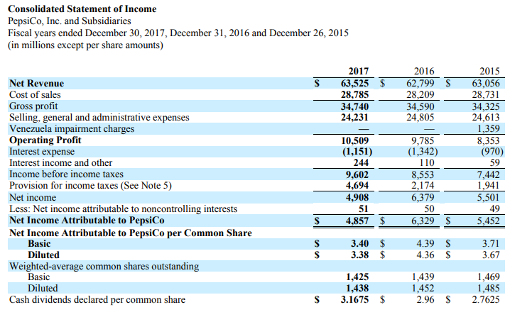

## Table of Contents

## What is an income statement and why is it important for businesses?

An income statement is a financial report that shows how much money a business made and spent over a certain period, usually a year or a quarter. It lists the company's revenues, or the money it earned from selling its products or services, and its expenses, or the costs it had to pay to run the business. The difference between the revenues and expenses is called the net income, which shows whether the company made a profit or a loss.

The income statement is important for businesses because it helps them understand their financial performance. By looking at the income statement, business owners and managers can see if they are making enough money to cover their costs and if they are profitable. It also helps them make decisions about where to cut costs or how to increase sales. Investors and lenders also use the income statement to decide if they want to invest in or loan money to the business, as it gives them a clear picture of the company's financial health.

## What are the main components of an income statement?

An income statement has three main parts: revenue, expenses, and net income. Revenue is the money a business earns from selling its products or services. This can include sales from different products or services and can also include other income like interest or rent. Expenses are the costs a business has to pay to run its operations. These can include things like salaries, rent, utilities, and the cost of goods sold, which is the cost of making or buying the products that are sold.

The difference between revenue and expenses is called net income. If revenue is more than expenses, the business has a profit. If expenses are more than revenue, the business has a loss. Net income is an important number because it shows how well the business is doing financially. Sometimes, businesses also include other parts in their income statement, like taxes or interest expenses, but revenue, expenses, and net income are the main parts that everyone looks at.

## How do you calculate revenue on an income statement?

Revenue on an income statement is the total amount of money a business earns from selling its products or services. To calculate it, you add up all the money received from sales during a specific period, like a month, quarter, or year. This includes money from selling goods, providing services, and any other income the business might have, like interest from investments or rent from property.

For example, if a bakery sells cakes and cookies, the revenue would be the total money made from selling cakes plus the total money made from selling cookies. If the bakery also earns money from renting out a part of its space, that money would be included in the revenue as well. So, to find the total revenue, you simply add up all these different sources of income.

## What is the difference between gross profit and net profit?

Gross profit and net profit are two important numbers on an income statement. Gross profit is the money a business makes after it pays for the things it sells. For example, if a store buys a toy for $10 and sells it for $20, the gross profit is $10. It's the money left after paying for the cost of the product, but before paying for other expenses like rent or salaries.

Net profit, on the other hand, is the money left after a business pays for everything. This includes the cost of the products, rent, salaries, utilities, and any other expenses. Using the same toy example, if the store sells the toy for $20, pays $10 for the toy, and then has to pay $5 for rent and $3 for other expenses, the net profit would be $2 ($20 - $10 - $5 - $3). Net profit shows how much money the business really makes after all costs are paid.

## How are operating expenses categorized on an income statement?

Operating expenses on an income statement are the costs a business has to pay to keep running every day. These costs are split into two main groups: selling expenses and general and administrative expenses. Selling expenses are the costs that come from selling products or services, like money spent on advertising, sales commissions, and the cost of running a sales team. General and administrative expenses are the costs of managing the business, like salaries for office staff, rent for office space, utilities, and office supplies.

Sometimes, businesses also include other types of operating expenses, like research and development costs if they are working on new products or services. These costs are important because they show how much money the business needs to spend just to keep going, not counting the money spent on making or buying the products they sell. By looking at these expenses, business owners can see where they might be able to save money and make their business more profitable.

## What role do non-operating items play in an income statement?

Non-operating items on an income statement are things that don't come from the main business activities. They include things like interest earned from money in the bank, money made from selling investments, or money lost from disasters like a fire. These items are important because they show other ways a business can make or lose money, apart from selling its products or services.

Even though non-operating items are not part of the main business, they can still affect how much money the business makes overall. For example, if a business earns a lot of interest from its bank account, that can add to its profit. On the other hand, if the business has to pay a lot of interest on loans, that can reduce its profit. By looking at non-operating items, business owners can see the full picture of their financial health and make better decisions about their money.

## How can one analyze the profitability of a company using an income statement?

To analyze the profitability of a company using an income statement, you start by looking at the main numbers: revenue, expenses, and net income. Revenue is the total money the company makes from selling its products or services. Expenses are all the costs the company has to pay to run the business, like salaries, rent, and the cost of making or buying the products. Net income is what's left after you subtract the expenses from the revenue. If the net income is positive, the company made a profit. If it's negative, the company had a loss. By comparing these numbers over time, you can see if the company is getting better at making money or if it's struggling.

Another way to analyze profitability is by looking at gross profit and operating profit. Gross profit is the money left after paying for the cost of the products sold. It shows how well the company is doing at selling its products without considering other costs. Operating profit is what's left after you take away all the operating expenses from the gross profit. This number tells you how well the company is managing its day-to-day costs. If both gross profit and operating profit are going up over time, it's a good sign that the company is becoming more profitable. By looking at these different parts of the income statement, you can get a clear picture of how well the company is doing financially.

## What are common financial ratios derived from an income statement and how are they used?

Common financial ratios derived from an income statement include the gross profit margin, operating profit margin, and net profit margin. The gross profit margin shows how much money a business makes from selling its products after paying for the cost of those products. It's calculated by dividing the gross profit by the revenue and then multiplying by 100 to get a percentage. The operating profit margin tells you how much money the business makes after paying for all the costs of running the business, but before paying taxes and interest. It's found by dividing the operating profit by the revenue and multiplying by 100. The net profit margin is the most important because it shows how much money the business keeps after paying for everything, including taxes and interest. It's calculated by dividing the net income by the revenue and multiplying by 100.

These ratios are used to understand how well a business is doing at making money. A high gross profit margin means the business is good at selling its products at a price that covers the cost of making or buying them. A high operating profit margin means the business is good at managing its day-to-day costs. A high net profit margin means the business is keeping a lot of the money it makes, which is a sign of a healthy and profitable business. By comparing these ratios over time or with other businesses in the same industry, you can see if the business is improving or if it's doing better or worse than its competitors.

## How do changes in accounting policies affect the comparability of income statements over time?

Changes in accounting policies can make it hard to compare income statements from different years. When a company changes how it counts money, like how it values its inventory or how it records sales, the numbers on the income statement can look different. For example, if a company switches from one method of accounting for inventory to another, the cost of goods sold might be higher or lower, which changes the gross profit and net income. This makes it tough to see if the company is doing better or worse over time because the numbers aren't calculated the same way.

To help with this, companies usually explain any big changes in their accounting policies in the notes to the financial statements. They might also show what the numbers would have been if they hadn't changed their policies, so you can compare them more easily. Still, it's important to know about these changes when you look at income statements from different years, so you can understand why the numbers might be different and make fair comparisons.

## What are some advanced techniques for analyzing trends in income statements?

One advanced technique for analyzing trends in income statements is to use horizontal analysis. This means looking at how numbers change over time. You can do this by comparing the income statements from different years side by side. For example, if you see that revenue is going up every year, it's a good sign that the business is growing. But if expenses are going up faster than revenue, that could be a problem. By looking at these trends, you can see if the business is getting better or worse at making money over time.

Another technique is vertical analysis, where you look at each part of the income statement as a percentage of revenue. This helps you see how each part of the business is doing compared to the whole. For example, if the cost of goods sold is getting bigger as a percentage of revenue, it might mean the business is having trouble keeping costs down. By doing this kind of analysis, you can spot trends that might not be clear just by looking at the raw numbers. Together, horizontal and vertical analysis give you a good picture of how the business is doing and where it might be headed.

## How can income statements be used to forecast future financial performance?

Income statements can help you guess how a business will do in the future by looking at how it has done in the past. If you see that the business has been making more money every year, you might think it will keep doing well. You can also look at the costs and see if they are going up or down. If costs are going down and the business is making more money, that's a good sign for the future. By looking at these trends, you can make a guess about what might happen next.

Another way to use income statements for forecasting is to look at the different parts of the business. For example, if you see that the business is selling more of one product than others, you might think it will keep doing well with that product. You can also look at how much money the business is spending on things like advertising or new products. If these costs are going up, it might mean the business is trying to grow, which could lead to more money in the future. By putting all these pieces together, you can make a smart guess about where the business is headed.

## What are the limitations of income statements in financial analysis?

Income statements are helpful for understanding how a business is doing, but they have some limits. One big problem is that they only show what has already happened, not what might happen next. So, they don't tell you everything you need to know about the future. Also, income statements can be affected by things like changes in how the business counts its money or one-time events like selling a building. These changes can make it hard to compare the numbers from different years and see the real trends.

Another limit is that income statements don't show everything about a business's money situation. They don't include things like how much money the business has in the bank or how much it owes to others. To get a full picture, you need to look at other financial statements too, like the balance sheet and cash flow statement. Plus, income statements can be tricky to understand because they use a lot of numbers and special terms. If you don't know what all the numbers mean, you might miss important information about how the business is really doing.

## What are Frequently Asked Questions (FAQs)?

**What are the key elements of an income statement?**

The key elements of an income statement include several vital components that collectively provide insight into a company's financial performance. The primary components are:

- **Revenue (or Sales):** This represents the total income earned from selling goods or services. It is categorized into operating and non-operating revenue.

- **Cost of Goods Sold (COGS):** This is the direct cost attributable to the production of the goods that a company sells.

- **Gross Profit:** Calculated as Revenue minus COGS, it represents the profit from core activities before deducting operating expenses.
$$
  \text{Gross Profit} = \text{Revenue} - \text{COGS}

$$

- **Operating Expenses:** These are expenses necessary for the day-to-day functioning of the company, such as salaries, rent, and utilities.

- **Operating Income:** Derived from subtracting operating expenses from gross profit, reflecting the profit from regular business operations.
$$
  \text{Operating Income} = \text{Gross Profit} - \text{Operating Expenses}

$$

- **Other Income and Expenses:** Include non-operating revenues and expenses such as interest received or paid.

- **Net Income:** This is the bottom line, indicating the profit after all expenses have been subtracted from total revenue.
$$
  \text{Net Income} = \text{Total Revenue} - (\text{Total Expenses} + \text{Taxes})

$$

- **Earnings Before Interest and Taxes (EBIT):** Highlights the operating performance sans the impact of capital structure.
$$
  \text{EBIT} = \text{Operating Income} + \text{Non-operating Income/Expenses}

$$

- **Earnings Before Interest, Taxes, Depreciation, and Amortization (EBITDA):** It adds back depreciation and amortization to EBIT, providing a clearer view of financial performance.
$$
  \text{EBITDA} = \text{EBIT} + \text{Depreciation} + \text{Amortization}

$$

**How does operating revenue differ from non-operating revenue?**

Operating revenue is income earned from a company’s core business activities, like sales of goods or services. It's a critical indicator of the company’s primary business efficiency and market demand. Non-operating revenue, on the other hand, originates from secondary sources not directly related to the primary business functions. This could include interest earned on investments, rental income from property leasing, or gains from asset sales. Distinguishing between these two helps stakeholders gauge the company’s reliance on its main business versus supplementary income sources.

**What can investors learn from the income statement?**

Investors use the income statement to assess a company's financial health and operational efficiency. By analyzing revenue patterns, investors can identify growth trends and sales performance. The statement also reveals a company’s profitability through metrics like gross profit, operating income, and net income. Additionally, examining operating expenses and cost structures helps investors understand how efficiently management controls costs relative to revenue. Consistent profitability and effective cost management often translate into a more stable investment. Comparative analysis over time or with competitors provides insights into a company’s competitiveness and strategic positioning in its industry.

**How can Python be used in financial analysis?**

Python is a highly favored tool in financial analysis due to its diverse libraries and ease of use. For income statement analysis:

- **Data Handling:** Libraries like Pandas allow users to import, manage, and transform financial data into meaningful formats for analysis.

- **Data Visualization:** Libraries such as Matplotlib and Seaborn enable the creation of visual representations of financial data, aiding in trend recognition and performance assessment.

- **Statistical Analysis:** NumPy and SciPy are used for statistical computations and quantitative financial analysis, enhancing accuracy in predictions and valuations.

- **Automating Analysis:** Python scripts can automate data analysis processes, including the computation of financial ratios and performance metrics.

- **Backtesting Models:** Developing and testing algorithmic trading models is simplified with libraries like Backtrader, which apply historical financial data for simulation and performance evaluations.

Here is a basic example of using Python to calculate a financial ratio, the profit margin:

```python
import pandas as pd

# Example data
data = {'Revenue': 100000, 'Net Income': 15000}
df = pd.DataFrame([data])

# Calculate profit margin
df['Profit Margin'] = df['Net Income'] / df['Revenue'] * 100
print(df[['Profit Margin']])
```

In this example, the profit margin measures how much of every dollar of sales a company actually keeps in earnings, assisting investors in assessing overall profitability.

## References & Further Reading

[1]: Bergstra, J., Bardenet, R., Bengio, Y., & Kégl, B. (2011). ["Algorithms for Hyper-Parameter Optimization."](https://papers.nips.cc/paper/4443-algorithms-for-hyper-parameter-optimization) Advances in Neural Information Processing Systems 24.

[2]: ["Advances in Financial Machine Learning"](https://www.amazon.com/Advances-Financial-Machine-Learning-Marcos/dp/1119482089) by Marcos Lopez de Prado

[3]: ["Evidence-Based Technical Analysis: Applying the Scientific Method and Statistical Inference to Trading Signals"](https://www.amazon.com/Evidence-Based-Technical-Analysis-Scientific-Statistical/dp/0470008741) by David Aronson

[4]: ["Machine Learning for Algorithmic Trading"](https://github.com/PacktPublishing/Machine-Learning-for-Algorithmic-Trading-Second-Edition) by Stefan Jansen

[5]: ["Quantitative Trading: How to Build Your Own Algorithmic Trading Business"](https://books.google.com/books/about/Quantitative_Trading.html?id=j70yEAAAQBAJ) by Ernest P. Chan