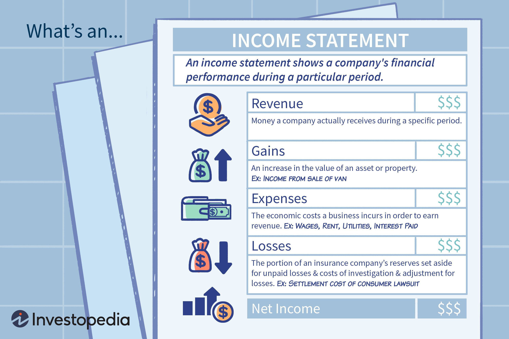

Understanding financial statements is fundamental for evaluating a company's financial health. Among these documents, the income statement, also referred to as the profit and loss statement, holds significant importance. This article explains how to read and analyze an income statement, especially focusing on its role in financial analysis and algorithmic trading.

The income statement provides a detailed account of a company's revenues, expenses, gains, and losses over a specific period. By analyzing the income statement, stakeholders can gain insights into the operational efficiency and overall financial performance of a business. This analysis is particularly valuable for investors, management, and creditors, each of whom employs the insights for distinct purposes. Investors use it to assess profitability and growth potential, management to monitor and improve operational efficiency, and creditors to evaluate the company's capacity to meet debt obligations.



Additionally, the convergence of income statement analysis and algorithmic trading represents a significant advancement in financial decision-making. Algorithmic trading leverages mathematical models and data analysis to execute trades based on complex analyses and pre-set conditions. By integrating income statement data into these models, traders can enhance predictive accuracy and optimize trading strategies, thus making more informed investment decisions.

In summary, the income statement is a crucial tool that supports traditional financial analysis and serves as a gateway to data-driven decision-making in algorithmic trading. This dual role underscores its importance in the financial landscape.

## Table of Contents

## Understanding the Income Statement

The income statement, a cornerstone of financial statements, is instrumental in assessing a company's operational outcomes, efficiency, and managerial effectiveness over a specific period. It encapsulates crucial financial information such as revenue, expenses, gains, and losses, providing stakeholders with a snapshot of the enterprise's performance.

Revenue, often the top line of the income statement, captures the total income generated by a company's core business operations. This may include sales of goods or provision of services. Expenses, on the other hand, account for the costs incurred to generate this revenue, including cost of goods sold (COGS), operational expenses, and administrative costs. The balance, known as net income or net earnings, reflects the company's profitability.

Understanding the transformation of net revenue into net earnings necessitates examining various elements of the income statement. Revenues are adjusted for returns, allowances, and discounts, transitioning from gross revenue to net revenue. Then, by subtracting COGS and other operating expenses, you can evaluate the company's gross profit. Subsequent deductions, such as interest and tax expenses, lead to the net profit figure.

A critical aspect of the income statement is that it does not distinguish between cash and non-cash transactions. This lack of differentiation requires careful analysis as non-cash activities like depreciation and amortization significantly impact the overall financial picture. These deductions do not involve immediate cash outflow but reflect the reduction in the value of assets over time.

The income statement's structure is designed to provide a comprehensive perspective on financial performance, but its reliance on accounting principles means that it may not fully encapsulate real-time cash flow status. Thus, while analyzing an income statement, differentiating between actual cash inflow and accounting-based transactions is crucial for an accurate understanding of a company’s financial health.

## Key Components of an Income Statement

An income statement, also referred to as a profit and loss statement, breaks down the key financial elements that account for a company's performance during a specified period. Understanding these components provides deeper insights into a company's financial situation:

**Operating Revenue:** This represents the income generated from a company's core business activities, which can include the sale of goods or provision of services. For many businesses, this is the most significant part of revenue, making it a critical measure of operational performance. Operating revenue is typically the top line on an income statement, and growth in this metric indicates a company's main operations are expanding.

**Non-Operating Revenue:** Unlike operating revenue, non-operating revenue arises from activities that are not part of the primary operations of the business. It includes income from sources such as interest, dividends, rentals, and other non-recurring sources. While these revenues contribute to the overall profit, they are not sustainable over the long term like operating revenues can be.

**Gains and Losses:** These elements reflect the financial impact of transactions that are incidental to the company's core business operations. Gains may arise from actions such as the sale of long-term assets like equipment or real estate, typically at values higher than their book value. Conversely, losses occur when these assets are sold at values lower than their book value, or when unexpected expenses occur. These results should be carefully analyzed, as they can significantly impact the net income.

**Primary and Secondary Activity Expenses:** Expenses are divided into those associated with primary business activities and those that arise from secondary activities. Primary activity expenses include costs directly tied to the production of goods or provision of services, such as cost of goods sold (COGS), wages, and manufacturing costs. Secondary expenses are those that do not directly relate to core business operations; for example, administrative expenses, restructuring costs, and interest expenses fall into this category. Proper management of both types of expenses is vital for maintaining profitability.

Each of these components is integral to the overall structure of the income statement, helping investors, managers, and creditors evaluate a company's operational efficiency, financial performance, and potential future profitability. By breaking down these components, stakeholders can gain a well-rounded view of a company's financial health and operational effectiveness.

## Analyzing the Income Statement for Financial Insights

Income statements, a pillar of financial reporting, are essential tools for deriving insights into a company's profitability and management efficiency. These documents provide valuable data that investors, management, and creditors can leverage to make informed financial decisions.

For investors, the primary focus is often on assessing a company's profitability through indicators such as net profit margins, gross margins, and operating profit margins. Investors evaluate these metrics to determine the company’s ability to generate profit from its revenues and control costs effectively. 

Managers use income statements to gain insights into the performance of both core and secondary business activities. Analyzing detailed income components, such as operational costs and revenue streams, allows management to identify areas of strength and opportunities for improvement. This analysis aids in strategic planning and optimizing processes to enhance overall financial performance.

Creditors scrutinize income statements to evaluate a company's cash flow and financial stability, essential for assessing the ability of a business to meet its financial obligations. Elements like interest coverage ratios and consistent revenue growth patterns help creditors determine creditworthiness and assess risks associated with lending.

Analyzing income statements across different quarters or years is crucial for recognizing business trends and performance consistency. This longitudinal analysis enables stakeholders to identify cyclical patterns, seasonal sales variations, or shifts in consumer behavior. Additionally, it allows the comparison of growth rates and operational efficiency over time, providing a clearer picture of a company's financial trajectory. 

By understanding these aspects of an income statement, each group of stakeholders can make strategic decisions based on solid financial insights, optimizing their involvement with the company.

## Income Statements in Algorithmic Trading

Algorithmic trading, often driven by sophisticated mathematical models, leverages financial data such as income statements to inform investment decisions. Income statements serve as a critical source of information, offering insights into a company's financial performance, which can be pivotal for developing effective trading strategies. Integrating this data into algorithmic models equips traders with the ability to forecast market movements with higher accuracy.

### Incorporating Income Statement Data into Financial Models

Financial models in [algorithmic trading](/wiki/algorithmic-trading) use data from income statements to assess various performance metrics, such as profitability margins and expense ratios. These metrics aid in evaluating a company's operational efficiency and financial health. For instance, by examining trends in operating revenue and expenses over several quarters, traders can make informed predictions about future stock performance. The use of income statements allows algorithms to assign scores or ratings to companies, which can be dynamically adjusted as new financial data is released.

### Using Python for Income Statement Analysis

Python, with its powerful libraries such as Pandas and NumPy, provides a robust framework for analyzing income statement data. Pandas' data manipulation capabilities allow traders to easily import, clean, and process large volumes of financial data. NumPy's mathematical functions facilitate performing complex calculations necessary for financial modeling.

Here is a simple Python example using Pandas to calculate the operating margin from an income statement:

```python
import pandas as pd

# Sample income statement data
data = {'Revenue': [100000, 120000, 150000],
        'Operating Expenses': [60000, 70000, 80000]}

income_statement = pd.DataFrame(data)

# Calculate Operating Margin
income_statement['Operating Margin'] = (income_statement['Revenue'] - income_statement['Operating Expenses']) / income_statement['Revenue']

print(income_statement)
```

This script calculates the operating margin, a key profitability metric, enabling traders to quickly assess how well a company is controlling its operating costs relative to its revenue.

### Developing Trading Strategies with Income Statement Insights

Leveraging insights from income statements, algorithmic trading strategies can be tailored to target specific market conditions. For example, a strategy may focus on companies with steadily increasing net income, indicating strong growth potential. Alternatively, algorithms can flag companies with shrinking profit margins as candidates for short-selling strategies.

Python's ecosystem supports the entire lifecycle of strategy development, from data collection and exploration to model evaluation. By incorporating income statement analysis into the strategy development process, traders can identify patterns indicative of future stock performance, thereby refining their investment approach.

In conclusion, the integration of income statement analysis into algorithmic trading frameworks enables a more data-driven approach to financial markets. By utilizing Python's rich set of libraries, traders can efficiently process and analyze financial data, enhancing their ability to make informed trading decisions.

## Building a Financial Analysis Framework with Python

Python has emerged as a pivotal tool in building a financial analysis framework due to its flexibility and robust ecosystem. It empowers analysts to perform both technical and [fundamental analysis](/wiki/fundamental-analysis) efficiently. One of the primary libraries, Pandas, excels at managing time-series data, making it particularly suited for analyzing stock prices and components of income statements. 

### Handling Time-Series Data with Pandas

Pandas provides data structures such as DataFrames and Series, which are ideal for handling time-series data. For example, a DataFrame can be used to store historical stock prices along with corresponding dates, enabling time-indexed data access that facilitates the analysis of trends over time. The library's functionality, including resampling and rolling window calculations, allows for sophisticated analysis of financial data.

```python
import pandas as pd

# Example: Loading stock price data
data = pd.read_csv('stock_prices.csv', parse_dates=['Date'], index_col='Date')
monthly_data = data.resample('M').mean()  # Resampling to monthly data
```

### Technical and Fundamental Analysis Automation

Python's ecosystem includes libraries such as NumPy and SciPy for numerical computations, alongside Pandas for data manipulation. This combination allows for the automation of technical analysis, such as calculating moving averages or identifying candlestick patterns.

For fundamental analysis, financial data extracted from income statements can be analyzed to assess company performance. Ratios such as the Price to Earnings (P/E) ratio or Earnings Per Share (EPS) can be calculated directly from raw data.

### Data Collection, Exploratory Data Analysis, and Model Building

Python supports seamless data collection through APIs provided by financial data services. Using libraries such as Requests and BeautifulSoup, data can be collected and formatted for analysis. Exploratory Data Analysis (EDA) ensures that any anomalies or trends in the data are identified early.

```python
import requests
from bs4 import BeautifulSoup

# Example: Collecting data from a financial website
response = requests.get('https://finance.example.com/data')
soup = BeautifulSoup(response.text, 'html.parser')
```

Model building in Python is facilitated by [machine learning](/wiki/machine-learning) libraries like scikit-learn and TensorFlow. These libraries can be used to train models on historical financial data, with the aim of predicting future trends or prices.

### Backtesting Trading Strategies

To ensure that trading strategies are well-prepared for live execution, [backtesting](/wiki/backtesting) using historical data is essential. Libraries like Backtrader and Zipline empower developers to test strategies against past data to evaluate their effectiveness.

```python
import backtrader as bt

# Example: Backtesting a simple moving average strategy
class SMAStrategy(bt.Strategy):
    def __init__(self):
        self.sma = bt.indicators.SimpleMovingAverage(self.data.close, period=15)

    def next(self):
        if self.data.close > self.sma:
            self.buy()
        elif self.data.close < self.sma:
            self.sell()

cerebro = bt.Cerebro()
cerebro.addstrategy(SMAStrategy)
cerebro.run()
```

The integration of Python for building financial analysis frameworks equips analysts and traders with the tools to effectively assess data, automate previously manual processes, and develop robust strategies that are grounded in thorough analysis. It ensures that decisions are informed by a comprehensive understanding of the data at hand.

## Conclusion: Integrating Income Statement Analysis and Algorithmic Trading

Income statements offer crucial insights into a company's financial performance by detailing revenue streams, expense management, and overall profitability. For individuals and entities engaged in algorithmic trading, effectively analyzing these statements can significantly refine trading strategies. By understanding the components and implications of an income statement, traders can identify trends, evaluate financial stability, and predict future performance, which can be pivotal in making informed investment decisions.

Python, a powerful tool in data analysis, provides numerous libraries that enhance the efficiency and depth of financial analysis. Libraries such as Pandas and NumPy facilitate the manipulation and analysis of vast datasets, allowing traders to dissect income statement data swiftly. This capability enables the development of algorithmic models capable of predicting market movements based on fundamental financial indicators derived from income statements.

The integration of financial analysis into algorithmic trading involves leveraging income statement data to create models that can anticipate price fluctuations and market trends. By utilizing historical income data, traders can backtest strategies to ensure robustness and reliability before implementing them in a live trading environment. This practice not only enhances the accuracy of trading decisions but also minimizes risk.

In conclusion, the synthesis of income statement analysis with algorithmic trading fosters more informed investment strategies. The computational power of Python, combined with a thorough understanding of financial statements, allows traders to transform raw financial data into actionable insights. This systematic approach to trading increases the likelihood of achieving favorable outcomes in the complex and dynamic financial markets.

## FAQs

**What are the key elements of an income statement?**

The key elements of an income statement include several vital components that collectively provide insight into a company's financial performance. The primary components are:

- **Revenue (or Sales):** This represents the total income earned from selling goods or services. It is categorized into operating and non-operating revenue.

- **Cost of Goods Sold (COGS):** This is the direct cost attributable to the production of the goods that a company sells.

- **Gross Profit:** Calculated as Revenue minus COGS, it represents the profit from core activities before deducting operating expenses.
$$
  \text{Gross Profit} = \text{Revenue} - \text{COGS}

$$

- **Operating Expenses:** These are expenses necessary for the day-to-day functioning of the company, such as salaries, rent, and utilities.

- **Operating Income:** Derived from subtracting operating expenses from gross profit, reflecting the profit from regular business operations.
$$
  \text{Operating Income} = \text{Gross Profit} - \text{Operating Expenses}

$$

- **Other Income and Expenses:** Include non-operating revenues and expenses such as interest received or paid.

- **Net Income:** This is the bottom line, indicating the profit after all expenses have been subtracted from total revenue.
$$
  \text{Net Income} = \text{Total Revenue} - (\text{Total Expenses} + \text{Taxes})

$$

- **Earnings Before Interest and Taxes (EBIT):** Highlights the operating performance sans the impact of capital structure.
$$
  \text{EBIT} = \text{Operating Income} + \text{Non-operating Income/Expenses}

$$

- **Earnings Before Interest, Taxes, Depreciation, and Amortization (EBITDA):** It adds back depreciation and amortization to EBIT, providing a clearer view of financial performance.
$$
  \text{EBITDA} = \text{EBIT} + \text{Depreciation} + \text{Amortization}

$$

**How does operating revenue differ from non-operating revenue?**

Operating revenue is income earned from a company’s core business activities, like sales of goods or services. It's a critical indicator of the company’s primary business efficiency and market demand. Non-operating revenue, on the other hand, originates from secondary sources not directly related to the primary business functions. This could include interest earned on investments, rental income from property leasing, or gains from asset sales. Distinguishing between these two helps stakeholders gauge the company’s reliance on its main business versus supplementary income sources.

**What can investors learn from the income statement?**

Investors use the income statement to assess a company's financial health and operational efficiency. By analyzing revenue patterns, investors can identify growth trends and sales performance. The statement also reveals a company’s profitability through metrics like gross profit, operating income, and net income. Additionally, examining operating expenses and cost structures helps investors understand how efficiently management controls costs relative to revenue. Consistent profitability and effective cost management often translate into a more stable investment. Comparative analysis over time or with competitors provides insights into a company’s competitiveness and strategic positioning in its industry.

**How can Python be used in financial analysis?**

Python is a highly favored tool in financial analysis due to its diverse libraries and ease of use. For income statement analysis:

- **Data Handling:** Libraries like Pandas allow users to import, manage, and transform financial data into meaningful formats for analysis.

- **Data Visualization:** Libraries such as Matplotlib and Seaborn enable the creation of visual representations of financial data, aiding in trend recognition and performance assessment.

- **Statistical Analysis:** NumPy and SciPy are used for statistical computations and quantitative financial analysis, enhancing accuracy in predictions and valuations.

- **Automating Analysis:** Python scripts can automate data analysis processes, including the computation of financial ratios and performance metrics.

- **Backtesting Models:** Developing and testing algorithmic trading models is simplified with libraries like Backtrader, which apply historical financial data for simulation and performance evaluations.

Here is a basic example of using Python to calculate a financial ratio, the profit margin:

```python
import pandas as pd

# Example data
data = {'Revenue': 100000, 'Net Income': 15000}
df = pd.DataFrame([data])

# Calculate profit margin
df['Profit Margin'] = df['Net Income'] / df['Revenue'] * 100
print(df[['Profit Margin']])
```

In this example, the profit margin measures how much of every dollar of sales a company actually keeps in earnings, assisting investors in assessing overall profitability.

## References & Further Reading

[1]: Bergstra, J., Bardenet, R., Bengio, Y., & Kégl, B. (2011). ["Algorithms for Hyper-Parameter Optimization."](https://papers.nips.cc/paper/4443-algorithms-for-hyper-parameter-optimization) Advances in Neural Information Processing Systems 24.

[2]: ["Advances in Financial Machine Learning"](https://www.amazon.com/Advances-Financial-Machine-Learning-Marcos/dp/1119482089) by Marcos Lopez de Prado

[3]: ["Evidence-Based Technical Analysis: Applying the Scientific Method and Statistical Inference to Trading Signals"](https://www.amazon.com/Evidence-Based-Technical-Analysis-Scientific-Statistical/dp/0470008741) by David Aronson

[4]: ["Machine Learning for Algorithmic Trading"](https://github.com/PacktPublishing/Machine-Learning-for-Algorithmic-Trading-Second-Edition) by Stefan Jansen

[5]: ["Quantitative Trading: How to Build Your Own Algorithmic Trading Business"](https://books.google.com/books/about/Quantitative_Trading.html?id=j70yEAAAQBAJ) by Ernest P. Chan