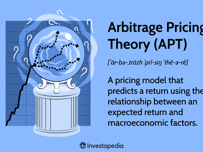

## Table of Contents

## What is Arbitrage Pricing Theory (APT)?

Arbitrage Pricing Theory (APT) is a way to understand how different things can affect the price of an investment, like a stock. It says that the expected return on an investment comes from several different factors, not just one. These factors could be things like how well the economy is doing, interest rates, or even surprises in oil prices. By understanding these factors, investors can figure out if a stock is priced right or if it's a good buy.

APT is different from another popular theory called the Capital Asset Pricing Model (CAPM), which only looks at the overall market's effect on a stock's return. APT is more flexible because it can include any number of factors that might influence an investment's price. This makes it useful for investors who want to look at many different things that could affect their investments. However, APT can be harder to use because it needs a lot of data and math to work out all the different factors.

## How does APT differ from the Capital Asset Pricing Model (CAPM)?

Arbitrage Pricing Theory (APT) and the Capital Asset Pricing Model (CAPM) are both ways to figure out how much return you might get from an investment, but they do it differently. APT looks at many different things that can affect an investment's price, like the economy, interest rates, or even oil prices. It says that the expected return on an investment depends on several factors, not just one. This makes APT more flexible because it can take into account lots of different influences.

On the other hand, CAPM is simpler and only focuses on how the overall market affects a stock's return. It uses something called "beta" to measure how much a stock moves with the market. If the market goes up, a stock with a high beta will go up more, and if the market goes down, it will go down more too. CAPM is easier to use because it only needs a few pieces of information, but it might not capture all the things that can affect a stock's price like APT does.

## What are the key assumptions of Arbitrage Pricing Theory?

Arbitrage Pricing Theory (APT) makes some guesses about how the world works to help figure out investment returns. One big guess is that there are no chances to make easy money without taking any risk. This means that if two investments look the same but one is cheaper, people will buy the cheaper one until the prices are the same. Another guess is that investors can borrow and lend money at the same rate, which helps them move their money around easily.

APT also assumes that the returns on investments are affected by several different factors, like the economy or interest rates. These factors are thought to be the main things that cause prices to change. The theory also guesses that these factors are not perfectly related to each other, so knowing one factor doesn't tell you everything about another. This helps investors spread out their risks by [picking](/wiki/asset-class-picking) investments that react differently to these factors.

## What are the factors used in APT models?

In Arbitrage Pricing Theory (APT) models, the factors that affect an investment's return can be many different things. These factors are usually big things that can move the whole market, like how well the economy is doing, changes in interest rates, or surprises in inflation rates. For example, if the economy is growing fast, stocks might do better because companies are making more money. On the other hand, if interest rates go up, borrowing money becomes more expensive, which can make stocks go down.

These factors are chosen because they have a big impact on lots of different investments. They are not things that only affect one company or one industry, but things that can move the whole market. The idea is that by understanding these big factors, investors can figure out if a stock is priced right or if it's a good buy. For example, if a stock is expected to do well when the economy grows, but it's priced as if the economy will stay the same, it might be a good investment.

## How is the APT formula structured?

The APT formula is a way to figure out how much return you might get from an investment. It looks at several different factors that can affect the price of the investment. The formula says that the expected return on an investment is equal to a starting point, called the risk-free rate, plus the sum of each factor's effect on the investment. Each factor's effect is figured out by multiplying how sensitive the investment is to that factor (called the factor loading) by how much that factor is expected to change (called the factor risk premium).

For example, imagine you have a stock and you think three things can affect its price: how well the economy is doing, changes in interest rates, and surprises in oil prices. The APT formula would start with the risk-free rate, like what you could get from a safe investment like a government bond. Then, you would add how much the stock might go up or down because of the economy, plus how much it might change because of interest rates, plus how much it might move because of oil prices. Each of these additions is calculated by how sensitive the stock is to each factor times how much that factor is expected to change.

## Can you explain the concept of arbitrage in the context of APT?

Arbitrage in the context of Arbitrage Pricing Theory (APT) is all about finding and taking advantage of price differences. Imagine you see two similar stocks, but one is cheaper than the other. Arbitrage means you buy the cheaper stock and sell the more expensive one at the same time. By doing this, you can make money without taking a big risk because the stocks are similar. The idea is that these price differences won't last long because lots of people will do the same thing until the prices become the same.

APT uses the idea of arbitrage to figure out how much return you might get from an investment. It says that if there are no chances for arbitrage, then the expected return on an investment must be in line with the different factors that affect its price. If an investment's expected return is too high or too low compared to these factors, people will buy or sell it until the price is right. This is why APT looks at lots of different things that can change an investment's price, like the economy or interest rates, to make sure there are no easy ways to make money without taking a risk.

## What are the steps to implement APT in portfolio management?

To implement Arbitrage Pricing Theory (APT) in portfolio management, you first need to identify the key factors that affect the returns of the investments in your portfolio. These factors could be things like how well the economy is doing, changes in interest rates, or surprises in oil prices. You'll need to look at data to see how these factors have moved in the past and how they might move in the future. Then, you'll figure out how sensitive each investment in your portfolio is to these factors. This is called finding the factor loadings. For example, if a stock goes up a lot when the economy grows, it has a high factor loading for economic growth.

Once you know the factors and the factor loadings, you can use the APT formula to calculate the expected return for each investment. The formula starts with the risk-free rate, which is what you could earn from a very safe investment like a government bond. Then, you add the effect of each factor on the investment. You do this by multiplying the factor loading by the expected change in the factor, called the factor risk premium. After calculating the expected return for each investment, you can compare it to the current market price to see if the investment is a good buy or if it's overpriced. By doing this for all the investments in your portfolio, you can make better decisions about what to buy or sell to get the best returns while managing your risk.

## How can one estimate the factor sensitivities (betas) in APT?

To estimate the factor sensitivities, or betas, in APT, you need to look at how much each investment in your portfolio moves when a certain factor changes. For example, if you think the economy's growth is a factor, you'll need data on how the economy has grown in the past and how your investments did during those times. You can use a method called regression analysis to figure out the betas. This means you're trying to see how much of the change in your investment's returns can be explained by changes in the factor. You'll end up with a number, the beta, that tells you how sensitive your investment is to that factor.

Once you have the betas for all the factors you're looking at, you can use them in the APT formula to figure out the expected return on your investments. It's important to use good data and make sure your factors really do affect your investments. Sometimes, you might need to adjust your factors or use more data to get a better estimate. The more accurate your betas are, the better you can predict how your investments will do based on changes in the economy or other big factors.

## What are the common challenges faced when applying APT in real-world scenarios?

Applying Arbitrage Pricing Theory (APT) in real-world scenarios can be tough because it needs a lot of data and math. You have to pick the right factors that affect your investments, like the economy or interest rates. But choosing these factors isn't easy because what works for one investment might not work for another. Plus, you need a lot of past data to see how these factors have moved and how your investments reacted. If your data isn't good or if you don't have enough of it, your predictions about how your investments will do might be wrong.

Another challenge is figuring out the factor sensitivities, or betas, which tell you how much your investments move when a factor changes. This involves using a method called regression analysis, which can be tricky. If you get the betas wrong, your calculations for expected returns will be off, and you might make bad investment choices. Also, the real world is always changing, so the factors you picked might not stay important over time. This means you have to keep updating your model, which can be a lot of work.

## How does APT handle multi-factor models compared to single-factor models?

Arbitrage Pricing Theory (APT) is really good at dealing with multi-factor models. Unlike single-factor models that only look at one thing affecting an investment's return, like the overall market, APT can take into account many different things. These could be the economy, interest rates, or even oil prices. By looking at all these factors, APT helps investors understand how different parts of the world can change the value of their investments. This makes APT more flexible and useful for figuring out if an investment is a good buy or not.

Single-factor models, like the Capital Asset Pricing Model (CAPM), are simpler and easier to use because they only need a few pieces of information. But they might miss out on important things that can affect an investment's price. APT, on the other hand, needs more data and math to work out all the different factors, but it can give a more complete picture of what might happen to your investments. This means that while APT might be harder to use, it can help investors make better decisions by considering a wider range of influences.

## What are some empirical tests used to validate APT?

To check if Arbitrage Pricing Theory (APT) works in the real world, researchers use something called empirical tests. These tests look at real data to see if the theory's ideas about how different factors affect investment returns are true. One common way to do this is by using a method called factor analysis. This involves looking at lots of data to find the main factors that move investment returns. If APT is right, these factors should explain why investments go up or down, and the expected returns should match what APT predicts.

Another way to test APT is by doing something called a cross-sectional regression. This means looking at many different investments at the same time to see if their returns fit with what APT says. Researchers check if the returns are in line with the factors they've picked, like the economy or interest rates. If the returns match up well with these factors, it suggests that APT is a good way to understand how investments work. But if the returns don't match, it might mean that APT isn't perfect or that the factors chosen aren't the right ones.

## How can APT be integrated with other financial theories or models for advanced analysis?

Arbitrage Pricing Theory (APT) can be used together with other financial theories and models to get a better understanding of investments. For example, you can use APT along with the Capital Asset Pricing Model (CAPM) to see how both the overall market and other big factors affect an investment's return. While CAPM looks at how an investment moves with the market, APT looks at many different factors. By combining them, you can get a fuller picture of what might happen to your investments. This can help you make better decisions because you're not just looking at one thing but many things that can change an investment's price.

Another way to use APT with other models is by adding it to portfolio optimization techniques. These techniques help you pick the best mix of investments to get the highest return for the least risk. By using APT, you can figure out the expected returns of each investment based on different factors like the economy or interest rates. Then, you can use these expected returns in your portfolio optimization model to find the best investments to buy or sell. This can make your portfolio stronger because you're taking into account a lot of different things that can affect your investments, not just one or two.

## What is Arbitrage Pricing Theory (APT) and how does it work?

Arbitrage Pricing Theory (APT) is a foundational concept in financial economics, introduced by economist Stephen Ross in the 1970s. It serves as an alternative to the more widely known Capital Asset Pricing Model (CAPM) by proposing a multi-factor approach to asset pricing. APT posits that the return on any asset can be represented as a linear function of various macroeconomic factors or theoretical market indices, each with a specific sensitivity or factor loading.

Stephen Ross developed APT to address certain limitations of CAPM. While CAPM relies on a single market factor to determine asset prices, APT suggests that multiple factors influence asset returns, offering a more comprehensive framework. CAPM assumes that the market portfolio is efficient, with the expected return of an asset primarily driven by its covariance with the market portfolio. This results in the familiar CAPM equation:

$$

E(R_i) = R_f + \beta_i (E(R_m) - R_f)
$$

where $E(R_i)$ is the expected return on asset $i$, $R_f$ is the risk-free rate, $\beta_i$ is the asset's sensitivity to market movements, and $E(R_m)$ is the expected return of the market portfolio.

In contrast, APT describes asset returns as being influenced by multiple factors rather than a single market index, as articulated in the formula:

$$

E(R_i) = R_f + \sum_{j=1}^{n} \beta_{ij} F_j 
$$

where $F_j$ represents the various factors impacting returns and $\beta_{ij}$ denotes the sensitivity of the asset's return to each factor. This multi-factor model approach allows for a more nuanced understanding of the drivers of asset returns, acknowledging that various economic, political, and market-specific factors can influence asset pricing simultaneously.

APT's flexibility in allowing various assumptions about influencing factors makes it a versatile tool in financial modeling. Unlike CAPM, which necessitates a market portfolio for deriving predictions, APT utilizes statistical techniques to identify relevant factors and their sensitivities without prescribing a specific portfolio. This adaptability is particularly useful in environments where CAPM's assumptions are difficult to satisfy.

The model’s ability to incorporate multiple dimensions of risk provides investors and financial analysts with a deeper insight into the risk-return profile of assets, beyond the simplistic market risk capture of CAPM. Consequently, APT is highly regarded for its theoretical contribution to the understanding of asset prices, even as it acknowledges the practical challenges of identifying and measuring the relevant factors.

## What are the key assumptions of APT?

Arbitrage Pricing Theory (APT), introduced by Stephen Ross, relies on several core assumptions that distinguish it from other financial models like the Capital Asset Pricing Model (CAPM). These assumptions are critical for understanding how APT posits the determinants of asset returns and guides investment strategies based on systematic risk factors.

Firstly, APT assumes that asset returns can be linearly explained by multiple systematic factors. Systematic factors, unlike specific risks associated with individual stocks, affect a broad range of assets and include macroeconomic variables such as inflation rates, interest rates, and GDP growth. The linear relationship is typically expressed as:

$$
R_i = E(R_i) + \beta_{i1}F_1 + \beta_{i2}F_2 + ... + \beta_{in}F_n + \epsilon_i
$$

where $R_i$ is the return on asset $i$, $E(R_i)$ is the expected return on asset $i$, $\beta_{ij}$ represents the sensitivity of asset $i$ to factor $j$, $F_j$ is the actual realization of factor $j$, and $\epsilon_i$ is the idiosyncratic risk of asset $i$.

Secondly, APT assumes that investors can diversify specific, or unsystematic, risks by holding a well-diversified portfolio. Unsystematic risks pertain to factors unique to a particular company or industry. By holding a large number of diverse assets, these specific risks tend to cancel each other out, leaving the investor exposed only to systematic risks. This is a central tenet of modern portfolio theory and implies that in equilibrium, the market does not reward these avoidable risks.

Thirdly, APT postulates that no [arbitrage](/wiki/arbitrage) opportunities exist in well-diversified portfolios. Arbitrage, the practice of profiting from price discrepancies in different markets or forms, should be impossible when markets are in equilibrium as per the Efficient Market Hypothesis (EMH). Any apparent arbitrage opportunity would quickly be exploited by investors, bringing prices to their equilibrium values. Therefore, the expected return on any asset should align according to its exposure to ubiquitous systematic factors.

These assumptions underpin the fundamental premise of APT: asset pricing reflects rational responses to collective economic forces rather than isolated stock attributes. Understanding these key assumptions allows investors and analysts to apply APT more effectively in assessing investment portfolios and identifying macroeconomic influences on asset returns.

## How can we estimate factor sensitivities and premiums?

Identifying and quantifying systematic factors is critical when employing the Arbitrage Pricing Theory (APT) to evaluate asset pricing. In this context, systematic factors refer to macroeconomic variables or indices that broadly influence asset returns. Unlike the Capital Asset Pricing Model (CAPM), which relies on a single-[factor](/wiki/factor-investing) approach, APT employs a multi-factor model that captures a more complex array of influences.

To estimate factor sensitivities effectively, it is essential to identify relevant systematic factors first. Common examples include inflation rates, [interest rate](/wiki/interest-rate-trading-strategies) differentials, GDP growth, and sector-specific indices such as the S&P 500 or NASDAQ. These factors often serve as proxies for the various risks impacting the asset returns.

**Statistical Methods for Deriving Factor Sensitivities**

Regression analysis is widely used to derive factor sensitivities, also known as factor loadings or betas. The procedure typically involves the following steps:

1. **Data Collection**: Gather historical data on asset returns and the selected systematic factors. The data should encompass the same time period for accurate analysis.

2. **Multiple Linear Regression**: Implement a multiple regression model where the dependent variable is the return of the asset, while the independent variables are the identified systematic factors. Mathematically, the regression model can be expressed as:
$$
   R_i = \alpha + \beta_1F_1 + \beta_2F_2 + \cdots + \beta_nF_n + \epsilon

$$

   where $R_i$ is the return of asset $i$, $\beta_n$ is the sensitivity or loading of the asset to factor $F_n$, and $\epsilon$ is the error term.

3. **Factor Premium Calculation**: After obtaining factor sensitivities, compute the factor premiums. The factor premium is the expected return on the factor and reflects the systematic risk associated with it.

4. **Validation**: Conduct statistical tests to ascertain the validity of the regression model, ensuring that the selected factors are significant predictors of asset returns.

**Example Using the S&P 500 and NASDAQ Indices**

To illustrate, consider a scenario where we want to determine how the S&P 500 and NASDAQ indices influence the return of a particular technology stock. Utilizing historical monthly returns of the technology stock as well as the S&P 500 and NASDAQ indices, we can set up the regression model as follows in Python:

```python
import pandas as pd
import statsmodels.api as sm

# Load data into a DataFrame
data = pd.read_csv('asset_returns.csv')

# Define independent variables and dependent variable
X = data[['SP500_Returns', 'NASDAQ_Returns']]
y = data['Tech_Stock_Returns']

# Add constant to predictor variables
X = sm.add_constant(X)

# Fit regression model
model = sm.OLS(y, X).fit()

# Output summary of regression
print(model.summary())
```

This code snippet performs a multiple regression analysis to derive the sensitivity of the technology stock to the S&P 500 and NASDAQ indices. The coefficients obtained in the regression results will indicate the factor loadings for each index, thereby quantifying how changes in these indices affect the stock's returns.

The insights gained from this analysis assist investors in constructing diversified portfolios and fine-tuning their risk management strategies by aligning them with the fundamental drivers of market dynamics.

## What are the arbitrage opportunities with APT?

Arbitrage Pricing Theory (APT) offers a framework for identifying mispriced securities and leveraging arbitrage opportunities in financial markets. APT assumes that asset prices are influenced by multiple systematic factors. When securities deviate from their theoretical prices as per these factors, arbitrageurs can capitalize on the discrepancies.

To exploit such opportunities, investors can construct an arbitrage portfolio by comparing expected returns, as dictated by the APT model, against actual market returns. The principle is that any mispricing identified should eventually correct itself, enabling the arbitrageur to profit without assuming significant risk.

### Construction of an Arbitrage Portfolio

To construct an arbitrage portfolio, investors first determine the expected return of an asset using APT. This involves identifying relevant systematic factors that influence the asset's return and their respective sensitivities (also known as factor loadings). Mathematically, the expected return $E(R_i)$ for asset $i$ can be represented as:

$$
E(R_i) = R_f + \beta_1F_1 + \beta_2F_2 + ... + \beta_nF_n
$$

Where:
- $R_f$ is the risk-free rate.
- $\beta_n$ denotes the sensitivity of the asset to factor $n$.
- $F_n$ is the risk premium associated with factor $n$.

Once the expected return is calculated, it is compared to the actual return $R_i$. If discrepancies are significant, an arbitrage strategy is crafted. This typically involves short-selling the overpriced security and taking a long position in the underpriced counterpart or constructing a combination that neutralizes unsystematic risk.

### Case Study: Using Combined Index Portfolios

An example of achieving arbitrage through APT involves using combined index portfolios like the S&P 500 and NASDAQ. Assume that an arbitrageur identifies factors such as economic growth, interest rates, and inflation which drive the returns of these indices.

1. **Identify and Quantify Factors:** Using regression analysis, the sensitivities ($\beta$) can be estimated by regressing historical returns of the indices on these factors.

2. **Calculate Expected Returns:** Plug these values into the APT formula to compute the expected returns for both indices.

3. **Detect Mispricing:** Compare the calculated expected returns with actual market returns. If S&P 500’s actual return exceeds its expected return while NASDAQ’s actual return is below its expected return, S&P might be overpriced relative to NASDAQ.

4. **Construct Arbitrage Portfolio:** Short-sell the S&P 500 and simultaneously buy the NASDAQ index to capitalize on the mispricing. Adjust the proportions based on the degree of mispricing.

This approach assumes that market forces will eventually restore prices to levels justified by their systematic risk exposures, thus allowing the arbitrageur to realize a profit when trading costs and constraints are minimal.

## References & Further Reading

[1]: Ross, S. A. (1976). "The Arbitrage Theory of Capital Asset Pricing." *Journal of Economic Theory*, 13(3), 341-360. [Link to paper](https://www.sciencedirect.com/science/article/pii/0022053176900466)

[2]: Bodie, Z., Kane, A., & Marcus, A. J. (2014). "Investments." McGraw-Hill Education. (For understanding APT, CAPM, and asset pricing models)

[3]: Fabozzi, F. J. (2004). "Handbook of Portfolio Management: Multi-Factor Models and Other Techniques." Wiley.

[4]: Lo, A. W., & MacKinlay, A. C. (1999). "A Non-Random Walk Down Wall Street." Princeton University Press. (Discusses statistical techniques in asset pricing including APT)

[5]: Elton, E. J., Gruber, M. J., Brown, S. J., & Goetzmann, W. N. (2010). "Modern Portfolio Theory and Investment Analysis." Wiley. (Provides insights into CAPM and multi-factor models like APT)