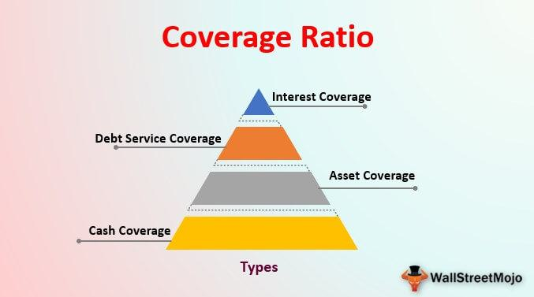

## Table of Contents

## What is an interest coverage ratio?

The interest coverage ratio is a financial measure that shows how well a company can pay the interest on its debts. It is calculated by dividing a company's earnings before interest and taxes (EBIT) by its interest expenses. This ratio helps investors and lenders understand if a company is making enough money to cover its interest payments. A higher ratio means the company is in a better position to meet its interest obligations, which is a sign of financial health.

A good interest coverage ratio is usually considered to be 1.5 or higher. This means the company's earnings are 1.5 times its interest expenses. If the ratio is below 1, it means the company's earnings are not enough to cover its interest payments, which could be a warning sign of financial trouble. Lenders and investors use this ratio to decide if they should lend money to a company or invest in it, because it gives them an idea of the company's ability to handle its debt.

## How is the interest coverage ratio calculated?

The interest coverage ratio is figured out by taking a company's earnings before interest and taxes (EBIT) and dividing it by the interest expenses the company has to pay. EBIT is the money the company makes before it pays any interest on its debts or any taxes. The interest expenses are the costs of borrowing money. So, the formula is simple: interest coverage ratio = EBIT / Interest Expenses.

This ratio tells us if a company can easily pay the interest on its loans. If the ratio is high, it means the company is doing well and can cover its interest payments easily. A ratio of 1.5 or more is usually seen as good. But if the ratio is less than 1, it means the company is not making enough money to pay its interest, which can be a problem. This helps people who might lend money to the company or invest in it to see if the company is financially healthy.

## Why is the interest coverage ratio important for businesses?

The interest coverage ratio is really important for businesses because it shows how well they can pay the interest on their loans. This ratio is like a health check for a company's finances. It tells lenders and investors if the company is making enough money to cover its interest payments. If a company has a high interest coverage ratio, it means they are doing well and can easily pay their interest. This makes lenders and investors feel more confident about giving money to the company.

On the other hand, if the interest coverage ratio is low, it can be a warning sign. A low ratio means the company might not be making enough money to pay its interest, which could lead to financial trouble. Lenders and investors use this ratio to decide if they should lend money to the company or invest in it. A company with a low interest coverage ratio might have a harder time getting loans or attracting investors. So, keeping a good interest coverage ratio is important for a business to stay healthy and grow.

## What is considered a bad interest coverage ratio?

A bad interest coverage ratio is usually one that is less than 1. This means the company isn't making enough money to cover its interest payments. If the ratio is below 1, it's a warning sign that the company might have trouble paying its debts. This can make lenders and investors worried about the company's financial health.

When a company has a bad interest coverage ratio, it might struggle to get new loans or attract investors. Lenders want to see that a company can pay back its debts, and a low ratio shows that the company might not be able to do that. This can lead to higher borrowing costs or even bankruptcy if the company can't improve its financial situation. Keeping a good interest coverage ratio is important for a business to stay stable and grow.

## What are the implications of a bad interest coverage ratio for a company?

A bad interest coverage ratio, which is below 1, means a company is not making enough money to pay the interest on its loans. This can cause big problems for the company. Lenders might not want to give the company more money because they are worried the company won't be able to pay it back. This can make it hard for the company to grow or even keep running its business. If the company can't get new loans, it might have to cut back on spending or sell off parts of its business to pay its debts.

Having a bad interest coverage ratio can also scare away investors. Investors want to put their money into companies that are doing well and can pay back their debts. If a company has a low interest coverage ratio, investors might think it's too risky to invest in that company. This can make it hard for the company to raise money it needs to grow. If the company can't improve its financial situation, it might even go bankrupt. So, a bad interest coverage ratio can really hurt a company's chances of staying healthy and successful.

## How can a bad interest coverage ratio affect a company's ability to borrow?

A bad interest coverage ratio makes it hard for a company to borrow money. Lenders look at the interest coverage ratio to see if a company can pay back its loans. If the ratio is bad, it means the company isn't making enough money to cover its interest payments. This scares lenders because they might not get their money back. So, they might say no to giving the company more loans or they might charge a higher [interest rate](/wiki/interest-rate-trading-strategies) to make up for the risk.

If a company can't borrow money easily, it can have big problems. It might need to cut back on spending or sell parts of its business just to pay its debts. This can slow down the company's growth or even stop it from running smoothly. Without new loans, the company might struggle to keep up with its bills and could face bankruptcy if things don't get better.

## What are common causes of a bad interest coverage ratio?

A bad interest coverage ratio often happens when a company's earnings before interest and taxes (EBIT) are too low to cover its interest expenses. This can be because the company isn't making enough money from its business. Maybe they're selling fewer products or services, or their costs are going up. If a company's sales drop because people aren't buying as much, or if the cost of making things goes up because of higher prices for materials or labor, the company's earnings will go down. This makes it hard for them to pay the interest on their loans.

Another reason for a bad interest coverage ratio is if a company has taken on too much debt. When a company borrows a lot of money, it has to pay more in interest. If the company's earnings don't grow enough to cover these higher interest payments, the interest coverage ratio will go down. Sometimes, companies borrow money to grow or buy other businesses, but if these plans don't work out as expected, the company can end up with a lot of debt and not enough earnings to pay the interest. This can put the company in a tough spot financially.

## How can a company improve its interest coverage ratio?

A company can improve its interest coverage ratio by increasing its earnings before interest and taxes (EBIT). One way to do this is by growing sales. The company can try to sell more products or services, maybe by coming up with new things to sell or by finding new customers. They can also work on cutting costs. If they can make their products or run their business for less money, their earnings will go up. This means they'll have more money to pay the interest on their loans, which will make their interest coverage ratio better.

Another way to improve the interest coverage ratio is by reducing the amount of debt the company has. If a company pays off some of its loans, it will have less interest to pay each month. This can be done by using extra money to pay down debt faster or by not taking on new loans. Sometimes, a company might even sell off parts of its business to get the money to pay down debt. By lowering their debt, the company's interest expenses go down, which makes it easier for them to cover those costs with their earnings, leading to a better interest coverage ratio.

## What are the differences between interest coverage ratio and other financial ratios?

The interest coverage ratio is different from other financial ratios because it focuses specifically on a company's ability to pay the interest on its debts. It's calculated by dividing a company's earnings before interest and taxes (EBIT) by its interest expenses. This ratio tells us if a company is making enough money to cover its interest payments. Other financial ratios, like the debt-to-equity ratio or the current ratio, look at different parts of a company's finances. The debt-to-equity ratio shows how much debt a company has compared to its equity, while the current ratio tells us if a company can pay its short-term bills. So, while the interest coverage ratio is all about interest payments, other ratios give us a broader picture of a company's financial health.

Another key difference is how these ratios are used. The interest coverage ratio is really important for lenders and bondholders because it shows if a company can handle its debt. A high interest coverage ratio means the company is in a good spot to pay its interest, which makes lenders feel safe about lending money. On the other hand, ratios like the return on equity (ROE) or the gross profit margin are more useful for investors. ROE shows how well a company is using the money shareholders have put in, and the gross profit margin tells us how much money the company makes after paying for the cost of goods sold. Each ratio gives different information, so they're used for different purposes depending on what someone wants to know about a company's finances.

## How does industry type influence what is considered a bad interest coverage ratio?

Different industries have different standards for what is considered a bad interest coverage ratio. This is because each industry has its own way of making money and dealing with costs. For example, a tech company might have a higher interest coverage ratio because it makes a lot of money from software with low costs. But a manufacturing company might have a lower ratio because it has to spend a lot on machines and materials. So, what's seen as a bad ratio in one industry might be okay in another.

Because of these differences, it's important to compare a company's interest coverage ratio to others in the same industry. A ratio below 1 is usually bad no matter the industry, but what's considered good or bad can change a bit. For example, in a stable industry like utilities, a ratio of 2 might be fine. But in a fast-growing industry like tech, a ratio of 3 or higher might be expected. So, understanding the industry helps us know if a company's interest coverage ratio is really bad or just normal for its type of business.

## What are some advanced strategies to analyze the interest coverage ratio in depth?

To really understand a company's interest coverage ratio, you can look at how it changes over time. By comparing the ratio from one year to the next, you can see if the company is getting better or worse at paying its interest. If the ratio is going up, it means the company is making more money or paying less interest, which is good. But if the ratio is going down, it could mean the company is struggling. You can also compare the company's ratio to other companies in the same industry. This helps you see if the company is doing better or worse than its competitors. If a company's ratio is lower than others in its industry, it might be a sign of trouble.

Another advanced strategy is to look at the company's cash flow. The interest coverage ratio uses earnings before interest and taxes (EBIT), but cash flow shows the actual money coming in and going out. A company might have a good EBIT but still have trouble paying its interest if it doesn't have enough cash. By looking at the company's cash flow statement, you can see if it has enough money to cover its interest payments. If the cash flow is strong, the company is in a good position to handle its debt, even if the interest coverage ratio isn't perfect. This gives you a more complete picture of the company's financial health.

## How can predictive analytics be used to forecast future interest coverage ratio trends?

Predictive analytics can help forecast future interest coverage ratio trends by looking at past data and using it to make guesses about what will happen next. Companies can use this to see if their interest coverage ratio might go up or down in the future. They do this by putting information like sales, costs, and interest payments into a computer program. The program then uses math to find patterns in the data and predict what the company's earnings and interest expenses will be in the future. If the program thinks the company will make more money or pay less interest, the interest coverage ratio might go up. But if it thinks the company will make less money or pay more interest, the ratio might go down.

This kind of forecasting can be really helpful for a company to plan ahead. If the predictive analytics show that the interest coverage ratio might get worse, the company can start making changes now. They might try to cut costs, increase sales, or pay off some debt to keep their ratio strong. On the other hand, if the forecast shows the ratio will get better, the company can feel more confident about taking on new projects or borrowing more money. By using predictive analytics, companies can make smarter decisions and avoid financial trouble before it happens.

## What is Interest Coverage Ratio?

The Interest Coverage Ratio (ICR) is a critical measure of a firm's ability to honor its interest payments on outstanding debt, serving as an indicator of financial health and creditworthiness. It highlights a company's capacity to generate enough operational earnings to cover its interest expenses, thereby providing insights into its solvency and risk profile.

The ICR is determined by dividing a company's Earnings Before Interest and Taxes (EBIT) by its interest expenses. Mathematically, the formula is expressed as:

$$
\text{ICR} = \frac{\text{EBIT}}{\text{Interest Expense}}
$$

This ratio offers a snapshot of how comfortably a company can meet its interest obligations using its earnings before the impact of interest and taxes. A higher ICR indicates a robust ability to handle interest commitments, which is generally viewed positively by investors and creditors. It suggests that the company is in a healthier financial position with lesser default risk on interest payments, thereby enhancing its attractiveness as a safe investment prospect.

Conversely, a lower ICR may raise red flags about the company's financial stability, potentially signaling difficulties in meeting debt obligations, which could lead to increased credit risk. Therefore, maintaining a high ICR is essential for any business seeking to preserve its financial credibility and investor confidence.

## What is the Formula and how is the Calculation done?

The Interest Coverage Ratio (ICR) is a financial metric that is calculated using the formula:

$$
\text{ICR} = \frac{\text{EBIT}}{\text{Interest Expense}}
$$

This formula calculates how many times a company can cover its interest obligations with its operational earnings, also known as Earnings Before Interest and Taxes (EBIT). For example, if a company reports an EBIT of $500,000 and incurs interest expenses totaling $100,000, the ICR calculation would be:

$$
\text{ICR} = \frac{500,000}{100,000} = 5
$$

This computation indicates that the company can meet its interest payments five times over using its earnings before accounting for interest and taxes. A higher ICR generally suggests that a company poses less financial risk and is more stable, which can be an attractive trait for investors and creditors. Here is a simple Python code snippet to calculate ICR:

```python
def calculate_icr(ebit, interest_expense):
    if interest_expense == 0:
        return float('inf')  # Infinite ICR when interest expenses are zero
    return ebit / interest_expense

# Example usage
ebit = 500000
interest_expense = 100000
icr = calculate_icr(ebit, interest_expense)
print(f"The ICR is: {icr}")
```

This example demonstrates the practical calculation of ICR, affirming its utility in assessing a company's capability to honor its interest commitments effectively.

## References & Further Reading

Graham, B., & Dodd, D. (1934). *Security Analysis*. McGraw Hill Education. This seminal work by Benjamin Graham and David Dodd lays a foundational framework for evaluating securities and understanding financial metrics, including the Interest Coverage Ratio. Their book provides valuable insights into financial analysis, emphasizing the importance of assessing a company's ability to manage its debt obligations.

Johnson, B. (2010). *Algorithmic Trading and DMA*. 4Myeloma Press. Barry Johnson's book offers a comprehensive guide to [algorithmic trading](/wiki/algorithmic-trading), detailing how financial ratios like the Interest Coverage Ratio can affect stock selection and trading strategies. It serves as an essential resource for those integrating financial analytics into automated trading systems.

Damodaran, A. (2012). *Investment Valuation: Tools and Techniques for Determining the Value of Any Asset*. Wiley Finance. Aswath Damodaran's text provides exhaustive coverage of valuation techniques, including the critical role of financial ratios such as the Interest Coverage Ratio in assessing company value. This book is crucial for those seeking quantitative methods in investment analysis and risk assessment.

