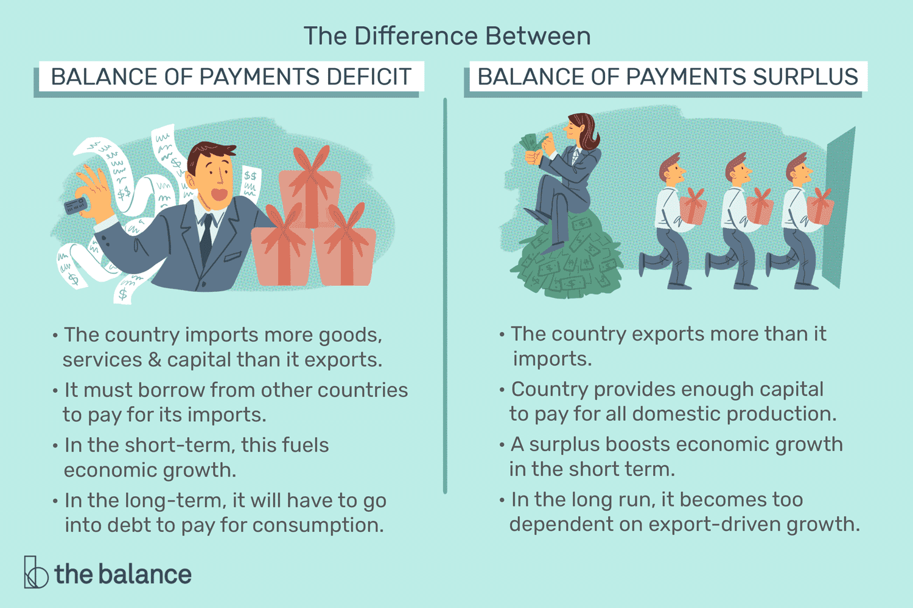

In a rapidly evolving global economy, understanding complex financial dynamics is crucial for stakeholders ranging from policymakers to investors. Economic deficits and the balance of payments (BOP) are foundational concepts that play pivotal roles in financial analysis, influencing decisions at both governmental and corporate levels. An economic deficit occurs when an entity's expenditures surpass its revenues over a specific period, leading to potential implications such as increased national debt or the necessity for corporate restructuring. In contrast, the balance of payments provides a comprehensive record of all economic transactions between a nation and the rest of the world, encompassing the current account, capital account, and financial account. This data is critical for assessing a country's economic standing, indicating either stability or potential areas for policy adjustments.

Algorithmic trading has revolutionized the way financial markets operate, leveraging the power of computer algorithms to execute trades with unmatched speed and precision. These algorithms are designed to track market conditions, capturing opportunities that might elude human traders due to the sheer volume and velocity at which data is processed. This technological advancement not only enhances market efficiency but also reduces the likelihood of human error. Algorithmic trading is now predominant in various markets, including equities, forex, and commodities, underscoring its significant impact.



This article explores the intersection of economic analysis, balance of payments deficits, and algorithmic trading, aiming to unravel how these elements interact and influence modern financial markets. By understanding these intricate relationships, stakeholders can better navigate the complexities of the global economy, devising strategies that leverage this synergy for improved market insights and decision-making.

## Table of Contents

## Understanding Economic Deficits

Deficits occur when a financial entity's expenditures surpass its revenues over a specific period. This financial phenomenon affects various economic agents, including governments, corporations, and individuals. Understanding the nuances of deficits is crucial for assessing economic stability and formulating effective policies.

For governments, fiscal deficits are a significant concern. A fiscal deficit arises when a government's total expenditures exceed the revenue it generates, excluding funds from borrowings. This situation often leads to an increase in national debt as governments borrow to cover the shortfall. Chronic fiscal deficits can affect a country's economic policy, as they may necessitate borrowing from domestic or international sources, leading to higher interest payments and potential crowding out of private investment. Persistent government deficits may also prompt policy adjustments, including tax reforms, spending cuts, or economic stimulus measures to foster growth and balance the budget.

In the corporate sector, deficits can affect a company's financial health and operational capability. A corporate deficit occurs when a company's expenses, including operational and capital expenditures, outstrip its income. Such deficits can pressure companies to engage in restructuring efforts, such as cost-cutting, lay-offs, or seeking new sources of revenue through innovation and market expansion. Moreover, sustained corporate deficits may impact a firm's creditworthiness, making it more expensive and difficult to raise capital for future initiatives.

On an individual level, deficits relate to personal financial management when a person's expenses exceed their income. This imbalance affects savings, leads to increased borrowing, and potentially results in a debt cycle that can be challenging to break. Personal deficits encourage individuals to reassess their financial habits, prioritize debt repayment, and implement budgetary controls to regain financial stability.

Analyzing deficits across these different sectors is essential for understanding their broader implications on economic stability. For policymakers, recognizing the causes and effects of fiscal deficits aids in crafting strategies that address underlying economic challenges and foster sustainable growth. Economists view deficits as key indicators of economic health, providing insights into fiscal sustainability and the need for structural reforms.

Quantitatively, deficits can be defined using a simple formula for a given period:

$$
\text{Deficit} = \text{Total Expenditures} - \text{Total Revenue}
$$

This formula applies universally, whether analyzing national budgets, corporate financial statements, or personal financial plans. By assessing these deficits, stakeholders can identify areas for improvement and make informed decisions to promote economic stability and growth.

## Balance of Payments (BOP) Explained

The Balance of Payments (BOP) is a comprehensive record of all economic transactions made between residents of a country and the rest of the world within a specific period. It serves as a key indicator of a country's economic interactions with foreign economies and is crucial for evaluating the economic standing and fiscal health of a nation.

The BOP is structured into three main accounts:

1. **Current Account**: This component includes transactions in goods, services, income, and current transfers. The balance on the current account essentially reflects the difference between a nation’s savings and its investment. A surplus in the current account indicates that a country is a net lender to the rest of the world, while a deficit suggests it is a net borrower.

2. **Capital Account**: Although it handles fewer and often less significant transactions, the capital account records capital transfers and the acquisition or disposal of non-produced, non-financial assets, such as patents or leases. It is pivotal in understanding changes in the ownership of national assess.

3. **Financial Account**: This account captures cross-border transactions associated with changes in ownership of financial assets and liabilities. It includes direct investment, portfolio investment, and other investments and derivative transactions. A surplus in the financial account implies a country is receiving more investment from abroad than it is investing outside its borders.

Understanding these components is vital for assessing a nation's economic standing. For instance, a persistent current account deficit might indicate that a country is over-consuming relative to its income, while a financial account surplus could suggest strong foreign investment which might be beneficial or risky depending on the context.

Imbalances in the BOP can signal economic instability or might represent opportunities for policy adjustments. For example, a deficit might prompt a country to devalue its currency to boost exports, or a surplus might encourage stronger currency valuations.

BOP [statistics](/wiki/bayesian-statistics) are crucial for investors and policymakers. Investors use BOP data to assess currency stability and investment opportunities, while policymakers analyze it to devise strategies for economic stability. By monitoring these transactions, nations can make informed decisions regarding trade policies, foreign exchange regulations, and international financial relations.

## Algorithmic Trading: Revolutionizing Markets

Algorithmic trading represents a transformative force in the financial markets, employing sophisticated computer algorithms to execute trades with high speed and precision. This approach leverages mathematical models and statistical analysis to identify and exploit market opportunities that might be imperceptible to human traders. By automating the decision-making process, [algorithmic trading](/wiki/algorithmic-trading) can quickly respond to market movements, executing orders at speeds and efficiencies far beyond human capabilities.

Trading algorithms typically operate by analyzing complex datasets to predict price movements, using a variety of strategies such as [trend following](/wiki/trend-following), [arbitrage](/wiki/arbitrage), and mean reversion. These algorithms process real-time data to detect patterns and correlations, enabling traders to capitalize on market inefficiencies. For example, a simple moving average crossover strategy might be implemented in Python as follows:

```python
import numpy as np
import pandas as pd

# Data: Assume df is a pandas DataFrame containing historical market data with a 'close' column
def moving_average_strategy(df, short_window=40, long_window=100):
    signals = pd.DataFrame(index=df.index)
    signals['signal'] = 0.0

    # Create short simple moving average
    signals['short_mavg'] = df['close'].rolling(window=short_window, min_periods=1).mean()

    # Create long simple moving average
    signals['long_mavg'] = df['close'].rolling(window=long_window, min_periods=1).mean()

    # Generate signals
    signals['signal'][short_window:] = np.where(signals['short_mavg'][short_window:] > signals['long_mavg'][short_window:], 1.0, 0.0)

    # Create positions
    signals['positions'] = signals['signal'].diff()

    return signals
```

Algorithmic trading now dominates a number of financial markets, including equities, foreign exchange ([forex](/wiki/forex-system)), and commodities. In the equities market, algorithms handle the majority of trades, allowing for rapid execution across various stocks. In the forex market, trading algorithms assess macroeconomic indicators and react to geopolitical events, making split-second decisions that influence currency valuations. Commodities trading benefits similarly, with algorithms optimizing trading strategies to manage supply and demand fluctuations.

The implementation of trading algorithms significantly enhances market efficiency by decreasing transaction costs, increasing [liquidity](/wiki/liquidity-risk-premium), and reducing the likelihood of human error. As these algorithms improve, they contribute to a more transparent and efficient price discovery process, reflecting all available information in the market prices.

Technological advancements have further augmented the capabilities of algorithmic trading. Python, a versatile programming language, is widely used for developing trading algorithms due to its extensive libraries and frameworks supporting data analysis and [machine learning](/wiki/machine-learning). Libraries like NumPy and pandas facilitate data manipulation and analysis, while machine learning libraries such as scikit-learn and TensorFlow allow for the creation of predictive models that can adapt to dynamic market conditions.

In summary, algorithmic trading revolutionizes the way modern financial markets operate by harnessing the power of technology to execute trades with unmatched speed and efficiency. Through the use of advanced computational methods and programming tools, market participants can better anticipate and strategically respond to ever-evolving market dynamics.

## The Synergy between BOP Data and Algo Trading

Balance of Payments (BOP) data serves as a vital input for algorithmic trading strategies, particularly in the forex markets. This interplay between BOP statistics and algorithmic models facilitates the identification of trading signals and enhances the predictive power of market operations.

Persistent deficits or surpluses in a nation's BOP can significantly impact currency valuations. For instance, a continuous current account deficit might indicate that a country is importing more goods, services, and capital than it exports, exerting downward pressure on its currency value. Conversely, a surplus suggests an excess of exports over imports, potentially leading to currency appreciation. Algorithmic trading systems can leverage such insights to develop strategies that automatically execute trades when specific criteria related to BOP imbalances are met.

Algorithmic models integrate BOP data to refine their forecasts and adjust to prevailing economic conditions. These models employ machine learning techniques, which enable the analysis of vast datasets for spotting patterns that might elude human traders. For example, algorithms can be programmed to scan for correlations between BOP deficits and foreign exchange rates, learning from historical data to enhance future predictions.

Market participants utilize BOP insights to craft predictive strategies suited for dynamic environments. By analyzing trends and anomalies within BOP data, traders can anticipate market shifts and make informed trading decisions. This might involve setting up algorithms to monitor real-time BOP reports and react instantaneously to changes that hint at shifts in economic conditions.

Integrating BOP data into algorithmic trading is not without challenges. The timeliness of data is crucial; algorithms require access to the most recent statistics to function effectively. Any delay in publication or data updates can diminish the algorithms' accuracy and the trading strategies' relevance. Additionally, the complexity of BOP datasets presents interpretation difficulties, necessitating sophisticated data processing systems and domain expertise to ensure accurate analyses.

Overall, the synergy between BOP data and algorithmic trading offers a compelling lens through which to view currency movements and broader economic trends. As technology continues to evolve, the capacity for these models to incorporate a growing variety of economic indicators will likely enhance their strategic effectiveness in the financial markets.

## Impacts and Implications

Economic deficits and algorithmic trading are pivotal elements influencing market efficiency and price discovery. The interplay between these components accentuates the necessity for evolving policy implications and market regulation.

Economic deficits, whether fiscal or trade-related, can create [volatility](/wiki/volatility-trading-strategies) in financial markets. Persistent deficits may lead to devaluation of a country's currency, altering the dynamics of supply and demand. This scenario provides algorithmic trading systems with an opportunity to capitalize on fluctuations through real-time analysis and execution of strategic trades. For instance, algorithms can detect trends in currency devaluation by analyzing Balance of Payments (BOP) data, thereby enabling traders to make informed decisions.

Policy implications are significant in this context. Regulatory frameworks must adapt to accommodate the speed and complexity of algorithmic trading. These trading systems often operate at lightning pace, exploiting market inefficiencies that human traders might overlook. Therefore, stringent regulations are necessary to prevent potential malpractices such as market manipulation or excessive risk-taking. Regulatory bodies, like the Securities and Exchange Commission (SEC) in the United States, continually update their frameworks to ensure fair trading practices and market integrity.

Algorithmic trading, when integrated with BOP data, offers enhanced opportunities for generating insights and optimizing trading strategies. Financial algorithms can process vast amounts of BOP data to evaluate economic conditions and forecast market trends. Advanced machine learning models can predict currency movements based on historical BOP data, facilitating rapid and precise trading decisions.

Moreover, advancements in [artificial intelligence](/wiki/ai-artificial-intelligence) (AI) and quantum computing are poised to further revolutionize this synergy. AI has the potential to enhance the analytical capabilities of algorithms, improving their efficiency and accuracy in predicting market movements. Quantum computing, with its superior processing power, could exponentially increase the speed at which complex calculations are performed, allowing for more sophisticated modeling and simulation of market scenarios.

In summary, the convergence of economic deficits and algorithmic trading necessitates ongoing adaptation of regulatory frameworks to safeguard market stability and integrity. The potential for informed, rapid trading decisions through algorithmic trading using BOP data is significant. Future technological advancements promise to further integrate these elements, enhancing their impact on financial markets.

## Conclusion

Understanding the intricate linkages between economic deficits, balance of payments (BOP), and algorithmic trading is essential for navigating the complexities of modern financial markets. The effective integration of BOP data into trading strategies offers significant potential for gaining market insights and identifying profitable opportunities. This integration allows traders to make informed decisions based on comprehensive economic indicators, which can reflect underlying market conditions and trends. For instance, fluctuations in BOP components can act as signals for currency movements, presenting opportunities for algorithmic models to exploit.

However, the rapidly changing landscape of financial markets presents substantial challenges, especially concerning regulatory and technological shifts. Regulatory frameworks must evolve to keep pace with innovations such as algorithmic trading, ensuring that market integrity is maintained while also accommodating new methodologies. Additionally, technological advancements, including those in artificial intelligence and data analytics, are crucial for enhancing the capabilities of algorithmic trading systems, requiring continuous adaptation and investment.

The future trajectory of economic interactions and trading strategies will heavily rely on ongoing research and development in these fields. By expanding our understanding of how economic data can be utilized effectively within algorithmic frameworks, we can unlock new avenues for market development and efficiency. This continuous research will be pivotal in addressing the challenges posed by data complexity and regulatory constraints, ultimately fostering a more robust and resilient financial ecosystem.

In conclusion, the rapidly evolving nature of finance necessitates agile and innovative approaches to leveraging the synergies between economic deficits, BOP data, and algorithmic trading. By embracing these interactions, market participants can enhance their strategic decision-making processes, driving growth and ensuring competitiveness in an increasingly interconnected global economy.

## References & Further Reading

[1]: Bergstra, J., Bardenet, R., Bengio, Y., & Kégl, B. (2011). ["Algorithms for Hyper-Parameter Optimization."](https://dl.acm.org/doi/10.5555/2986459.2986743) Advances in Neural Information Processing Systems 24.

[2]: ["Advances in Financial Machine Learning"](https://www.amazon.com/Advances-Financial-Machine-Learning-Marcos/dp/1119482089) by Marcos Lopez de Prado

[3]: ["Evidence-Based Technical Analysis: Applying the Scientific Method and Statistical Inference to Trading Signals"](https://www.amazon.com/Evidence-Based-Technical-Analysis-Scientific-Statistical/dp/0470008741) by David Aronson

[4]: ["Machine Learning for Algorithmic Trading"](https://github.com/stefan-jansen/machine-learning-for-trading) by Stefan Jansen

[5]: ["Quantitative Trading: How to Build Your Own Algorithmic Trading Business"](https://www.amazon.com/Quantitative-Trading-Build-Algorithmic-Business/dp/1119800064) by Ernest P. Chan