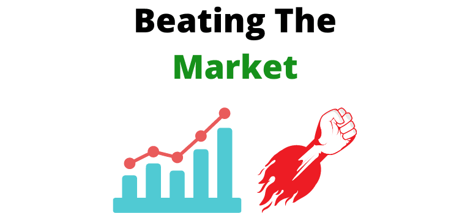

## Table of Contents

## What does 'beat the market' mean in simple terms?

"Beat the market" is a term used when someone's investment does better than the overall market. Imagine the market is like a big race with lots of runners. If you "beat the market," it means your investment ran faster than most other runners in the race.

This is important because it shows that the person or the fund manager made smarter choices than just following what everyone else was doing. Beating the market is hard to do and not many people can do it consistently over time. It's like trying to win a race against very fast runners every time you run.

## Why do investors aim to beat the market?

Investors aim to beat the market because they want to make more money than if they just followed the average performance of the market. If you can beat the market, your investments grow faster, and you end up with more money in the end. It's like trying to get a better grade than the class average on a test; you work harder and smarter to come out on top.

Beating the market is also a way for investors to show they are good at picking the right investments. It's a sign of skill and knowledge. If an investor can consistently beat the market, it means they understand the game better than most and can make smarter choices. This is why many investors see beating the market as a big goal to achieve.

## How is market performance typically measured?

Market performance is usually measured by looking at stock market indexes like the S&P 500 or the Dow Jones Industrial Average. These indexes are like big baskets that hold a bunch of different stocks. When people say "the market went up," they're usually talking about how these indexes did. If the S&P 500 goes up by 10% over a year, that means the average stock in that basket did pretty well.

Another way to measure market performance is by looking at things like total return, which includes not just the change in stock prices but also any dividends paid out. Total return gives a fuller picture of how well an investment did. For example, if a stock went up by 5% in price and also paid a 2% dividend, the total return would be 7%. This helps investors see the whole picture of their investment's performance.

## What is a benchmark index and how is it related to beating the market?

A benchmark index is like a scorecard that shows how well the overall market is doing. It's made up of a bunch of different stocks, and it gives us a number that tells us if the market is going up or down. The most famous benchmark indexes are the S&P 500 and the Dow Jones Industrial Average. They help investors see the big picture of the market's performance.

Beating the market means doing better than this benchmark index. If your investments grow more than the S&P 500, for example, you're beating the market. It's like trying to run faster than the average time in a race. Investors use the benchmark index to see if they're doing a good job with their investments. If they can consistently do better than the benchmark, it shows they're making smart choices and picking the right stocks.

## Can you explain the concept of alpha in relation to beating the market?

Alpha is a way to measure how well an investment does compared to the overall market. It's like a score that tells you if an investor is beating the market. If an investment has a positive alpha, it means it's doing better than the market. For example, if the market goes up by 10% and your investment goes up by 12%, your alpha would be positive because you did better than the market.

Alpha is important because it shows how much skill an investor has. If someone can keep getting a positive alpha, it means they're really good at picking investments that do better than just following the market. It's like being a star player in a game who always scores more points than the average player. But getting a positive alpha is hard, and not many people can do it all the time.

## What are some common strategies used to try to beat the market?

One common strategy to try to beat the market is called active investing. This means picking individual stocks or funds that you think will do better than the market. People who do this spend a lot of time researching companies, looking at their financials, and trying to predict what will happen next. They might also use technical analysis, which is like studying stock price patterns to guess where the price might go. The idea is to find hidden gems that other investors might not see yet.

Another strategy is called value investing. This is when investors look for companies that they think are undervalued, meaning the stock price is lower than what the company is really worth. They buy these stocks hoping that other investors will eventually see the true value and the price will go up. This is like finding a good deal at a store and waiting for it to become popular. Value investors often look at things like a company's earnings, assets, and how much debt it has to decide if it's a good buy.

Some investors also use a strategy called momentum investing. This is based on the idea that stocks that have been going up will keep going up, and stocks that have been going down will keep going down. Momentum investors look at recent price trends and jump on the bandwagon, hoping to ride the wave until it's time to sell. It's like trying to catch a trend before it's too late. Each of these strategies has its own risks and rewards, but they all aim to do better than just following the market.

## How does diversification impact the ability to beat the market?

Diversification means spreading your money across different types of investments, like stocks, bonds, and real estate. It's like not putting all your eggs in one basket. When you diversify, you lower your risk because if one investment does badly, the others might do well and balance it out. This can make your overall investment safer and more stable, but it might also make it harder to beat the market. If you spread your money too thinly, you might not have enough in any one investment to really make a big gain.

On the other hand, some investors use diversification in a smart way to try to beat the market. They might pick a mix of investments that they think will do better than the market as a whole. For example, they might choose stocks from different industries that they believe are undervalued or have strong growth potential. By carefully choosing their investments, they can still aim to beat the market while also reducing their risk. So, diversification can help or hurt your chances of beating the market, depending on how you do it.

## What role does risk management play in beating the market?

Risk management is super important when you're trying to beat the market. It's like wearing a seatbelt when you're driving fast. You want to go fast and get ahead, but you also need to stay safe. In investing, risk management means figuring out how much you can lose and making plans to protect your money. If you take too many risks without thinking, you might lose a lot and not be able to beat the market. But if you manage your risks well, you can still try to do better than the market while keeping your losses small.

One way to manage risk is by setting stop-loss orders. This means you decide ahead of time to sell a stock if it drops to a certain price. It's like having a safety net that catches you if you start to fall. Another way is by not putting all your money into one stock or one type of investment. This is called diversification, and it helps because if one investment goes down, the others might go up and balance it out. Good risk management lets you take smart risks, which can help you beat the market over time.

## How do active and passive investment strategies differ in their approach to beating the market?

Active investment strategies are like trying to be a star player in a game. People who use this approach spend a lot of time picking individual stocks or funds they think will do better than the market. They do a lot of research, look at company financials, and try to predict what will happen next. They might also use charts and patterns to guess where stock prices are going. The goal is to find investments that will grow faster than the market average, so they can beat it. But this can be risky because if they pick the wrong stocks, they might lose money instead of beating the market.

Passive investment strategies are more like joining a team and just going with the flow. Instead of trying to pick winners, people who use this approach usually invest in index funds or ETFs that track a benchmark like the S&P 500. They're not trying to beat the market; they're just trying to match it. This is easier and usually less risky because it's hard to consistently pick stocks that do better than the market. While passive investing might not beat the market, it can still give you good returns over time without the stress of trying to outsmart everyone else.

## What are the historical success rates of investors trying to beat the market?

Historically, most investors have a tough time beating the market. Studies show that over long periods, like 10 or 20 years, only a small number of active investors can do better than the market average. For example, research from S&P Dow Jones Indices shows that over a 15-year period, more than 90% of actively managed funds in the U.S. didn't beat their benchmark index. This means that most people who try to pick stocks or funds to do better than the market end up doing worse or just about the same.

Even the few investors who do beat the market in one year often can't keep it up year after year. It's really hard to keep picking winners consistently. Some famous investors like Warren Buffett have done it, but they're the exception, not the rule. Most people find it's easier and safer to just invest in a broad market index and get the average return, rather than trying to beat the market and risking losing money.

## How do market anomalies and inefficiencies provide opportunities to beat the market?

Market anomalies and inefficiencies are like little mistakes or patterns in the market that smart investors can use to their advantage. An anomaly might be something like a stock price going up or down for no clear reason, or a pattern where certain stocks do better at certain times of the year. These anomalies can give investors a chance to buy stocks at a lower price than they're really worth, or sell them at a higher price. If investors can spot these mistakes before others do, they can make money by buying low and selling high, which can help them beat the market.

Inefficiencies happen when the market isn't working perfectly, like when information doesn't spread evenly or quickly to all investors. For example, if a company does something great but the news doesn't reach everyone right away, the stock price might not go up as fast as it should. Investors who find out about this news early can buy the stock before everyone else does, and then sell it later for a profit when the price catches up. By taking advantage of these inefficiencies, investors can get better returns than the market average and beat the market.

## What advanced techniques, like algorithmic trading, are used by experts to beat the market?

Algorithmic trading is like using a super smart computer to help you buy and sell stocks really fast. Experts use special math formulas and computer programs to look at lots of data, like stock prices and news, to find the best times to trade. These programs can spot tiny changes in the market that humans might miss, and they can make trades in milliseconds. This can help experts beat the market by making lots of small profits that add up over time. It's like playing a game where the computer can see and move faster than you can.

Another advanced technique is called quantitative analysis, or "quant" for short. Quants use math and stats to find patterns in the market that they can use to make money. They might look at things like how stocks move together or how certain events affect stock prices. By using these patterns, quants can build models to predict what might happen next and make trades based on those predictions. This can be a powerful way to beat the market if the models are good, but it's also really complicated and can go wrong if the math is off.

## What does it mean to beat the market?

Beating the market refers to achieving investment returns that surpass a standard market benchmark, such as the S&P 500 index. This benchmark represents a broad spectrum of the market, typically encompassing a diversified range of assets, making it a common metric for evaluating investment performance.

In quantitative terms, if an investment portfolio yields a higher annual return than the S&P 500, it is considered to have beaten the market. The formula to quantify this can be expressed as:

$$
R_{p} > R_{b}
$$

where $R_{p}$ is the return of the portfolio and $R_{b}$ is the return of the benchmark index over the same period.

The ability to consistently outperform these benchmarks is a crucial criterion for assessing the effectiveness of investment strategies employed by companies and individual investors. Stakeholders, such as mutual funds, hedge funds, and individual asset managers, are often judged on their capacity to exceed these benchmarks, which serves as evidence of their investment acumen.

In practice, investors might use various methods to aim for returns exceeding market averages. These methods can include leveraging specialized knowledge, employing sophisticated trading strategies, or utilizing advanced technologies like [algorithmic trading](/wiki/algorithmic-trading). The challenge, however, resides in the efficient market hypothesis, which posits that asset prices fully reflect all available information, thus making it difficult for investors to consistently achieve better returns than the overall market.

Nonetheless, by deploying strategies that capitalize on market inefficiencies or using technology to execute faster and more informed trades, some market participants manage to achieve this goal. The pursuit of beating the market is a driving force behind innovation and competition within the investment community, continually pushing firms and investors to refine their strategies and enhance performance evaluation metrics.

 to Algorithmic Trading

Algorithmic trading is a method of executing trade orders by utilizing automated and pre-programmed trading instructions. These instructions can encompass variables such as timing, price, and [volume](/wiki/volume-trading-strategy). The core concept of algorithmic trading hinges on the use of complex mathematical models and formulas to exploit market inefficiencies. By leveraging computerized systems, algorithms can execute trades at speeds and frequencies that are far beyond human capabilities.

The process of algorithmic trading involves setting up a series of instructions that guide the trading system to make buy or sell decisions on its own. These instructions can be based on an array of criteria, including technical indicators, statistical [arbitrage](/wiki/arbitrage), or market signals. Algorithms are especially effective in scenarios where rapid decision-making is paramount, as they can analyze market data and execute trades in fractions of a second.

A fundamental advantage of algorithmic trading lies in its capacity to remove human emotions from trading decisions. Emotional responses often lead to irrational trading behavior, which can result in significant financial losses. By employing algorithms, traders can ensure that decisions are systematic and based solely on data-driven insights. This level of discipline aids in adhering strictly to predefined trading strategies, thereby minimizing the risk of impulsive decisions prompted by market [volatility](/wiki/volatility-trading-strategies).

The precision of algorithmic trading is significantly enhanced by its reliance on data analytics and computing power. This not only allows for meticulous [backtesting](/wiki/backtesting) of trading strategies against historical data but also facilitates the real-time assessment of market conditions. In environments where information changes rapidly, the ability to process data instantly and adjust strategies accordingly is invaluable.

For illustrative purposes, consider a simple algorithmic trading strategy implemented in Python:

```python
import numpy as np

def simple_moving_average_strategy(prices, window_size):
    moving_avg = np.convolve(prices, np.ones(window_size)/window_size, mode='valid')
    signals = []

    for i in range(len(moving_avg)):
        if i == 0:
            signals.append(0)  # No signal at the start
        elif prices[i + window_size - 1] > moving_avg[i - 1]:
            signals.append(1)  # Buy signal
        else:
            signals.append(-1)  # Sell signal

    return signals

# Example usage
prices = [100, 102, 104, 103, 105, 107, 106, 108, 110]
window_size = 3
signals = simple_moving_average_strategy(prices, window_size)
print(signals)
```

This strategy captures the essence of algorithmic trading by using historical price data to generate buy (1) and sell (-1) signals based on a moving average. Although simplistic, such strategies can be refined and combined with more complex algorithms to create robust trading systems capable of handling diverse market scenarios.

In summary, algorithmic trading represents a paradigm shift in investment practices, enabling traders to deploy systematic and emotionless strategies swiftly and with precision. This technological evolution continues to reshape financial markets, offering significant potential for increased efficiency and profitability.

## What are common algorithmic trading strategies?

Algorithmic trading strategies have become an essential component in modern financial markets. These strategies leverage computational power to identify and execute trades based on established patterns, reducing human bias and potentially improving trading outcomes. Among the numerous strategies, trend-following, arbitrage, and mean reversion are some of the most widely employed due to their effectiveness across different market conditions.

**Trend-Following Strategies**

Trend-following strategies are predicated on the idea that assets which have been moving in a given direction will continue to do so in the near future. These strategies do not attempt to predict the market direction but rather exploit the existing trend. A common tool used in trend-following is the moving average. For instance, a simple moving average crossover strategy might involve buying an asset when a short-term moving average crosses above a long-term moving average and selling when it crosses below. The formula for a simple moving average (SMA) is:

$$

SMA = \frac{1}{n} \sum_{i=0}^{n-1} P_i 
$$

where $P_i$ represents the price of the asset at time $i$ and $n$ is the number of periods.

Trend-following strategies generally perform well in markets that exhibit strong directional movements, such as during bullish or bearish periods. However, they can struggle in sideways or choppy markets where definitive trends are absent.

**Arbitrage Strategies**

Arbitrage strategies seek to profit from price discrepancies of the same or similar financial instruments across different markets or forms. The fundamental premise is to buy low in one market and sell high in another, thus capitalizing on the price differential. For instance, [statistical arbitrage](/wiki/statistical-arbitrage) might exploit mean reversion characteristics by simultaneously buying underpriced securities and selling overpriced ones based on statistical models.

Market conditions that feature inefficiencies, such as moments of high volatility or illiquid markets, often make arbitrage strategies more viable. However, arbitrage opportunities can be fleeting, requiring rapid execution and advanced technology for success. Algorithmic systems enable swift identification and trade execution, smoothing out the complexities of taking advantage of minute discrepancies.

**Mean Reversion Strategies**

Mean reversion strategies are based on the theory that prices oscillate around their historical average or mean. When prices deviate significantly from this mean, the strategy anticipates a reversion to the mean. A typical approach involves identifying securities that have outperformed or underperformed relative to historical norms, and trading against the extreme move.

These strategies tend to be more effective in stable or range-bound markets where prices regularly return to an average level after deviating. However, in the face of strong trends, mean reversion strategies can face losses if prices fail to revert as expected. The challenge is accurately determining the timeframe and magnitude of the mean to avoid false signals.

Overall, the effectiveness of these strategies greatly depends on the underlying market conditions and the precision of the models used to execute trades. Incorporating these strategies into a diversified trading approach can help in achieving consistent returns while managing risks effectively.

## References & Further Reading

[1]: ["Advances in Financial Machine Learning"](https://www.amazon.com/Advances-Financial-Machine-Learning-Marcos/dp/1119482089) by Marcos Lopez de Prado

[2]: Bergstra, J., Bardenet, R., Bengio, Y., & Kégl, B. (2011). ["Algorithms for Hyper-Parameter Optimization."](https://dl.acm.org/doi/10.5555/2986459.2986743) Advances in Neural Information Processing Systems 24.

[3]: ["Evidence-Based Technical Analysis: Applying the Scientific Method and Statistical Inference to Trading Signals"](https://www.amazon.com/Evidence-Based-Technical-Analysis-Scientific-Statistical/dp/0470008741) by David Aronson

[4]: ["Machine Learning for Algorithmic Trading"](https://github.com/stefan-jansen/machine-learning-for-trading) by Stefan Jansen

[5]: ["Quantitative Trading: How to Build Your Own Algorithmic Trading Business"](https://github.com/LucindaYa/quant-resources/blob/master/Quantitative%20Trading%20How%20to%20Build%20Your%20Own%20Algorithmic%20Trading%20Business.pdf) by Ernest P. Chan