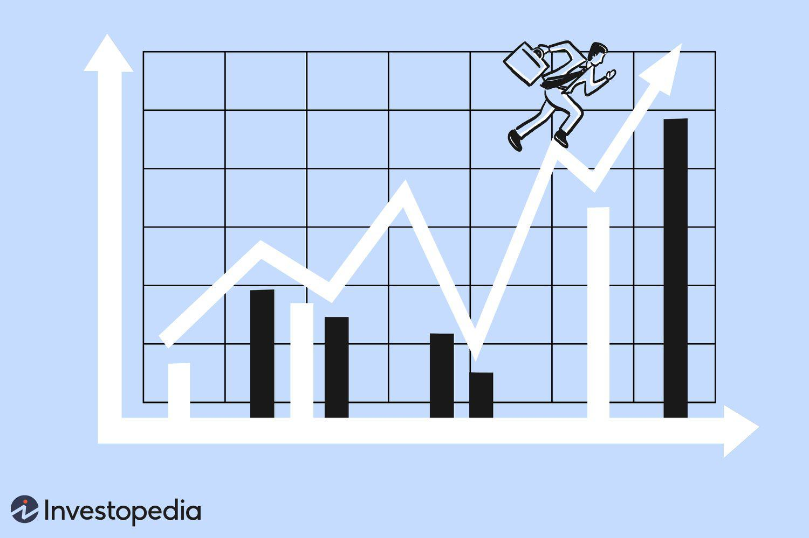

'Beating the market' is a term that epitomizes success in the investing world. It refers to the ability of an investor or investment strategy to achieve returns that exceed a market benchmark like the S&P 500. This benchmark serves as a standard for measuring market performance, so surpassing it is often viewed as an indicator of superior investment skills or strategies.

Traditionally, investors have relied on fundamental and technical analysis to guide their investment decisions, engaging in manual trades based on these insights. However, the rise of algorithmic trading is significantly altering the landscape. Algorithmic trading uses computerized systems to execute trades according to pre-defined criteria, enabling a more disciplined and systematic approach. This transformation is primarily driven by the elimination of human emotions, which often lead to impulsive decisions and errors.



Incorporating sophisticated algorithms, these systems can process vast volumes of market data in milliseconds, analyze patterns, and execute trades with precision and speed far beyond human capabilities. For example, algorithmic trading can exploit price discrepancies between different markets or assets through strategies such as arbitrage, or it can follow trends by recognizing significant indicators that suggest market direction shifts.

The goal of this article is to explore how investors can potentially surpass market performance through the adoption of algorithmic trading strategies. As financial markets become increasingly complex and efficient, understanding the role of algorithmic trading in potentially 'beating the market' is crucial for modern investors seeking to maximize their returns.

## Table of Contents

## What Does It Mean to Beat the Market?

Beating the market refers to achieving investment returns that surpass a standard market benchmark, such as the S&P 500 index. This benchmark represents a broad spectrum of the market, typically encompassing a diversified range of assets, making it a common metric for evaluating investment performance.

In quantitative terms, if an investment portfolio yields a higher annual return than the S&P 500, it is considered to have beaten the market. The formula to quantify this can be expressed as:

$$
R_{p} > R_{b}
$$

where $R_{p}$ is the return of the portfolio and $R_{b}$ is the return of the benchmark index over the same period.

The ability to consistently outperform these benchmarks is a crucial criterion for assessing the effectiveness of investment strategies employed by companies and individual investors. Stakeholders, such as mutual funds, hedge funds, and individual asset managers, are often judged on their capacity to exceed these benchmarks, which serves as evidence of their investment acumen.

In practice, investors might use various methods to aim for returns exceeding market averages. These methods can include leveraging specialized knowledge, employing sophisticated trading strategies, or utilizing advanced technologies like [algorithmic trading](/wiki/algorithmic-trading). The challenge, however, resides in the efficient market hypothesis, which posits that asset prices fully reflect all available information, thus making it difficult for investors to consistently achieve better returns than the overall market.

Nonetheless, by deploying strategies that capitalize on market inefficiencies or using technology to execute faster and more informed trades, some market participants manage to achieve this goal. The pursuit of beating the market is a driving force behind innovation and competition within the investment community, continually pushing firms and investors to refine their strategies and enhance performance evaluation metrics.

 to Algorithmic Trading

Algorithmic trading is a method of executing trade orders by utilizing automated and pre-programmed trading instructions. These instructions can encompass variables such as timing, price, and [volume](/wiki/volume-trading-strategy). The core concept of algorithmic trading hinges on the use of complex mathematical models and formulas to exploit market inefficiencies. By leveraging computerized systems, algorithms can execute trades at speeds and frequencies that are far beyond human capabilities.

The process of algorithmic trading involves setting up a series of instructions that guide the trading system to make buy or sell decisions on its own. These instructions can be based on an array of criteria, including technical indicators, statistical [arbitrage](/wiki/arbitrage), or market signals. Algorithms are especially effective in scenarios where rapid decision-making is paramount, as they can analyze market data and execute trades in fractions of a second.

A fundamental advantage of algorithmic trading lies in its capacity to remove human emotions from trading decisions. Emotional responses often lead to irrational trading behavior, which can result in significant financial losses. By employing algorithms, traders can ensure that decisions are systematic and based solely on data-driven insights. This level of discipline aids in adhering strictly to predefined trading strategies, thereby minimizing the risk of impulsive decisions prompted by market [volatility](/wiki/volatility-trading-strategies).

The precision of algorithmic trading is significantly enhanced by its reliance on data analytics and computing power. This not only allows for meticulous [backtesting](/wiki/backtesting) of trading strategies against historical data but also facilitates the real-time assessment of market conditions. In environments where information changes rapidly, the ability to process data instantly and adjust strategies accordingly is invaluable.

For illustrative purposes, consider a simple algorithmic trading strategy implemented in Python:

```python
import numpy as np

def simple_moving_average_strategy(prices, window_size):
    moving_avg = np.convolve(prices, np.ones(window_size)/window_size, mode='valid')
    signals = []

    for i in range(len(moving_avg)):
        if i == 0:
            signals.append(0)  # No signal at the start
        elif prices[i + window_size - 1] > moving_avg[i - 1]:
            signals.append(1)  # Buy signal
        else:
            signals.append(-1)  # Sell signal

    return signals

# Example usage
prices = [100, 102, 104, 103, 105, 107, 106, 108, 110]
window_size = 3
signals = simple_moving_average_strategy(prices, window_size)
print(signals)
```

This strategy captures the essence of algorithmic trading by using historical price data to generate buy (1) and sell (-1) signals based on a moving average. Although simplistic, such strategies can be refined and combined with more complex algorithms to create robust trading systems capable of handling diverse market scenarios.

In summary, algorithmic trading represents a paradigm shift in investment practices, enabling traders to deploy systematic and emotionless strategies swiftly and with precision. This technological evolution continues to reshape financial markets, offering significant potential for increased efficiency and profitability.

## Advantages of Algorithmic Trading

Algorithmic trading offers numerous advantages that significantly enhance the trading process, making it more efficient, accurate, and capable of handling large volumes of data in real-time.

One of the primary benefits of algorithmic trading is its speed and efficiency. Algorithmic systems can execute trades within fractions of a second, far surpassing human capabilities. This rapid execution allows traders to capitalize on transient market opportunities that would be missed if reliant on manual trading. A well-timed trade can make a substantial difference in the fast-paced environment of financial markets, where prices can change rapidly.

Another critical advantage of algorithmic trading is its ability to make data-driven decisions that reduce human error. Algorithms operate on pre-defined criteria and rules, eliminating the emotional biases and impulsive decisions that can affect human traders. This systematic approach ensures disciplined trading behavior, even under volatile market conditions. By adhering to a set strategy, algorithmic trading minimizes errors and maintains consistency in decision-making.

Furthermore, algorithmic trading enables the processing of massive amounts of market data in real-time. This capability is crucial in the modern financial landscape, where traders need to analyze vast datasets to identify patterns and trends. Algorithms can swiftly process and interpret this data, providing traders with actionable insights that inform profitable trading strategies. The capacity to filter relevant information from a continuous stream of data enhances the trader's ability to react to market movements promptly.

In essence, the advantages of algorithmic trading lie in its speed, precision, and data processing capabilities. These attributes collectively enhance the trading experience, enabling more informed and strategic decisions that align with investment objectives.

## Can Algorithmic Trading Beat the Market?

Algorithmic trading has revolutionized the investment landscape, yet the question remains: can it consistently beat the market? Beating the market refers to achieving investment returns that surpass a designated market benchmark, such as the S&P 500. This task is especially challenging given the efficient market hypothesis, which asserts that asset prices fully reflect all available information.

### Challenges and Capabilities

The primary challenge lies in the efficiency of modern markets, where asset prices typically react swiftly to new information. This makes it difficult for any trader, algorithmic or otherwise, to maintain a persistent advantage. However, algorithmic trading comes equipped with certain capabilities that can potentially tilt the odds:

1. **Speed and Efficiency**: Algorithms can execute trades with remarkable speed, leveraging minute differences in price to gain an edge. This is particularly useful in high-frequency trading, where speed and timing are paramount.

2. **Data Processing**: Algorithms can analyze vast datasets in real-time, identifying complex patterns or trends that human traders might overlook. This capability is pivotal in developing sophisticated trading strategies capable of identifying mispriced assets.

### Superior Performance Scenarios

While it is challenging, there are specific scenarios where algorithmic strategies have demonstrated superior performance:

- **Trend Following**: This strategy capitalizes on the tendency of markets to exhibit trends. Algorithms are designed to identify and exploit these trends by executing trades that align with the prevailing market direction. Trend-following strategies have historically performed well in markets experiencing strong directional movements.

- **Arbitrage**: Algorithmic trading thrives in scenarios where arbitrage opportunities arise. These opportunities exist when price discrepancies occur between different markets or instruments. Algorithms are capable of executing simultaneous trades to profit from these discrepancies before they disappear, thus securing a risk-free profit.

### An Illustrative Example

Consider a simplified Python script that implements a basic arbitrage strategy:

```python
def arbitrage_opportunity(price_market1, price_market2, transaction_cost):
    # Check for arbitrage opportunity
    if price_market1 + transaction_cost < price_market2:
        return "Buy in Market 1, Sell in Market 2"
    elif price_market2 + transaction_cost < price_market1:
        return "Buy in Market 2, Sell in Market 1"
    else:
        return "No Arbitrage Opportunity"

# Example prices
price_market1 = 100
price_market2 = 102
transaction_cost = 1

decision = arbitrage_opportunity(price_market1, price_market2, transaction_cost)
```

In this example, the algorithm examines prices in two different markets and accounts for transaction costs to determine the viability of an arbitrage opportunity. This systematic approach enables rapid decision-making, which is crucial in capitalizing on short-lived market inefficiencies.

### Conclusion

While algorithmic trading holds potential for outperforming market benchmarks, doing so consistently remains a formidable challenge. Market efficiency, competition, and the need for robust algorithms and data are significant hurdles. However, with strategic application and advancement in technologies such as [machine learning](/wiki/machine-learning), algorithmic traders continue to explore avenues to unlock market-beating returns in specific scenarios.

## Common Algorithmic Trading Strategies

Algorithmic trading strategies have become an essential component in modern financial markets. These strategies leverage computational power to identify and execute trades based on established patterns, reducing human bias and potentially improving trading outcomes. Among the numerous strategies, trend-following, arbitrage, and mean reversion are some of the most widely employed due to their effectiveness across different market conditions.

**Trend-Following Strategies**

Trend-following strategies are predicated on the idea that assets which have been moving in a given direction will continue to do so in the near future. These strategies do not attempt to predict the market direction but rather exploit the existing trend. A common tool used in trend-following is the moving average. For instance, a simple moving average crossover strategy might involve buying an asset when a short-term moving average crosses above a long-term moving average and selling when it crosses below. The formula for a simple moving average (SMA) is:

$$

SMA = \frac{1}{n} \sum_{i=0}^{n-1} P_i 
$$

where $P_i$ represents the price of the asset at time $i$ and $n$ is the number of periods.

Trend-following strategies generally perform well in markets that exhibit strong directional movements, such as during bullish or bearish periods. However, they can struggle in sideways or choppy markets where definitive trends are absent.

**Arbitrage Strategies**

Arbitrage strategies seek to profit from price discrepancies of the same or similar financial instruments across different markets or forms. The fundamental premise is to buy low in one market and sell high in another, thus capitalizing on the price differential. For instance, [statistical arbitrage](/wiki/statistical-arbitrage) might exploit mean reversion characteristics by simultaneously buying underpriced securities and selling overpriced ones based on statistical models.

Market conditions that feature inefficiencies, such as moments of high volatility or illiquid markets, often make arbitrage strategies more viable. However, arbitrage opportunities can be fleeting, requiring rapid execution and advanced technology for success. Algorithmic systems enable swift identification and trade execution, smoothing out the complexities of taking advantage of minute discrepancies.

**Mean Reversion Strategies**

Mean reversion strategies are based on the theory that prices oscillate around their historical average or mean. When prices deviate significantly from this mean, the strategy anticipates a reversion to the mean. A typical approach involves identifying securities that have outperformed or underperformed relative to historical norms, and trading against the extreme move.

These strategies tend to be more effective in stable or range-bound markets where prices regularly return to an average level after deviating. However, in the face of strong trends, mean reversion strategies can face losses if prices fail to revert as expected. The challenge is accurately determining the timeframe and magnitude of the mean to avoid false signals.

Overall, the effectiveness of these strategies greatly depends on the underlying market conditions and the precision of the models used to execute trades. Incorporating these strategies into a diversified trading approach can help in achieving consistent returns while managing risks effectively.

## Real-World Applications and Success Stories

Financial institutions and hedge funds have increasingly turned to algorithmic trading to enhance their investment strategies and achieve superior market performance. A prominent example is Renaissance Technologies, a [hedge fund](/wiki/hedge-fund-trading-strategies) renowned for its Medallion Fund. This fund, managed by a team of scientists and mathematicians, has leveraged complex algorithmic models to deliver annualized returns exceeding 35% since its inception in 1988, far outpacing broader market indices.[^1] Their success is attributed to sophisticated statistical models and data analytics that identify and exploit market inefficiencies.

Another notable instance is the Goldman Sachs' trading division, which extensively employs algorithmic trading to manage a significant portion of its trades. The use of advanced algorithms allows the firm to execute high-frequency trades across global markets, optimizing profits by analyzing vast datasets and adjusting strategies in real-time.[^2] This approach not only mitigates the risks associated with human error but also capitalizes on arbitrage opportunities with exceptional speed and accuracy.

Two Sigma, a technology-driven hedge fund, has also showcased the efficacy of algorithmic trading. Utilizing machine learning and Big Data, Two Sigma develops predictive models that assess various economic indicators and market sentiments. These AI-driven algorithms have enabled Two Sigma to consistently outperform market benchmarks, emphasizing the role of continuous innovation and technology adaptation in investment success.

Case studies demonstrate the transformative impact of AI-driven algorithms in algorithmic trading. For instance, [quantitative trading](/wiki/quantitative-trading) firm AQR Capital Management integrates quantitative strategies and automated systems to manage its diverse investment portfolio. The firm's deployment of multi-[factor](/wiki/factor-investing) strategies and systematic trading models has been instrumental in achieving substantial market returns, even amid volatile conditions.[^3]

Another illustrative case involves the use of algorithmic trading in [momentum](/wiki/momentum) strategies, where algorithms detect price trends and execute trades to ride these trends for profit. This strategy has been effectively implemented by hedge funds like Winton Group, which utilizes data science and financial theories to design algorithms that can predict market moves based on historical price movements and trading patterns.

The adoption of algorithmic trading has also permeated the operations of large asset management firms such as BlackRock. The firm employs algorithms to enhance portfolio management, optimize trades, and manage risk more effectively. These algorithms process millions of data points daily to inform investment decisions, enabling BlackRock to provide competitive returns for its clients.

Collectively, these examples underscore the significant role that algorithmic trading plays in shaping modern investment strategies. The success stories of these financial institutions and hedge funds reflect the potential of AI-driven algorithms to not only meet but often exceed market expectations, thus solidifying their place in contemporary trading frameworks.

[^1]: "Simons and Renaissance: A Numerical Coincidence." The Financial Times.
[^2]: "Inside the High-Frequency Trading Engine Room." The Wall Street Journal.
[^3]: "AQR Capital Management: A Case Study in Systematic Trading." Institutional Investor.

## Risks and Challenges of Algorithmic Trading

Algorithmic trading, while offering numerous advantages, is not devoid of risks and challenges that traders and institutions must navigate. One of the primary risks is market volatility. Algorithmic systems, designed to execute trades at high speeds based on pre-defined criteria, may react unpredictably during periods of abnormal market activity. Rapid price movements can trigger a cascade of programmed trades, potentially exacerbating volatility and leading to unintended large-scale sell-offs or buy-ins. Such scenarios can manifest in events like the "flash crash" of 2010, where algorithms contributed to a dramatic drop in market value within minutes.

Technical failures also pose significant risks. Algorithms are dependent on complex software and hardware infrastructure, and any technical glitch, whether due to software bugs, hardware malfunctions, or connectivity issues, can lead to costly errors. For instance, an algorithm might execute trades based on outdated or incorrect information if a data feed is disrupted. This highlights the necessity for robust infrastructure, regular testing, and fail-safes to ensure system reliability.

A critical requirement for algorithmic trading is access to high-quality data. Algorithms rely heavily on real-time and historical data to make informed decisions. Inaccurate, incomplete, or delayed data can result in suboptimal trades and significant financial losses. Ensuring data integrity involves sourcing from reliable vendors and implementing rigorous data validation processes. Without high-quality inputs, even the most sophisticated algorithms can produce flawed outputs.

The development of robust algorithms is paramount. An algorithm's logic determines its ability to process data effectively and execute profitable trades. Poorly designed algorithms, which might arise from inadequate backtesting or overly simplistic models, can lead to inefficiencies and financial losses. Continuous refinement and adaptation to changing market conditions are essential. This involves employing advanced techniques such as machine learning, where algorithms can learn and evolve from new data, enhancing their predictive capabilities.

Algorithmic trading is also subject to regulatory challenges. Markets worldwide are governed by a plethora of rules to ensure fairness and stability. Algorithms must comply with these regulations to avoid legal penalties and reputational damage. This necessitates a thorough understanding of relevant legal frameworks and the integration of compliance checks within algorithmic systems.

In conclusion, while algorithmic trading offers significant potential to enhance investment returns, it requires careful management of risks associated with market volatility, technical failures, data quality, algorithm robustness, and regulatory compliance. Traders and institutions should invest in resilient systems and continuous monitoring to mitigate these challenges effectively.

## Future Trends in Algorithmic Trading

Emerging technologies such as [artificial intelligence](/wiki/ai-artificial-intelligence) (AI) and machine learning are significantly enhancing the capabilities of algorithmic trading. These technologies are automating complex tasks, allowing traders to make decisions based on comprehensive data analysis and prediction models.

AI and machine learning algorithms can identify patterns in vast datasets that traditional statistical methods might miss. These algorithms are constantly improving their performance through techniques such as supervised, unsupervised, and [reinforcement learning](/wiki/reinforcement-learning). For example, machine learning can help develop predictive models that assess the potential future movements of stock prices based on historical data and other quantitative factors.

One of the critical advancements brought by these technologies is the development of [deep learning](/wiki/deep-learning) frameworks. Deep learning—a subset of machine learning using neural networks—excels at processing large datasets to discern intricate patterns. Applications of deep learning in algorithmic trading include sentiment analysis from news sources and social media to gauge market conditions, price prediction, and optimizing trading strategies for better performance.

AI-driven sentiment analysis allows traders to evaluate the market mood, which can be a valuable addition to quantitative data. For example, Python libraries such as Natural Language Toolkit (NLTK) or advanced machine learning models like BERT (Bidirectional Encoder Representations from Transformers) can be used to parse and interpret financial news articles or social media chatter to predict market behavior. 

Machine learning models also play a crucial role in risk management by predicting the likelihood of extreme market events, thus preventing significant losses. By developing classifiers that can flag potential risks, investors are better positioned to rebalance their portfolios in anticipation.

Algorithmic trading increasingly relies on AI's ability to process [alternative data](/wiki/best-alternative-data) sources. Satellite imagery, social media trends, and even environmental data, once deemed irrelevant, are now part of sophisticated trading models that offer better predictive power. This new type of data, coupled with the processing power of AI, allows for more nuanced and informed trading decisions.

Quantum computing, while still in its nascent stages, promises to further transform algorithmic trading. It potentially offers exponential improvements in processing speed for real-time data analysis, optimization problems, and fraud detection. As quantum computing evolves, it could handle computations and simulations that are currently impractical with classical computers.

Looking ahead, the influence of AI and machine learning on algorithmic trading is expected to grow as these technologies become more sophisticated. This evolution promises more personalized trading strategies, adaptive learning systems that continually refine trading models in real time, and an even greater reliance on diverse datasets for decision-making. In this rapidly evolving environment, staying abreast of technological advancements will be crucial for market participants aiming to maintain a competitive edge.

## Conclusion

Algorithmic trading has been highlighted as a transformative force in the investment world, offering the possibility to outperform traditional market benchmarks. By leveraging computerized systems, investors can execute trades with precision and speed, reducing the impact of human emotions and errors. The efficiency of these algorithms allows them to process vast quantities of market data in real-time, leading to more informed and timely decisions that are crucial for capitalizing on fleeting market opportunities.

However, the ambition to consistently beat the market presents significant challenges, primarily due to the market's inherently efficient nature. Whether it is through trend-following, arbitrage, or mean reversion strategies, algorithmic trading can provide advantages in specific circumstances, but it does not guarantee success across all market conditions. As seen in various case studies, institutions have managed to achieve superior returns by tailoring their algorithmic strategies to exploit specific market inefficiencies, albeit not without risks such as market volatility and technical failures.

Looking ahead, advancements in technologies like AI and machine learning are poised to further enhance the capabilities of algorithmic trading, potentially offering new opportunities for investors to achieve their financial objectives. To fully harness these innovations, investors should align their algorithmic strategies with their overall investment goals, taking into account the need for high-quality data, robust algorithms, and a comprehensive understanding of the associated risks. By doing so, algorithmic trading can serve as a powerful tool, not just for beating the market, but for achieving sustained and strategic financial growth.

## References & Further Reading

[1]: ["Advances in Financial Machine Learning"](https://www.amazon.com/Advances-Financial-Machine-Learning-Marcos/dp/1119482089) by Marcos Lopez de Prado

[2]: Bergstra, J., Bardenet, R., Bengio, Y., & Kégl, B. (2011). ["Algorithms for Hyper-Parameter Optimization."](https://dl.acm.org/doi/10.5555/2986459.2986743) Advances in Neural Information Processing Systems 24.

[3]: ["Evidence-Based Technical Analysis: Applying the Scientific Method and Statistical Inference to Trading Signals"](https://www.amazon.com/Evidence-Based-Technical-Analysis-Scientific-Statistical/dp/0470008741) by David Aronson

[4]: ["Machine Learning for Algorithmic Trading"](https://github.com/stefan-jansen/machine-learning-for-trading) by Stefan Jansen

[5]: ["Quantitative Trading: How to Build Your Own Algorithmic Trading Business"](https://github.com/LucindaYa/quant-resources/blob/master/Quantitative%20Trading%20How%20to%20Build%20Your%20Own%20Algorithmic%20Trading%20Business.pdf) by Ernest P. Chan