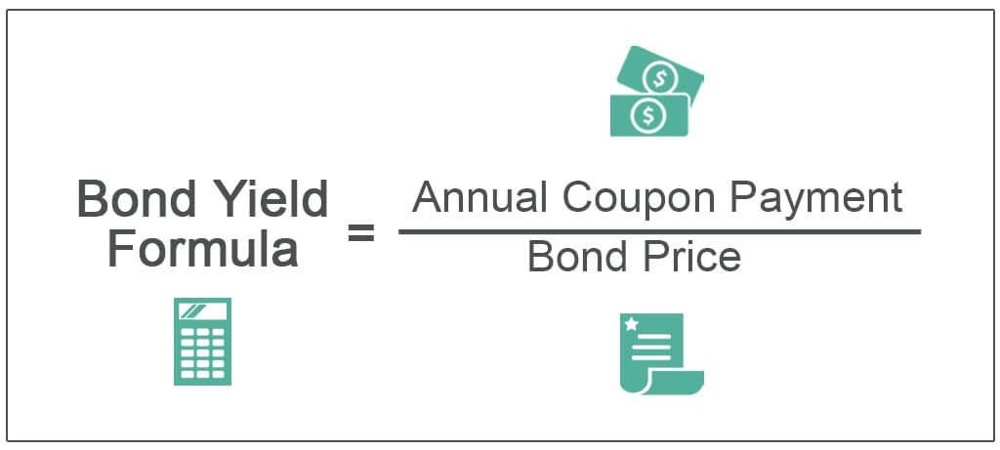

## Table of Contents

## What is a bond?

A bond is like a loan that you give to a company or the government. When you buy a bond, you are lending them money. In return, they promise to pay you back the money you lent them, plus some extra money called interest, over a certain period of time. This interest is usually paid to you regularly, like every year or every six months, until the bond reaches its end date, which is called the maturity date.

Bonds are considered safer than stocks because they have a more predictable return. If you hold a bond until it matures, you know exactly how much money you will get back. However, bonds can still lose value if the issuer (the company or government that issued the bond) runs into financial trouble and can't pay back the loan. Also, if interest rates go up, the value of existing bonds can go down because new bonds might offer higher interest rates.

## What is cost basis and why is it important for bonds?

Cost basis is the original price you paid for a bond, including any fees or commissions. It's important because it helps you figure out if you made or lost money when you sell the bond. When you sell, you compare the selling price to your cost basis. If the selling price is higher, you made a profit. If it's lower, you had a loss.

Knowing your cost basis is also important for taxes. If you sell a bond for more than your cost basis, you might have to pay taxes on the profit, which is called a capital gain. If you sell for less, you might be able to use the loss to reduce your taxes. Keeping track of your cost basis helps you report your taxes correctly and avoid any surprises.

## How is the cost basis of a bond calculated when purchased at face value?

When you buy a bond at its face value, the cost basis is easy to figure out. The face value is the amount the bond will be worth when it matures, and it's also the price you pay for the bond. So, if you buy a bond with a face value of $1,000, your cost basis is $1,000. This is the starting point for calculating any profit or loss when you sell the bond.

If you hold the bond until it matures, you'll get back the face value, which matches your cost basis. But if you decide to sell the bond before it matures, you'll compare the selling price to your cost basis of $1,000. If you sell for more than $1,000, you'll have a profit. If you sell for less, you'll have a loss. Knowing your cost basis helps you understand your financial situation and handle your taxes correctly.

## What happens to the cost basis if a bond is bought at a premium or discount?

When you buy a bond at a premium, you're paying more than its face value. For example, if a bond's face value is $1,000 but you pay $1,050 for it, your cost basis is $1,050. This higher cost basis means that if you hold the bond until it matures, you'll get back less than what you paid. You'll get the face value of $1,000, so you'll have a loss of $50. If you sell the bond before it matures, you'll compare the selling price to your $1,050 cost basis to see if you made or lost money.

If you buy a bond at a discount, you're paying less than its face value. For instance, if a bond's face value is $1,000 but you buy it for $950, your cost basis is $950. Holding the bond until it matures means you'll get back more than what you paid. You'll receive the face value of $1,000, so you'll have a profit of $50. If you sell the bond before it matures, you'll compare the selling price to your $950 cost basis to determine your profit or loss. Knowing your cost basis is important for understanding your financial gains or losses and for handling your taxes correctly.

## How do bond amortization and accretion affect cost basis?

When you buy a bond at a premium, you pay more than its face value. Over time, you can adjust your cost basis through a process called amortization. Amortization means you slowly reduce your cost basis until it matches the bond's face value by the time it matures. This is because you're spreading out the extra amount you paid over the life of the bond. For example, if you paid $1,050 for a bond with a face value of $1,000, you'd lower your cost basis a little bit each year until it reaches $1,000. This helps you figure out your taxable income more accurately because you can claim a bit of that premium as a loss each year.

On the other hand, if you buy a bond at a discount, you pay less than its face value. You can adjust your cost basis through a process called accretion. Accretion means you slowly increase your cost basis until it matches the bond's face value by the time it matures. This is because you're spreading out the difference between what you paid and the face value over the life of the bond. For example, if you paid $950 for a bond with a face value of $1,000, you'd raise your cost basis a little bit each year until it reaches $1,000. This helps you figure out your taxable income more accurately because you can report a bit of that discount as income each year.

## What are the tax implications of bond cost basis?

When you sell a bond, the difference between what you sell it for and your cost basis can affect your taxes. If you sell the bond for more than your cost basis, you have a capital gain. You might have to pay taxes on this gain. The tax rate depends on how long you held the bond. If you held it for a year or less, it's a short-term capital gain, and you'll pay your regular income tax rate. If you held it for more than a year, it's a long-term capital gain, and you'll pay a lower tax rate. If you sell the bond for less than your cost basis, you have a capital loss. You can use this loss to lower your taxes by offsetting other gains or even some of your regular income.

Amortization and accretion also have tax implications. If you bought a bond at a premium, you can claim the amortized amount as a loss each year, which can reduce your taxable income. This means you're slowly getting back the extra money you paid through a tax benefit. If you bought a bond at a discount, the accreted amount each year counts as income. You'll need to report this income on your taxes, but it helps you spread out the tax hit over the life of the bond instead of having to pay all at once when the bond matures. Keeping track of these adjustments to your cost basis helps you handle your taxes more accurately.

## How does reinvestment of interest affect the cost basis of a bond?

When you reinvest the interest you earn from a bond, it can change your cost basis. If you take the interest payments and use them to buy more of the same bond, you're adding to your investment. This means your cost basis goes up because you're now holding more bonds than you started with. For example, if you originally bought a bond for $1,000 and then used the interest to buy another $100 worth of the same bond, your new cost basis would be $1,100.

This change in cost basis can affect your taxes when you sell the bond. If you sell all your bonds for more than your new, higher cost basis, you'll have a bigger capital gain to report. If you sell for less than your new cost basis, you'll have a smaller capital loss. Keeping track of how reinvesting interest changes your cost basis helps you figure out your taxes correctly and understand your overall profit or loss from the bond.

## What adjustments need to be made to the cost basis for callable or convertible bonds?

If you own a callable bond, the company that issued it can decide to pay you back early. This can affect your cost basis if you bought the bond at a premium or a discount. If you bought it at a premium, you might have been amortizing the extra amount you paid. If the bond gets called early, you'll need to adjust your cost basis to reflect the amortization up to that point. If you bought it at a discount, you might have been accreting the difference. If the bond is called, you'll need to adjust your cost basis to show the accretion up to the call date. This helps you figure out any profit or loss and handle your taxes correctly.

Convertible bonds can also change your cost basis. These bonds can be turned into a set number of the company's stock. If you decide to convert your bond into stock, you'll need to figure out the cost basis of the stock you get. You do this by taking your bond's cost basis and dividing it by the number of shares you receive. This new cost basis for the stock will be important if you later sell the stock, as it will help you calculate any capital gains or losses for tax purposes. Keeping track of these adjustments helps you manage your investments and taxes accurately.

## How should bond cost basis be reported for tax purposes?

When you sell a bond, you need to report the cost basis on your taxes to figure out if you made or lost money. The cost basis is the price you paid for the bond, including any fees or commissions. If you sell the bond for more than your cost basis, you have a capital gain, and you might have to pay taxes on it. If you sell for less, you have a capital loss, which can help lower your taxes. The tax rate depends on how long you held the bond. If you held it for a year or less, it's a short-term capital gain or loss, and you'll use your regular income tax rate. If you held it for more than a year, it's a long-term capital gain or loss, and you'll pay a lower tax rate.

If you bought the bond at a premium or a discount, you might need to adjust your cost basis over time through amortization or accretion. This can affect your taxes each year. With a premium bond, you can claim a bit of the extra amount you paid as a loss each year, which can lower your taxable income. With a discount bond, you need to report a bit of the difference as income each year. If you reinvest the interest from your bond to buy more bonds, your cost basis goes up. This can change how much capital gain or loss you report when you sell. Keeping track of these adjustments helps you report your taxes correctly and avoid any surprises.

## What are the considerations for bond cost basis in a bond ladder strategy?

A bond ladder strategy means you buy bonds that mature at different times. This can help you manage your money better because you get money back at different times. When you use this strategy, you need to keep track of the cost basis for each bond in your ladder. The cost basis is the price you paid for each bond, including any fees. If you bought some bonds at a premium or a discount, you'll need to adjust the cost basis over time through amortization or accretion. This helps you figure out your profit or loss and handle your taxes correctly when you sell or when the bonds mature.

If you reinvest the interest from your bonds to buy more bonds, your cost basis for those new bonds will go up. This means you'll need to keep track of the new cost basis for each bond you add to your ladder. When you sell a bond or it matures, you'll compare the selling price or the face value to the cost basis to see if you made or lost money. This can affect your taxes because you might have a capital gain or loss. Keeping good records of your cost basis for each bond in your ladder helps you manage your investments and taxes accurately.

## How does the cost basis change in the event of a bond swap or exchange?

When you do a bond swap or exchange, you trade one bond for another. This can change your cost basis. The new cost basis for the bond you get will be the same as the cost basis of the bond you gave up. For example, if you swap a bond you bought for $1,000 for a different bond, the new bond's cost basis will be $1,000. If you bought the original bond at a premium or a discount, you need to adjust the cost basis up to the time of the swap. This means if you were amortizing a premium or accreting a discount, you'll need to figure out where your cost basis was at the time of the swap and use that for the new bond.

This change in cost basis can affect your taxes. If you later sell the new bond, you'll compare the selling price to the new cost basis to see if you made or lost money. If you sell for more than the new cost basis, you'll have a capital gain and might have to pay taxes on it. If you sell for less, you'll have a capital loss, which can help lower your taxes. Keeping track of these changes helps you handle your taxes correctly and understand your overall profit or loss from the bond swap or exchange.

## What advanced strategies can be used to manage bond cost basis for optimizing tax outcomes?

One advanced strategy to manage bond cost basis for better tax outcomes is called tax loss harvesting. This means you sell a bond that has gone down in value, so you have a loss. You can use this loss to lower your taxes by offsetting other gains or even some of your regular income. After selling the bond, you can buy a similar bond to keep your investment strategy the same. This way, you get the tax benefit without changing your overall investment plan. If you bought the bond at a premium or a discount, you need to adjust the cost basis through amortization or accretion before you sell. This helps you figure out the right amount of loss to report.

Another strategy is to use bond swaps to manage your cost basis. If you have a bond that's lost value, you can swap it for a similar bond. The new bond will have the same cost basis as the old one, adjusted for any amortization or accretion up to the swap date. This can help you keep your investment strategy while possibly getting a tax benefit from the loss on the old bond. You can also use bond swaps to change the timing of when you get your money back or to adjust to changes in interest rates. By carefully managing these swaps, you can optimize your tax situation and keep your investment goals on track.

## References & Further Reading

[1]: ["Advances in Financial Machine Learning"](https://www.amazon.com/Advances-Financial-Machine-Learning-Marcos/dp/1119482089) by Marcos Lopez de Prado

[2]: ["Evidence-Based Technical Analysis: Applying the Scientific Method and Statistical Inference to Trading Signals"](https://www.amazon.com/Evidence-Based-Technical-Analysis-Scientific-Statistical/dp/0470008741) by David Aronson

[3]: ["Machine Learning for Algorithmic Trading"](https://github.com/stefan-jansen/machine-learning-for-trading) by Stefan Jansen

[4]: ["Quantitative Trading: How to Build Your Own Algorithmic Trading Business"](https://www.amazon.com/Quantitative-Trading-Build-Algorithmic-Business/dp/1119800064) by Ernest P. Chan