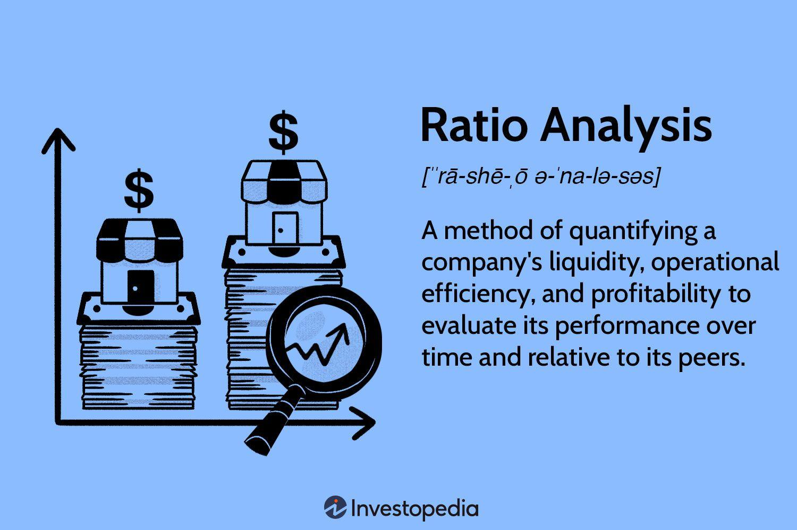

Understanding investment tools is essential for making informed decisions in finance. Among these tools, the bond ratio stands out as a critical metric in investment analysis and algorithmic trading. Bond ratios provide investors with the ability to assess and compare the yields of bonds, paving the way for strategic investment decisions. This article aims to provide a comprehensive overview of bond ratios and their financial interpretation, highlighting their significance within the realms of investment analysis and algorithmic trading systems. By grasping the intricacies of bond ratios, traders and investors can optimize their strategies and maximize returns, ensuring they remain competitive in an ever-evolving financial landscape. As we progress, we will examine the components and applications of bond ratios, offering insights into their pivotal role in the modern financial ecosystem.

## Table of Contents



## Understanding Bond Ratios

Bond ratios, also often referred to as bond yield ratios, are pivotal indicators employed by investors to evaluate bonds' performance and value relative to other investment avenues. These ratios allow for a comparative analysis of bond yields against alternative investment options like stocks and other fixed-income securities.

### Key Components of Bond Ratios

1. **Coupon Rate**: The coupon rate is the annual interest rate paid by the bond issuer relative to the bond's face or par value. It represents the fixed income that an investor receives for holding the bond. The coupon rate is expressed as a percentage. For example, a bond with a face value of $1,000 and an annual coupon payment of $50 would have a coupon rate of 5%.

2. **Current Yield**: The current yield is a measure that compares the annual coupon payment to the current market price of the bond. It provides insight into the income generated relative to the bond's current trading price rather than its face value. The formula for the current yield is:
$$
   \text{Current Yield} = \frac{\text{Annual Coupon Payment}}{\text{Current Market Price}}

$$

   For instance, if the bond mentioned above is trading at $900, the current yield would be approximately 5.56% ($50 / $900).

3. **Yield to Maturity (YTM)**: Yield to maturity is a comprehensive measure that calculates the total expected return on a bond if it is held until it matures. YTM takes into account the bond's current market price, par value, coupon interest rate, and time remaining until maturity. Unlike the current yield, YTM accounts for the time value of money and gains or losses realized if the bond is purchased at a discount or premium. It is often calculated using a complex formula or financial calculator, as it typically involves solving for the yield in the bond pricing equation.

These components are crucial for investors as they interpret the financial implications of different bonds and help in making informed strategic investment decisions. The coupon rate offers a preliminary look at what the investor can expect periodically, the current yield reflects the bond’s immediate earnings potential relative to its market price, and YTM offers a long-term picture of potential profitability. Understanding these measures enables investors to compare bonds effectively and choose investments that align with their risk tolerance and income requirements. Analyzing bond ratios also aids in assessing the issuer's creditworthiness and the potential for changes in interest rates affecting future bond performance.

## Financial Interpretation of Bond Ratios

Interpreting bond ratios requires a clear understanding of the interplay between bond prices, yields, and the prevailing market conditions. These metrics are pivotal for investors aiming to navigate the complexities of the bond market effectively.

Bond ratios serve as vital indicators for assessing risk levels and tracking economic trends. They are particularly useful in anticipating potential changes in interest rates, which can significantly influence bond values. A basic financial principle is that bond prices and yields move inversely. Consequently, when yields are rising, bond prices typically fall, and vice versa. This inverse relationship is crucial for interpreting bond ratios.

A higher bond ratio typically signals a more attractive yield, enticing investors with the promise of higher returns. However, this allure is often accompanied by an elevated risk profile. These bonds may be issued by entities with lower credit ratings or may reflect market conditions where interest rates are expected to rise, enhancing yields but also increasing risk.

Conversely, a lower bond ratio tends to indicate a safer investment. These bonds generally emanate from issuers with strong creditworthiness and a stable outlook, offering lower yields in exchange for reduced risk. Such investments are suitable for risk-averse investors prioritizing capital preservation over high returns.

Understanding these nuances is essential for investors striving to make informed decisions and manage portfolio risk effectively. For instance, a portfolio manager might decide to allocate more assets to low-risk bonds when market [volatility](/wiki/volatility-trading-strategies) is anticipated, despite the lower yield, to safeguard the portfolio's value.

Investors often employ quantitative tools to model the relationship between bond yields and market variables. Consider the following Python snippet, which uses a simplified approach to estimate the yield of a bond given its price and face value:

```python
def calculate_yield(face_value, price, coupon_rate):
    return (coupon_rate * face_value) / price

face_value = 1000  # Example face value of the bond
price = 950        # Current market price of the bond
coupon_rate = 0.05 # Annual coupon rate (5%)

yield_estimate = calculate_yield(face_value, price, coupon_rate)
print(f'Estimated Yield: {yield_estimate:.2f}')
```

This function calculates the yield by dividing the annual coupon payment by the current market price of the bond. It offers a simplified way to understand how different bond prices impact yields, assisting investors in making decisions aligned with their risk-return profiles. Proficiency in interpreting bond ratios, supported by such computational tools, is indispensable for those seeking to thrive in financial markets.

## Bond Ratios in Investment Analysis

Investment analysis heavily relies on bond ratios to evaluate different investment opportunities, offering a robust framework for investors aiming to optimize their portfolios. By scrutinizing bond ratios, analysts can effectively determine the relative values of various bonds within the market. This evaluation is vital for constructing diversified portfolios that balance risk and return, tailored to specific investor preferences.

Bond ratios serve as a critical tool for forecasting future market trends and potential shifts in economic policies. For instance, changes in central bank interest rates directly impact bond yields, influencing bond ratios. By closely monitoring these ratios, investors can anticipate market movements and adjust their strategies accordingly. This foresight is crucial, as it allows investors to make informed decisions on bond selection and timing.

Integrating bond ratio analysis into investment strategies can lead to more efficient allocations and enhance overall portfolio performance. The key components of bond ratios, such as the current yield and yield to maturity (YTM), provide valuable insights into the expected returns of a bond over its lifetime. The current yield is calculated as:

$$
\text{Current Yield} = \frac{\text{Annual Coupon Payment}}{\text{Current Market Price of the Bond}}
$$

Yield to maturity, on the other hand, considers the total returns an investor can expect if the bond is held until it matures, factoring in all coupon payments and the capital gain or loss incurred if the bond is purchased at a price different from its par value. YTM can be more complex to calculate, often requiring iterative methods or software for precise computation.

Additionally, bond ratios aid in navigating economic cycles and assessing potential changes in fiscal or monetary policies. By understanding bond ratios' implications on these areas, investors can position their portfolios to benefit from or mitigate risks associated with macroeconomic developments.

Incorporating bond ratio analysis into investment decisions empowers investors to achieve a more refined balance between risk and reward, ultimately leading to superior portfolio management. As markets grow increasingly complex, the role of rigorous bond ratio analysis in investment strategies becomes ever more critical.

## Algorithmic Trading and Bond Ratios

Algorithmic trading, often referred to as algo trading, leverages computer systems to execute trades based on pre-programmed instructions. These instructions incorporate variables such as timing, price, and quantity. The use of algorithms enables traders to operate at unparalleled speeds and volumes, capturing fleeting market opportunities. Bond ratios are integral to formulating these algorithms, serving as critical inputs that help identify and exploit market inefficiencies.

Bond ratios, which include metrics such as the current yield, yield to maturity (YTM), and coupon rate, provide valuable insights into the relative value of bonds. Traders use these ratios to evaluate and compare potential investments swiftly. When integrated into [algorithmic trading](/wiki/algorithmic-trading), bond ratios can facilitate the identification of [arbitrage](/wiki/arbitrage) opportunities—buying and selling securities to profit from price discrepancies across markets.

For a practical understanding, consider an algorithm that aims to exploit differences in the bond yield curves across various markets or issuers. Here's a simplified Python pseudocode example:

```python
import numpy as np

def find_arbitrage_opportunities(bond_data):
    # bond_data is a list of dictionaries with keys: 'market', 'bond', 'yield'
    arbitrage_opportunities = []

    # Calculate spread matrix
    markets = list(set(bond['market'] for bond in bond_data))
    spread_matrix = np.zeros((len(markets), len(markets)))

    for i, market1 in enumerate(markets):
        for j, market2 in enumerate(markets):
            if i != j:
                yields_market1 = [bond['yield'] for bond in bond_data if bond['market'] == market1]
                yields_market2 = [bond['yield'] for bond in bond_data if bond['market'] == market2]
                average_yield_market1 = np.mean(yields_market1)
                average_yield_market2 = np.mean(yields_market2)
                spread_matrix[i][j] = average_yield_market1 - average_yield_market2

    # Identify opportunities where the spread is greater than a certain threshold
    threshold = 0.02  # 2% for example
    for i, market1 in enumerate(markets):
        for j, market2 in enumerate(markets):
            if spread_matrix[i][j] > threshold:
                arbitrage_opportunities.append((market1, market2, spread_matrix[i][j]))

    return arbitrage_opportunities

# Example bond data
bond_data = [
    {'market': 'Market A', 'bond': 'Bond 1', 'yield': 0.05},
    {'market': 'Market B', 'bond': 'Bond 2', 'yield': 0.03},
    {'market': 'Market A', 'bond': 'Bond 3', 'yield': 0.04},
    {'market': 'Market B', 'bond': 'Bond 4', 'yield': 0.035},
]

opportunities = find_arbitrage_opportunities(bond_data)
print(opportunities)
```

The pseudocode exemplifies how algorithms assess yield differences between markets to identify lucrative trading positions. Additionally, advanced trading systems utilize real-time data to continuously adjust strategies, integrating dynamic changes in bond ratios and market conditions. Such capabilities allow for optimal trading decisions that maximize returns while managing risk effectively.

In sum, bond ratios serve as pivotal components in algorithmic trading, where they inform data-driven strategies that leverage rapid analysis and execution. By integrating these ratios, trading algorithms can enhance performance, offering competitive advantages in increasingly complex financial markets.

## Conclusion

Bond ratios serve as essential tools in financial interpretation and investment analysis. These ratios offer investors insights into bond performance and market conditions, enabling informed decision-making. Their application extends to algorithmic trading, where they contribute significantly to formulating strategies that enhance trading efficiency and profitability. By incorporating bond ratios into algorithmic models, traders can capitalize on market inefficiencies, assess arbitrage opportunities, and optimize trade execution.

Understanding and utilizing bond ratios allow investors to strike a more effective balance between risk and return in their portfolios. By comparing the yields of various bonds to other investment options, investors can gauge the attractiveness and risk associated with each option. This comparative analysis is fundamental for constructing well-diversified portfolios tailored to individual risk preferences and market forecasts.

As financial markets evolve, mastering bond ratio analysis is crucial for professional traders and investors. It empowers them to adjust to shifts in market dynamics, interest rates, and economic policies, ensuring their strategies remain adaptive and robust. Given the rapid development in financial technologies and data analytics, integrating bond ratio analysis into investment strategies will continue to be a vital practice for optimizing returns.

We encourage readers to further explore the nuances of bond ratios and integrate these concepts into their financial strategies. By doing so, investors can enhance their decision-making processes, improve their portfolio management capabilities, and achieve superior investment outcomes.

## References & Further Reading

[1]: Choudhry, M. (2010). ["Bond and Money Markets: Strategy, Trading, Analysis."](https://www.sciencedirect.com/book/9780750646772/the-bond-and-money-markets) Elsevier.

[2]: Fabozzi, F. J. (ed.). (2007). ["Fixed Income Analysis,"](https://books.google.com/books/about/Fixed_Income_Analysis.html?id=lujLawVLS3YC) 2nd Edition, John Wiley & Sons.

[3]: Ang, A. (2014). ["Asset Management: A Systematic Approach to Factor Investing."](https://academic.oup.com/book/3342) Oxford University Press.

[4]: Hull, J. C. (2014). ["Options, Futures, and Other Derivatives."](https://www.amazon.com/Options-Futures-Other-Derivatives-9th/dp/0133456315) 9th Edition, Pearson.

[5]: Nesvetailova, A. (2010). ["Financial Alchemy in Crisis: The Great Liquidity Illusion."](https://www.jstor.org/stable/j.ctt183p9vs) Pluto Press.