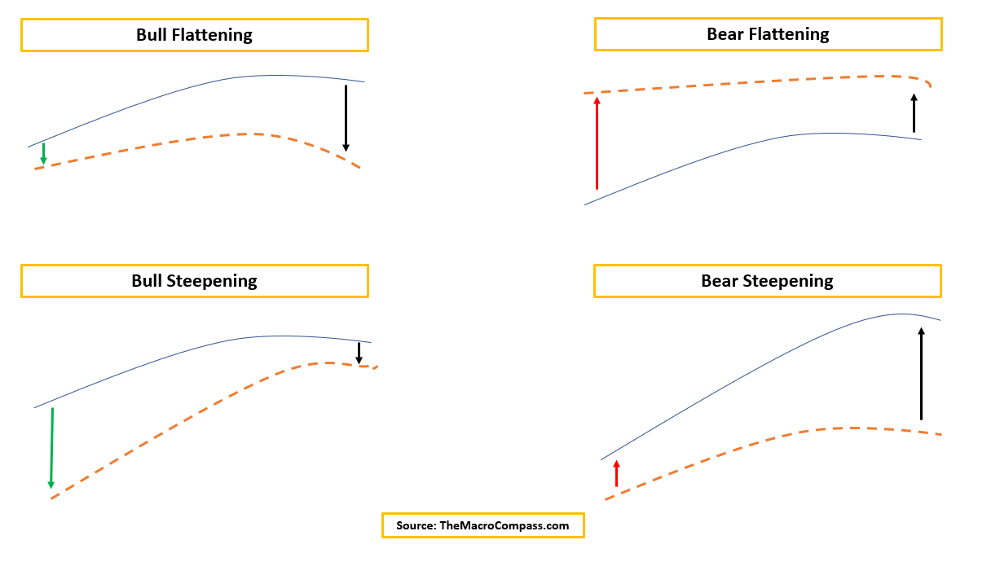

## Table of Contents

## What is a yield curve and why is it important?

A yield curve is a graph that shows the interest rates on bonds of different lengths of time, usually from three months to thirty years. It helps people see how much they can earn from investing in bonds over different periods. The shape of the yield curve can tell us a lot about what investors think will happen with the economy in the future. For example, a normal yield curve slopes upward, meaning long-term bonds have higher interest rates than short-term bonds. This shows that investors expect the economy to grow and inflation to rise over time.

The yield curve is important because it can signal changes in the economy. When the yield curve is flat or inverted, it can mean that investors are worried about the future. A flat yield curve happens when short-term and long-term interest rates are almost the same. An inverted yield curve, where short-term rates are higher than long-term rates, is often a sign that a recession might be coming. Economists and investors watch the yield curve closely because it helps them make decisions about where to put their money and how to plan for the future.

## What does the term 'steepening' mean in the context of a yield curve?

When people talk about a yield curve 'steepening,' they mean that the difference between the interest rates on short-term and long-term bonds is getting bigger. Imagine a line on a graph that goes up from left to right. If the line starts to tilt more steeply, that's what we call steepening. This happens when the interest rates on long-term bonds go up faster than the rates on short-term bonds.

Steepening can happen for different reasons. Sometimes it's because people think the economy will grow faster in the future, so they want more money for lending over a long time. Other times, it might be because the government or the central bank is doing things that make people think interest rates will go up. Watching the yield curve steepen can give investors clues about what might happen with the economy and help them decide where to put their money.

## What is a bull steepener and how does it differ from a bear steepener?

A bull steepener happens when the interest rates on long-term bonds go up, but the interest rates on short-term bonds stay the same or go down. This makes the yield curve steeper because the difference between short-term and long-term rates gets bigger. People call it a "bull" steepener because it often happens when investors feel good about the economy. They think the economy will grow, so they want more money for lending over a long time. This kind of steepening is a sign that people expect better times ahead.

A bear steepener is different because it happens when the interest rates on short-term bonds go up, but the rates on long-term bonds stay the same or don't go up as much. This also makes the yield curve steeper, but it's called a "bear" steepener because it can mean that investors are worried about the future. They might think that the central bank will raise short-term rates to fight inflation, but they're not so sure about the long-term. So, a bear steepener can be a sign that people are worried about what's coming next in the economy.

## What are the typical economic conditions that lead to a bull steepener?

A bull steepener usually happens when people feel good about the economy. They think things will get better, so they want more money for lending over a long time. This makes the interest rates on long-term bonds go up, while the rates on short-term bonds stay the same or go down. When people are hopeful about the future, they're more willing to invest in things that will pay off later, like long-term bonds. This hope can come from things like good job reports, strong business growth, or the government doing things to help the economy grow.

The hope for better times can also make people think that inflation will go up. When inflation goes up, the money you get back from a bond in the future won't be worth as much. So, to make up for this, people want higher interest rates on long-term bonds. That's why long-term rates go up faster than short-term rates during a bull steepener. It's all about people feeling good about the economy and expecting it to keep getting better.

## How does a bull steepener affect different types of bonds?

A bull steepener affects different types of bonds in different ways. For long-term bonds, their interest rates go up because people want more money for lending over a long time. They think the economy will get better and inflation will go up, so they want to be paid more to make up for the money losing value in the future. This means the price of long-term bonds goes down because new bonds with higher interest rates are more attractive.

For short-term bonds, their interest rates stay the same or go down during a bull steepener. People feel good about the economy, so they don't need as much money to lend for a short time. They're happy to get a smaller return because they think they can invest in other things that will do better in the future. So, the price of short-term bonds might go up a little because they become more appealing compared to long-term bonds with falling prices.

Overall, a bull steepener makes the difference between short-term and long-term bond rates bigger. This can lead investors to shift their money around, selling long-term bonds and buying short-term bonds or other investments they think will do well as the economy grows.

## What are the implications of a bull steepener for bond investors?

When a bull steepener happens, it can change things for bond investors. If you own long-term bonds, their value might go down because new bonds are being sold with higher interest rates. This is because people want more money for lending over a long time when they think the economy will get better. So, if you're thinking about selling your long-term bonds, you might not get as much money for them as before. But if you keep them until they mature, you'll still get the interest you were promised when you bought them.

For people who own short-term bonds, things might look a bit better. The value of short-term bonds might go up a little because their interest rates stay the same or go down. People are happy to lend money for a short time at a lower rate because they think they can find better places to put their money later. So, if you're holding short-term bonds, you might be in a good spot if you want to sell them. Bond investors need to watch these changes and decide if they want to keep their bonds or switch to other investments that might do well as the economy grows.

## How can investors identify a bull steepener in the market?

Investors can spot a bull steepener by watching how the interest rates on bonds change over time. They should look at the difference between the interest rates on long-term bonds, like those that last 10 or 30 years, and short-term bonds, like those that last a few months or a year. If the interest rates on long-term bonds are going up while the rates on short-term bonds stay the same or go down, that's a sign of a bull steepener.

This change can be seen on a graph called a yield curve. The yield curve shows the interest rates for bonds of different lengths. When a bull steepener is happening, the line on the graph will start to slope upward more steeply. This means the difference between the rates on short-term and long-term bonds is getting bigger. By keeping an eye on these changes, investors can tell when a bull steepener is happening and make choices about what to do with their money.

## What trading strategies are effective during a bull steepener environment?

During a bull steepener, a good strategy for bond investors is to sell their long-term bonds. When the interest rates on long-term bonds go up, the prices of those bonds go down. By selling before the prices drop too much, investors can avoid losing money. Another strategy is to buy short-term bonds because their prices might go up a little. People want to buy short-term bonds when they think the economy will get better, so their value can increase.

Another effective strategy is to look for other investments that might do well as the economy grows. This could mean buying stocks or investing in other things that people think will grow in value. When people are hopeful about the future, they're more likely to spend money on things that can make them more money later. So, moving money from long-term bonds to these kinds of investments can be a smart move during a bull steepener.

## How do central bank policies influence the occurrence of a bull steepener?

Central banks can make a bull steepener happen by doing things that make people feel good about the economy. For example, if a central bank lowers interest rates on short-term loans, people might think the economy will get better. They might start spending and investing more, which can make the interest rates on long-term bonds go up. When the central bank does things like this, it can make the difference between short-term and long-term bond rates bigger, which is what we call a bull steepener.

But central banks don't always want a bull steepener. Sometimes, they might raise short-term interest rates to slow down the economy and stop prices from going up too fast. If they do this and long-term rates stay the same or go up a little, it might not lead to a bull steepener. So, what central banks do can really change whether a bull steepener happens or not. They have a big say in how the yield curve looks because their actions affect what people think about the future of the economy.

## What historical examples illustrate the impact of bull steepeners on the economy?

One good example of a bull steepener happened in the United States in the early 2000s. After the dot-com bubble burst and the economy was struggling, the Federal Reserve cut interest rates a lot to help things get better. This made people feel more hopeful about the future. As a result, the interest rates on long-term bonds went up because people wanted more money for lending over a long time. This bull steepener helped the economy start to grow again because it made people more willing to invest and spend money.

Another time a bull steepener had a big effect was after the 2008 financial crisis. The Federal Reserve again lowered interest rates to very low levels to help the economy recover. As people started to feel better about the future, they wanted higher interest rates for long-term bonds. This made the yield curve steeper, showing that people were more hopeful about the economy getting better. The bull steepener that happened then was a sign that things were starting to improve, and it helped set the stage for the economy to start growing again.

## How do bull steepeners fit into broader yield curve dynamics and economic forecasts?

Bull steepeners are part of the bigger picture when we look at yield curves and what they tell us about the economy. A yield curve shows us how much people can earn from bonds that last different amounts of time. When a bull steepener happens, it means the interest rates on long-term bonds are going up while the rates on short-term bonds stay the same or go down. This makes the yield curve steeper because the difference between short-term and long-term rates gets bigger. People see this as a good sign because it means they think the economy will grow and inflation will go up in the future. So, a bull steepener is a piece of the puzzle that helps us understand where the economy might be headed.

In the world of economic forecasts, a bull steepener is important because it can give us clues about what people expect to happen next. When investors see a bull steepener, they might start to feel more hopeful about the economy. They could decide to move their money around, maybe selling long-term bonds and buying short-term bonds or other investments that they think will do well as the economy grows. This shift can help the economy pick up speed. Economists and investors pay close attention to these changes in the yield curve because they help them make better guesses about the future and plan their next moves.

## What advanced analytical tools can be used to predict and analyze bull steepeners?

To predict and analyze bull steepeners, people can use advanced tools like yield curve models. These models look at past data to guess what might happen with interest rates in the future. They can show how the difference between short-term and long-term bond rates might change. Another tool is regression analysis, which helps find patterns in data. By looking at things like economic growth, inflation rates, and what central banks are doing, regression analysis can help predict when a bull steepener might happen.

Another useful tool is machine learning. This kind of computer program can learn from lots of data to make better guesses about the future. Machine learning can look at tons of information, like news articles, economic reports, and even social media, to see what people are thinking about the economy. This can help predict if a bull steepener is coming. Also, risk management software can help investors figure out how a bull steepener might affect their investments. It can show them what might happen to their money if interest rates change in certain ways.

## What economic indicators influence interest rates?

Understanding the dynamics of key economic indicators is essential for forecasting [interest rate](/wiki/interest-rate-trading-strategies) movements and predicting the occurrence of a bull steepener, a scenario where short-term interest rates decline more rapidly than long-term rates. Inflation, employment data, and geopolitical events are primary indicators affecting interest rate movements. Each of these elements influences the yield curve's behavior, ultimately impacting the financial markets.

Inflation is a crucial determinant of interest rate levels. Central banks, such as the Federal Reserve, monitor inflation closely, adjusting interest rates to maintain price stability. Higher inflation typically prompts a central bank to increase interest rates to curb spending, while lower inflation can lead to rate cuts to stimulate economic activity. As inflation influences both short-term and long-term interest rates, monitoring inflation trends is vital for understanding changes in the yield curve. Expected inflation can be modeled using the Fisher Equation:

$$
i = r + \pi
$$

where $i$ is the nominal interest rate, $r$ is the real interest rate, and $\pi$ is the expected inflation rate.

Employment data, including unemployment rates and job creation figures, serve as barometers of economic health. Strong employment growth generally signals a robust economy, potentially leading to higher interest rates as consumer spending and investment increase. Conversely, high unemployment may necessitate rate cuts to stimulate job creation. Traders can gauge the likelihood of a bull steepener by analyzing employment trends, as significant deviations can influence short-term rate expectations more than long-term rates.

Geopolitical events bring a layer of uncertainty to financial markets, often causing abrupt shifts in interest rates. Political instability, trade tensions, and international conflicts can lead to flight-to-safety dynamics, where investors flock to safer assets such as long-term government bonds, impacting the yield curve. These events can cause short-term rates to fall relative to long-term rates, making it essential for traders to stay informed about global political developments.

Historical analysis of these indicators can provide insights into their impacts on the yield curve. By studying past economic cycles and corresponding yield curve changes, traders can identify patterns that might indicate future movements. Statistical models and [machine learning](/wiki/machine-learning) algorithms can further aid in predicting interest rate shifts by analyzing vast datasets encompassing these economic indicators.

Future economic conditions, shaped by these indicators, will continue to influence the strategies employed by traders. Anticipating changes in inflation, employment, and geopolitical landscapes allows traders to adapt their strategies, optimizing their bond portfolios to leverage yield curve movements effectively. Maintaining a nuanced understanding of how these factors intertwine with the yield curve dynamics is integral for traders aiming to capitalize on opportunities presented by configurations such as bull steepeners.

## What are Algorithmic Trading Strategies for Leveraging Bull Steepeners?

Algorithmic trading can significantly enhance the ability to capitalize on bull steepeners within the yield curve. By automating the process, traders can swiftly react to market movements, thereby increasing trading efficiency and maximizing returns. 

A primary strategy involves using automated systems to detect changes in the yield curve. These systems typically begin by continuously monitoring the yield curve for significant shifts indicative of a bull steepener—where short-term interest rates decline more rapidly than long-term rates. Utilizing real-time data feeds, algorithms can quickly identify these patterns and execute trades based on predefined criteria. For example, algorithms may initiate bond purchases to benefit from potential price increases due to falling interest rates. 

Machine learning (ML) models can be instrumental in predicting interest rate movements. These models intake vast amounts of historical and current market data to identify patterns that precede bull steepeners. By training on various economic indicators such as inflation rates and employment figures, ML models improve their predictive accuracy over time. One might employ models such as Long Short-Term Memory (LSTM) networks, which are particularly suited for time series data associated with interest rate prediction. Here's a simplified Python code snippet using TensorFlow for creating an LSTM model:

```python
import tensorflow as tf
from tensorflow.keras.models import Sequential
from tensorflow.keras.layers import LSTM, Dense

# Example LSTM model for interest rate prediction
model = Sequential()
model.add(LSTM(50, return_sequences=True, input_shape=(timesteps, features)))
model.add(LSTM(50))
model.add(Dense(1))

model.compile(optimizer='adam', loss='mean_squared_error')
model.fit(X_train, y_train, epochs=100, batch_size=32)
```

Quantitative data analysis plays a crucial role in developing robust trading algorithms. By leveraging statistical techniques and financial models, traders can test the potential impact of bull steepeners on various bond portfolios. Techniques such as [backtesting](/wiki/backtesting) allow traders to simulate algorithmic strategies using historical data, thereby refining trading models and risk parameters before deployment in live markets. Consider the application of the Capital Asset Pricing Model (CAPM) to evaluate prospective returns adjusted for risk. The CAPM formula is:

$$
E(R_i) = R_f + \beta_i (E(R_m) - R_f)
$$

where $E(R_i)$ is the expected return, $R_f$ is the risk-free rate, $\beta_i$ is the beta of the investment, and $E(R_m)$ is the expected market return. This helps in assessing the risk-return profile when anticipating yield curve shifts.

Overall, integrating these automated strategies and machine learning models into trading systems can provide a considerable edge in exploiting bull steepeners. With continuous advancement in technology, [algorithmic trading](/wiki/algorithmic-trading) strategies are becoming more sophisticated, allowing traders to optimize their approach in the dynamic bond market.

## References & Further Reading

[1]: ["Understanding The Yield Curve"](https://www.investopedia.com/terms/y/yieldcurve.asp) by Investopedia

[2]: Bernanke, B. S., & Blinder, A. S. (1992). ["The Federal Funds Rate and the Channels of Monetary Transmission."](https://www.jstor.org/stable/2117350) The American Economic Review, 82(4), 901-921.

[3]: ["Advances in Financial Machine Learning"](https://www.amazon.com/Advances-Financial-Machine-Learning-Marcos/dp/1119482089) by Marcos Lopez de Prado

[4]: ["Machine Learning for Algorithmic Trading"](https://github.com/stefan-jansen/machine-learning-for-trading) by Stefan Jansen

[5]: Estrella, A., & Mishkin, F. S. (1996). ["The Yield Curve as a Predictor of U.S. Recessions."](https://www.newyorkfed.org/medialibrary/media/research/current_issues/ci2-7.pdf) National Bureau of Economic Research Working Paper Series.

[6]: ["Quantitative Trading: How to Build Your Own Algorithmic Trading Business"](https://www.amazon.com/Quantitative-Trading-Build-Algorithmic-Business/dp/1119800064) by Ernest P. Chan