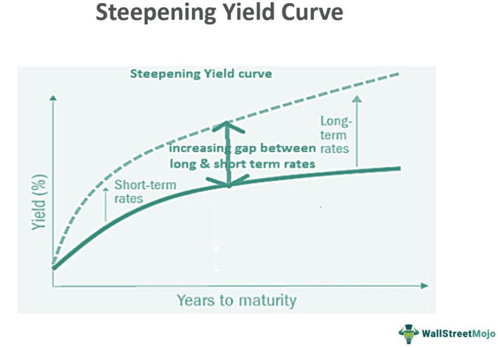

Understanding the intricacies of interest rate movements and yield curves is vital for successful trading. The yield curve, a graphical representation of interest rates across different bond maturities, serves as a crucial tool for investors analyzing future economic activity and interest rate forecasts. Fundamental to this analysis is the concept of a bull steepener, an interest rate movement scenario where short-term interest rates decrease at a quicker pace than long-term rates, thereby steepening the yield curve. This phenomenon typically indicates investor confidence in the long-term economic outlook despite short-term uncertainties.

Interest rates, both short and long-term, reflect myriad economic variables such as inflation expectations, central bank policies, and macroeconomic indicators. The relationship between these rates offers traders insights necessary for optimizing investment strategies. For instance, understanding why a bull steepener occurs can help traders anticipate shifts in economic policy or sentiment, allowing them to adjust their fixed-income portfolios accordingly. When a bull steepener is in effect, the relative attractiveness of short-term securities decreases, which might prompt a reevaluation of investment positions in favor of longer-term bonds.



The opportunities presented by bull steepeners extend into algorithmic trading, which uses quantitative models to identify and exploit market inefficiencies. Algorithmic trading strategies can be tailored to detect changes in the yield curve dynamics, such as those induced by a bull steepener. These automated systems enhance trading precision and speed, allowing traders to capitalize on rate movements more effectively than manual trading approaches.

In this context, exploring the principles behind interest rate shifts and yield curve variations equips traders with a robust framework for making informed decisions. Through incorporating advanced algorithmic trading strategies and leveraging the predictive power of economic analysis, traders can enhance their returns while navigating the complexities of the bond market. By understanding and exploiting bull steepeners, investors can maintain a competitive edge in an ever-evolving financial landscape.

## Table of Contents

## Understanding the Yield Curve and Bull Steepener

The yield curve effectively captures the dynamics between varying interest rates across different bond maturities. In a typical setting, longer-term bonds usually command higher yields than short-term bonds due to risks associated with time, generating an upward-sloping curve. However, this relationship isn't static, with the curve's shape primarily influenced by changes in the economic environment and monetary policy alterations. An essential phenomenon to understand in this context is the bull steepener.

A bull steepener occurs when short-term interest rates decline at a faster pace than long-term rates, resulting in an increasingly steep yield curve. This movement signifies that while the market anticipates easing monetary policy or a weakening economy in the short term, it expects higher inflation or growth over the long term. Consequently, the differential between short and long-term rates widens.

Multiple factors can contribute to the emergence of a bull steepener. One such [factor](/wiki/factor-investing) stems from central bank policies. For instance, if the Federal Reserve expresses a dovish stance—indicating probable rate cuts to stimulate the economy—short-term rates generally fall. Long-term rates, however, might remain relatively stable or decrease at a lesser rate if investors foresee long-term economic recovery or inflationary pressures, thus driving the steepening of the yield curve.

Comparatively, a bear steepener represents the inverse scenario where long-term rates rise more than short-term ones, typically reflecting expectations of tightening monetary policy or escalating inflation. Other variations in yield curve movements include "flattening," where the difference between short-term and long-term rates diminishes, and "inversion," where short-term rates exceed long-term rates, often perceived as a recession indicator.

Understanding these dynamics is crucial for bond market participants. A bull steepener impacts bond portfolios differently depending on their duration exposure. Short-duration bonds gain value due to declining short-term rates, whereas the impact on longer-duration bonds can vary based on assumptions about future economic conditions and the extent of [interest rate](/wiki/interest-rate-trading-strategies) changes. Therefore, identifying and predicting movements of the yield curve enables traders to optimize strategies that capitalize on anticipated economic shifts, leading to potentially higher returns.

## Economic Indicators Influencing Interest Rates

Understanding the dynamics of key economic indicators is essential for forecasting interest rate movements and predicting the occurrence of a bull steepener, a scenario where short-term interest rates decline more rapidly than long-term rates. Inflation, employment data, and geopolitical events are primary indicators affecting interest rate movements. Each of these elements influences the yield curve's behavior, ultimately impacting the financial markets.

Inflation is a crucial determinant of interest rate levels. Central banks, such as the Federal Reserve, monitor inflation closely, adjusting interest rates to maintain price stability. Higher inflation typically prompts a central bank to increase interest rates to curb spending, while lower inflation can lead to rate cuts to stimulate economic activity. As inflation influences both short-term and long-term interest rates, monitoring inflation trends is vital for understanding changes in the yield curve. Expected inflation can be modeled using the Fisher Equation:

$$
i = r + \pi
$$

where $i$ is the nominal interest rate, $r$ is the real interest rate, and $\pi$ is the expected inflation rate.

Employment data, including unemployment rates and job creation figures, serve as barometers of economic health. Strong employment growth generally signals a robust economy, potentially leading to higher interest rates as consumer spending and investment increase. Conversely, high unemployment may necessitate rate cuts to stimulate job creation. Traders can gauge the likelihood of a bull steepener by analyzing employment trends, as significant deviations can influence short-term rate expectations more than long-term rates.

Geopolitical events bring a layer of uncertainty to financial markets, often causing abrupt shifts in interest rates. Political instability, trade tensions, and international conflicts can lead to flight-to-safety dynamics, where investors flock to safer assets such as long-term government bonds, impacting the yield curve. These events can cause short-term rates to fall relative to long-term rates, making it essential for traders to stay informed about global political developments.

Historical analysis of these indicators can provide insights into their impacts on the yield curve. By studying past economic cycles and corresponding yield curve changes, traders can identify patterns that might indicate future movements. Statistical models and [machine learning](/wiki/machine-learning) algorithms can further aid in predicting interest rate shifts by analyzing vast datasets encompassing these economic indicators.

Future economic conditions, shaped by these indicators, will continue to influence the strategies employed by traders. Anticipating changes in inflation, employment, and geopolitical landscapes allows traders to adapt their strategies, optimizing their bond portfolios to leverage yield curve movements effectively. Maintaining a nuanced understanding of how these factors intertwine with the yield curve dynamics is integral for traders aiming to capitalize on opportunities presented by configurations such as bull steepeners.

## Algorithmic Trading Strategies for Leveraging Bull Steepeners

Algorithmic trading can significantly enhance the ability to capitalize on bull steepeners within the yield curve. By automating the process, traders can swiftly react to market movements, thereby increasing trading efficiency and maximizing returns. 

A primary strategy involves using automated systems to detect changes in the yield curve. These systems typically begin by continuously monitoring the yield curve for significant shifts indicative of a bull steepener—where short-term interest rates decline more rapidly than long-term rates. Utilizing real-time data feeds, algorithms can quickly identify these patterns and execute trades based on predefined criteria. For example, algorithms may initiate bond purchases to benefit from potential price increases due to falling interest rates. 

Machine learning (ML) models can be instrumental in predicting interest rate movements. These models intake vast amounts of historical and current market data to identify patterns that precede bull steepeners. By training on various economic indicators such as inflation rates and employment figures, ML models improve their predictive accuracy over time. One might employ models such as Long Short-Term Memory (LSTM) networks, which are particularly suited for time series data associated with interest rate prediction. Here's a simplified Python code snippet using TensorFlow for creating an LSTM model:

```python
import tensorflow as tf
from tensorflow.keras.models import Sequential
from tensorflow.keras.layers import LSTM, Dense

# Example LSTM model for interest rate prediction
model = Sequential()
model.add(LSTM(50, return_sequences=True, input_shape=(timesteps, features)))
model.add(LSTM(50))
model.add(Dense(1))

model.compile(optimizer='adam', loss='mean_squared_error')
model.fit(X_train, y_train, epochs=100, batch_size=32)
```

Quantitative data analysis plays a crucial role in developing robust trading algorithms. By leveraging statistical techniques and financial models, traders can test the potential impact of bull steepeners on various bond portfolios. Techniques such as [backtesting](/wiki/backtesting) allow traders to simulate algorithmic strategies using historical data, thereby refining trading models and risk parameters before deployment in live markets. Consider the application of the Capital Asset Pricing Model (CAPM) to evaluate prospective returns adjusted for risk. The CAPM formula is:

$$
E(R_i) = R_f + \beta_i (E(R_m) - R_f)
$$

where $E(R_i)$ is the expected return, $R_f$ is the risk-free rate, $\beta_i$ is the beta of the investment, and $E(R_m)$ is the expected market return. This helps in assessing the risk-return profile when anticipating yield curve shifts.

Overall, integrating these automated strategies and machine learning models into trading systems can provide a considerable edge in exploiting bull steepeners. With continuous advancement in technology, [algorithmic trading](/wiki/algorithmic-trading) strategies are becoming more sophisticated, allowing traders to optimize their approach in the dynamic bond market.

## Risk Management and Investment Considerations

Managing risk is a fundamental aspect of trading based on interest rate changes and yield curve predictions. In the context of bull steepeners, effective risk management strategies are crucial to safeguarding investments and enhancing potential returns.

### Hedging Strategies and Diversification

Hedging strategies are pivotal in minimizing risks associated with interest rate fluctuations and yield curve dynamics. One common method is using interest rate derivatives such as futures, options, and swaps. These instruments allow traders to lock in favorable interest rates or offset potential losses from adverse rate movements. For example, a portfolio manager anticipating a bull steepener might consider buying interest rate call options, which profit from declining short-term rates.

Diversification is equally important in risk management. By spreading investments across a variety of asset classes, sectors, and geographic regions, traders can reduce the impact of localized market [volatility](/wiki/volatility-trading-strategies). In the fixed income domain, diversification within bond maturities, credit ratings, and issuers can cushion against specific risks associated with interest rate changes.

### Risks in Algorithmic Trading Systems

While algorithmic trading significantly improves efficiency and decision-making precision, it comes with its own set of risks. These include technological failures, algorithmic errors, and unexpected market conditions. To mitigate these risks, traders should implement robust backtesting, continuous monitoring, and periodic review processes.

Backtesting involves simulating an algorithm's performance using historical data. This process helps identify potential weaknesses and ensures the strategy performs reliably under various market scenarios. Furthermore, real-time monitoring systems should be in place to detect and address algorithmic anomalies promptly. Regular reviews and updates to algorithms ensure they remain aligned with evolving market conditions and trends.

### Balanced Approach to Fixed Income Investments

Maintaining a balanced approach to fixed income investments is essential for sustainable returns. Investors should assess their risk tolerance, investment objectives, and time horizon when constructing a bond portfolio. A combination of aggressive and conservative strategies can be employed, balancing between higher-yielding, higher-risk bonds and more stable, lower-yield investments.

Additionally, interest rate forecasting models can aid in understanding potential yield curve shifts, allowing for proactive portfolio adjustments. For instance, incorporating machine learning models to predict the likelihood of bull steepener scenarios could enable timely reallocation of assets to optimize returns while managing risk exposure effectively.

In conclusion, employing a comprehensive risk management framework, leveraging hedging strategies, diversification, and cautious algorithmic trading can help traders navigate the complexities of interest rate changes and yield curve predictions. Such strategies ensure that portfolios remain resilient against market volatility while capitalizing on opportunities presented by yield curve movements like bull steepeners.

## Conclusion

Bull steepeners offer significant trading opportunities in bond markets for knowledgeable traders. By leveraging economic analysis alongside advanced algorithmic trading strategies, investors can potentially enhance their returns significantly. This integration enables traders to respond adeptly to shifts in the yield curve, capturing price movements and optimizing investment portfolios.

Understanding the principles driving yield curve dynamics is essential for successful trading. These principles include recognizing the influence of macroeconomic indicators such as inflation rates, employment [statistics](/wiki/bayesian-statistics), and central bank policies, as well as understanding how these factors interact with bond prices and yields. A thorough comprehension of these drivers allows traders to anticipate potential curve movements, positioning themselves advantageously in the market.

Advanced algorithmic strategies are indispensable tools in this context. By employing algorithms that incorporate machine learning models, traders can predict interest rate fluctuations with greater accuracy and precision. These models utilize quantitative data analysis to detect patterns and make responsive trading decisions, adapting to new information in real-time.

Further research and adaptation to changing market conditions are essential for sustained trading success. As economic variables and market environments evolve, continuous learning and strategy refinement ensure that traders remain proficient in exploiting yield curve movements. This adaptability helps maintain a competitive edge in the increasingly complex and automated financial markets.

Ultimately, the ability to effectively respond to bull steepeners and other yield curve shifts can position informed traders for substantial gains, reinforcing the importance of integrating economic insights with cutting-edge technology for bond market investments.

## References & Further Reading

[1]: ["Understanding The Yield Curve"](https://www.investopedia.com/terms/y/yieldcurve.asp) by Investopedia

[2]: Bernanke, B. S., & Blinder, A. S. (1992). ["The Federal Funds Rate and the Channels of Monetary Transmission."](https://www.jstor.org/stable/2117350) The American Economic Review, 82(4), 901-921.

[3]: ["Advances in Financial Machine Learning"](https://www.amazon.com/Advances-Financial-Machine-Learning-Marcos/dp/1119482089) by Marcos Lopez de Prado

[4]: ["Machine Learning for Algorithmic Trading"](https://github.com/stefan-jansen/machine-learning-for-trading) by Stefan Jansen

[5]: Estrella, A., & Mishkin, F. S. (1996). ["The Yield Curve as a Predictor of U.S. Recessions."](https://www.newyorkfed.org/medialibrary/media/research/current_issues/ci2-7.pdf) National Bureau of Economic Research Working Paper Series.

[6]: ["Quantitative Trading: How to Build Your Own Algorithmic Trading Business"](https://www.amazon.com/Quantitative-Trading-Build-Algorithmic-Business/dp/1119800064) by Ernest P. Chan