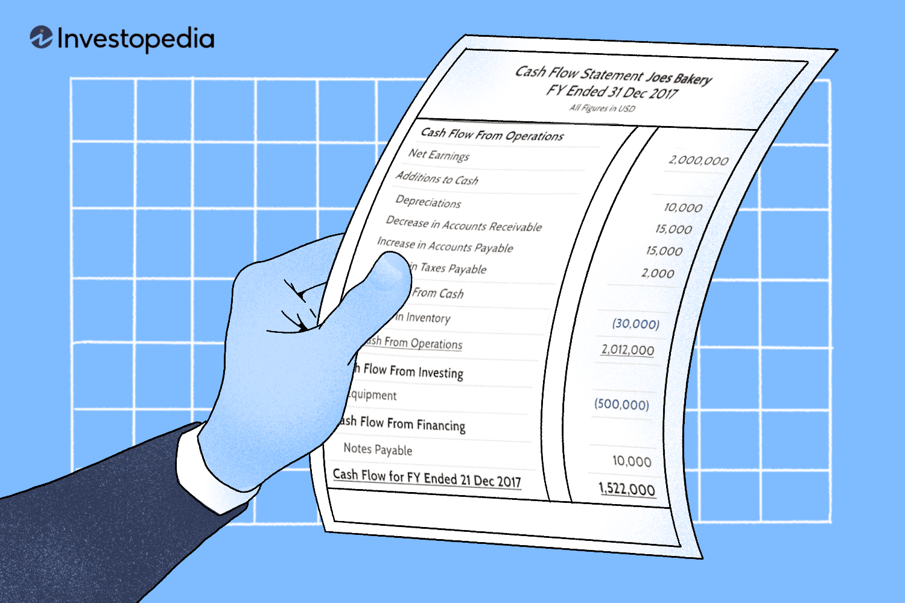

In finance, understanding financial statements, cash flow management, and financial analysis is fundamental for traders and investors. As markets become increasingly complex and technology-driven, these elements form the core of strategic decision-making processes. The advent of algorithmic trading has transformed the financial landscape by enabling the execution of trades using automated systems based on predefined models. This approach leverages data and computational algorithms to enhance trading precision and speed.

Algorithmic trading’s rise in popularity underscores the importance of integrating fundamental analysis with automated strategies to maximize returns. Fundamental analysis involves evaluating a company's intrinsic value by examining financial data, such as earnings, expenses, and growth potential. Financial statements, particularly cash flow statements, serve as crucial tools in this analysis. They provide insights into a company’s operational efficiency, liquidity, and overall financial health, which are vital for making informed trading decisions.



This article aims to explore the significant role of cash flow statements in financial analysis and the development of algorithmic trading strategies. Cash flow statements track the flow of cash in and out of a business, highlighting the company's ability to generate liquidity and maintain solvency. Understanding these aspects allows investors to assess the financial robustness of a company, which is indispensable for crafting effective trading algorithms.

Through a comprehensive understanding of cash flow statements and financial analysis, traders can navigate the complexities of the market more effectively. Developing strategies that are not only profitable but also adaptable to fluctuating market conditions is crucial. By integrating these financial insights into algorithmic trading, traders can enhance their ability to identify profitable opportunities and improve their overall trading performance.

## Table of Contents

## Understanding Financial Statements

Financial statements are essential tools for evaluating a company's financial health. They provide valuable insights into its operations, asset management, and cash flow, serving as a mirror reflecting a company's economic condition at any given time. Key components of financial statements include the balance sheet, income statement, cash flow statement, and statement of shareholders' equity.

The balance sheet presents a snapshot of a company's assets, liabilities, and shareholders' equity at a specific point in time. This statement is crucial for understanding how a company's assets are financed, either through debt or equity, and it highlights the company's financial stability. The formula underpinning the balance sheet is:

$$
\text{Assets} = \text{Liabilities} + \text{Equity}
$$

Next, the income statement, also known as the profit and loss statement, details a company's revenues, costs, and expenses over a particular period. It ultimately reveals the company's net profit or loss, offering insights into its operational efficiency and profitability. Calculating the net income involves subtracting total expenses from total revenues:

$$
\text{Net Income} = \text{Total Revenues} - \text{Total Expenses}
$$

The cash flow statement is particularly vital for assessing a company's [liquidity](/wiki/liquidity-risk-premium) and cash management. This document is divided into three sections: operating activities, investing activities, and financing activities. Cash flow from operating activities indicates the cash generated or used by the company's core business operations. Cash flows from investing activities represent changes in cash flow from the acquisition or sale of long-term assets. Lastly, cash flow from financing activities shows the cash movements between the company and its owners or creditors, detailing funding sourced through equity or debt. 

Understanding these statements is crucial for [fundamental analysis](/wiki/fundamental-analysis), as they help investors gauge a company's performance and financial position. Furthermore, they are foundational in developing trading algorithms. In [algorithmic trading](/wiki/algorithmic-trading), financial statements inform models that automate trade executions based on various financial metrics and indicators. Through systematic analysis of these statements, traders can construct algorithms that react to financial trends and anomalies, thereby optimizing trading strategies and improving decision-making processes.

## Diving into Cash Flow Statements

Cash flow statements provide a comprehensive view of the inflow and outflow of cash in a company, which is vital for analyzing its financial operations. They categorize cash activities into three main segments: operating, investing, and financing activities.

Cash flows from operating activities deal with the primary revenue-generating activities of the business. They include cash receipts from sales of goods and services, cash payments to suppliers and employees, and other transactions that influence net income. The net cash provided by operating activities is an indicator of the company’s ability to generate sufficient cash flow to maintain operations and cover expenses.

Investing activities encompass transactions related to the acquisition and disposal of long-term assets and investments. These include cash used for purchasing property, plant, and equipment, as well as cash received from the sale of investments and other assets. Cash flow from investing activities is crucial in assessing how a company is allocating its resources for future growth.

Financing activities involve the cash transactions related to a company's financing of its operations and capital. This section includes cash inflows from issuing shares and debt, as well as cash outflows for dividend payments and debt repayments. The net cash flow from financing activities provides insights into the company's capital structure and financial strategy.

Analyzing cash flow statements is critical for evaluating a company's ability to generate liquidity, which measures the short-term financial health of a business. Liquidity is essential for a company to fulfill its financial obligations, invest in new projects, and sustain operations during economic downturns.

In algorithmic trading, cash flow data can be leveraged to identify potential trading opportunities. By assessing a company's liquidity and financial health, traders can detect inefficiencies in cash flow management that may signal investment opportunities. Algorithmic traders use cash flow data to programmatically analyze trends and fluctuations in liquidity, enabling them to make informed trading decisions. For example, a significant decline in operating cash flow might indicate potential financial distress, prompting algorithms to short the stock or adjust risk management parameters. Conversely, strong and growing cash flows could signal a robust financial position, presenting opportunities for long positions.

Python, a popular programming language in algorithmic trading, provides several libraries like Pandas and NumPy to efficiently handle and analyze cash flow data. Here is a simple code snippet demonstrating how to calculate basic cash flow metrics using Python:

```python
import pandas as pd

# Sample cash flow data
data = {
    'Operating Activities': [10000, 12000, 14000],
    'Investing Activities': [-5000, -7000, -6000],
    'Financing Activities': [3000, 4000, -2000],
}

# Create DataFrame
cash_flow_df = pd.DataFrame(data, index=['Year1', 'Year2', 'Year3'])

# Calculate Net Cash Flow
cash_flow_df['Net Cash Flow'] = cash_flow_df.sum(axis=1)

print(cash_flow_df)
```

This approach helps traders to identify trends and make data-driven investment decisions, enhancing the predictive accuracy and profitability of their trades.

## Financial Analysis in Algorithmic Trading

Financial analysis is instrumental in evaluating a company's performance and valuation, and it plays a crucial role in algorithmic trading. This analysis often employs financial ratios derived from financial statements, serving as vital tools for traders and investors. Among these ratios, the Price-Earnings (P/E) ratio, Return on Equity (ROE), and Debt-to-Equity ratio are significant for conducting fundamental analysis.

The Price-Earnings (P/E) ratio, calculated as $\text{P/E} = \frac{\text{Market Price per Share}}{\text{Earnings per Share (EPS)}}$, helps assess whether a stock is over- or under-valued relative to its earnings. It is crucial for algorithmic traders aiming to identify investment opportunities by comparing the P/E ratios of various companies within the same industry.

Return on Equity (ROE), which is computed as $\text{ROE} = \frac{\text{Net Income}}{\text{Shareholder's Equity}}$, measures a company's ability to generate profits from shareholders' investments. A high ROE indicates efficient management and robust profitability, making it a valuable metric for developing trading strategies focused on long-term equity investment.

The Debt-to-Equity ratio, expressed as $\text{Debt-to-Equity} = \frac{\text{Total Liabilities}}{\text{Shareholder's Equity}}$, evaluates a company's financial leverage. It provides insights into the firm's capital structure and risk profile, with higher ratios potentially indicating greater financial risk.

In algorithmic trading, these ratios are employed within trading algorithms that can continuously evaluate and respond to market conditions. By quantifying these financial ratios, traders can backtest them against historical data, fine-tuning strategies to enhance their effectiveness.

For instance, Python can be used to automate the process of retrieving and analyzing financial ratios. Utilizing libraries like `pandas` for data manipulation and `numpy` for numerical operations, traders can create scripts to extract ratios from financial data and simulate trading strategies. Here is a simple example demonstrating the calculation of the P/E ratio using Python:

```python
import pandas as pd

# Sample data
data = {'Market Price': [150, 200, 250],
        'EPS': [5, 10, 15]}

df = pd.DataFrame(data)

# Calculate P/E Ratio
df['P/E Ratio'] = df['Market Price'] / df['EPS']
print(df)
```

Integrating financial analysis into algorithmic systems enables traders to make informed, data-driven decisions, enhancing trading efficiency and strategy resilience. By leveraging these quantitative insights, traders can develop robust strategies that adapt to market dynamics, optimizing their trading performance and potential profitability.

## Algorithmic Trading Strategies and Cash Flow

Algorithmic trading leverages quantitative models and automated systems to perform trades based on predefined criteria, significantly improving trading efficiency and mitigating human errors. A key aspect of effective algorithmic trading involves integrating cash flow analysis, enabling algorithms to evaluate real-time financial health and liquidity. This integration is pivotal for enhancing trade predictions and profitability.

Incorporating cash flow analysis into algorithmic trades allows algorithms to monitor a company's liquidity by examining the cash flow statement, which is segmented into operating, investing, and financing activities. Positive cash flow from operating activities indicates healthy core operations, while significant cash outflows from investing may reflect strategic expansions or acquisitions. A balanced approach to financing can signal good debt management. Algorithms programmed to analyze such cash flow components can make informed decisions by quickly assessing liquidity risks and opportunity costs.

One potential strategy utilizes cash flow anomalies, which are irregular patterns in the cash flow statement that might indicate market inefficiencies or future valuation changes. For example, a mismatch between rising net income and negative operating cash flows might suggest window dressing where earnings are inflated, prompting an algorithm to short-sell the stock.

Python's powerful data analysis libraries offer efficient tools for implementing such strategies. For instance, using pandas to parse financial statements and numpy for developing cash flow-related computations provides a reliable framework for algorithmic modeling:

```python
import pandas as pd
import numpy as np

# A hypothetical function that identifies cash flow anomalies
def detect_cash_flow_anomalies(df):
    anomalies = []
    for index, row in df.iterrows():
        if row['Net Income'] > 0 and row['Operating Cash Flow'] < 0:
            anomalies.append(index)  # Potential short-sell candidates
    return anomalies

# Example DataFrame with financial statement data
financial_data = {
    'Company': ['A', 'B', 'C'],
    'Net Income': [100, 200, 150],
    'Operating Cash Flow': [-50, 300, 100]
}

df = pd.DataFrame(financial_data)
anomalies = detect_cash_flow_anomalies(df)
```

Algorithms could also explore inefficiencies in other balance sheet items, such as high receivables or inventory levels relative to sales, which often precede cash flow issues. By leveraging these inefficiencies, traders can refine their strategies, maximizing returns and minimizing risks.

The coupling of cash flow data with algorithmic trading's quantitative methods transforms financial analysis into a dynamic, real-time application, ultimately refining the accuracy and profitability of trading strategies. Employing comprehensive financial analysis in this manner allows traders to capitalize on emerging opportunities while protecting against potential downturns.

## Conclusion

The synergy between financial statements, cash flow analysis, and algorithmic trading offers a powerful approach to modern trading. Financial statements, by providing a comprehensive view of a company's financial health, enable traders to assess potential opportunities and risks. The cash flow statement, as a part of these financial reports, plays a crucial role in evaluating liquidity, an essential [factor](/wiki/factor-investing) for strategy development in volatile markets.

Understanding these elements allows traders to build strategies that are not only profitable but also resilient in fluctuating markets. The integration of financial metrics, such as those derived from cash flow analysis, into algorithmic trading systems enhances the depth of decision-making processes. This integration can lead to more predictive power and better risk management, ultimately refining trading strategies to withstand market turbulence.

As financial markets continue to evolve, the ability to analyze financial statements and integrate them into trading algorithms will be a valuable asset. Markets are becoming increasingly data-driven; hence, incorporating these analyses into algorithmic models will likely become standard practice. The evolution of technology allows these models to process vast amounts of data swiftly, offering real-time insights that were previously inaccessible.

By harnessing the power of technology and data, traders can unlock new opportunities and optimize their trading performance. The use of algorithms in processing financial statements helps identify patterns and anomalies that might not be evident through traditional analysis, thereby creating a competitive edge. The implementation of these strategies can improve both the efficiency and accuracy of trading decisions, ultimately leading to greater profitability and strategic advantage.

## References & Further Reading

[1]: ["Statement of Cash Flows—Overview"](https://viewpoint.pwc.com/dt/us/en/pwc/accounting_guides/financial_statement_/financial_statement___18_US/chapter_6_statement__US/61_chapter_overview__5_US.html) by IFRS

[2]: ["Financial Statements for Managers"](https://online.hbs.edu/blog/post/how-managers-use-financial-statements) by Mohammed Naeem

[3]: ["The Basics of Cash Flow Analysis"](https://www.investopedia.com/terms/c/cashflow.asp) on Investopedia

[4]: ["Algorithmic Trading and DMA: An Introduction to Direct Access Trading Strategies"](https://archive.org/details/algorithmictradi0000john) by Barry Johnson

[5]: ["Python for Finance: Analyze Big Financial Data"](https://books.google.com/books/about/Python_for_Finance.html?id=E93SBQAAQBAJ) by Yves Hilpisch