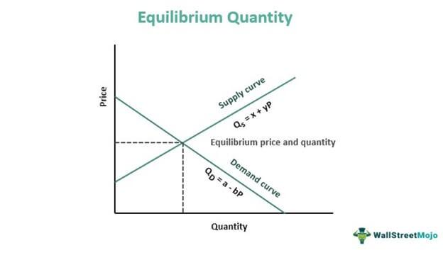

Algorithmic trading, often referred to as algo trading, has transformed trading by employing sophisticated mathematical models to execute transactions. This method leverages computer algorithms to analyze market data at speeds and volumes that are impossible for human traders. Central to these models is the calculation of change, a metric crucial for assessing price fluctuations and making data-driven trading decisions.

Change calculations are at the heart of trading strategies, enabling algorithmic systems to evaluate minor shifts in financial instruments. By quantifying changes in price, these systems are better positioned to capitalize on short-term market movements while maintaining an understanding of long-term trends. An essential element of change calculation is the ability to process real-time data at high frequency, allowing for rapid adjustments to trading positions.



The prominence of algo trading lies not just in speed but in the precision of its operations. Algorithms appraise minute price changes and execute trades with minimal human intervention, thereby reducing errors and emotion-based decisions. This ability to compute and interpret change in real-time empowers traders to optimize their strategies, making this practice a dominant force in modern financial markets.

In this article, we investigate how change is calculated within the framework of algorithmic trading, the methodologies employed, and the practical applications of these calculations. Understanding price changes is pivotal for traders aiming to enhance their strategic approaches and achieve better trading outcomes. Mastery of these concepts can lead to more informed decisions, ultimately improving profitability and success in the dynamic trading environment.

## Table of Contents

## Understanding the Concept of Change

Change, within the context of algorithmic trading, denotes the variation in the price of a financial instrument over a specified duration. This difference is pivotal for understanding market dynamics and making informed trading decisions. A fundamental aspect of financial analysis, such change, often represented in terms of percentage, enables traders to assess fluctuations in asset prices and interpret the corresponding market behavior.

In trading, change is closely associated with volatility. Volatility is the degree of variation in trading prices over time and is a critical metric for evaluating the performance of an asset. High volatility often implies significant price changes, which might suggest either risk or opportunity, depending on the trader’s perspective and strategy.

A variety of financial instruments—including stocks, options, futures, and others—are consistently analyzed for these price changes. In stocks, for instance, traders look at daily price changes to make day-to-day buying or selling decisions. For options, [volatility](/wiki/volatility-trading-strategies) calculations help estimate the likelihood of reaching certain price levels. Futures contracts often show price changes due to alterations in supply and demand expectations.

The computation of change is simple yet powerful. Generally, it is calculated using the formula:

$$
\text{Change} = \frac{\text{End Price} - \text{Start Price}}{\text{Start Price}} \times 100\%
$$

Where "End Price" is the price at the end of the observation period, and "Start Price" is the price at the beginning. A positive change percentage signifies an upward trend, indicating bullish market conditions, whereas a negative change suggests a downward movement, pointing towards bearish sentiments.

In summary, understanding and quantifying change allow traders to assess past market behavior, anticipate future movement, and optimize their trading strategies accordingly. This comprehension is further augmented by integrating such analysis with predictive algorithms that exploit these changes to capitalize on market inefficiencies efficiently.

## Significance of Change Calculation in Algo Trading

In [algorithmic trading](/wiki/algorithmic-trading), calculating percentage change is essential for predicting market dynamics and developing effective trading strategies. The percentage change represents the degree to which an asset's price has risen or fallen over a specified period, and it serves as a critical indicator of market trends. This value is typically computed using the formula:

$$
\text{Percentage Change} = \left( \frac{\text{Current Price} - \text{Previous Price}}{\text{Previous Price}} \right) \times 100
$$

By quantifying the price movement in this manner, traders and their algorithmic systems can gain insights into market behavior and potential future movements.

Algorithms are designed to process these percentage changes swiftly, enabling them to make high-speed trades with minimal human intervention. This rapid decision-making capability not only reduces human errors but also enhances trading efficiency by optimizing entry and [exit](/wiki/exit-strategy) points in the market. For instance, if an algorithm identifies a consistent upward trend through positive percentage changes, it may trigger a buy order. Conversely, if a negative trend is detected, a sell order might be initiated.

Furthermore, these calculations play a significant role in optimizing profits and minimizing risks. By understanding the magnitude of price changes, traders can better assess when to buy or sell assets, thus refining their strategies for varied market conditions. Integrating percentage change calculations enhances the system's responsiveness to market fluctuations, allowing traders to capitalize on opportunities and mitigate potential losses efficiently.

Overall, the integration of percentage change calculations in algorithmic trading is fundamental to strategy formulation, enabling the anticipation of market movements and the execution of trades with increased precision.

## The Role of Rate of Change (ROC) in Trading

The Rate of Change (ROC) is a [momentum](/wiki/momentum) indicator widely used in trading to assess the speed at which a financial instrument's price is changing. Calculated by taking the difference between the current price and a price from a specified number of periods ago, then dividing by the older price, ROC is typically expressed as a percentage:

$$
\text{ROC} = \left( \frac{\text{Current Price} - \text{Past Price}}{\text{Past Price}} \right) \times 100
$$

This percentage value reflects how much the price has moved in relation to its past value, providing a quantifiable measure of the momentum behind a price movement.

ROC assists traders in evaluating both short-term and long-term trends. A positive ROC indicates an upward momentum, signaling potential buying opportunities, while a negative ROC suggests downward momentum, which can be a cue for selling. This ability to measure price acceleration or deceleration makes ROC an invaluable tool for predicting market reversals. In situations where the ROC reaches extreme highs or lows, it often suggests that the market is overbought or oversold, respectively. These conditions can inform traders about strategic entry or exit points, maximizing potential profits or minimizing losses.

However, the ROC must be used with caution, as it can produce false signals, particularly in volatile markets. These false signals occur when sudden price movements create misleading indications of momentum without substantive shifts in fundamental values. For instance, a sharp price spike may generate a high ROC reading, suggesting strong momentum, but the price might quickly stabilize, rendering the signal inaccurate.

Therefore, traders often combine ROC with other technical indicators, such as moving averages or the Relative Strength Index (RSI), to filter out noise and validate signals. This multi-indicator approach helps in strengthening the predictive ability of trading strategies while mitigating the risk associated with relying solely on ROC. By incorporating the ROC thoughtfully within a comprehensive trading strategy, traders can significantly enhance their market analysis and decision-making process.

## Implementing Change Calculations: Examples and Strategies

Implementing change calculations in trading strategies necessitates an active engagement with modern programming tools and software, primarily utilizing Python due to its versatility and extensive library support. Precision in executing these calculations can differentiate successful trading strategies from less effective ones, enabling traders to automate and optimize decision-making processes.

One practical application is automating stock purchases based on percentage change. By coding a strategy that initiates stock purchases during significant price drops, traders can capitalize on potential undervaluation. For instance, the following Python code snippet demonstrates how percentage change can be calculated to trigger an automated buy signal when a stock's price falls by more than 5% in a day:

```python
import yfinance as yf  # For more datasets, visit: https://paperswithbacktest.com/datasets

# Fetch historical price data
data = yf.download('AAPL', period='5d', interval='1d')
data['Pct Change'] = data['Close'].pct_change() * 100  # Calculate percentage change

for index, row in data.iterrows():
    if row['Pct Change'] < -5:  # Check for a drop greater than 5%
        print(f"Buy signal: {index} - Price drop of {row['Pct Change']:.2f}%")
```

In trading strategies, change indicators are also integral to approaches like mean reversion and trend-following. Mean reversion relies on the assumption that asset prices will return to their mean or average level over time. Traders using this strategy can capitalize on extreme price changes, betting on a reversion to the mean. By contrast, trend-following strategies use change calculations to identify existing market trends and align trades with these trends, believing they will persist.

Proper [backtesting](/wiki/backtesting) is essential to ensure these models' reliability and adaptability in real market conditions. Backtesting involves testing a trading strategy on historical data to evaluate its performance. The code snippet below illustrates a simplified Python backtesting process for a trend-following strategy based on moving averages:

```python
import backtrader as bt

class MovingAverageStrategy(bt.Strategy):
    def __init__(self):
        self.sma = bt.indicators.SimpleMovingAverage(self.data.close, period=20)

    def next(self):
        if self.data.close[-1] < self.sma[-1] and self.data.close[0] > self.sma[0]:
            self.buy()  # Buy signal on upward cross
        elif self.data.close[-1] > self.sma[-1] and self.data.close[0] < self.sma[0]:
            self.sell()  # Sell signal on downward cross

# Set up backtesting environment
cerebro = bt.Cerebro()
data = bt.feeds.YahooFinanceData(dataname='AAPL', fromdate=datetime(2022, 1, 1), todate=datetime(2022, 12, 31))
cerebro.adddata(data)
cerebro.addstrategy(MovingAverageStrategy)
cerebro.run()
```

In conclusion, the meticulous implementation of change calculations is pivotal in forming robust trading strategies. By leveraging software tools and precise coding practices, traders can automate responses to market fluctuations, thereby increasing the strategy's effectiveness. Backtesting these methods against historical data is crucial for refining and adapting the models to ensure robustness in real-world scenarios.

## Conclusion

Change calculations are a foundational aspect of algorithmic trading strategies, offering critical insights into market trends and price movements. Mastering the concept of change empowers traders to effectively navigate the complexities of financial markets. This proficiency enables them to anticipate and respond to market shifts with greater precision. Integrating change calculations with other technical indicators and robust risk management practices can significantly refine trading strategies. This combination not only aids in optimizing profitability but also in minimizing potential losses.

Understanding change as a concept allows traders to make more informed decisions based on quantitative data rather than intuition or guesswork. By incorporating change calculations into their trading systems, traders can ensure a systematic approach to buying and selling, grounded in the objective assessment of market behavior. This systematic approach is essential in reducing emotional impacts and enhancing the consistency of trading results.

In summary, the effective use of change calculations within algorithmic trading can lead to strategic, data-driven, and profitable decision-making. As traders continue to integrate these concepts into their strategies, they position themselves for success in an ever-evolving market landscape.

## References & Further Reading

For further exploration, readers may consider sources such as "Advances in Financial Machine Learning" by Marcos Lopez de Prado. This book provides a thorough examination of the role that [machine learning](/wiki/machine-learning) plays in modern finance, including practical guidelines and techniques for implementing machine learning solutions in trading.

David Aronson’s "Evidence-Based Technical Analysis" offers a methodological approach to evaluating trading signals using scientific principles. Aronson stresses the importance of data integrity and statistical validation in technical analysis, aiding traders in making informed decisions based on empirical evidence.

Another useful resource is Ernest P. Chan’s "Quantitative Trading: How to Build Your Own Algorithmic Trading Business". This book serves as a practical guide for traders interested in developing their own algorithmic trading systems. Chan covers a range of topics from strategy development to risk management, offering insights into how quantitative analysis can be applied to create profitable trading strategies.

These resources provide comprehensive information on various aspects of algorithmic and [quantitative trading](/wiki/quantitative-trading), offering both theoretical knowledge and practical guidance for traders at different levels of experience.

