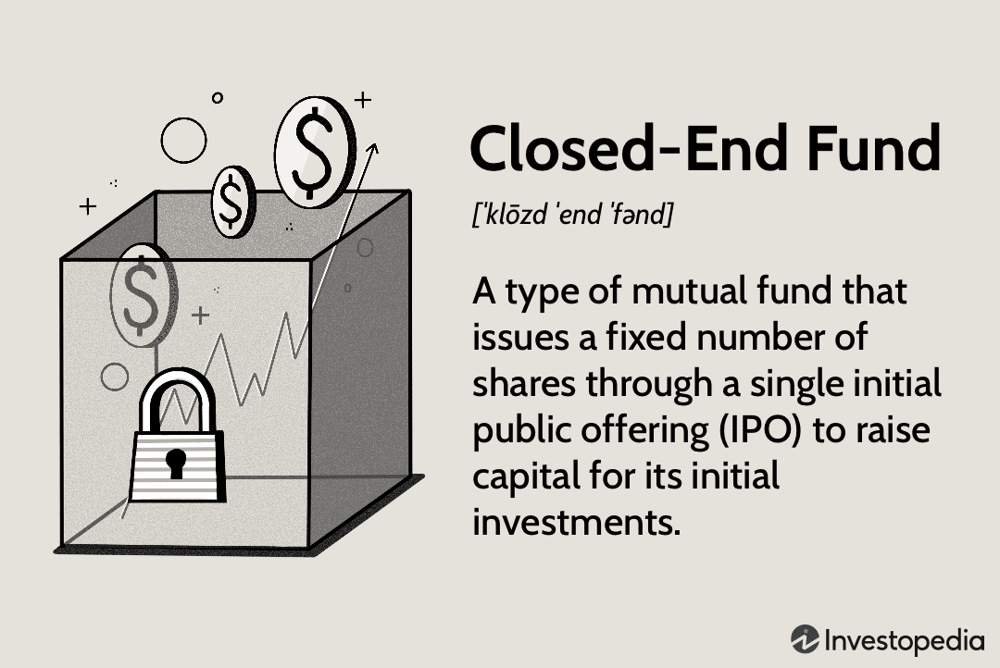

Financial education, closed-end funds, investment strategies, and algorithmic trading form a complex network that plays a pivotal role in personal and institutional investment landscapes. Financial literacy is foundational in this interconnected world, as it equips individuals with the knowledge and skills necessary to make informed decisions about personal finance and investments. A robust understanding of financial concepts helps investors navigate various investment vehicles, assess risks, and identify opportunities to diversify and maximize returns.

Investment vehicles such as mutual funds, exchange-traded funds (ETFs), and closed-end funds provide diverse opportunities for investors to allocate capital in a way that aligns with their financial goals and risk tolerance. Among these, closed-end funds present unique dynamics due to their structure and trading characteristics. Unlike open-end funds, which continuously issue and redeem shares at net asset value (NAV), closed-end funds have a fixed number of shares that trade on public exchanges. This feature can lead to the shares trading at a premium or discount to NAV, influenced by market demand and supply, investor sentiment, and broader economic factors. As a result, closed-end funds can play a special role in modern investment portfolios, offering avenues for both diversification and strategic plays on market inefficiencies.



Algorithmic trading, defined as the use of algorithms and automated execution of trading orders, has transformed fund management and financial markets. It allows for high-speed trading, improved efficiency, and reduced transaction costs. This technological advancement affects market dynamics by influencing liquidity, volatility, and price discovery processes. For fund managers, especially those managing closed-end funds, algorithmic trading can be instrumental in optimizing fund performance through precise execution and dynamic portfolio rebalancing.

In conclusion, the interplay among financial education, closed-end funds, investment strategies, and algorithmic trading highlights the need for continuous learning and adaptation. As financial markets evolve, so do the tools and strategies used by investors and fund managers. Understanding these components and their interactions is crucial for maximizing returns and ensuring successful investment outcomes.

## Table of Contents

## The Importance of Financial Education

Financial education plays a pivotal role in empowering investors by providing them with the necessary knowledge and skills to make informed investment decisions. At its core, financial literacy equips individuals with the understanding of fundamental economic principles, investment vehicles, and the risks and rewards associated with various financial decisions. 

Key concepts in personal finance and investment that every investor should understand include budgeting, savings, debt management, and portfolio diversification. Budgeting involves creating a plan for income and expenses, which is crucial for ensuring financial stability. Savings account for setting aside funds for future needs or investments. Debt management requires understanding interest rates and the importance of paying off high-interest debt as a priority. Diversification is a vital investment strategy aimed at reducing risk by spreading investments across different asset classes.

Several resources and tools are available for improving financial literacy. Online platforms and courses, such as those offered by the National Endowment for Financial Education and Khan Academy, provide comprehensive learning modules on various aspects of personal finance and investing. Books like "The Intelligent Investor" by Benjamin Graham and "Rich Dad Poor Dad" by Robert Kiyosaki offer valuable insights into investing and wealth management. Financial advisors and planners can also provide personalized guidance based on an individual's financial situation and goals.

Education can lead to better investment decisions and financial outcomes by demystifying complex financial concepts and encouraging disciplined strategies. For instance, an understanding of compound interest can motivate individuals to start investing early, as it illustrates how small, regular investments can grow significantly over time. Knowledge of market cycles can prevent panic selling during downturns, leading investors to maintain their long-term strategies. Furthermore, financially literate investors are better equipped to interpret financial news, evaluate risk, and identify investment opportunities aligned with their objectives.

In summary, financial education is essential for empowering investors, providing them with the skills to navigate the complexities of personal finance and investing. As the financial landscape evolves with new investment options and technologies, continuing education will be critical for maintaining financial well-being and capitalizing on emerging opportunities.

## Understanding Investment Funds

Investment funds are collective investment vehicles that pool money from multiple investors to invest in a diversified portfolio of securities. The three primary types of investment funds are mutual funds, exchange-traded funds (ETFs), and closed-end funds, each with distinct characteristics and operational mechanics.

**1. Mutual Funds**

Mutual funds are open-ended investment vehicles that allow investors to buy or sell shares at the fund's net asset value (NAV) at the end of each trading day. NAV is calculated as:

$$
\text{NAV} = \frac{\text{Total Assets - Total Liabilities}}{\text{Number of Outstanding Shares}}
$$

Mutual funds offer a wide range of investment options, including equity funds, bond funds, and balanced funds. Their key benefits include professional management, diversification, and [liquidity](/wiki/liquidity-risk-premium). However, mutual funds may also have drawbacks, such as management fees and less control over investment decisions.

**2. Exchange-Traded Funds (ETFs)**

ETFs are similar to mutual funds in terms of diversification and professional management but differ in how they are traded. ETFs are bought and sold on stock exchanges throughout the trading day, similar to stocks. This feature provides real-time pricing and greater flexibility for investors. ETFs often have lower expense ratios compared to mutual funds and offer tax efficiency advantages due to their unique creation and redemption processes. However, their market-based pricing can lead to differences between the market price and the NAV, known as the bid-ask spread.

**3. Closed-End Funds**

Closed-end funds issue a fixed number of shares during an initial public offering (IPO) and are subsequently traded on exchanges. Their market price may differ from the NAV, often trading at a premium or discount depending on market conditions and investor sentiment. Closed-end funds provide opportunities for active management and access to illiquid assets, but they may pose risks related to leverage and liquidity.

**Benefits and Risks**

Investment funds, by pooling resources, enable individual investors to gain access to a broader range of investments, enhancing diversification and risk management. Diversification reduces the unsystematic risk, as defined by the formula:

$$
\text{Total Risk} = \text{Systematic Risk} + \text{Unsystematic Risk}
$$

By spreading investments across various assets, investors can reduce their exposure to the risk associated with any single investment. However, investment in funds inherently carries market risk, [interest rate](/wiki/interest-rate-trading-strategies) risk, and, in some cases, currency risk.

**Role in Diversification and Risk Management**

The primary role of investment funds is to provide diversification, which mitigates specific risks associated with individual securities. This is achieved through the careful selection of a variety of investments, spreading exposure across different asset classes, sectors, and geographical markets. Professional fund managers utilize advanced strategies and tools to balance risk and optimize returns for investors.

Ultimately, the choice among mutual funds, ETFs, and closed-end funds depends on the investor's objectives, risk tolerance, and investment horizon. Each type of fund offers distinct advantages and involves different risks, necessitating careful consideration and alignment with individual financial goals.

## An In-Depth Look at Closed-End Funds

Closed-end funds (CEFs) represent a unique segment of the investment fund market, distinguished by their specific structural and operational characteristics. Unlike open-end funds, such as mutual funds, closed-end funds issue a fixed number of shares through an initial public offering (IPO), after which the shares are traded on stock exchanges. This fixed capital structure means that, unlike open-end funds, closed-end funds do not continuously issue new shares or redeem existing ones based on investor demand. Instead, their market price is determined by supply and demand dynamics in the market, which can lead to trading at a premium or discount to the fund's net asset value (NAV).

The structural distinction of closed-end funds allows for several operational differences. Fund managers are not compelled to maintain cash reserves to accommodate redemptions, enabling them to invest fully in long-term strategies without worrying about liquidity demands. This can potentially enhance returns, as assets are not tied up in cash and can be fully committed to investment opportunities. 

However, this structure also introduces certain disadvantages. The shares of closed-end funds can trade at significant discounts or premiums to their NAV. This market behavior is subject to investor sentiment, liquidity conditions, and market speculation, which might not always align with the underlying asset value. Consequently, investors may face increased [volatility](/wiki/volatility-trading-strategies) and potential mispricing risks.

One notable advantage of closed-end funds is their ability to employ leverage more effectively than open-end funds. Leverage can amplify both gains and losses, offering the potential for enhanced returns but also increasing risk. Additionally, closed-end funds often provide access to niche or illiquid markets, such as emerging market equities or municipal bonds, which can be more challenging for open-end funds to manage due to liquidity constraints.

Historically, closed-end funds have played a significant role in the investment market, offering opportunities for diversification and specialized portfolio strategies. Their performance has varied based on market conditions, investment themes, and fund management expertise. In periods of market stability, closed-end funds with well-timed leverage strategies and specialized focus have delivered substantial returns to their investors. Conversely, in times of market stress or uncertainty, the discount to NAV can widen, impacting investor returns negatively.

Understanding closed-end funds requires a grasp of these structural nuances and an awareness of market conditions that influence their trading dynamics. Investors considering closed-end funds should weigh the benefits of full capital investment and potential for leveraged gains against the risks of market price volatility and NAV misalignment. CEFs continue to provide valuable opportunities in diversified portfolio construction, particularly for those seeking access to less liquid investment areas or those able to tolerate the inherent risks of the fund’s structure.

## Algorithmic Trading: A Game Changer

Algorithmic trading, often known as algo trading, is the process of using computer algorithms to manage the trading of financial instruments. This approach leverages mathematical models, automated systems, and often [artificial intelligence](/wiki/ai-artificial-intelligence) to execute trades at high speeds that are unachievable by human traders. In modern financial markets, [algorithmic trading](/wiki/algorithmic-trading) is a crucial component, helping to ensure liquidity, tighten bid-ask spreads, and facilitate high-frequency trading.

One of the foremost benefits of algorithmic trading is its speed. Algorithms can process vast amounts of data and execute trades in milliseconds. This capability is particularly advantageous in high-frequency trading environments where every millisecond counts. Moreover, algorithmic trading enhances efficiency by automating repetitive tasks and minimizing human intervention, which helps reduce errors and increase the consistency of trading strategies.

Reduced transaction costs are another significant advantage of algorithmic trading. Automated systems analyze market conditions and execute trades at optimal times to enhance profitability. By removing emotional decision-making, these algorithms can also minimize the market impact and slippage, further reducing the costs associated with executing large trades.

However, despite its advantages, algorithmic trading presents certain challenges and risks. Technical failures are a primary concern, as they can lead to significant financial losses if a system malfunctions or executes incorrect trades. For instance, glitches in coding or software errors can result in unintended trading behaviors, often exacerbated during volatile market conditions.

Market regulations also present challenges to algorithmic trading. Regulatory bodies like the U.S. Securities and Exchange Commission (SEC) have implemented rules to ensure market stability and protect investors from potential market manipulations associated with automated trading. Compliance with these regulations requires significant resources and constant updates to ensure algorithms adhere to legal standards.

In conclusion, algorithmic trading represents a transformative approach in financial markets, providing significant benefits in terms of speed, efficiency, and cost reduction. However, careful consideration of the potential risks and adherence to regulatory requirements are essential to maintain market integrity and stability.

## Integrating Algo Trading with Closed-End Funds

Algorithmic trading, which leverages computer algorithms to execute trading strategies with precision and speed, can be effectively integrated into the management of closed-end funds (CEFs). These funds operate by issuing a fixed number of shares, which are traded on the open market, thus providing a unique opportunity for algorithmic trading strategies to enhance their performance.

### Application of Algorithmic Trading to Closed-End Funds

Algorithmic trading can be applied to closed-end funds through strategies such as statistical [arbitrage](/wiki/arbitrage), [trend following](/wiki/trend-following), and [market making](/wiki/market-making). These strategies can capitalize on the pricing inefficiencies that often exist in the trading of CEFs due to their fixed share count and market price divergence from net asset value (NAV).

1. **Statistical Arbitrage**: Algorithms can be designed to exploit discrepancies between the market price of a closed-end fund and its NAV. By using historical data and statistical models, these algorithms can predict price movements, allowing fund managers to buy undervalued shares and sell overvalued ones.

2. **Trend Following**: Algorithms can analyze historical price data to identify trends and generate buy or sell signals. This approach can be particularly beneficial in identifying longer-term trends in CEF trading that are not always apparent to human traders.

3. **Market Making**: In closed-end funds, where liquidity may be lower than in open-end funds, algorithmic trading can facilitate smoother market operations. By quoting bid and ask prices, algorithms can enhance liquidity and reduce spreads, benefiting both traders and the fund itself.

### Benefits of Using Algorithms in Fund Performance

Integrating algorithmic strategies into closed-end fund management offers multiple advantages: 

- **Efficiency and Speed**: Algorithms can process vast amounts of data in real-time, enabling quicker decision-making and execution of trades. This is especially beneficial in volatile markets where timing is critical.

- **Risk Management**: Algorithms can incorporate risk management protocols that automatically trigger stop-loss orders, limiting potential losses during adverse market movements.

- **Cost Reduction**: By minimizing the need for manual intervention, algorithmic trading can reduce transaction costs and human error, improving overall fund performance.

### Case Studies and Examples

One notable case is the application of [machine learning](/wiki/machine-learning) algorithms by some fund managers to optimize portfolio allocation and trading strategies in closed-end funds. These algorithms learn and adapt from historical performance data, improving their predictive capabilities over time.

Another example involves the use of high-frequency trading ([HFT](/wiki/high-frequency-trading-strategies)) algorithms by closed-end fund managers to identify and exploit temporary price inefficiencies. While controversial, when used prudently, HFT can complement traditional trading strategies by adding another layer of diversification to fund management.

### Python Example

Below is a basic Python example demonstrating a simple [backtesting](/wiki/backtesting) strategy for [statistical arbitrage](/wiki/statistical-arbitrage) in closed-end funds using historical price data.

```python
import numpy as np
import pandas as pd

# Load historical price data
data = pd.read_csv('closed_end_fund_data.csv')

# Calculate moving averages
data['MA50'] = data['Price'].rolling(window=50).mean()
data['MA200'] = data['Price'].rolling(window=200).mean()

# Generate trading signals
data['Signal'] = 0
data.loc[data['MA50'] > data['MA200'], 'Signal'] = 1
data.loc[data['MA50'] < data['MA200'], 'Signal'] = -1

# Calculate returns
data['Returns'] = data['Price'].pct_change()
data['StrategyReturns'] = data['Returns'] * data['Signal'].shift(1)

# Output cumulative returns of the strategy
cumulative_returns = (1 + data['StrategyReturns']).cumprod()
print(cumulative_returns.iloc[-1])
```

This script calculates 50-day and 200-day moving averages of a closed-end fund's price to generate buy (1) and sell (-1) signals. It then backtests the strategy by calculating the strategy's cumulative returns over the dataset.

Incorporating algorithmic trading strategies in closed-end funds offers the potential for enhanced returns and risk management, making it a valuable tool for modern fund management.

## The Future of Investment Strategies

Emerging trends in investment strategies are increasingly being reshaped by the integration of advanced technologies, creating new opportunities and challenges for investors and fund managers. The technology-driven evolution of the financial industry is characterized by the rise of machine learning, artificial intelligence, and big data analytics, which are revolutionizing traditional investment processes.

Algorithmic trading, for instance, has significantly enhanced the efficiency and precision of executing trades, reducing human error, and enabling high-frequency trading capabilities. Machine learning algorithms can process large datasets to identify patterns and predict market movements, leading to more informed investment decisions. As technology continues to evolve, these methods are expected to become even more sophisticated, enhancing returns while managing risk more effectively.

Closed-end funds, traditionally known for their fixed number of shares and traded on stock exchanges, are also poised to benefit from technological advancements. The integration of technology into closed-end funds can lead to more dynamic management and improved liquidity. Technologies like blockchain could provide a transparent and secure framework for managing funds and executing transactions, thus enhancing investor confidence. Additionally, data analytics and predictive modeling can optimize portfolio management within these funds, potentially leading to superior market performance.

The future of closed-end funds in the context of technological advancements may involve enhanced investor interactions through digital platforms. These platforms could offer greater transparency and real-time insights into fund performance, aligning with the growing demand for real-time information among investors. Furthermore, the advent of robo-advisors and automated portfolio management services might make closed-end funds more accessible to retail investors, democratizing access to this investment vehicle.

Changing market conditions and evolving investor needs are pivotal in shaping future investment strategies. Economic fluctuations, regulatory changes, and societal shifts towards sustainable investing are crucial factors influencing investor behavior. In response, investment strategies may increasingly prioritize environmental, social, and governance ([ESG](/wiki/esg-investing)) criteria, thereby aligning with socially responsible investing trends.

Investors are also likely to demand more personalized investment solutions. With the help of artificial intelligence and machine learning, it is possible to create customized portfolios that match individual risk appetites and investment goals. This personalization can enhance client satisfaction and loyalty, setting a new standard for wealth management services.

In conclusion, the future of investment strategies is poised for transformative change driven by technological advancements and shifting investor expectations. The integration of technology into investment processes presents an opportunity to optimize fund performance, enhance transparency, and ultimately, cater to the diverse needs of modern investors. By embracing these changes, financial institutions can remain competitive and deliver value to investors in an ever-evolving market landscape.

## Conclusion

In conclusion, the landscape of investment is continuously evolving, driven by advances in technology and a deeper understanding of financial markets. The interconnectedness of financial education, diverse investment vehicles like closed-end funds, and modern trading strategies such as algorithmic trading underscores the necessity for investors to be well-versed in these domains. Financial education plays a pivotal role in empowering investors to make informed decisions, enabling them to navigate the complexities of contemporary financial markets with confidence and clarity.

The dynamic nature of financial markets demands ongoing learning and adaptation. As new strategies and technologies emerge, staying informed and educated becomes crucial. Investors must continuously update their knowledge to harness the full potential of innovative investment strategies and adapt to changing market conditions. This proactive approach not only enhances investment outcomes but also fortifies an investor's ability to manage risk effectively.

By embracing financial education and leveraging the benefits of advanced trading techniques, investors can better position themselves to achieve their financial goals. In a world where information and technology are driving change, remaining adaptable and informed is vital for sustained success in the financial arena.

## References & Further Reading

[1]: Graham, Benjamin. ["The Intelligent Investor"](https://en.wikipedia.org/wiki/The_Intelligent_Investor). HarperBusiness Essentials.

[2]: Kiyosaki, Robert T. ["Rich Dad Poor Dad"](https://en.wikipedia.org/wiki/Rich_Dad_Poor_Dad). Plata Publishing.

[3]: López de Prado, Marcos. ["Advances in Financial Machine Learning"](https://www.amazon.com/Advances-Financial-Machine-Learning-Marcos/dp/1119482089). Wiley.

[4]: Livermore, Jesse. ["How to Trade In Stocks"](https://www.amazon.com/How-Trade-Stocks-Jesse-Livermore/dp/0071469796). Martino Fine Books.

[5]: Chan, Ernest P. ["Algorithmic Trading: Winning Strategies and Their Rationale"](https://github.com/ftvision/quant_trading_echan_book). Wiley.

[6]: Jansen, Stefan. ["Machine Learning for Algorithmic Trading"](https://github.com/stefan-jansen/machine-learning-for-trading). Packt Publishing.

[7]: Aronson, David R. ["Evidence-Based Technical Analysis: Applying the Scientific Method and Statistical Inference to Trading Signals"](https://www.amazon.com/Evidence-Based-Technical-Analysis-Scientific-Statistical/dp/0470008741). Wiley.