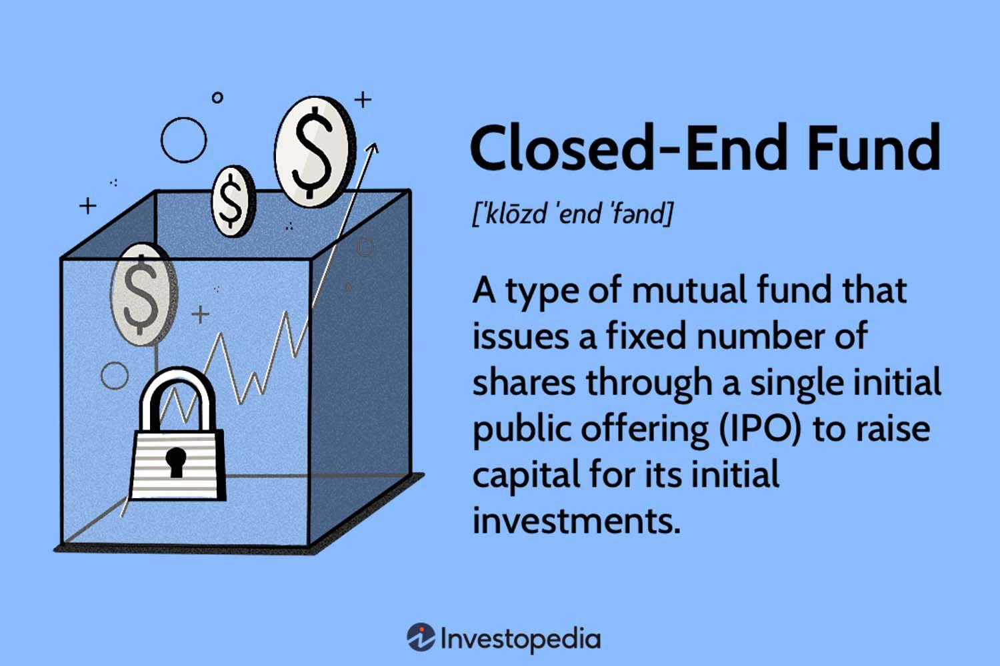

## Table of Contents

## What is a closed-end fund?

A closed-end fund is a type of investment company that raises a fixed amount of money through an initial public offering (IPO). Once the shares are sold, the fund is closed to new investors, meaning it does not continuously issue and redeem shares like an open-end fund. The shares of a closed-end fund are then traded on a stock exchange, similar to stocks, and their prices can fluctuate based on supply and demand.

These funds typically invest in a variety of assets such as stocks, bonds, or other securities. Because the number of shares is fixed, the price of the shares can differ from the net asset value (NAV) of the fund's underlying investments. If the share price is higher than the NAV, the fund is said to be trading at a premium. Conversely, if the share price is lower than the NAV, it is trading at a discount. This feature can provide opportunities for investors to buy into the fund at a lower price than the actual value of its assets.

## How does a closed-end fund differ from an open-end fund?

A closed-end fund and an open-end fund are two types of investment funds, but they work in different ways. A closed-end fund raises money by selling a fixed number of shares through an initial public offering (IPO). After the IPO, no new shares are created, and the fund is closed to new investors. The shares then trade on a stock exchange like stocks, and their price can go up or down based on what people are willing to pay for them. This means the price of the shares might not match the actual value of the investments the fund holds.

On the other hand, an open-end fund keeps selling and buying back its shares all the time. When you want to invest in an open-end fund, you buy shares directly from the fund at the current net asset value (NAV), which is the total value of the fund's investments divided by the number of shares. If you want to sell your shares, the fund buys them back from you at the NAV. Because of this, the price of an open-end fund's shares always matches the value of its investments.

The main difference between the two is how they handle their shares. Closed-end funds have a fixed number of shares that trade on the market, while open-end funds can create or redeem shares as needed, keeping the share price in line with the NAV. This makes closed-end funds more like stocks and open-end funds more flexible for investors looking to buy or sell at any time.

## What are the key features of closed-end funds?

Closed-end funds have a few main features that set them apart from other types of funds. One big feature is that they raise a fixed amount of money through an initial public offering, or IPO. After the IPO, they don't let in new investors. This means the number of shares stays the same, and these shares trade on a stock exchange just like stocks. Because of this, the price of the shares can go up and down based on what people are willing to pay, which might be different from the actual value of what the fund owns.

Another important feature is that the price of closed-end fund shares can be higher or lower than the net asset value, or NAV, of the fund's investments. If the share price is higher than the NAV, the fund is trading at a premium. If it's lower, it's trading at a discount. This can give investors a chance to buy into the fund for less than what its investments are worth. Closed-end funds can invest in all sorts of things, like stocks, bonds, or other securities, making them a flexible choice for investors looking for different types of investments.

## How are closed-end funds structured?

A closed-end fund is set up by selling a certain number of shares to investors through an initial public offering, or IPO. Once the IPO is done, the fund doesn't let in any more investors. This means the number of shares stays the same, and these shares start trading on a stock exchange, just like stocks. Because the number of shares is fixed, the price of the shares can go up or down based on what people are willing to pay for them, which might not be the same as the actual value of the fund's investments.

Closed-end funds can invest in many different things, like stocks, bonds, or other securities. The price of the shares can be higher or lower than the net asset value, or NAV, of what the fund owns. If the share price is higher than the NAV, the fund is trading at a premium. If it's lower, it's trading at a discount. This difference between the share price and the NAV can give investors a chance to buy into the fund for less than what its investments are actually worth.

## What are the benefits of investing in closed-end funds?

One big benefit of investing in closed-end funds is that you might be able to buy them at a discount. This means the price of the shares can be less than what the fund's investments are actually worth. When you buy a closed-end fund at a discount, it's like getting a deal on your investment. If the discount goes away and the price goes up to match the real value of the investments, you could make a profit.

Another benefit is that closed-end funds can give you more variety in your investments. They can put money into all sorts of things, like stocks, bonds, or other securities. This means you can spread out your money across different types of investments, which can help lower your risk. Plus, because closed-end funds trade on a stock exchange, you can buy and sell them easily, just like you would with stocks.

## What are the risks associated with closed-end funds?

One risk of investing in closed-end funds is that the price of the shares can go up and down a lot. Because closed-end funds trade on a stock exchange like stocks, their price can be different from the actual value of the investments they hold. If a lot of people want to sell their shares and not many people want to buy them, the price can drop, even if the value of the investments inside the fund stays the same. This can mean you might lose money if you need to sell your shares when the price is low.

Another risk is that closed-end funds often use borrowed money, or leverage, to try to make more money for investors. While this can lead to bigger gains if the investments do well, it can also lead to bigger losses if the investments don't do well. Using borrowed money makes the fund riskier because it has to pay back the money it borrowed, no matter how its investments perform. This can make the value of your investment go down if the fund can't make enough money to cover its debts.

Lastly, closed-end funds can be hard to understand because they invest in a wide range of things, like stocks, bonds, or other securities. If you don't know much about these investments, it can be tough to figure out if the fund is a good choice for you. Plus, some closed-end funds might focus on riskier investments, which can make your investment more likely to lose value. It's important to do your homework and understand what you're investing in before you put your money into a closed-end fund.

## How are closed-end funds priced and traded?

Closed-end funds are priced and traded on a stock exchange, just like regular stocks. When you want to buy or sell shares of a closed-end fund, you do it through a broker, and the price you pay or get depends on what other people are willing to pay at that time. This means the price of the shares can go up or down based on what people think the fund is worth, and it might not match the actual value of the investments the fund holds. If more people want to buy the shares than sell them, the price can go up. If more people want to sell than buy, the price can go down.

The price of a closed-end fund can be different from its net asset value, or NAV, which is the total value of all the investments the fund owns divided by the number of shares. If the share price is higher than the NAV, the fund is said to be trading at a premium. If it's lower, it's trading at a discount. This difference between the share price and the NAV can be a good thing or a bad thing for investors. If you buy shares at a discount, you're getting them for less than what the investments are worth, which could be a good deal. But if you buy at a premium, you're paying more than the investments are worth, which could be risky if the price goes down.

## What is the role of the discount or premium in closed-end funds?

The discount or premium in closed-end funds is the difference between the price of the fund's shares and the net asset value (NAV) of its investments. The NAV is what the fund's investments are actually worth, divided by the number of shares. If the share price is less than the NAV, the fund is trading at a discount. This means you can buy the shares for less than what the investments are worth, which could be a good deal. On the other hand, if the share price is more than the NAV, the fund is trading at a premium. This means you're paying more for the shares than what the investments are worth, which could be risky if the price goes down.

The discount or premium can change over time based on what people think about the fund and how much they want to buy or sell the shares. If a lot of people want to buy the shares, the price might go up and the fund might trade at a premium. If a lot of people want to sell, the price might go down and the fund might trade at a discount. This can give investors a chance to make money if they buy at a discount and the price goes up to match the NAV. But it can also be risky because the price can keep going down, making your investment worth less than what you paid for it.

## How can investors use leverage in closed-end funds?

Investors can use leverage in closed-end funds to try to make more money. Leverage means borrowing money to invest more than what you have. Closed-end funds often borrow money to buy more investments, hoping that the returns from these investments will be bigger than the cost of the borrowed money. This can lead to bigger gains if the investments do well, but it also means bigger losses if they don't. So, using leverage can make closed-end funds riskier because they have to pay back the borrowed money no matter how the investments perform.

Because closed-end funds use leverage, they can be a good choice for investors who are okay with taking on more risk to try to get higher returns. But it's important to understand that leverage can also make your investment more likely to lose value. If the fund can't make enough money to cover what it borrowed, the value of your shares could go down. So, before you invest in a closed-end fund that uses leverage, make sure you know how it works and if it's right for you.

## What are some strategies for investing in closed-end funds?

One strategy for investing in closed-end funds is to look for funds trading at a discount. This means you can buy the shares for less than what the fund's investments are actually worth. If you buy at a discount and the price goes up to match the real value of the investments, you could make a profit. To find these discounts, you need to compare the share price with the net asset value (NAV) of the fund. Keep an eye on funds that often trade at a discount, and think about buying when the discount is big. But remember, just because a fund is at a discount doesn't mean it will always go up, so do your homework.

Another strategy is to pay attention to the use of leverage in closed-end funds. Some funds borrow money to invest more, hoping to make bigger returns. This can be good if the investments do well, but it can also be risky if they don't. If you're okay with taking on more risk for the chance of higher returns, you might want to look at funds that use leverage. But make sure you understand how much the fund is borrowing and if it can handle the debt. It's a good idea to check the fund's past performance and see how it has managed leverage before.

You can also think about diversifying your investments with closed-end funds. These funds can put money into different types of investments like stocks, bonds, or other securities. By investing in a few different closed-end funds, you can spread out your money and lower your risk. Look for funds that focus on different areas or types of investments to build a balanced portfolio. This way, if one type of investment doesn't do well, the others might help balance it out. Always do your research and understand what you're investing in before you make a decision.

## How do closed-end funds manage their portfolios?

Closed-end funds manage their portfolios by investing in a variety of assets like stocks, bonds, or other securities. The fund's managers choose what to buy and sell based on the fund's goals. They might focus on certain types of investments, like stocks from a specific industry or bonds from different countries. The goal is to make money for the investors by [picking](/wiki/asset-class-picking) investments that will grow in value or pay out interest. The managers keep an eye on the market and the fund's performance, making changes to the portfolio when they think it's needed.

Because closed-end funds have a fixed number of shares, the managers don't have to worry about new money coming in or investors taking their money out. This can make it easier for them to plan long-term investments. They might use borrowed money, or leverage, to try to make more money for the investors. This means they can buy more investments than they could with just the money from the initial public offering. But using leverage can also make the fund riskier because they have to pay back the borrowed money, no matter how the investments do.

## What are the tax implications of investing in closed-end funds?

Investing in closed-end funds can have tax implications that you need to think about. When a closed-end fund makes money from its investments, like dividends from stocks or interest from bonds, it has to pass that money on to its investors. This money is called a distribution, and it can be taxed as regular income or as capital gains, depending on what kind of money the fund made. If the fund makes money by selling investments for more than it paid for them, that's a capital gain, and it might be taxed at a lower rate than regular income. But if the fund gets money from interest or dividends, that's usually taxed as regular income.

Another thing to know is that if you sell your shares in a closed-end fund for more than you paid for them, you might have to pay capital gains tax on the profit. The tax rate depends on how long you held the shares. If you held them for a year or less, it's a short-term capital gain, and it's taxed as regular income. If you held them for more than a year, it's a long-term capital gain, and it might be taxed at a lower rate. It's a good idea to talk to a tax advisor to understand how investing in closed-end funds might affect your taxes, because tax laws can change and everyone's situation is different.

## What is the understanding of investment funds?

Investment funds are collective investment vehicles that pool money from multiple investors to invest in a diversified portfolio of securities. The three primary types of investment funds are mutual funds, exchange-traded funds (ETFs), and closed-end funds, each with distinct characteristics and operational mechanics.

**1. Mutual Funds**

Mutual funds are open-ended investment vehicles that allow investors to buy or sell shares at the fund's net asset value (NAV) at the end of each trading day. NAV is calculated as:

$$
\text{NAV} = \frac{\text{Total Assets - Total Liabilities}}{\text{Number of Outstanding Shares}}
$$

Mutual funds offer a wide range of investment options, including equity funds, bond funds, and balanced funds. Their key benefits include professional management, diversification, and [liquidity](/wiki/liquidity-risk-premium). However, mutual funds may also have drawbacks, such as management fees and less control over investment decisions.

**2. Exchange-Traded Funds (ETFs)**

ETFs are similar to mutual funds in terms of diversification and professional management but differ in how they are traded. ETFs are bought and sold on stock exchanges throughout the trading day, similar to stocks. This feature provides real-time pricing and greater flexibility for investors. ETFs often have lower expense ratios compared to mutual funds and offer tax efficiency advantages due to their unique creation and redemption processes. However, their market-based pricing can lead to differences between the market price and the NAV, known as the bid-ask spread.

**3. Closed-End Funds**

Closed-end funds issue a fixed number of shares during an initial public offering (IPO) and are subsequently traded on exchanges. Their market price may differ from the NAV, often trading at a premium or discount depending on market conditions and investor sentiment. Closed-end funds provide opportunities for active management and access to illiquid assets, but they may pose risks related to leverage and liquidity.

**Benefits and Risks**

Investment funds, by pooling resources, enable individual investors to gain access to a broader range of investments, enhancing diversification and risk management. Diversification reduces the unsystematic risk, as defined by the formula:

$$
\text{Total Risk} = \text{Systematic Risk} + \text{Unsystematic Risk}
$$

By spreading investments across various assets, investors can reduce their exposure to the risk associated with any single investment. However, investment in funds inherently carries market risk, [interest rate](/wiki/interest-rate-trading-strategies) risk, and, in some cases, currency risk.

**Role in Diversification and Risk Management**

The primary role of investment funds is to provide diversification, which mitigates specific risks associated with individual securities. This is achieved through the careful selection of a variety of investments, spreading exposure across different asset classes, sectors, and geographical markets. Professional fund managers utilize advanced strategies and tools to balance risk and optimize returns for investors.

Ultimately, the choice among mutual funds, ETFs, and closed-end funds depends on the investor's objectives, risk tolerance, and investment horizon. Each type of fund offers distinct advantages and involves different risks, necessitating careful consideration and alignment with individual financial goals.

## References & Further Reading

[1]: Graham, Benjamin. ["The Intelligent Investor"](https://en.wikipedia.org/wiki/The_Intelligent_Investor). HarperBusiness Essentials.

[2]: Kiyosaki, Robert T. ["Rich Dad Poor Dad"](https://en.wikipedia.org/wiki/Rich_Dad_Poor_Dad). Plata Publishing.

[3]: López de Prado, Marcos. ["Advances in Financial Machine Learning"](https://www.amazon.com/Advances-Financial-Machine-Learning-Marcos/dp/1119482089). Wiley.

[4]: Livermore, Jesse. ["How to Trade In Stocks"](https://www.amazon.com/How-Trade-Stocks-Jesse-Livermore/dp/0071469796). Martino Fine Books.

[5]: Chan, Ernest P. ["Algorithmic Trading: Winning Strategies and Their Rationale"](https://github.com/ftvision/quant_trading_echan_book). Wiley.

[6]: Jansen, Stefan. ["Machine Learning for Algorithmic Trading"](https://github.com/stefan-jansen/machine-learning-for-trading). Packt Publishing.

[7]: Aronson, David R. ["Evidence-Based Technical Analysis: Applying the Scientific Method and Statistical Inference to Trading Signals"](https://www.amazon.com/Evidence-Based-Technical-Analysis-Scientific-Statistical/dp/0470008741). Wiley.