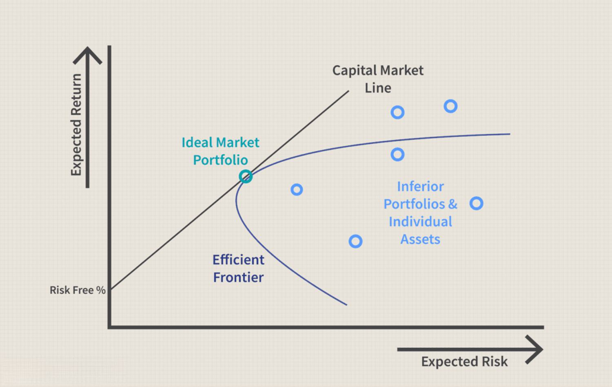

## Table of Contents

## What is the Consumption Capital Asset Pricing Model (CCAPM)?

The Consumption Capital Asset Pricing Model (CCAPM) is a financial theory that helps explain how people make investment decisions based on their consumption habits. It suggests that the expected return on an investment is related to how that investment affects a person's overall consumption. In simpler terms, if an investment can help someone consume more in the future, they might be willing to invest in it, even if it's risky. This model builds on the idea that people care about their future consumption and will adjust their investments to balance the risk and reward in a way that maximizes their future consumption.

The CCAPM is different from other models, like the traditional Capital Asset Pricing Model (CAPM), because it focuses on consumption rather than just the market's performance. While the CAPM looks at how an investment's return compares to the overall market, the CCAPM considers how an investment impacts someone's ability to consume goods and services. By taking consumption into account, the CCAPM provides a more personal approach to understanding investment decisions, showing that people might choose investments that not only offer good returns but also help them maintain or increase their future consumption levels.

## How does the CCAPM differ from the traditional Capital Asset Pricing Model (CAPM)?

The Consumption Capital Asset Pricing Model (CCAPM) and the traditional Capital Asset Pricing Model (CAPM) are both used to understand how investments are priced, but they look at things differently. The CAPM focuses on how an investment's return compares to the overall market's performance. It says that the expected return of an investment depends on how risky it is compared to the market as a whole. If an investment is riskier than the market, investors will expect a higher return to take on that extra risk.

On the other hand, the CCAPM looks at how investments affect a person's consumption. It suggests that people make investment choices based on how those choices will help them consume more in the future. So, if an investment can help someone buy more things they need or want later on, they might be willing to take the risk, even if it's not the best choice according to the market's performance. This makes the CCAPM more personal, focusing on individual consumption rather than just market trends.

## What are the key assumptions of the CCAPM?

The Consumption Capital Asset Pricing Model (CCAPM) relies on a few main ideas. One key assumption is that people care about how their investments will affect their future ability to consume goods and services. This means they look at investments not just for the money they might make, but for how that money will help them buy things they need or want later on. Another important assumption is that people are willing to take risks with their investments if they believe those risks will lead to better consumption in the future. So, if an investment has a chance to help them consume more, they might be okay with the risk involved.

Another assumption of the CCAPM is that people have a way to balance the risk and reward of their investments in a way that maximizes their future consumption. They are smart about their choices and try to find the best balance between risk and the chance to consume more later. This model also assumes that everyone has the same information and expectations about the future, which helps them make these investment decisions. Overall, the CCAPM sees people as trying to make the most of their money by focusing on how their investments will help them live better in the future.

## How is consumption used in the CCAPM to determine asset prices?

In the Consumption Capital Asset Pricing Model (CCAPM), consumption is a big part of figuring out how much an asset should cost. The idea is that people care about what they can buy in the future, so they choose investments that help them consume more later on. If an investment can make it easier for someone to buy things they need or want, they might be willing to pay more for it. This means that the price of an asset in the CCAPM depends on how it can help someone consume more in the future.

The CCAPM looks at how risky an investment is and how it affects future consumption. If an investment is risky but it has a good chance of helping someone consume more, they might still go for it. So, the expected return on an investment is linked to how it can improve future consumption. This way, the CCAPM uses consumption to help set the prices of assets by considering both the risk and the potential for better living in the future.

## What role does the marginal rate of substitution play in the CCAPM?

In the Consumption Capital Asset Pricing Model (CCAPM), the marginal rate of substitution is really important. It's a fancy way to say how much someone is willing to give up today to get something in the future. Think of it like trading: if you're willing to give up a lot now for a little bit more later, that's the marginal rate of substitution at work. In the CCAPM, this idea helps figure out how much people value future consumption compared to what they have now. It's a key part of deciding if an investment is worth it because it shows how much someone is willing to trade off current consumption for better consumption later.

The marginal rate of substitution helps set the price of investments in the CCAPM. If people are willing to give up a lot now for a chance to consume more later, they might be okay with riskier investments. This means the expected return on an investment needs to match up with what people are willing to trade off. So, the price of an asset in the CCAPM is tied to this idea of how much someone is willing to sacrifice now for future benefits. It's all about balancing the risk and reward in a way that makes sense for future consumption.

## Can you explain the relationship between consumption growth and asset returns in the CCAPM?

In the Consumption Capital Asset Pricing Model (CCAPM), the relationship between consumption growth and asset returns is pretty straightforward. The idea is that people invest in assets because they want to be able to consume more in the future. If an asset helps them do that, they're more likely to invest in it, even if it's risky. So, the expected return on an asset is closely tied to how it can help someone increase their consumption over time. If an asset is expected to lead to higher consumption growth, people will be willing to accept lower returns now because they believe it will pay off with better consumption later.

This means that in the CCAPM, assets that are expected to help with consumption growth might have lower immediate returns but are valued higher because of their potential to improve future consumption. On the other hand, if an asset doesn't help with consumption growth, people might demand higher immediate returns to make up for the lack of future benefits. The key is balancing the risk of the investment with the potential for increased consumption. So, the CCAPM shows that asset returns are not just about making money now, but about how that money can help someone live better in the future.

## How does the CCAPM incorporate risk aversion and intertemporal substitution?

The Consumption Capital Asset Pricing Model (CCAPM) takes into account how people feel about risk and how they make choices between consuming now and later. Risk aversion means people don't like uncertainty and might need more reward to take on riskier investments. In the CCAPM, if an investment is risky but can help someone consume more in the future, they might still go for it if the potential reward is big enough. So, the model shows that people's willingness to take risks is tied to how much they think it will help them consume more later.

Intertemporal substitution is about choosing between using money now or saving it for later. The CCAPM uses this idea to understand how people make investment decisions. If someone thinks they can consume a lot more in the future by investing now, they might be willing to give up some consumption today. The model looks at how much people are willing to trade off current consumption for future benefits, which helps explain why they might choose certain investments. Both risk aversion and intertemporal substitution help the CCAPM explain how people balance the risks and rewards of investments with their future consumption needs.

## What are some empirical challenges faced when testing the CCAPM?

Testing the Consumption Capital Asset Pricing Model (CCAPM) can be tricky because it's hard to measure how much people consume over time. Researchers need good data on how people's consumption changes, but this information is not always easy to get. Sometimes the data is not detailed enough or it's collected in a way that doesn't fit well with the model. Also, people's consumption habits can be affected by lots of things, like the economy, their jobs, and even their feelings, which makes it hard to see clear patterns that the CCAPM predicts.

Another challenge is that the CCAPM assumes people make investment choices based on how those choices will help them consume more in the future. But in real life, people might not think that far ahead or they might have other reasons for investing. This means the model's predictions might not match up with what actually happens. Plus, figuring out how much people care about future consumption compared to now, or how much risk they're willing to take, can be tough. These factors can change from person to person, making it hard to test the model accurately across a large group of people.

## How have researchers attempted to modify the CCAPM to better fit empirical data?

Researchers have tried different ways to make the Consumption Capital Asset Pricing Model (CCAPM) fit better with real-world data. One way they've done this is by adding new factors to the model. For example, they might include things like how much people save or how they feel about the future. By adding these extra pieces, the model can better explain why people make certain investment choices. Another approach is to look at different types of consumption, like separating out what people spend on things they need versus things they want. This helps the model match up better with how people actually behave.

Another way researchers have tried to improve the CCAPM is by changing how they measure risk. They've used different ways to figure out how much risk people are willing to take, like looking at how much people's consumption changes over time. By doing this, they hope to get a clearer picture of how risk affects investment decisions. Some researchers have also tried to account for how people's expectations about the future might change, which can help the model explain real-world data more accurately. Overall, these changes aim to make the CCAPM a better tool for understanding how people make investment choices based on their consumption needs.

## What are the implications of the CCAPM for portfolio management and asset allocation?

The Consumption Capital Asset Pricing Model (CCAPM) has big implications for how people manage their investments and decide where to put their money. It says that people should think about how their investments will help them consume more in the future. So, when managing a portfolio, someone should look for investments that can grow their money in a way that helps them buy more things they need or want later on. This means they might choose riskier investments if those investments have a good chance of leading to better consumption down the road. It's all about balancing the risk with the potential to live better in the future.

For asset allocation, the CCAPM suggests that people should spread their money across different types of investments based on how those investments affect their future consumption. If an investment can help someone consume a lot more later, they might put more money into it, even if it's risky. On the other hand, if an investment doesn't help much with future consumption, they might put less money into it or look for something else. The key is to think about how each investment fits into the bigger picture of future consumption, and then choose the mix of investments that best supports that goal.

## How does the CCAPM account for macroeconomic factors in asset pricing?

The Consumption Capital Asset Pricing Model (CCAPM) takes into account macroeconomic factors by looking at how these factors affect people's ability to consume in the future. Things like economic growth, inflation, and unemployment can all change how much people can buy and save. If the economy is doing well, people might feel more confident about investing in riskier assets because they think their future consumption will go up. On the other hand, if the economy is struggling, people might be more cautious and choose safer investments that still help them consume in the future, even if the returns are lower.

The CCAPM uses these macroeconomic factors to help set the prices of assets. If an asset is expected to do well when the economy is growing, it might be priced higher because people see it as a good way to increase their future consumption. But if an asset is sensitive to economic downturns, people might demand a higher return to invest in it, which can affect its price. By considering how these big economic changes impact people's consumption, the CCAPM helps explain why some assets are priced the way they are and how people should think about their investments in different economic conditions.

## What are the future directions for research in the CCAPM and its applications?

Future research in the Consumption Capital Asset Pricing Model (CCAPM) is likely to focus on improving how well the model fits with real-world data. Researchers might look at adding more factors to the model, like how people feel about the future or how much they save. They could also try to better understand different kinds of consumption, like what people need versus what they want. By doing this, they hope to make the CCAPM a better tool for understanding why people make certain investment choices. Another area of focus could be on how to measure risk more accurately, maybe by looking at how much people's consumption changes over time. This could help the model explain real-world data more accurately.

Another direction for research might be on how the CCAPM can be used in different areas, like helping people plan for retirement or managing their money during economic changes. Researchers could study how the model can be applied to different groups of people, like those with different income levels or in different countries. They might also explore how the CCAPM can be used to create new investment strategies that focus on future consumption. By looking at these new applications, researchers can make the CCAPM more useful for people in their everyday lives.

## What is an Overview of CCAPM?

The Consumption Capital Asset Pricing Model (CCAPM) was developed by economists such as Douglas Breeden and Robert Lucas as an extension to the traditional Capital Asset Pricing Model (CAPM). The CCAPM is designed to better capture the dynamics of asset pricing by incorporating consumption data, which highlights the connection between an investor's consumption behavior and asset prices. This approach suggests that the risk associated with an asset is not only tied to market fluctuations but also to changes in consumption patterns across the economy.

Unlike the CAPM, which primarily uses the market beta to quantify the risk of an asset relative to the overall market, the CCAPM employs a consumption beta. The consumption beta measures an asset's risk in terms of its covariance with consumption growth. The idea is that the expected returns on an asset are influenced by how its value co-moves with the changes in consumption over time. Formally, this relationship can be expressed as:

$$
E(R_i) = R_f + \beta_c (E(R_m) - R_f)
$$

where:
- $E(R_i)$ is the expected return on asset $i$,
- $R_f$ is the risk-free rate,
- $\beta_c$ is the consumption beta of the asset,
- $E(R_m)$ is the expected market return.

The consumption beta $\beta_c$ represents the sensitivity of the asset's return to changes in consumption, rather than overall market movements, providing a unique perspective on risk assessment. The use of consumption data aligns the CCAPM with broader economic trends and behaviors, potentially offering insights into macroeconomic fluctuations and their impact on asset pricing.

Through this framework, CCAPM aims to provide a more comprehensive view of assets' risk and returns by taking into account the systematic consumption risks that can affect investments. This approach can be particularly useful in environments where consumption data is a significant driver of economic conditions. The CCAPM therefore extends the traditional asset pricing models by linking consumption habits and patterns to financial market predictions.

## What are the Theoretical Foundations?

The Consumption Capital Asset Pricing Model (CCAPM) relies on a multi-period framework, reflecting its more dynamic nature compared to the static, one-period Capital Asset Pricing Model (CAPM). This framework is essential for capturing the evolution of consumption over time and its impact on asset pricing. In CCAPM, the expected return on an asset is directly associated with its impact on consumption growth, leading to the fundamental equation of the model:

$$
E(R_i) = R_f + \beta_c (E(R_m) - R_f)
$$

Where:
- $E(R_i)$ is the expected return on the asset,
- $R_f$ is the risk-free rate,
- $\beta_c$ is the consumption beta, measuring the sensitivity of the asset return relative to consumption growth,
- $E(R_m)$ is the expected market return.

The key postulation of CCAPM is that assets contributing to greater uncertainty in an investor’s consumption pattern require higher expected returns. This conjecture stems from the notion that consumption [volatility](/wiki/volatility-trading-strategies) is a critical risk [factor](/wiki/factor-investing). Investors demand returns as compensation for the possibility that an asset's performance could adversely affect their ability to consume, aligning with risk aversion principles.

Consumption beta ($\beta_c$) plays a pivotal role in this model as it denotes the co-movement between an asset's return and consumption changes. A higher consumption beta implies that an asset's return is more closely tied to changes in consumption, thereby representing higher risk. For instance, during economic downturns, if an asset exhibits significant volatility in tandem with reduced consumption, it is perceived as riskier, necessitating a higher return to attract investors.

By focusing on consumption rather than merely market indices, CCAPM aligns asset pricing with observable economic behavior. This connection offers an enriched understanding of macroeconomic relationships, beyond the market-centric view of CAPM. CCAPM's consumption-based risk assessment provides a theoretical framework that resonates with real-world economic interactions, recognizing that consumption patterns are fundamental drivers in economic systems. 

This alignment with real-world behaviors allows CCAPM to potentially provide insights into broader macroeconomic phenomena, accommodating varying economic phases by considering consumption levels and fluctuations. Through linking consumption preferences and risk, CCAPM provides a nuanced perspective on asset pricing that reflects the complex interdependencies between financial markets and economic activity.

## How does it compare with CAPM?

Capital Asset Pricing Model (CAPM) and Consumption Capital Asset Pricing Model (CCAPM) both serve to explain how assets are priced by modeling the relationship between risk and expected return, but they diverge significantly in their approaches. CAPM primarily focuses on market risks, utilizing market beta to quantify the sensitivity of an individual asset's returns to the overall market returns. The model's underlying formula, often represented as:

$$

E(R_i) = R_f + \beta_i (E(R_m) - R_f) 
$$

where $E(R_i)$ is the expected return of the asset, $R_f$ is the risk-free rate, $\beta_i$ represents the market beta, and $E(R_m)$ is the expected market return, captures this focus. In CAPM, market beta measures the asset's systematic risk in relation to the market as a whole. This singular focus on market fluctuations enables CAPM to offer a simplified yet broadly applicable tool for investors.

In contrast, the CCAPM shifts the focal point to consumption risks through the use of consumption beta. This model evaluates how variations in economic consumption influence asset prices. By incorporating data on consumption, CCAPM proposes that the covariance between an asset’s returns and consumption growth influences its expected returns, a relationship posited as:

$$

E(R_i) = R_f + \beta_c [E(R_g) - R_f] 
$$

where $\beta_c$ denotes the consumption beta and $E(R_g)$ indicates the expected growth rate of consumption. Unlike CAPM, which looks at market indices as the benchmark, CCAPM examines consumption figures, positioning economic consumption at the heart of risk assessment.

This divergence highlights a critical asset of CCAPM: its potential to integrate real-life economic indicators like consumption. Unlike CAPM's reliance on broader market dynamics, CCAPM's emphasis on consumption data offers an alternative perspective that potentially enhances the accuracy of asset valuation, particularly in contexts where consumer behavior is a dominant economic force. By aligning the model with individual consumption patterns, CCAPM can provide insights that might be overlooked by CAPM's more market-centric scope. Nevertheless, while CCAPM extends the paradigm of risk and return beyond traditional market factors, it is often applied in tandem with other models to balance its focus on economic consumption with other critical market variables.

## What are the applications in algorithmic trading?

In the domain of [algorithmic trading](/wiki/algorithmic-trading), the Consumption Capital Asset Pricing Model (CCAPM) provides substantial benefits by integrating economic consumption data into trading strategies. By leveraging consumption growth trends, traders can enhance the predictive capabilities of their algorithms, allowing for more informed decisions about future asset behavior. 

Algorithmic trading strategies based on CCAPM typically rely on the fundamental principle that an asset’s expected return is influenced by its covariance with consumption growth. This relationship can be expressed mathematically as:

$$
E(R_i) = R_f + \beta_c (E(R_m) - R_f)
$$

where:
- $E(R_i)$ is the expected return on asset $i$,
- $R_f$ is the risk-free rate,
- $\beta_c$ is the consumption beta, representing the sensitivity of asset returns to consumption growth,
- $E(R_m)$ is the expected return on the market portfolio.

By incorporating economic indicators such as consumption growth rates, traders can refine the consumption beta, allowing the algorithm to adjust to economic changes more accurately. This adaptability is crucial in developing robust algorithmic strategies that can withstand market fluctuations.

The implementation of CCAPM in trading algorithms involves gathering and analyzing macroeconomic data alongside traditional financial metrics. Here is a simple Python code snippet illustrating how one might calculate consumption beta using historical data:

```python
import numpy as np
import pandas as pd

# Assume df is a DataFrame containing historical returns and consumption growth
# with columns ['AssetReturns', 'ConsumptionGrowth']

def calculate_consumption_beta(df):
    covariance_matrix = np.cov(df['AssetReturns'], df['ConsumptionGrowth'])
    consumption_variance = covariance_matrix[1][1]
    beta_c = covariance_matrix[0][1] / consumption_variance
    return beta_c

# Example usage
df = pd.DataFrame({
    'AssetReturns': [0.05, 0.07, 0.04, 0.06],
    'ConsumptionGrowth': [0.02, 0.03, 0.025, 0.03]
})

beta_c = calculate_consumption_beta(df)
print(f"Consumption Beta: {beta_c}")
```

This Python function calculates the consumption beta by evaluating the covariance between asset returns and consumption growth alongside the variance of consumption growth itself. Incorporating such calculations into algorithmic trading systems allows traders to dynamically adjust their strategies in line with observed economic consumption patterns.

Ultimately, the integration of CCAPM into algorithmic trading frameworks facilitates a more comprehensive consideration of systematic economic factors, potentially improving prediction accuracy and offering a more robust approach to asset risk assessment. The enhanced understanding of economic trends provided by CCAPM proves indispensable for long-term trading strategies, as it equips traders with a deeper perspective on market behaviors influenced by consumption.

## What are the criticisms and limitations?

Despite its theoretical appeal, the Consumption Capital Asset Pricing Model (CCAPM) has faced significant criticism, particularly regarding its empirical performance. One of the primary issues is that the model often fails to align with real-world data as accurately as it might predict in theory. This discrepancy arises from various factors, each highlighting limitations inherent to the CCAPM framework.

One major criticism lies in the assumption that all consumers participate equally in financial markets. This assumption is rarely valid, as financial market participation is often restricted by wealth, access to information, and risk preferences. Consequently, the CCAPM's premise that consumption patterns drive asset pricing assumes a uniformity in consumer behavior that does not exist in practice. For instance, in reality, only a subset of consumers actively engage in the purchase and sale of financial assets, which limits the model’s applicability across diverse economic conditions.

Another limitation of CCAPM is its reliance on a single factor, namely consumption, for risk assessment. This single-factor approach has been criticized for oversimplifying the complex nature of financial markets. In practice, asset prices are influenced by a multitude of factors, including interest rates, inflation, labor market conditions, and geopolitical risks. As a result, the CCAPM's singular focus on consumption may overlook other significant economic indicators that can impact asset risk and return. This deficiency has prompted the development of multifactor models, which aim to capture a broader spectrum of risk factors and thereby offer greater predictive power.

Mathematically, the CCAPM posits that the expected return on an asset is a function of its covariance with consumption growth. The model can be expressed as:

$$
E(R_i) = R_f + \beta_{c} (E(R_m) - R_f)
$$

where $E(R_i)$ is the expected return on asset $i$, $R_f$ is the risk-free rate, $E(R_m)$ is the expected return on the market portfolio, and $\beta_{c}$ is the consumption beta, representing the asset's sensitivity to consumption growth. In practice, however, accurately estimating $\beta_{c}$ remains challenging due to the difficulty in measuring and predicting consumption growth with precision.

The limitations of the CCAPM highlight the need for models that incorporate a wider range of variables and more accurately reflect the complexities of real-world economic behavior. This recognition has led to the exploration of factor-based models such as the Arbitrage Pricing Theory (APT), which integrate multiple economic indicators to enhance predictive capabilities. Moreover, advancements in data science and [machine learning](/wiki/machine-learning) offer potential for developing more robust models that can bridge the gap between theoretical appeal and empirical validity.

## References & Further Reading

[1]: Breeden, D. T. (1979). ["An Intertemporal Asset Pricing Model with Stochastic Consumption and Investment Opportunities."](https://static.secure.website/wscfus/8149792/uploads/Breeden_1979_JFE_Consumption_CAPM_Theory.pdf) Journal of Financial Economics, 7(3), 265-296.

[2]: Lucas, R. E. Jr. (1978). ["Asset Prices in an Exchange Economy."](https://www.jstor.org/stable/1913837) Econometrica, 46(6), 1429-1445.

[3]: Cochrane, J. H. (2005). ["Asset Pricing"](https://www.amazon.com/Asset-Pricing-John-Cochrane-2005-01-23/dp/B01K91VBCA) (Revised Edition). Princeton University Press.

[4]: Campbell, J. Y. (2003). ["Consumption-Based Asset Pricing"](https://papers.ssrn.com/sol3/papers.cfm?abstract_id=343784) in Handbook of the Economics of Finance.

[5]: Mehra, R., & Prescott, E. C. (1985). ["The Equity Premium: A Puzzle."](https://www.academicwebpages.com/preview/mehra/pdf/The%20Equity%20Premium%20A%20Puzzle.pdf) Journal of Monetary Economics, 15(2), 145-161.