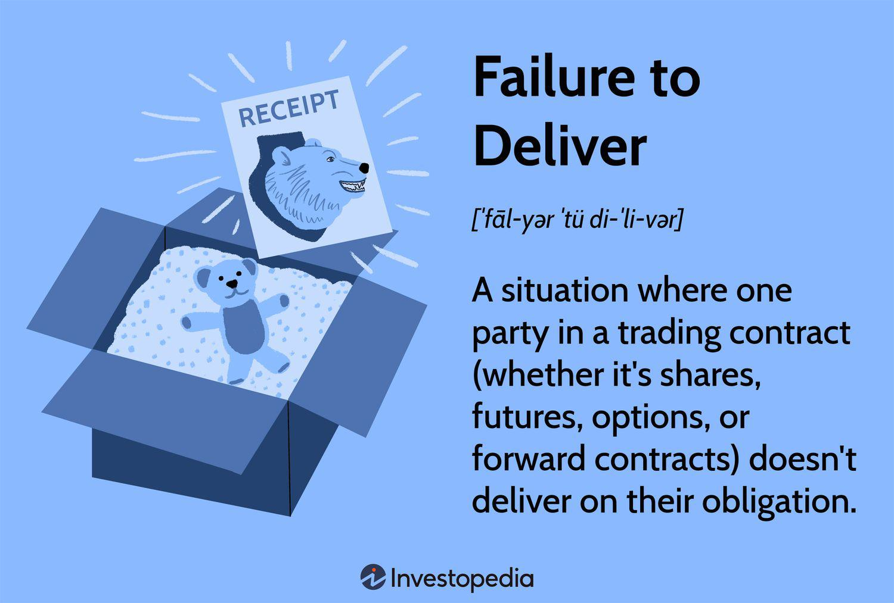

The securities market has undergone significant transformations in recent years, driven by technological advancements and changing regulatory environments. This evolution is characterized by increased automation, complex financial instruments, and a globalized trading ecosystem. The adoption of algorithmic trading, a dominant force in modern markets, exemplifies these changes. This practice involves the use of computer algorithms to manage trading activities by making decisions at speeds beyond human capability. Algorithms assess data, execute trades, and even manage risk, revolutionizing traditional trading methodologies. Algorithmic trading has led to enhanced market efficiency and liquidity but has also introduced new challenges, including systemic risks and market disruptions.

One crucial aspect tied to these market dynamics is the concept of "Failure to Deliver" (FTD). FTD occurs when a seller does not deliver the securities or assets to the buyer by the settlement date. This can arise from various causes, such as settlement errors, mismatches in trade data, or financial difficulties faced by the seller. FTDs pose significant risks to market stability, as they can lead to a cascade of unmet obligations and impact investor confidence.



Understanding FTD is critical for several reasons. Primarily, FTDs can distort market prices and lead to artificial supply and demand conditions, making them a focal point for traders, regulators, and investors aiming to maintain fair and orderly markets. Furthermore, repeated or chronic FTD occurrences may indicate underlying systemic issues that could escalate into broader financial instability.

The purpose of this article is to explore the concept of Failure to Deliver within the securities market comprehensively, examining its causes, impacts, and the regulatory framework in place to manage its occurrences. Additionally, this discussion will assess the role of algorithmic trading in influencing FTD rates, considering how automated systems might contribute to or mitigate these episodes. The scope of the article encompasses both historical and contemporary perspectives, emphasizing technological and regulatory solutions to enhance market resilience.

## Table of Contents

## Understanding Failure to Deliver (FTD)

Failures to Deliver (FTDs) occur when one party involved in a trading transaction does not deliver a security or financial instrument by the settlement date. This can be detrimental as it affects the completion of securities transactions, causing market inefficiencies and instability. While FTDs are typically understood within the context of equity markets, they can arise in any financial market where securities are traded.

### Definition and Basic Explanation

At its core, an FTD arises when a buyer is unable to receive the intended security because the seller fails to deliver it at the time of settlement. In typical trading markets, when an order is executed, the seller is obligated to deliver the shares to the buyer by a specified date, usually set by the securities exchange rules. A failure to meet this obligation results in an FTD, which can disrupt securitization processes, [liquidity](/wiki/liquidity-risk-premium) flows, and overall market trust.

### Causes and Conditions Leading to FTD

Several conditions can lead to FTDs:

1. **Seller's Short Selling**: Often, FTDs arise from short selling, a strategy where a trader sells a security not currently owned, betting the price will decline. If the trader cannot borrow the securities in time to make the delivery, an FTD occurs.

2. **Operational Errors**: Mistakes in the processing of trades, such as clerical or technological errors, can also result in failures to deliver.

3. **Technical Challenges**: System failures and delays in clearing houses or settlement processes can contribute to FTDs.

4. **Market Volatility**: During periods of high volatility, rapid changes in security prices may make settling trades more complex, leading to an increase in FTD incidents.

### Impact on Investors and the Broader Market

FTDs can significantly impact investors and the market. For investors, these failures can result in lost opportunities or forced purchases at higher prices. On a broader level, persistent FTDs can erode market confidence, reduce liquidity, and potentially lead to market manipulation, particularly if exploited by those engaging in abusive short selling practices.

### Historical Perspective and Regulatory Backdrop

Historically, FTDs have been an issue in financial markets, leading to regulatory interventions to mitigate their occurrences. In the United States, the Securities and Exchange Commission (SEC) introduced Regulation SHO in the early 2000s, which includes provisions to address FTDs. This regulation mandates close-out requirements for positions with FTDs, aiming to decrease the number and impact of such failures in the market. The SEC continues to enhance and refine these regulations, adapting to evolving market dynamics and trading technologies.

### Key Statistics Related to FTD Occurrences

Quantifying the exact occurrences of FTDs can vary based on the specific market and time period. However, regulatory bodies regularly report on FTD data to increase market transparency. For instance, FTD [statistics](/wiki/bayesian-statistics) are published bi-monthly by the SEC, showing the extent to which these events occur and their persistence. According to recent reports, despite heightened regulatory scrutiny, FTDs continue to appear, albeit less frequently than in the past, thanks to improved market compliance and technological advancements in trade processing.

Understanding FTDs and their implications is vital for maintaining market integrity and investor confidence. With continuous advancements in regulatory measures and market technologies, the goal is to minimize FTD occurrences and mitigate their impact when they do occur.

## Role of Algorithmic Trading in Securities Markets

Algorithmic trading has fundamentally altered the landscape of securities markets. By employing computer algorithms to automatically execute trades based on predetermined criteria, this approach enhances speed, efficiency, and precision in trading. These algorithms analyze multiple market parameters such as price, timing, and [volume](/wiki/volume-trading-strategy) to detect trading opportunities, executing orders at a pace and frequency unachievable by human traders.

The benefits of [algorithmic trading](/wiki/algorithmic-trading) are significant. Primarily, it increases the liquidity of financial markets, providing more opportunities for trades to be matched and executed. Additionally, the reduction in transaction costs is a crucial advantage, as algorithms can perform tasks faster and minimize manual errors. They also enable traders to capitalize on market patterns and trends with greater accuracy, optimizing both investment returns and risk management.

However, algorithmic trading presents challenges too. The complexity of financial algorithms can lead to systemic risks. Erroneous algorithms may cause market disruptions, as witnessed in events like the 2010 "Flash Crash," where abnormal trading behaviors led to a rapid yet severe plunge in United States stock indices. Moreover, hypersensitivity in reactive algorithms can trigger a domino effect, escalating [volatility](/wiki/volatility-trading-strategies) during turbulent market conditions.

In terms of market integration, algorithmic trading complements traditional practices by increasing the ability to react to macroeconomic news and events. Traders can program algorithms to execute trades when certain news items break, accommodating both short-term and long-term investment strategies without the delays inherent in manual processing. Yet, human oversight remains imperative to adjust strategies and parameters in response to unexpected developments or shifts in market behavior.

Regulatory considerations for algorithmic trading focus on ensuring market stability and reducing risks of abuse. Authorities like the Securities and Exchange Commission (SEC) in the United States and the European Securities and Markets Authority (ESMA) in the EU have established guidelines mandating firms to implement robust risk management frameworks, ensuring the algorithms used are thoroughly tested, monitored, and capable of being halted during irregularities. Compliance with these regulations is crucial for maintaining fairness and security in the markets.

Real-life examples demonstrate the substantial influence of algorithmic trading, particularly its role in high-frequency trading ([HFT](/wiki/high-frequency-trading-strategies)). HFT firms, exemplified by companies such as Citadel Securities, employ sophisticated algorithms to execute a large number of orders within fractions of a second, altering market dynamics significantly. Another instance is the use of statistical [arbitrage](/wiki/arbitrage) strategies, where algorithms identify and exploit small price inefficiencies across different markets or securities, thus bringing the market closer to price efficiency.

Overall, while algorithmic trading provides numerous advantages by streamlining processes and optimizing strategies, its integration into the securities market necessitates careful oversight and regulation to prevent potential disruptions and ensure it enhances, rather than detracts from, market stability.

## Intersection of Algorithmic Trading and FTD

Algorithmic trading has fundamentally reshaped the landscape of securities markets, introducing efficiencies but also new challenges, particularly in the context of Failures to Deliver (FTD). The integration of high-speed, automated trading algorithms can inadvertently contribute to FTDs due to the complexity and velocity at which trades are executed.

### Analysis of How Algorithmic Trading Might Contribute to FTD
Algorithmic trading, by design, facilitates rapid execution of buy and sell orders based on pre-determined criteria. However, the sheer volume and speed of these transactions can overshadow the ability to confirm the actual availability of securities, potentially leading to a higher incidence of FTDs. The automated nature of algorithmic trading can also exacerbate existing market anomalies, especially if there are inaccuracies or outdated information in the underlying data driving the algorithms.

### Market Scenarios Escalated by Algorithmic Trades Resulting in FTD
Algorithmically driven trades often capitalize on short-term market inefficiencies. In volatile market conditions or during a market squeeze, algorithms may exacerbate supply-demand imbalances, leading to scenarios where sellers are unable to deliver the promised securities. This can be particularly pronounced when dealing with thinly traded securities or those with limited float, as the rapid execution of trades can misalign actual security positions with transaction volumes.

### Discussion of Trading Velocity and its Relation to FTD Occurrences
The high-frequency aspect of algorithmic trading increases trading velocity, often culminating in FTDs due to mismatches in timing. Trading velocity refers to the speed at which transactions are carried out. With algorithms capable of executing thousands of trades per second, the reconciliation processes required to ensure delivery may lag, leading to failures. Moreover, high velocity can obscure visibility into ownership changes, complicating the settlement process.

### Case Studies Highlighting the Connection Between Algorithmic Trading and FTD
Consider the 2010 "Flash Crash," where algorithmic trading played a significant role. The incident underscored the potential for algorithms to exacerbate market volatility and increase FTD occurrences when trades are executed without the ability to deliver. Another example is the 2020 market correction due to COVID-19, where FTD levels spiked amidst rapid algorithmic trading activity. These cases highlight the need for robust monitoring mechanisms to mitigate the risks associated with high-speed trading.

### Technical Perspectives on Monitoring and Mitigating FTD Through Algorithms
Mitigating FTDs in an environment dominated by algorithmic trading requires a combination of enhanced monitoring and adaptive algorithm design. Techniques such as real-time trade matching, blockchain settlements, and predictive analytics can be employed to streamline the tracking of securities and their settlement status. For instance, deploying real-time trade surveillance systems that flag anomalies or potential FTDs could preemptively alert traders and market makers to adjust their strategies.

Python code can be utilized for developing algorithms that enhance monitoring capabilities:

```python
import pandas as pd

def identify_ftd_risks(trade_data):
    # Simulate a simple check on trade data to flag potential FTD risks
    trade_data['Risk_Flag'] = trade_data['Executed_Volume'] > trade_data['Available_Securities']
    return trade_data[trade_data['Risk_Flag']]

# Sample trade data
trade_data = pd.DataFrame({
    'Executed_Volume': [100, 200, 150],
    'Available_Securities': [150, 180, 150]
})

# Identify potential FTD risks
potential_ftds = identify_ftd_risks(trade_data)
print(potential_ftds)
```

In conclusion, while algorithmic trading has transformed modern markets, it also necessitates sophisticated tools and strategies to prevent FTDs. By leveraging advanced technologies and fostering collaboration between industry participants, it is possible to address the challenges and maintain market stability.

## Regulatory Framework Governing FTD and Algorithmic Trading

The regulatory framework governing Failures to Deliver (FTD) and algorithmic trading involves a complex set of rules designed to maintain market integrity and stability. Failures to Deliver occur when one party in a trading contract does not meet its obligation to deliver the relevant security or cash, which can undermine market confidence and foster volatility. As a result, regulatory bodies have instituted specific measures to address these occurrences.

### Overview of Existing Regulations Addressing FTD

In the United States, the Securities and Exchange Commission (SEC) enforces regulations aimed at curtailing FTD occurrences. Regulation SHO, implemented in 2005, is a central piece of this regulatory architecture. It requires brokers to close out open Failures to Deliver positions in all equity securities registered in the national market system. Furthermore, “locate” requirements oblige brokers to ensure availability within a certain timeframe before short selling, thereby minimizing FTD risk.

### Examination of Rules and Guidelines for Algorithmic Trading

Algorithmic trading, defined by the use of complex algorithms to execute orders at unprecedented speeds, is regulated to prevent market manipulation and systemic risks. The Markets in Financial Instruments Directive II (MiFID II) in the European Union exemplifies comprehensive regulation in this area. MiFID II mandates that algorithmic trading practices must include risk controls and system testing to prevent errors. In the United States, the SEC and the Commodity Futures Trading Commission (CFTC) provide guidelines for reduces fraud and market disruptions through automated trading.

### Recent Regulatory Changes and Their Implications

Recent years have seen updates to address the evolving nature of financial markets. The SEC’s proposed Rule 15c3-3 would tighten controls around lending fiduciary assets, indirectly affecting FTD rates. These regulatory developments aim to enhance transparency and accountability in electronic trading platforms and have significant implications for compliance costs and operational practices within trading firms.

### Challenges Regulators Face in Balancing Innovation and Safety

Regulating algorithmic trading and FTD is particularly challenging due to the need to balance technological innovation with market safety. Rapid advancements in algorithmic systems exacerbate the difficulty of creating regulations that remain relevant. Moreover, the global nature of financial markets complicates regulatory harmonization across jurisdictions.

### The Role of Self-Regulation Among Trading Entities

In addition to formal regulations, self-regulation by trading entities plays a crucial role in managing FTD and algorithmic trading risks. Exchanges and trading platforms often develop their guidelines to ensure fair trading practices and respond swiftly to technological disruptions. These internal measures complement governmental regulations, providing a dual-layered approach to market oversight.

In summary, the regulatory landscape for FTD and algorithmic trading is expansive and continually evolving. It balances prescriptive measures with flexibility to adapt to new market conditions, all while encouraging self-regulation among industry participants. The ongoing challenge is to adapt these regulatory frameworks to support innovation while maintaining stability and integrity in the securities markets.

## Advancements and Solutions to Mitigate FTD

Technological advancements have significantly influenced strategies to mitigate Failures to Deliver (FTD) within securities markets. A primary solution lies in enhanced trading technologies designed to improve the efficiency of trade executions and settlements. High-frequency trading platforms, equipped with real-time monitoring capabilities, have been developed to reduce lag times between trade execution and settlement, thereby minimizing the occurrence of FTD.

Industry best practices recommended by financial experts emphasize the importance of adopting robust risk management frameworks and settlement assurance models. These models often integrate predictive analytics to anticipate potential failures by analyzing trading patterns and market behaviors. Furthermore, establishing automated post-trade processing systems can ensure that all executed trades are promptly validated and settled.

Transparency, underpinned by comprehensive data analytics, plays a crucial role in managing FTD. By leveraging big data technologies, trading entities can maintain a clear view of trade flows and settlement statuses. Analytical tools that incorporate [machine learning](/wiki/machine-learning) algorithms can detect anomalies suggesting potential FTD points and allow for preemptive measures. For instance, Python-based data analytics platforms can process large datasets to identify trends and outliers, thereby enabling more accurate forecasting of settlement failures.

```python
import pandas as pd
from sklearn.ensemble import RandomForestClassifier

# Sample data loading
trade_data = pd.read_csv('trade_data.csv')

# Feature extraction and labeling
features = trade_data[['trade_volume', 'time_to_settle', 'market_condition']]
labels = trade_data['ftd_occurrence']  # 1 if FTD, 0 otherwise

# Train a model to predict FTD
model = RandomForestClassifier(n_estimators=100)
model.fit(features, labels)

# Predict FTD probability for new transactions
new_trade_data = pd.read_csv('new_trade_data.csv')
new_features = new_trade_data[['trade_volume', 'time_to_settle', 'market_condition']]
ftd_probabilities = model.predict_proba(new_features)

print(ftd_probabilities)
```

Stakeholder collaboration is vital in mitigating FTD risks. This includes engagement between regulatory bodies, financial institutions, and technology providers to harmonize standards and practices across the market. Joint initiatives to develop unified protocols can lead to more resilient infrastructures and improved compliance with settlement obligations.

Looking ahead, future technological trends promise further minimization of FTD occurrences. Blockchain technology is gaining traction due to its potential to provide immutable transaction records and streamline clearance and settlement processes. Smart contracts, embedded within blockchain networks, could automate contractual obligations and facilitate timely trade settlements, reducing the scope for FTD. Additionally, advancements in quantum computing might eventually offer computational power capable of real-time settlement simulations, enhancing predictive accuracy and reducing FTD probabilities.

In conclusion, the integration of cutting-edge technologies, adherence to best practices, and the fostering of cooperative frameworks are critical in addressing FTD within securities markets. As the market evolves, continued innovation and adaptation to emerging technological trends will be essential in sustaining market stability and efficiency.

## Conclusion

Failures to Deliver (FTD) have notable implications on the stability and integrity of securities markets. This phenomenon disrupts market equilibrium, creating potential liquidity issues, increased volatility, and systemic risks for investors and institutions alike. The persistence of FTD underscores the importance of effective mechanisms to ensure timely settlement and market transparency. 

Algorithmic trading, while beneficial in enhancing market efficiency and liquidity, has also been identified as a contributor to FTD. The high-frequency and automated nature of algorithmic trading can inadvertently escalate FTD occurrences, particularly during periods of market stress or when algorithms are imperfectly designed. The speed at which trades are executed also increases the potential for settlement failures, especially in volatile markets.

Addressing the challenges posed by FTD requires robust regulatory frameworks and technological advancements. Regulatory bodies have made strides in formulating guidelines to curb FTD and to ensure that trading algorithms operate within set parameters that promote market stability. Technical measures, such as real-time monitoring systems and enhanced risk management protocols, are crucial in mitigating the risks associated with FTD and algorithmic trading.

Looking forward, developments in machine learning and data analytics hold promise for more effective detection and reduction of FTD. These technologies are expected to play a pivotal role in refining trading algorithms and settlement processes. Encouragingly, ongoing collaboration between regulators, financial institutions, and technology providers aims to innovate solutions that further reduce the prevalence of FTD.

The intricate interplay between algorithmic trading and FTD necessitates continued research and dialogue among stakeholders. It is imperative that the financial industry remains adaptive and vigilant to harness the benefits of technological innovation while mitigating its risks. Through sustained effort and collaborative initiatives, the securities market can achieve equilibrium, reduce FTD, and enhance overall market integrity.

## References & Further Reading

[1]: Gemmill, G. (1996). ["Transparency and Liquidity: A Study of Block Trades on the London Stock Exchange under Different Publication Rules."](https://onlinelibrary.wiley.com/doi/10.1111/j.1540-6261.1996.tb05225.x) The Review of Financial Studies, 9(3), 579-580.

[2]: Lo, A. W. (2010). ["The Flash Crash: The Impact of High-Frequency Trading on an Electronic Market."](https://www.epfl.ch/schools/cdm/wp-content/uploads/2019/03/Kyle-paper.pdf) The Journal of Portfolio Management, 40(2).

[3]: USA Securities and Exchange Commission. (2005). ["Regulation SHO."](https://www.sec.gov/investor/pubs/regsho.htm)

[4]: Gomber, P., Arndt, B., Lutat, M., & Uhle, T. (2011). ["High-Frequency Trading."](https://papers.ssrn.com/sol3/papers.cfm?abstract_id=1858626) Schmalenbach Business Review, 63, 267-294.

[5]: European Securities and Markets Authority. (2018). ["MiFID II and MiFIR."](https://www.esma.europa.eu/publications-and-data/interactive-single-rulebook/mifid-ii)

[6]: Aldridge, I. (2013). ["High-Frequency Trading: A Practical Guide to Algorithmic Strategies and Trading Systems."](https://www.ahmetbeyefendi.com/wp-content/uploads/2020/07/High-Frequency-Trading-Irene-Aldridge.pdf) Wiley Finance.

[7]: Budish, E., Cramton, P., & Shim, J. (2015). ["The High-Frequency Trading Arms Race: Frequent Batch Auctions as a Market Design Response."](https://academic.oup.com/qje/article/130/4/1547/1916146) Quarterly Journal of Economics, 130(4), 1547-1621.