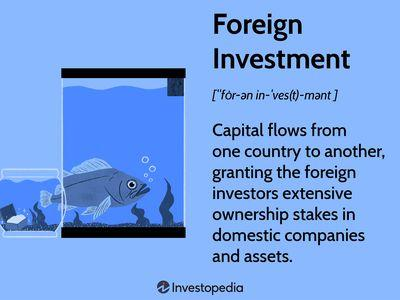

## Table of Contents

## What is Foreign Direct Investment (FDI)?

Foreign Direct Investment (FDI) is when a company or person from one country puts money into a business in another country. It's like when someone buys a part of a company or starts a new business in a different country. This helps the company grow and can help the country's economy too.

FDI is important because it can create jobs and bring new technology and skills to the country where the investment is made. It can also help companies reach new customers in different parts of the world. But, it can be risky because the rules and the economy in the other country might be different and harder to understand.

Overall, FDI is a way for businesses to expand and for countries to grow their economies. It involves both opportunities and challenges, but when done right, it can benefit everyone involved.

## What is Foreign Portfolio Investment (FPI)?

Foreign Portfolio Investment (FPI) is when people or companies from one country invest in the stocks, bonds, or other financial assets of another country. It's different from FDI because FPI doesn't involve taking control of a company or starting a new business. Instead, it's more like buying pieces of paper that represent ownership in a company or a loan to a government.

FPI can be a good way for investors to spread their money around and possibly make more money. It can also help the country receiving the investment by bringing in more money to its financial markets. But, FPI can be risky because the value of stocks and bonds can go up and down a lot. Also, investors can take their money out quickly, which can cause problems for the country's economy if a lot of people decide to leave at the same time.

## How do FDI and FPI differ from each other?

Foreign Direct Investment (FDI) and Foreign Portfolio Investment (FPI) are two ways that money can move from one country to another, but they are different in how they work. FDI happens when a company or person from one country buys a part of a company or starts a new business in another country. This means they have a say in how the business runs and they are in it for the long term. It's like planting a tree and taking care of it to grow big and strong.

On the other hand, FPI is when people or companies buy stocks, bonds, or other financial assets in another country. They don't get to control the company; they just own a piece of paper that says they own part of it. FPI is more like buying a ticket to a show – you hope it will be good and make you happy, but you can leave if you want to. This makes FPI easier to get into and out of, but it can also be riskier because the value of those pieces of paper can change a lot.

In summary, FDI is about long-term control and growth, while FPI is more about short-term gains and can be more easily moved around. Both can help countries and companies grow, but they come with different levels of commitment and risk.

## What are the main motivations for a company to engage in FDI?

Companies engage in FDI mainly to grow their business and reach new customers in different countries. When a company invests in another country, it can set up new factories or offices there. This helps the company sell its products or services to people in that country more easily. It's like opening a new store in a different city to reach more people. By doing this, the company can increase its sales and make more money.

Another big reason for FDI is to take advantage of lower costs in other countries. Sometimes, it's cheaper to make things in another country because the cost of labor or materials is lower there. For example, a company might build a factory in a country where workers are paid less, which can save the company a lot of money. This can make their products cheaper to produce and more competitive in the market. So, FDI can help a company save money and make their products more affordable for customers.

Lastly, FDI can also be about getting new technology or skills that are not available in the home country. When a company invests in a foreign country, it might learn new ways of doing things or use technology that is more advanced there. This can help the company improve its products or services. It's like going to a new school to learn something you can't learn at home. By doing this, the company can stay ahead of its competitors and keep growing.

## What are the typical instruments used in FPI?

The main instruments used in Foreign Portfolio Investment (FPI) are stocks, bonds, and mutual funds. Stocks are pieces of a company that people can buy. When someone buys a stock, they own a small part of that company. The value of the stock can go up or down depending on how well the company is doing. Bonds are like loans that people give to a government or a company. The government or company promises to pay back the money with interest over time. Mutual funds are a way for people to invest in a mix of stocks and bonds. They pool money from many investors and use it to buy a variety of assets, which can help spread the risk.

These instruments are popular because they are easy to buy and sell. People can invest in them without having to go to the other country. They can do it from their own home using a computer or a phone. This makes FPI a convenient way to invest in other countries. However, the value of these instruments can change a lot, which means they can be risky. If the stock market goes down, the value of stocks and mutual funds can drop quickly. If a government or company has trouble paying back its loans, the value of bonds can also fall. So, while FPI can be a good way to make money, it's important for investors to understand the risks involved.

## How do FDI and FPI impact the economy of the host country?

Foreign Direct Investment (FDI) can have a big impact on the economy of the host country. When a company from another country invests in a new factory or business there, it often creates new jobs for people in that country. This can help lower unemployment and give people more money to spend, which can make the whole economy grow. FDI can also bring new technology and skills to the host country. This can help local businesses learn new ways of doing things and make their products better. But, FDI can also have some downsides. If the foreign company takes too much control, it might hurt local businesses. Also, if the foreign company decides to leave, it can cause problems for the workers and the economy.

Foreign Portfolio Investment (FPI) also affects the host country's economy, but in different ways. When people from other countries buy stocks or bonds in the host country, it can bring a lot of money into the country's financial markets. This can help the country's businesses grow and make it easier for them to borrow money. FPI can also make the country's stock market more active and attract more investors. However, FPI can be risky because the money can leave the country quickly if investors decide to sell their stocks or bonds. This can cause the value of the country's currency to drop and make it harder for businesses to plan for the future. So, while FPI can help the economy grow, it can also make it more unstable.

## What are the risks associated with FDI and FPI for investors?

When investors put money into Foreign Direct Investment (FDI), they take on several risks. One big risk is that the political situation in the host country might change. If a new government comes in and doesn't like foreign companies, they might make new rules that make it hard for the investor to keep their business running. Another risk is that the economy of the host country might not do well. If people in that country stop buying things, the investor's business might lose money. Also, it can be hard to understand all the rules and customs in a different country, which can lead to mistakes and losses.

Foreign Portfolio Investment (FPI) also comes with its own set of risks for investors. The biggest risk is that the value of stocks and bonds can go up and down a lot. If the stock market in the host country crashes, the investor could lose a lot of money very quickly. Another risk is that investors might not know as much about the companies they are investing in because they are far away. This can make it hard to make good decisions. Also, if a lot of investors decide to take their money out of the country at the same time, it can cause the value of the country's currency to drop, which can make the investor's money worth less when they bring it back home.

## How do government policies influence FDI and FPI?

Government policies can have a big impact on Foreign Direct Investment (FDI). When a government makes rules that help foreign companies, like giving them tax breaks or making it easier to start a business, it can attract more FDI. For example, if a country offers lower taxes to foreign companies that build factories there, more companies might want to invest. But, if a government makes strict rules or puts up barriers, it can scare companies away. For instance, if a country doesn't let foreign companies own more than a certain percentage of a business, fewer companies might want to invest there. So, government policies can either encourage or discourage FDI depending on how friendly they are to foreign investors.

Government policies also play a big role in Foreign Portfolio Investment (FPI). When a government makes it easy for foreigners to buy stocks and bonds, like by having fewer restrictions or lower taxes on these investments, it can attract more FPI. For example, if a country allows foreign investors to easily buy and sell stocks without many rules, more people might want to invest there. However, if a government puts tight controls on the financial markets or makes it hard for foreigners to take their money out of the country, it can scare investors away. This can make the value of stocks and bonds go down because fewer people want to buy them. So, government policies can make a big difference in how much FPI a country gets.

## Can you explain the role of FDI and FPI in global financial stability?

Foreign Direct Investment (FDI) helps make the world's economy more stable by bringing money and new ideas to different countries. When companies invest in other countries, they often create jobs and help local businesses grow. This can make the economy stronger and less likely to have big problems. But, if a lot of FDI leaves a country quickly, it can cause trouble. So, while FDI can help keep things stable, it can also make things shaky if not managed well.

Foreign Portfolio Investment (FPI) also plays a big part in global financial stability. When people from different countries buy stocks and bonds in another country, it can bring a lot of money into that country's financial markets. This can help the economy grow and stay strong. But, FPI can be risky because investors can take their money out fast if they think something is going wrong. If a lot of investors do this at the same time, it can cause the value of the country's currency to drop and make the economy unstable. So, FPI can help keep the global economy stable, but it can also make it more unpredictable.

## What are some case studies that illustrate successful FDI and FPI?

One successful example of FDI is when Toyota, a car company from Japan, decided to build factories in the United States. They started making cars in places like Kentucky and Tennessee. This helped Toyota sell more cars in America because they could make them closer to where people were buying them. It also created a lot of jobs for people in those states. The local economy grew because people had more money to spend. Toyota learned how to make cars better by working with American workers and using new technology. This made Toyota a stronger company and helped the U.S. economy too.

Another good example of FPI is when many investors from around the world started buying stocks in Indian companies. This happened a lot in the early 2000s. The money from these investors helped Indian companies grow and build new things. It also made the Indian stock market more active and exciting. More people wanted to invest in India because they saw that the economy was doing well. This helped India's economy grow faster and become more stable. But, the investors had to be careful because the value of stocks can go up and down a lot.

## How do multinational corporations manage their FDI and FPI strategies?

Multinational corporations manage their FDI strategies by carefully choosing where to invest their money. They look for countries where they can make more money, like places with growing economies or lower costs to make things. They also think about the rules in those countries. If a country has good laws that help foreign companies, the corporation might decide to invest there. They might build new factories or buy parts of other companies. This helps them grow their business and reach new customers. But they also have to be ready for problems, like changes in the government or the economy, that could make their investment less successful.

For FPI, multinational corporations often use their money to buy stocks and bonds in other countries. They do this to spread their money around and maybe make more money. They look at which countries have strong financial markets and good chances for growth. They might also use experts to help them decide where to invest. This can help them make better choices and avoid big risks. But they know that the value of stocks and bonds can change a lot, so they have to be ready to move their money quickly if things go wrong. By managing both FDI and FPI well, these corporations can grow their business and make the most of their money.

## What advanced financial models are used to analyze the effectiveness of FDI and FPI?

To understand how well Foreign Direct Investment (FDI) is working, companies and researchers use something called the Cost-Benefit Analysis model. This model helps them see if the money they put into a new factory or business in another country is worth it. They look at all the costs, like building the factory and paying workers, and compare them to the benefits, like making more money from selling products in that country. They also think about other good things that might happen, like creating jobs and helping the local economy grow. By using this model, they can decide if the investment will help their company grow and make more money in the long run.

For Foreign Portfolio Investment (FPI), people often use the Capital Asset Pricing Model (CAPM) to see how well their investments are doing. This model helps them figure out if the stocks and bonds they bought in another country are a good choice. It looks at how much risk they are taking and how much money they might make. The model compares the return they get from their investment to what they could get from a safe investment, like a bank account. By using CAPM, investors can see if the extra risk of investing in another country's financial markets is worth it. This helps them make smarter choices about where to put their money.

## References & Further Reading

[1]: Lipsey, R. E., & Sjöholm, F. (2005). "The Impact of Inward FDI on Host Countries: Why Such Different Answers?" In T. H. Moran, E. M. Graham, & M. Blomström (Eds.), *Does Foreign Direct Investment Promote Development?* Washington, DC: Institute for International Economics.

[2]: Schmidt, T., & Zwick, L. (2013). ["Algorithmic Trading: Prospects and Challenges."](https://www.investopedia.com/terms/a/algorithmictrading.asp) *Journal of Asset Management, 14*(6), 402-422.

[3]: Lopez de Prado, M. (2018). ["Advances in Financial Machine Learning."](https://www.amazon.com/Advances-Financial-Machine-Learning-Marcos/dp/1119482089) Wiley.

[4]: Chan, E. P. (2013). ["Algorithmic Trading: Winning Strategies and Their Rationale."](https://github.com/ftvision/quant_trading_echan_book) Wiley.

[5]: Krugman, P. R., Obstfeld, M., & Melitz, M. J. (2018). *International Economics: Theory and Policy*. Pearson.

[6]: Sarno, L., & Taylor, M. P. (2002). "The Economics of Exchange Rates." *Cambridge University Press*.

[7]: Harvey, C. R., Liu, Y., & Zhu, H. (2016). ["...and the Cross-Section of Expected Returns."](https://academic.oup.com/rfs/article/29/1/5/1843824) *The Review of Financial Studies, 29*(1), 5-68.