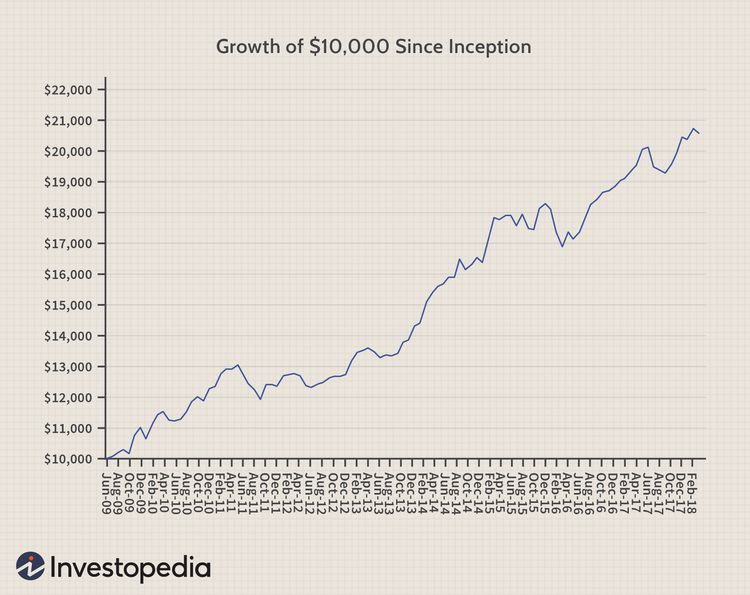

The increasing complexity of financial markets has led investors to seek innovative solutions for maximizing portfolio returns. Investors now operate in an environment characterized by rapid technological advancements, increased scrutiny from regulatory bodies, and an ever-expanding range of financial instruments. This complexity necessitates robust analytical tools and strategies to optimize investment outcomes. A prominent concept in financial analysis and algorithmic trading is the 'Growth of 10K', which serves as a key benchmark for measuring investment performance over time.

The 'Growth of 10K' refers to the hypothetical trajectory of a $10,000 initial investment in a particular asset or portfolio. By utilizing this benchmark, investors can visualize and compare the historical performance of various investments on a standardized scale. This approach aids in identifying potential high-performing assets and tailoring portfolio strategies accordingly. Notably, the visualization simplifies the complex web of data and trends into a more digestible form, allowing for clearer insights into performance metrics.



Furthermore, the 'Growth of 10K' interacts significantly with financial metrics such as growth rates, which are essential for refining investment strategies through algorithmic trading. Financial metrics like the Compound Annual Growth Rate (CAGR) provide a smoothed annual rate that indicates how an investment grows over a specified period. These metrics are foundational for algorithmic trading, enabling the testing and optimization of strategies within a defined risk framework. By understanding the implications of these metrics, investors can calibrate their trading algorithms to not only maximize returns but also effectively manage the inherent risks.

It is crucial for investors to understand both returns and risks, as these elements are intertwined in making informed investment decisions. Successful investment strategies seek a delicate balance between potential returns and the acceptable level of risk, ensuring resilient performance across varying market conditions. Advanced algorithmic trading strategies allow for continuous real-time assessment and adjustment based on evolving market data and financial metrics, providing a significant edge in a competitive landscape.

In conclusion, the 'Growth of 10K' is more than a mere visualization tool; it is a foundational element in financial analysis, helping investors measure and enhance performance within their portfolios. By integrating financial metrics and growth rates into their strategic frameworks, investors are better positioned to navigate the complexities of modern financial markets, optimizing both returns and risk management.

## Table of Contents

## Understanding Growth of 10K

The 'Growth of 10K' chart is an essential tool in financial analysis, providing a visual representation of how an initial investment of $10,000 evolves over a specified period. This chart is instrumental in assessing the performance of investments, as it illustrates the increase or decrease in the value of the investment based on historical market data. By simulating a consistent starting point, such as $10,000, this chart allows investors to easily compare the performance of different investments and strategies, providing clarity in understanding which options have historically yielded higher returns.

Typically, the timeframe for these charts ranges from several months to multiple decades. This flexibility enables investors to analyze short-term fluctuations as well as long-term trends. Through these timeframes, investors can make informed decisions by examining how various factors impact investment growth over different periods. For instance, a ten-year 'Growth of 10K' chart might highlight the impact of market cycles on the investment, while a shorter chart might focus on recent [volatility](/wiki/volatility-trading-strategies) and its effects.

A critical aspect of the 'Growth of 10K' chart is its treatment of reinvested dividends and capital gains. Reinvesting dividends and capital gains can significantly enhance the growth rate of an investment, as these amounts contribute to the compounding returns over time. By reinvesting these earnings, the investor can take advantage of the power of compound interest, potentially leading to exponential growth. The formula for compound growth can be illustrated as:

$$

\text{Future Value} = P \times (1 + r)^n 
$$

where $P$ is the principal amount ($10,000 in this context), $r$ is the growth rate, and $n$ is the number of compounding periods.

However, it is important to note that the 'Growth of 10K' chart often excludes management fees. Management fees can erode investment returns, so investors should consider these costs when evaluating net performance. By separating fees from the chart, the focus remains on the pure growth of the investment, offering a clearer comparison among various asset classes or funds without the distortion of fee structures.

The 'Growth of 10K' chart serves as a powerful comparative tool in financial analysis, granting investors a straightforward method to visualize potential returns and the impact of reinvested earnings, while reminding them to remain aware of the implications of additional costs like management fees in real-world scenarios.

## Financial Metrics in Algorithmic Trading

Financial metrics are essential tools in [algorithmic trading](/wiki/algorithmic-trading), providing quantitative measures to evaluate and optimize trading strategies. Key metrics such as the Compound Annual Growth Rate (CAGR), Sharpe Ratio, and Sortino Ratio are widely used for assessing investment performance and associated risks.

### Compound Annual Growth Rate (CAGR)
CAGR represents the mean annual growth rate of an investment over a specified time period longer than one year. It assumes that profits are reinvested at the end of each period, thus smoothing the annualized gains or losses over time.

The formula for CAGR is:
$$

\text{CAGR} = \left( \frac{V_f}{V_i} \right)^{\frac{1}{n}} - 1 
$$
where $V_f$ is the final value, $V_i$ is the initial value, and $n$ is the number of years.

CAGR is highly useful for comparing the growth of investments with varying periods, offering a clearer perspective on which investment yields more over time, irrespective of interim volatility.

### Sharpe Ratio
The Sharpe Ratio measures the performance of an investment compared to a risk-free asset, adjusted for its risk. The greater the Sharpe Ratio, the better its risk-adjusted performance.

The formula for Sharpe Ratio is:
$$

\text{Sharpe Ratio} = \frac{E[R] - R_f}{\sigma} 
$$
where $E[R]$ is the expected return of the portfolio, $R_f$ is the risk-free rate, and $\sigma$ is the standard deviation of the portfolio’s excess return.

This ratio helps traders understand how much excess return they might receive for the additional unit of risk undertaken. It is instrumental in portfolio management and strategy formulation, as it guides adjustments to improve risk-adjusted returns.

### Sortino Ratio
The Sortino Ratio is a variation of the Sharpe Ratio that differentiates harmful volatility from total volatility by using downside deviation instead of standard deviation. It provides a more accurate view of downside risk by focusing only on negative returns.

The formula for Sortino Ratio is:
$$

\text{Sortino Ratio} = \frac{E[R] - R_f}{\sigma_D} 
$$
where $\sigma_D$ is the standard deviation of negative asset returns.

The Sortino Ratio is particularly beneficial when assessing portfolios or strategies with non-normal distributions or when the focus is against downside performance rather than overall volatility.

### Significance in Algorithmic Trading
These financial metrics are integral in algorithmic trading for evaluating the efficacy and risk profile of trading strategies. By computing and analyzing these metrics, traders can:
- Identify the risk-adjusted returns of different strategies.
- Optimize portfolio allocations and asset selections.
- Enhance strategy robustness by factoring in risk measures.

### Calculations and Implications
The calculation of these metrics helps traders develop a comprehensive understanding of their trading strategies’ historical performance:
- **CAGR** provides insight into growth trends and the long-term viability of strategies.
- **Sharpe Ratio** enables identification of strategies offering better returns per unit risk.
- **Sortino Ratio** aids in focusing on minimizing downside exposure.

Python can be used to automate these calculations. For example:

```python
import numpy as np

def calculate_cagr(initial_value, final_value, years):
    return (final_value / initial_value)**(1/years) - 1

def calculate_sharpe_ratio(returns, risk_free_rate):
    excess_returns = returns - risk_free_rate
    return np.mean(excess_returns) / np.std(excess_returns)

def calculate_sortino_ratio(returns, risk_free_rate):
    downside_returns = [r - risk_free_rate for r in returns if r < risk_free_rate]
    downside_deviation = np.std(downside_returns, ddof=1)
    return np.mean(returns - risk_free_rate) / downside_deviation
```

These metrics help assess both the return potential and risk exposure of trading strategies, underscoring the importance of understanding quantitative measures in building and refining trading algorithms. Through these assessments, traders can make informed decisions, driving their strategic development for better alignment with their investment goals and risk tolerance levels.

## Growth Rates and Their Applications

Growth rates are fundamental indicators in financial analysis, reflecting the rate at which an investment or a portfolio value increases over a specified period. They are vital for evaluating past performance and predicting future potential. Understanding growth rates helps investors determine the efficiency of their investment strategies and make informed decisions about future allocations.

The Compound Annual Growth Rate (CAGR) is a specific growth rate that provides a smoothed annual rate of return on an investment over a specified timeframe. It is favored for its ability to account for volatility and compounding, offering a clearer picture of true performance as opposed to simple arithmetic averages. CAGR is calculated using the formula:

$$
CAGR = \left( \frac{V_f}{V_i} \right)^{\frac{1}{n}} - 1
$$

where $V_f$ represents the final value, $V_i$ is the initial value, and $n$ denotes the number of years. This measure is particularly useful when comparing the growth rates of different investments or assessing performance against a benchmark.

Growth rates can aid in forecasting potential investment returns by extrapolating past performance into the future, while also facilitating risk management. Investors use growth rate trends to anticipate market movements and tweak their portfolios to cushion against downturns while capitalizing on uptrends. Additionally, growth rates can help stress-test portfolios against hypothetical scenarios, thereby evaluating resilience to various market conditions.

Automating growth rate calculations enhances accuracy and efficiency, reducing the risk of manual calculation errors. Basic computational tools and software, such as spreadsheet applications and programming languages like Python, can streamline these processes. For instance, Python’s NumPy library can be used to calculate CAGR:

```python
import numpy as np

def calculate_cagr(initial_value, final_value, years):
    return (final_value / initial_value) ** (1 / years) - 1

# Example usage
initial_investment = 10000
final_investment = 20000
years = 5

cagr = calculate_cagr(initial_investment, final_investment, years)
print(f"CAGR: {cagr:.2%}")
```

This code snippet provides a straightforward implementation for calculating the CAGR, demonstrating how programming tools can facilitate financial analysis and decision-making. By leveraging computational tools, investors can automate repetitive tasks, allowing for more sophisticated strategy development and portfolio management.

## Integrating Financial Metrics into Algo Trading Strategies

Financial metrics play an essential role in refining algorithmic trading strategies, serving as the backbone for evaluating the viability and effectiveness of trading systems. Applying metrics like win rates, average trade returns, and maximum drawdowns enables traders to quantitatively assess the potential success and resilience of their strategies. These analyses guide the systematic improvement and optimization of trading algorithms.

Backtesting forms the cornerstone of integrating financial metrics into algorithmic trading. This process involves simulating a trading strategy using historical data to evaluate its performance. Key metrics such as win rates, average trade returns, and maximum drawdowns are crucial in this context. The win rate is the ratio of profitable trades to the total number of trades, offering insights into the probability of success. Average trade returns provide a measure of profitability per trade, while maximum drawdown indicates the largest loss relative to the peak portfolio value, shedding light on the risk involved.

Python, with its rich ecosystem of libraries, is a powerful tool for conducting backtests and evaluating trading strategies. Libraries such as pandas, NumPy, and Matplotlib are useful for data manipulation and visualization. More specialized libraries like Backtrader and PyAlgoTrade offer comprehensive frameworks for [backtesting](/wiki/backtesting).

A basic structure for a backtest script using Python and Backtrader might look like this:

```python
import backtrader as bt

class MyStrategy(bt.Strategy):
    def __init__(self):
        self.sma = bt.indicators.SimpleMovingAverage(self.data.close, period=15)

    def next(self):
        if self.data.close > self.sma:
            self.buy()
        elif self.data.close < self.sma:
            self.sell()

cerebro = bt.Cerebro()
cerebro.addstrategy(MyStrategy)
cerebro.adddata(bt.feeds.YahooFinanceData(dataname='AAPL', fromdate=datetime(2020, 1, 1),
                                          todate=datetime(2021, 1, 1)))
cerebro.broker.setcash(10000.0)
cerebro.run()
cerebro.plot()
```

This script demonstrates the application of a simple moving average strategy, providing a visual and quantitative basis for further strategy refinement.

Incorporating metrics such as the Sharpe Ratio and the Sortino Ratio can significantly enhance the robustness and adaptability of trading algorithms. The Sharpe Ratio measures the excess return per unit of risk, while the Sortino Ratio considers only downside risk, offering a more targeted risk assessment.

For instance, consider a trading algorithm with an annual return \$R \$ and an annual volatility (standard deviation of returns) \$\sigma \$. The Sharpe Ratio \$S \$ is calculated as:

$$
S = \frac{R - R_f}{\sigma}
$$

where \$R_f \$ is the risk-free rate. This metric aids in optimizing portfolios by maximizing the ratio of expected return to risk.

In summary, financial metrics are indispensable for refining algorithmic trading strategies. They provide traders with a structured approach to assess, modify, and optimize their strategies through rigorous backtesting and strategic evaluation. The use of Python and its libraries enhances the ability to conduct comprehensive analysis, making it a preferred choice for algorithmic traders keen on achieving superior market performance.

## Benefits and Limitations of Metrics in Algo Trading

Quantitative metrics are instrumental in the systematic evaluation of trading strategies, offering a numerical basis for assessing performance. They empower traders with objective data to make informed decisions, facilitating process automation and enabling the comparison of various strategies. Metrics such as the Compound Annual Growth Rate (CAGR), Sharpe Ratio, and Sortino Ratio provide insights into returns and risks, aiding in optimizing trading algorithms for maximum efficiency and effectiveness.

Despite their advantages, quantitative metrics have limitations. One notable issue is interim volatility, which can obscure true strategy performance by focusing excessively on short-term fluctuations. While metrics provide valuable numerical insights, they often fail to capture qualitative factors like economic events or regulatory changes, which can significantly impact market behavior. Hence, solely relying on quantitative analysis could lead to an incomplete understanding of the market dynamics.

Balancing quantitative and qualitative analysis is critical in crafting robust trading strategies. While metrics quantify performance, qualitative insights add context, enabling traders to consider broader market influences and investor sentiment. For instance, a high Sharpe Ratio might indicate strong risk-adjusted returns, but without qualitative insights on market trends or geopolitical factors, traders might overlook potential strategy vulnerabilities.

Overfitting is another challenge in algorithmic trading, where a model performs well on historical data but fails with real-world scenarios. Managing overfitting involves techniques like cross-validation, where the data is split into training and testing sets to ensure the strategy generalizes well. Additionally, employing Python libraries such as `statsmodels` or `scikit-learn` can aid in implementing regularization techniques, which prevent models from becoming too complex.

Here is a basic example in Python that demonstrates how to use cross-validation to evaluate a trading strategy:

```python
import numpy as np
from sklearn.model_selection import TimeSeriesSplit
from sklearn.linear_model import LinearRegression

# Sample data: hypothetical market features and returns
X = np.random.rand(100, 5)  # 100 samples with 5 features each
y = np.random.rand(100)  # 100 corresponding returns

# Initialize the time series cross-validator
tscv = TimeSeriesSplit(n_splits=5)

# Example trading strategy evaluation using cross-validation
model = LinearRegression()
for train_index, test_index in tscv.split(X):
    X_train, X_test = X[train_index], X[test_index]
    y_train, y_test = y[train_index], y[test_index]

    model.fit(X_train, y_train)
    performance_score = model.score(X_test, y_test)
    print(f"Performance Score: {performance_score:.4f}")
```

By integrating both quantitative metrics and qualitative insights, traders can construct more resilient and adaptable strategies. This comprehensive approach ensures strategies are not only statistically sound but also contextually informed, enhancing their applicability and success in dynamic market conditions.

## Conclusion

Financial metrics and growth rates play a pivotal role in enhancing investment strategies through algorithmic trading. These metrics allow traders to evaluate, optimize, and efficiently manage their trading strategies, providing quantitative insights into both performance and risk. For instance, the Compound Annual Growth Rate (CAGR) offers a streamlined view of an investment's annual return over time, smoothing out the volatility associated with daily price movements. By integrating metrics like the Sharpe Ratio, traders can adjust for risk, ensuring that strategies are aligned with their risk tolerance and financial goals.

Continuous assessment and realignment of strategies are necessary as financial metrics evolve with market conditions. This dynamic adjustment is crucial for traders seeking to maintain a competitive edge and achieve consistent returns over time. Tools and technologies, particularly algorithmic trading platforms, facilitate this ongoing evaluation, offering automated ways to react to market changes swiftly.

In today's dynamic market conditions, traders are presented with significant opportunities to refine risk management strategies and maximize returns. With the aid of sophisticated data analysis tools and financial metrics, traders can pinpoint emerging market trends, swiftly adapt strategies to changing economic indicators, and identify potential risks before they manifest significantly. This analytical foresight enables enhanced decision-making processes that can capture more favorable return opportunities.

Importantly, while quantitative analysis serves as the backbone of algorithmic trading, incorporating qualitative insights remains essential for robust strategy development. Factors such as macroeconomic indicators, geopolitical events, and psychological market sentiment play crucial roles in influencing market dynamics, often beyond what numerical data alone can predict. Therefore, integrating these qualitative elements with quantitative metrics fosters a more holistic and resilient approach to trading.

In conclusion, financial metrics and growth rates are essential components in the refinement of algorithmic trading strategies, offering a structured pathway to optimize both risk management and potential returns. A comprehensive approach that harmonizes quantitative metrics with qualitative analysis will enable traders to make informed decisions and sustain competitive advantage in the face of ever-evolving market trends.

## References & Further Reading

[1]: Bergstra, J., Bardenet, R., Bengio, Y., & Kégl, B. (2011). ["Algorithms for Hyper-Parameter Optimization."](https://dl.acm.org/doi/10.5555/2986459.2986743) Advances in Neural Information Processing Systems 24.

[2]: ["Advances in Financial Machine Learning"](https://www.amazon.com/Advances-Financial-Machine-Learning-Marcos/dp/1119482089) by Marcos Lopez de Prado

[3]: ["Evidence-Based Technical Analysis: Applying the Scientific Method and Statistical Inference to Trading Signals"](https://www.amazon.com/Evidence-Based-Technical-Analysis-Scientific-Statistical/dp/0470008741) by David Aronson

[4]: ["Machine Learning for Algorithmic Trading"](https://github.com/stefan-jansen/machine-learning-for-trading) by Stefan Jansen

[5]: ["Quantitative Trading: How to Build Your Own Algorithmic Trading Business"](https://www.amazon.com/Quantitative-Trading-Build-Algorithmic-Business/dp/1119800064) by Ernest P. Chan