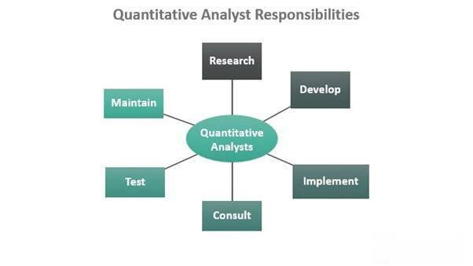

## Table of Contents

## What is a quantitative analyst and what do they do?

A quantitative analyst, often called a "quant," is a person who uses math and computer skills to help make decisions in finance. They work in banks, investment firms, and other financial places. Their main job is to create models and strategies that can predict how markets will move or how investments will perform. This helps their companies make smarter choices about where to put money.

Quants use a lot of data and complex math to build their models. They might look at past market trends, economic reports, and other information to find patterns. Once they have a model, they test it to see if it works well. If it does, they use it to suggest what to buy or sell. This can be for things like stocks, bonds, or even more complicated financial products. Their work is important because it helps reduce risk and can lead to better returns on investments.

## What educational background is required to become a quantitative analyst?

To become a quantitative analyst, you usually need a strong background in math, statistics, and computer science. Most quants have at least a bachelor's degree in one of these fields. Some even have advanced degrees like a master's or a Ph.D. These higher degrees can give you a deeper understanding of complex topics and make you more competitive in the job market.

Besides the technical skills, it's helpful to have some knowledge of finance and economics. You don't always need a degree in these subjects, but taking some classes can be useful. Many people start with a technical degree and then learn about finance on the job or through additional courses. This mix of skills helps quants build models that work well in the real world of finance.

## What are the key skills needed for a career in quantitative analysis?

To be a good quantitative analyst, you need to be really good at math and [statistics](/wiki/bayesian-statistics). These are the core skills that help you build models and make predictions. You also need to know how to use computers well, especially programming languages like Python or R. These tools help you handle big sets of data and test your models. Being able to think logically and solve problems is also very important because you'll often need to figure out new ways to approach financial problems.

Besides the technical stuff, you should also know a bit about finance and economics. This helps you understand the markets and what your models are trying to predict. Good communication skills are important too, because you'll need to explain your findings to people who might not understand the math. Being able to work in a team is also key, as many projects in finance involve working with others to reach a common goal.

## How can someone start preparing for a career as a quantitative analyst?

To start preparing for a career as a quantitative analyst, you should focus on building a strong foundation in math and statistics. This means taking as many classes as you can in these subjects during your high school and college years. A degree in math, statistics, or a related field like computer science is a good starting point. You'll also want to learn how to program, especially in languages like Python or R, which are commonly used in the field. There are many online courses and resources that can help you learn these skills if you don't have access to them through school.

Once you have the basics down, it's a good idea to start learning about finance and economics. You don't need a degree in these subjects, but taking some classes or reading [books](/wiki/algo-trading-books) can give you a better understanding of the markets you'll be working with. It's also helpful to get some practical experience. This could be through internships, working on personal projects, or even participating in competitions like those held by universities or financial firms. These experiences will not only build your skills but also make your resume stand out to potential employers.

## What are the typical job responsibilities of a quantitative analyst?

A quantitative analyst, or quant, has the job of using math and computers to help make choices in finance. They work in places like banks and investment firms. Their main job is to create models that can predict how markets will move or how investments will perform. They use a lot of data and complex math to build these models. Once they have a model, they test it to see if it works well. If it does, they use it to suggest what to buy or sell. This can be for things like stocks, bonds, or even more complicated financial products.

Besides building models, quants also need to keep an eye on how well their models are doing. They update their models with new data and make changes if needed. They also work with other teams, like traders and risk managers, to make sure everyone understands the models and how to use them. Good communication is important because quants need to explain their findings to people who might not understand the math. Their work helps reduce risk and can lead to better returns on investments.

## What industries employ quantitative analysts and what roles do they play?

Quantitative analysts, or quants, work in many different industries, but they are most common in finance. Banks, investment firms, and hedge funds hire quants to help them make smart choices about where to put their money. These companies use the models that quants create to predict how markets will move and to decide what to buy or sell. This can be for things like stocks, bonds, or more complex financial products. Quants help these companies reduce risk and aim for better returns on their investments.

Quants also work in other industries like insurance and technology. In insurance, they help companies figure out how much to charge for policies and how much risk they are taking on. They use data and math to make these decisions. In technology, quants might work on developing algorithms for trading platforms or analyzing big data to find patterns that can be used to make better business decisions. No matter where they work, the main job of a quant is to use math and computers to solve problems and make predictions.

## How important is programming for quantitative analysts and which languages should one learn?

Programming is very important for quantitative analysts. It helps them handle big sets of data and build models that can predict how markets will move. Without good programming skills, it would be hard for quants to do their job well. They use programming to write code that can do math quickly and test their models to see if they work.

The most common programming languages for quants are Python and R. Python is popular because it's easy to learn and can do a lot of different things. It's good for working with data and building models. R is also used a lot, especially for statistics. It has many tools that help quants analyze data and make predictions. Learning both Python and R can make you a better quant because they each have their own strengths.

## What are some common tools and software used by quantitative analysts?

Quantitative analysts use many tools and software to do their job. One of the most common tools is Python, a programming language that's easy to learn and can handle big sets of data. Quants use Python to build models and test them to see if they work well. Another popular tool is R, which is also a programming language but is used a lot for statistics. R has many tools that help quants analyze data and make predictions. Both Python and R are important because they help quants do their math quickly and accurately.

Besides programming languages, quants also use other software. One example is MATLAB, which is good for doing math and building models. It's often used in finance to help quants solve complex problems. Another tool is Bloomberg Terminal, which gives quants a lot of financial data and news. This helps them keep up with what's happening in the markets and make better predictions. Excel is also used a lot because it's easy to use and can handle data well. These tools all help quants do their job better and make smarter choices in finance.

## How can one gain practical experience in quantitative analysis?

One way to gain practical experience in quantitative analysis is by doing internships. Many banks, investment firms, and other financial companies offer internships for students and recent graduates. During an internship, you can work on real projects, build models, and learn from experienced quants. This hands-on experience is very valuable because it helps you understand how to apply what you've learned in school to real-world problems. It also looks good on your resume and can help you get a job after you finish your studies.

Another way to get practical experience is by working on personal projects. You can use data from public sources to build your own models and test them. This could be something like predicting stock prices or analyzing economic trends. There are also competitions, like those held by universities or financial firms, where you can test your skills against others. These projects and competitions not only help you practice your skills but also show potential employers that you're serious about becoming a quant.

## What advanced mathematical concepts are crucial for expert quantitative analysts?

Expert quantitative analysts need to know a lot about advanced math to do their job well. One important concept is calculus, which helps them understand how things change over time. This is useful for predicting how markets will move or how investments will perform. Another key area is linear algebra, which is all about working with many numbers at once. This helps quants build models that can handle big sets of data. They also need to know about probability and statistics, which help them figure out how likely different outcomes are and how to make sense of the data they have.

In addition to these, quants often use more specialized math like stochastic processes. This is a way of modeling things that change randomly over time, which is common in finance. They also need to understand numerical methods, which are ways of solving math problems on a computer. These methods help quants make their models work faster and more accurately. Knowing these advanced math concepts helps quants build better models and make smarter choices in finance.

## How do quantitative analysts use data to make decisions and what methodologies do they employ?

Quantitative analysts, or quants, use data to make decisions by looking at a lot of numbers and finding patterns. They collect data from places like stock markets, economic reports, and other sources. Then, they use this data to build models that can predict how markets will move or how investments will perform. These models help quants figure out what to buy or sell. For example, if a model shows that a certain stock is likely to go up in price, a quant might suggest buying that stock.

Quants use different methods to build their models. One common method is called statistical analysis, where they use math to understand the data and make predictions. They might use something called regression analysis to see how different factors affect stock prices. Another method is [machine learning](/wiki/machine-learning), where computers learn from the data to make better predictions over time. Quants also use something called [backtesting](/wiki/backtesting), where they test their models on old data to see if they would have worked well in the past. These methods help quants make smarter choices and reduce risk in their investments.

## What are the career progression opportunities for a quantitative analyst and how can one advance to expert level?

As a quantitative analyst, you can move up in your career by taking on more responsibility and learning new skills. You might start as a junior quant, working on small parts of bigger projects. As you get better at your job, you could become a senior quant, leading your own projects and working with other teams. Some quants even become managers, where they lead a whole team of quants and help make big decisions for the company. To move up, it's important to keep learning and to show that you can handle more complex work.

To become an expert quant, you need to keep studying and working on hard projects. This might mean getting a higher degree like a master's or a Ph.D. in math, statistics, or finance. You should also learn about new methods and tools that other quants are using. Joining professional groups and going to conferences can help you stay up-to-date. As you work on more projects and solve harder problems, you'll become known as an expert in your field. This can lead to better job opportunities and the chance to work on the most important projects in your company.

## References & Further Reading

[1]: Bergstra, J., Bardenet, R., Bengio, Y., & Kégl, B. (2011). ["Algorithms for Hyper-Parameter Optimization."](https://papers.nips.cc/paper/4443-algorithms-for-hyper-parameter-optimization) Advances in Neural Information Processing Systems 24.

[2]: ["Advances in Financial Machine Learning"](https://www.amazon.com/Advances-Financial-Machine-Learning-Marcos/dp/1119482089) by Marcos Lopez de Prado

[3]: ["Evidence-Based Technical Analysis: Applying the Scientific Method and Statistical Inference to Trading Signals"](https://www.amazon.com/Evidence-Based-Technical-Analysis-Scientific-Statistical/dp/0470008741) by David Aronson

[4]: ["Machine Learning for Algorithmic Trading"](https://github.com/stefan-jansen/machine-learning-for-trading) by Stefan Jansen

[5]: ["Quantitative Trading: How to Build Your Own Algorithmic Trading Business"](https://books.google.com/books/about/Quantitative_Trading.html?id=j70yEAAAQBAJ) by Ernest P. Chan