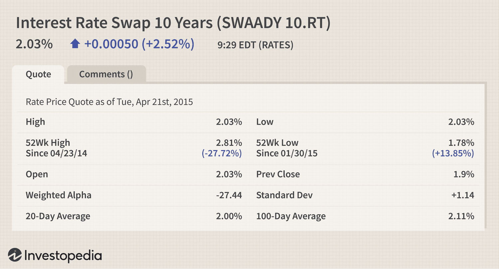

Interest rate swaps are key instruments in the financial markets, serving as vital tools for managing interest rate risks. These swaps enable the exchange of fixed-rate payments for floating-rate payments between parties, facilitating effective management of interest rate exposure. By utilizing interest rate swaps, financial entities can stabilize cash flows and hedge against adverse movements in interest rates.

The fundamental mechanism of interest rate swaps involves two counterparties who agree to exchange a series of interest payments based on a notional principal amount. One party pays a fixed interest rate, while the other pays a floating rate, usually indexed to a benchmark such as the London Interbank Offered Rate (LIBOR) or the Secured Overnight Financing Rate (SOFR). This exchange allows parties to adapt to varying interest rate environments, effectively aligning their financial obligations with their economic goals.



In understanding the significance of interest rate swaps, it is crucial to explore how these instruments reflect market perceptions of future interest rate movements. Swap quotes, which present the fixed and floating rates involved in the swap, offer insights into market expectations and serve as vital indicators for investment decisions.

Moreover, interest rate swaps are increasingly integrated into algorithmic trading strategies. Algorithmic trading, through the use of complex algorithms and technology, enhances the efficiency and precision of swap transactions. This integration allows for better hedging of interest rate risks and the potential to exploit opportunities in volatile markets. As such, interest rate swaps not only aid in risk management but also play a strategic role in optimizing financial performance.

In conclusion, understanding interest rate swaps and their application in modern financial strategies, including their incorporation into algorithmic trading, is essential for stakeholders seeking to navigate the complexities of today's financial environment. Future sections will further elaborate on the interpretation of swap quotes, the benefits of electronically executed swaps, and how algorithmic innovations continue to refine these vital financial instruments.

## Table of Contents

## Understanding Interest Rate Swaps

Interest rate swaps (IRS) are financial derivatives that involve two parties agreeing to exchange streams of interest payments over a set period, based on a notional principal amount. The fundamental structure of an interest rate swap typically involves one party paying interest at a fixed rate, while the other pays a floating rate, which is usually tied to a reference rate such as the London Interbank Offered Rate (LIBOR) or the Secured Overnight Financing Rate (SOFR). Despite the exchange of cash flows, the notional principal amount itself does not change hands.

The primary purpose of [interest rate](/wiki/interest-rate-trading-strategies) swaps is to manage the exposure to fluctuations in interest rates. Businesses and financial institutions utilize these swaps to hedge against interest rate risk. For instance, a company with a floating-rate loan may enter into an interest rate swap to convert its variable rate exposure to a fixed rate, thereby stabilizing its interest expenses and forecasting future cash flows more accurately.

The mechanics of interest rate swaps involve the periodic exchange of cash flows based on the respective fixed and floating rates. The fixed-rate payer agrees to pay a set interest rate, which remains constant throughout the contract term, while the floating-rate payer's obligations will vary in line with the movements of the reference rate. The predetermined schedule includes the timing of these payments, often aligning with the payment intervals of the underlying obligations such as quarterly, semi-annually, or annually.

The mathematical representation of an interest rate swap involves calculating the present value of these cash flows. The net cash flow exchanged between the parties each period is determined by the difference between the amounts due. The formula typically used for calculating the cash flow from the floating rate leg in a basic plain-vanilla swap is:

$$
\text{Floating Rate Payment} = \text{Notional Principal} \times \left( \text{Floating Rate at Payment Date} \right) \times \frac{\text{Days in Period}}{360}
$$

Here, the "Days in Period" corresponds to the actual number of days in the interest period, and the denominator 360 is commonly used in financial markets depending on the standard convention followed.

The counterparties in such swaps are often banks, corporations, and institutional investors seeking to optimize their interest rate exposures. These instruments play an essential role in corporate finance, allowing entities to align their debt profiles with internal financial strategies, thereby fostering more secure and predictable financial management.

## How to Read Interest Rate Swap Quotes

Interest rate swap quotes are a reflection of the market's expectations regarding future interest rates. They provide crucial information about the fixed and floating rates that can be exchanged through a swap agreement. Understanding these quotes is essential for investors and financial professionals who need to make informed decisions about managing interest rate risk.

The core components of an interest rate swap quote include the bid and ask prices, which represent the rates at which a swap can be entered into from the perspective of the market maker. The bid price is the rate the market maker is willing to pay to receive the fixed rate and thus corresponds to the floating leg of the swap. Conversely, the ask price is the rate at which the market maker is willing to pay to provide the fixed rate, reflecting the fixed leg of the swap.

These quotes often also involve the interpretation of the spread, which is the difference between the bid and ask prices. This spread is a reflection of market sentiment and indicates the [liquidity](/wiki/liquidity-risk-premium) and demand for interest rate swaps at that time. A narrow spread typically suggests high liquidity and an active market, whereas a wider spread might indicate lower liquidity or higher uncertainty about future interest rates.

When looking at percentage changes in swap quotes, especially in a dynamic market, these reflect the alterations in market expectations regarding future interest rates. An increase in the swap quote might suggest the market anticipates rising interest rates, prompting higher demand for fixed-rate payments. Conversely, a decrease could indicate expectations of falling rates, increasing the attractiveness of floating-rate payments.

Comprehending these metrics allows investors to better anticipate market movements and hedge against potential adverse interest rate fluctuations. For instance, when an investor expects interest rates to rise, they may enter into a swap favouring a fixed rate to lock in current conditions, thereby shielding themselves from future rate increases.

In summary, correctly reading and interpreting interest rate swap quotes requires an understanding of bid and ask prices, spreads, and the implications of percentage changes. Mastery of these concepts empowers investors to make strategic decisions to safeguard and optimize their financial positions in response to evolving market conditions.

## The Role of Interest Rate Swaps in Algo Trading

Algorithmic trading, commonly referred to as algo trading, involves using computer programs to execute trades at high speed and efficiency. When integrated with interest rate swaps, this form of trading significantly optimizes transaction processes by automating the exchange of fixed and floating rate cash flows based on pre-set computational models.

Interest rate swaps, by nature, are prone to fluctuations as they respond to changes in the underlying interest rates. Algo trading helps mitigate the risks associated with these fluctuations through rapid execution and precision, ensuring the timely adjustment of positions in response to market changes. The automation of swap transactions helps manage large volumes of trades efficiently, reducing human error and minimizing transaction costs.

Incorporating interest rate swaps into algo trading strategies involves algorithms that analyze and predict market trends to optimize decision-making processes. These algorithms often employ historical data and advanced statistical methods to forecast movements in interest rates. For example, a basic algorithm might utilize the following Python code to determine the best time to execute a swap based on predicted rate changes:

```python
import numpy as np
from sklearn.linear_model import LinearRegression

# Sample historical interest rates
historical_rates = np.array([1.5, 1.7, 1.8, 1.9, 2.0]).reshape(-1, 1)
future_periods = np.array([6, 12, 18, 24, 30]).reshape(-1, 1)

# Predict future swap rates using linear regression
model = LinearRegression()
model.fit(future_periods, historical_rates)
predicted_rates = model.predict(future_periods)

print("Predicted Future Interest Rates:", predicted_rates)
```

This basic predictive model can be expanded with more complex [machine learning](/wiki/machine-learning) algorithms to process large datasets, incorporating factors such as economic indicators and geopolitical events to refine predictions further. The ability to leverage sophisticated algorithms in analyzing market data enhances the strategic positioning of traders to exploit [arbitrage](/wiki/arbitrage) opportunities and safeguard against adverse rate movements.

By swiftly adjusting positions as the market shifts, algo trading strategies in interest rate swaps can effectively hedge against interest rate risks. The optimization of hedging strategies allows financial entities to protect their portfolios from the adverse impacts of rate [volatility](/wiki/volatility-trading-strategies), ultimately contributing to more stable financial outcomes.

Additionally, in volatile market conditions, [algorithmic trading](/wiki/algorithmic-trading) of interest rate swaps provides the agility needed to capitalize on fleeting opportunities, thereby enhancing potential profit margins. The rapid processing capability of these algorithms ensures that trades are executed at the most opportune moments, maximizing the effectiveness of swap transactions in dynamic markets. 

Overall, the synergy between algorithmic trading and interest rate swaps represents a significant evolution in financial strategies, offering a robust mechanism for managing interest rate risks and capitalizing on market opportunities.

## Real-World Applications of Interest Rate Swaps

Interest rate swaps play a pivotal role in the financial management strategies of major corporations and financial institutions. One illustrative example is PepsiCo, which regularly utilizes interest rate swaps to stabilize its financial outcomes amid fluctuating interest rates. By employing these derivative instruments, PepsiCo can manage its exposure to variable interest rates, effectively converting variable rate liabilities into fixed-rate liabilities. This allows PepsiCo to achieve more predictable interest expenses, facilitating better financial forecasting and budgeting.

For financial institutions, interest rate swaps are indispensable in managing loan portfolios and optimizing capital costs. Banks and other lending institutions often have a mismatch between the interest they pay on deposits and the interest they earn on loans. By entering into interest rate swaps, these institutions can align their interest rate exposure with their financial strategies. For instance, if a bank primarily issues fixed-rate loans but borrows at variable rates, it can use an interest rate swap to exchange the variable interest payments for fixed payments, thereby stabilizing its net interest margin.

Interest rate swaps also enable financial institutions to enhance liquidity management and capital efficiency. By altering the cash flow structure without affecting the principal amount, swaps facilitate better alignment of assets and liabilities, which can be crucial in maintaining regulatory capital requirements. These instruments are often employed as part of a broader asset-liability management strategy, ensuring that financial institutions can maintain profitability and solvency even in adverse interest rate environments.

Moreover, large corporations and financial institutions frequently leverage the flexibility of interest rate swaps to pursue strategic financial goals. For example, by entering into a series of swaps with different maturities or currencies, companies can tailor their interest rate exposure to their specific needs, taking advantage of favorable market conditions or hedging against expected changes in interest rates. This capability allows for the optimization of financial performance, reduced cost of debt, and enhanced shareholder value.

In summary, interest rate swaps are a crucial tool for managing interest rate risk and optimizing financial strategies. They provide major corporations and financial institutions with the flexibility to adjust their interest rate exposure, stabilize financial performance, and meet their strategic financial objectives.

## Algo Trading Innovations and Interest Rate Swaps

Recent technological advancements have significantly reshaped algorithmic trading, particularly its application in managing interest rate swaps. Machine learning techniques play a prominent role in predicting interest rate trends, which is crucial for optimizing swap trading strategies. By analyzing vast datasets of historical and real-time interest rate information, machine learning models can identify patterns and forecast future movements with high accuracy. These predictions help traders and financial institutions make more informed decisions when engaging in interest rate swaps, ultimately enhancing profitability and risk management.

One such innovative algorithmic technique involves the use of supervised learning models like decision trees, random forests, and neural networks to predict interest rate fluctuations. These models learn from data features such as economic indicators, historical swap rates, and macroeconomic variables. For instance, consider using a [neural network](/wiki/neural-network) to forecast future interest rate movements. This model would require training on historical data sets containing key economic indicators and swap rate trends:

```python
import numpy as np
from sklearn.model_selection import train_test_split
from sklearn.neural_network import MLPRegressor
from sklearn.metrics import mean_squared_error

# Sample data: X for features (e.g., economic indicators), y for target (interest rate trends)
X = np.random.rand(1000, 5)  # 5 economic indicators
y = np.random.rand(1000)     # interest rate trends

# Splitting the dataset into training and test sets
X_train, X_test, y_train, y_test = train_test_split(X, y, test_size=0.2, random_state=42)

# Define and train the neural network
nn = MLPRegressor(hidden_layer_sizes=(50,50,50), max_iter=1000)
nn.fit(X_train, y_train)

# Make predictions and evaluate the model
predictions = nn.predict(X_test)
mse = mean_squared_error(y_test, predictions)
print(f"Mean Squared Error: {mse}")
```

Additionally, [reinforcement learning](/wiki/reinforcement-learning) algorithms have shown promise in automating swap trading decisions. These algorithms adapt and optimize trading strategies by simulating various market scenarios, allowing them to learn the best actions that maximize financial rewards over time. The feedback mechanism inherent in reinforcement learning helps these algorithms evolve continuously, paralleling market dynamics.

Algorithmic innovations not only automate the execution of trades with increased speed and precision but also allow traders to manage vast portfolios efficiently. They enable the real-time analysis of interest rate swap quotes and market sentiments, facilitating quick adjustments to trading strategies. As a result, algo trading enhances the capacity to hedge interest rate risks and exploit market volatility, delivering superior financial outcomes.

As these technologies advance, they hold the potential to transform traditional swap trading practices. By providing predictive insights and optimizing execution processes, algorithmic trading supports the evolving landscape of interest rate swaps, driving sophisticated financial strategies and improved market performance.

## Conclusion

Interest rate swaps have become fundamental tools within modern finance, allowing institutions to mitigate risks associated with interest rate volatility and optimize their financial strategies. By enabling entities to exchange fixed interest rate payments for floating rate ones, these swaps provide a mechanism for managing cash flow unpredictability due to fluctuating interest rates. Their strategic utility is further magnified when integrated with algorithmic trading systems.

Algorithmic trading has revolutionized the execution and management of interest rate swap transactions. This combination enhances precision, speed, and the ability to handle large volumes of data, facilitating superior financial outcomes. Algorithms leverage historical data and predictive analytics to optimize the timing and execution of swap trades, making it possible to efficiently hedge against interest rate exposures and exploit market inefficiencies.

Looking forward, the evolution of swap quotes and algorithmic trading technologies holds the potential to significantly influence financial markets. Advancements in machine learning and [artificial intelligence](/wiki/ai-artificial-intelligence) are set to refine trading strategies further, leading to more accurate forecasts of rate movements and improved decision-making processes. These innovations present promising prospects for investors, suggesting a future where they can better navigate complex market dynamics and capitalize on emerging opportunities.

In summary, the synergy between interest rate swaps and algorithmic trading exemplifies the ongoing advancement in financial technologies, heralding a future that offers both enhanced methodologies for risk management and growth potential within the investment landscape.

## References & Further Reading

[1]: ["An Introduction to Interest Rate Swaps"](https://fastercapital.com/content/Interest-Rate-Swap--Swapping-Success--An-Introduction-to-Interest-Rate-Swaps.html) by CFA Institute

[2]: Hull, J. C. (2012). ["Options, Futures, and Other Derivatives"](https://www.semanticscholar.org/paper/Options%2C-Futures%2C-and-Other-Derivatives-Hull/89bdee500c8623864fc9eb7a471546aa713acc44), 9th Edition. Pearson.

[3]: ["Understanding Interest Rate Swaps"](https://www.investopedia.com/terms/i/interestrateswap.asp) by Risk.net 

[4]: ["Swap Execution Facilities: A Guide"](https://blog.counselstack.com/swap-execution-facilities-sefs-regulations-compliance-trading/) by Reuters

[5]: Lopez de Prado, M. J. (2018). ["Advances in Financial Machine Learning"](https://books.google.com/books/about/Advances_in_Financial_Machine_Learning.html?id=oU9KDwAAQBAJ) John Wiley & Sons.

[6]: Chan, E. P. (2009). ["Quantitative Trading: How to Build Your Own Algorithmic Trading Business"](https://github.com/ftvision/quant_trading_echan_book), John Wiley & Sons.