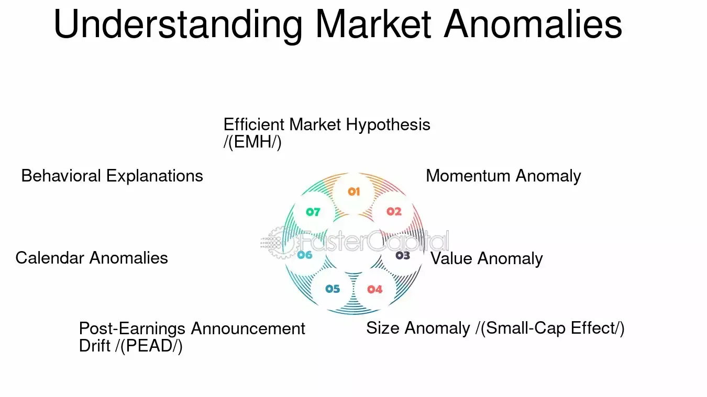

## Table of Contents

## What are market anomalies?

Market anomalies are unusual patterns or events in the stock market that don't follow the normal rules of how markets are supposed to work. These anomalies can be things like certain stocks going up or down in ways that don't make sense based on the news or the company's performance. They can also be patterns that happen over and over again, like stocks doing better on certain days of the week or during certain times of the year.

People who study the stock market, called financial analysts, are very interested in market anomalies because they can help them make better predictions and maybe even make more money. For example, if they find a pattern where stocks always go up right before a holiday, they might buy stocks just before the holiday to take advantage of this pattern. But, it's important to remember that just because something has happened in the past, it doesn't mean it will happen again in the future. So, while market anomalies can be useful, they are not a sure thing.

## How do market anomalies differ from market efficiency?

Market anomalies and market efficiency are two different ideas about how the stock market works. Market efficiency means that the prices of stocks always show all the information that people know about a company. If the market is efficient, you can't beat it by finding special information or patterns because all the information is already in the stock prices.

Market anomalies, on the other hand, are when the stock market doesn't work the way it's supposed to according to the idea of market efficiency. Anomalies are patterns or events that don't make sense if you think the market is efficient. For example, if stocks always go up on a certain day of the week, that's an anomaly because it suggests that you can predict stock prices based on the day, not just the information about the company.

So, market efficiency says the market is always right and you can't beat it, while market anomalies show times when the market might not be working perfectly and you might be able to find ways to do better than the market average.

## What are some common types of market anomalies?

Market anomalies come in different forms, but some common ones are calendar effects, [momentum](/wiki/momentum) effects, and value effects. Calendar effects happen when stock prices go up or down because of the time of year or even the day of the week. For example, the "January effect" is when stocks tend to do better in January than other months. Another example is the "Monday effect," where stocks might go down more often on Mondays.

Momentum effects are when stocks that have been going up keep going up, and stocks that have been going down keep going down. This goes against the idea that the market should quickly adjust to new information. If a stock has been doing well, people might keep buying it, thinking it will keep doing well, even if there's no new reason for it to go up.

Value effects are when stocks that seem cheap compared to what the company is worth do better than expected. These stocks might have a low price compared to their earnings or assets. People who look for these value stocks think they can find bargains that the rest of the market has missed. These anomalies show that the market doesn't always work perfectly and that there might be ways to beat it.

## Can you explain the January effect as a market anomaly?

The January effect is a market anomaly where stocks tend to do better in January than in other months. It's like a pattern that happens every year, where the stock market goes up more in January. People think this might happen because investors sell stocks at the end of the year to save on taxes, and then they buy them back in January. This buying in January can push the stock prices up.

Even though the January effect has been seen in the past, it doesn't mean it will always happen. Sometimes, the market doesn't follow this pattern, and stocks might not go up in January. But, because it has happened before, some investors try to use this information to make money by buying stocks at the end of December and selling them in January. This shows how market anomalies can be used to try to beat the market, but they are not a sure thing.

## How does the size effect influence stock returns?

The size effect is a market anomaly where smaller companies' stocks tend to do better than bigger companies' stocks. This means that if you invest in smaller companies, you might see your money grow more than if you invest in big companies. People think this happens because smaller companies are not watched as closely by investors and analysts, so their stock prices might not reflect all the good things about the company.

Even though the size effect has been seen in the past, it doesn't always work. Sometimes, big companies' stocks do better than small companies' stocks. But because the size effect has been noticed before, some investors try to use this information to make more money by focusing on smaller companies. This shows how market anomalies can be used to try to beat the market, but they are not a sure thing.

## What role do momentum and reversal effects play in market anomalies?

Momentum and reversal effects are important market anomalies that can influence how stocks perform. Momentum effect is when stocks that have been going up keep going up, and stocks that have been going down keep going down. This happens because investors might see a stock going up and think it will keep going up, so they buy more of it. This can push the price even higher. On the other hand, if a stock has been going down, people might sell it, thinking it will keep going down, which can make the price fall even more.

Reversal effects are the opposite of momentum. They happen when stocks that have been going up start to go down, and stocks that have been going down start to go up. This can happen because the market might overreact to news or trends, causing prices to move too far in one direction. Then, when people realize the stock has moved too much, they start to buy or sell to bring the price back to where it should be. Both momentum and reversal effects show that the market doesn't always work perfectly and that there might be ways to beat it by understanding these patterns.

## How can behavioral finance explain market anomalies?

Behavioral finance helps explain market anomalies by looking at how people's feelings and mistakes can affect the stock market. People don't always make smart choices with their money. Sometimes, they get too excited about a stock and buy too much of it, making the price go up more than it should. Other times, they might get scared and sell a stock too quickly, making the price go down more than it should. These feelings and mistakes can create patterns in the market that don't make sense if you think the market is always right.

For example, the January effect might happen because people sell stocks at the end of the year to save on taxes and then buy them back in January. This is a behavior that can cause the stock market to go up in January. The size effect might happen because people pay more attention to big companies and don't notice the good things about smaller companies. Momentum and reversal effects can happen because people follow trends without thinking about the real value of a stock. By understanding how people's behaviors can lead to these patterns, we can see why market anomalies happen.

## What are the implications of market anomalies for investors?

Market anomalies can give investors a chance to make more money if they can spot and use these patterns. For example, if an investor knows about the January effect, they might buy stocks at the end of December and sell them in January to take advantage of the price going up. The same goes for the size effect, where investing in smaller companies might lead to bigger returns. By understanding these patterns, investors can try to beat the market and make more money than they would if they just followed the normal rules.

But, market anomalies are not a sure thing. Just because a pattern has happened before doesn't mean it will happen again. Sometimes, the market doesn't follow these patterns, and investors who try to use them might lose money. Also, if too many people start using the same anomaly to make money, it might stop working because everyone's actions can change the market. So, while market anomalies can be useful, investors need to be careful and not rely on them too much.

## How can investors exploit market anomalies for profit?

Investors can try to make money from market anomalies by spotting patterns and using them to their advantage. For example, if they know about the January effect, they might buy stocks at the end of December and sell them in January, hoping to make a profit from the price going up. The same idea applies to the size effect, where investing in smaller companies might lead to bigger returns. By understanding these patterns, investors can try to beat the market and make more money than they would if they just followed the normal rules.

But, using market anomalies to make money is not a sure thing. Just because a pattern has happened before doesn't mean it will happen again. Sometimes, the market doesn't follow these patterns, and investors who try to use them might lose money. Also, if too many people start using the same anomaly to make money, it might stop working because everyone's actions can change the market. So, while market anomalies can be useful, investors need to be careful and not rely on them too much.

## What are the challenges in consistently profiting from market anomalies?

Trying to make money from market anomalies is hard because these patterns don't always happen. Just because a stock went up in January last year doesn't mean it will go up this January. The market can change, and what worked before might not work again. Also, if too many people start using the same anomaly to make money, it can stop working. When everyone knows about a pattern and tries to use it, their actions can change the market and make the pattern go away.

Another challenge is that market anomalies can be hard to spot and use. You need to do a lot of research and keep track of what's happening in the market. Even if you find a pattern, it might be hard to know when to buy and sell to make a profit. Plus, there are always risks in the stock market. Even if you think you've found a good anomaly, you could still lose money if the market does something unexpected. So, while market anomalies can be a way to try to beat the market, they are not a sure thing and need a lot of careful work.

## How have market anomalies been studied and documented in financial literature?

Market anomalies have been studied and written about a lot in financial [books](/wiki/algo-trading-books) and papers. Researchers look at past stock market data to find patterns that don't fit with the idea that the market is always right. They use numbers and charts to show when these patterns happen and how often. For example, they might look at stock prices over many years to see if there's a January effect, where stocks go up more in January than other months. They also study things like the size effect, where smaller companies' stocks do better than bigger ones, and momentum effects, where stocks that have been going up keep going up.

These studies help us understand why market anomalies happen and how they can be used. Researchers often use big computers and special math to find these patterns. They write about their findings in financial journals so other people can learn from them. But, they also warn that just because a pattern has been seen before, it doesn't mean it will happen again. The market can change, and what worked in the past might not work in the future. So, while these studies are helpful, they also show that using market anomalies to make money is not easy and comes with risks.

## What are the latest research findings on new or evolving market anomalies?

Recent research has been looking into new and changing market anomalies. One interesting finding is about the "low-[volatility](/wiki/volatility-trading-strategies) anomaly," where stocks that don't move up and down a lot tend to do better than expected. This goes against the idea that you need to take big risks to make big money. Researchers have found that these low-volatility stocks can give good returns without the big ups and downs. Another new anomaly is the "quality anomaly," where companies with strong finances and good management do better than others. This shows that looking at a company's health can help find stocks that might do well.

Another area of research is about how technology and data are changing market anomalies. With more people using computers and special math to find patterns, some old anomalies are disappearing. For example, the January effect is not as strong as it used to be because more investors know about it and try to use it. But new anomalies are also being found. Researchers are using big data and [machine learning](/wiki/machine-learning) to spot new patterns that might not have been seen before. This shows that the stock market is always changing, and what worked in the past might not work in the future.

## References & Further Reading

[1]: Malkiel, B. G. (2003). ["The Efficient Market Hypothesis and Its Critics."](https://www.princeton.edu/~ceps/workingpapers/91malkiel.pdf) Journal of Economic Perspectives, 17(1), 59-82.

[2]: Jegadeesh, N., & Titman, S. (1993). ["Returns to Buying Winners and Selling Losers: Implications for Stock Market Efficiency."](https://www.jstor.org/stable/2328882) The Journal of Finance, 48(1), 65-91.

[3]: Schwert, G. W. (2003). ["Anomalies and Market Efficiency."](https://www.nber.org/papers/w9277) In Handbook of the Economics of Finance (Vol. 1, pp. 939-974). Elsevier.

[4]: Fama, E. F. (1998). ["Market Efficiency, Long-Term Returns, and Behavioral Finance."](https://www.sciencedirect.com/science/article/pii/S0304405X98000269) Journal of Financial Economics, 49(3), 283-306.

[5]: Khan, Y. (2020). ["Machine Learning and Big Data in Algorithmic Trading."](https://onlinelibrary.wiley.com/doi/book/10.1002/9781119654834) The Journal of Trading, 15(3), 30-47.