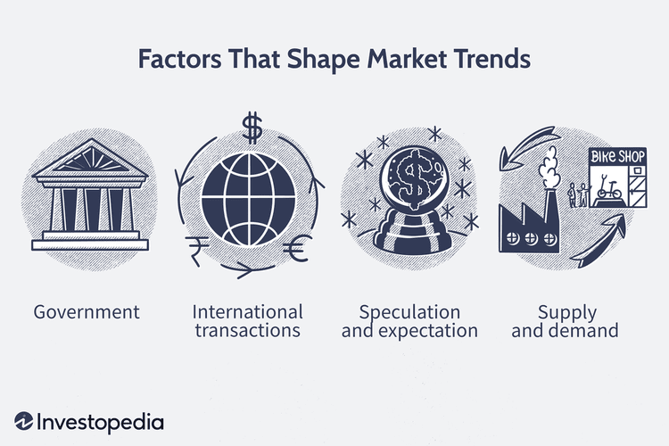

The financial markets are a dynamic entity that continuously evolve with technological advancements and economic developments. These markets have always been at the forefront of innovation, adapting to changes in technology, macroeconomic factors, and regulatory environments. In recent years, the integration of algorithmic trading and artificial intelligence (AI) has significantly influenced market trends and economic implications. Algorithmic trading, which utilizes predefined rules and sophisticated algorithms to execute trades rapidly, has become increasingly prevalent. It reduces the latency of trading processes and enhances market efficiency by allowing high-frequency trading that surpasses human capabilities.

AI's role in financial markets has expanded beyond mere automation. It now includes complex predictive analytics, which contribute to more informed trading strategies and improved decision-making processes. AI algorithms can process vast amounts of data and adapt to new patterns, providing insights that were previously unobtainable. This has implications not only for traders but also for market stability and ethical considerations.



This article aims to explore the current market trends within financial markets, analyze the economic implications of these trends, and assess the impact of algorithmic trading. Attention will be given to understanding how these technological advancements are reshaping market operations and what this means for stakeholders in terms of opportunities and challenges. By examining these elements, readers will gain a comprehensive understanding of the evolving financial landscape and the complex interplay between technology and economic developments.

## Table of Contents

## Understanding Financial Markets

Financial markets are complex systems that serve as platforms for the buying and selling of financial instruments, which include stocks, bonds, commodities, and derivatives. These markets are essential components of the global financial system, providing the infrastructure for economic development and wealth creation.

At their core, financial markets serve three primary functions: the raising of capital, the transfer of risk, and the facilitation of international trade. Firstly, companies and governments raise capital through financial markets by issuing stocks and bonds. Stocks, or equities, represent ownership in a company and entitle shareholders to a portion of the profits while bonds are debt instruments through which issuers borrow funds from investors with the promise of repayment plus interest. This capital-raising process is vital for funding business expansion, infrastructure projects, and governmental expenditures, thereby fueling economic growth.

Secondly, financial markets enable the transfer of risk through various instruments, most notably derivatives. Derivatives, such as options and futures, are contracts whose value is derived from an underlying asset. These instruments allow market participants to hedge against price volatility, securing financial stability by mitigating potential losses. For example, a wheat farmer might use futures contracts to lock in a selling price for their crop, minimizing the risk of price fluctuations at harvest time.

Moreover, financial markets are crucial for facilitating international trade by providing mechanisms for currency exchange. They offer platforms where currencies can be traded, enabling businesses to engage in cross-border transactions with relative ease. A robust foreign exchange market ensures that businesses can convert currency systematically, supporting global commerce and economic integration.

Listed and over-the-counter (OTC) markets represent two key categories within financial markets. Listed markets, such as stock exchanges, provide a centralized venue where securities are bought and sold, often through a formal transparent auction process. Conversely, OTC markets consist of decentralized networks where trading is conducted directly between parties, typically with more flexible and customized terms.

Financial markets are influenced by a host of factors, including economic indicators, government policies, and investor sentiment. They are also subject to regulatory oversight, which aims to protect investors, maintain fair and efficient markets, and reduce systemic risk. Regulations can vary significantly across countries and regions, reflecting different economic priorities and legal frameworks.

Technological advancements continue to shape financial markets, introducing innovations such as electronic trading platforms and [algorithmic trading](/wiki/algorithmic-trading) that enhance the speed and efficiency of transactions. These technological shifts have made financial markets more accessible to a broader range of participants, democratizing investment opportunities globally.

In conclusion, financial markets are indispensable to the functioning of the global economy. By facilitating capital formation, risk management, and trade, they play a pivotal role in driving economic prosperity and stability. As these markets continue to evolve, their complexity and integration into the broader economic landscape further underscore their importance.

## Key Market Trends

The current financial market landscape is characterized by a notable shift towards increased [volatility](/wiki/volatility-trading-strategies) and rapid technological transformation. This transformation is driven predominantly by globalization and digitalization, which have led to the creation of highly interconnected markets. These trends have significant implications for both traditional financial instruments and emerging assets such as cryptocurrencies and tech stocks.

Volatility in financial markets refers to the degree of variation in the price of financial instruments over a given period. Increased volatility often reflects uncertainty and rapid changes in market conditions, influenced by factors such as geopolitical events, economic data releases, and shifts in investor sentiment. The advent of technology has augmented this volatility, as high-frequency trading and algorithmic strategies execute trades in milliseconds, responding almost instantaneously to market stimuli.

Globalization has increasingly tied financial markets worldwide, making them susceptible to cross-border influences. For instance, economic developments in one region can have ripple effects on markets across the globe. This interconnectedness has been exemplified by the rapid dissemination of information through digital platforms, making markets more reactive and volatile. 

Digitalization has also brought about the rise of new asset classes, notably cryptocurrencies. Cryptocurrencies such as Bitcoin and Ethereum have gained significant traction as both speculative assets and alternative stores of value. Their decentralized nature, coupled with blockchain technology, appeals to investors seeking diversification away from traditional financial systems. However, their volatile nature and regulatory uncertainties contribute to market instability.

Furthermore, technological advancements have spurred the rise of tech stocks, with companies in this sector experiencing exponential growth. Giants like Apple, Amazon, and Google have led the charge, driven by their ability to innovate and dominate in areas such as cloud computing, [artificial intelligence](/wiki/ai-artificial-intelligence), and e-commerce. These companies have become pivotal components of major stock indices, influencing broader market trends.

In conclusion, the financial markets are undergoing significant changes, characterized by increased volatility and rapid technological evolution. Globalization and digitalization are key drivers of these trends, as evidenced by the rise of cryptocurrencies and the dominance of tech stocks. Understanding these dynamics is crucial for investors and policymakers aiming to navigate the complexities of modern financial markets.

## Economic Implications of Market Trends

Market trends are intricately linked to overarching economic conditions, often serving as a reflection of global and local economic health. Economic indicators such as Gross Domestic Product (GDP), unemployment rates, and consumer confidence indices are critical metrics that investors and policymakers use to gauge economic performance and anticipate future market movements.

The GDP, as a measure of a country's economic activity, is directly influenced by market trends. For instance, a booming stock market can boost wealth and spending, potentially leading to an increase in GDP. Conversely, declining markets may result in reduced wealth and economic contraction. Unemployment rates are another key indicator, where low unemployment generally suggests robust economic activity, which can lead to increased investor confidence and a bullish market trend. On the other hand, rising unemployment might signal economic distress, often resulting in bearish market trends.

Recent market trends have shown a noticeable shift towards sectoral restructuring and an emphasis on sustainable investments. The drive towards sustainability is becoming more prominent, partially fueled by growing environmental concerns and the increasing importance of corporate social responsibility. This shift is influencing economic policies, as governments and institutions are more inclined to promote green initiatives and technologies, potentially altering fiscal measures to support sustainable growth. For example, tax incentives for renewable energy investments or penalties for higher carbon emissions can reshape market dynamics and sector performance.

### Python Code Example for Tracking Economic Indicators
To analyze how these economic indicators affect market trends, data analysis and visualization can be employed using Python. The following code provides a basic framework for plotting GDP and unemployment rate trends over time:

```python
import matplotlib.pyplot as plt
import pandas as pd

# Sample data for demonstration
data = {
    'Year': [2015, 2016, 2017, 2018, 2019, 2020, 2021],
    'GDP Growth (%)': [2.9, 1.6, 2.4, 2.9, 2.3, -3.4, 5.7],
    'Unemployment Rate (%)': [5.3, 4.9, 4.4, 3.9, 3.7, 8.1, 5.4]
}

df = pd.DataFrame(data)

plt.figure(figsize=(10, 5))
plt.plot(df['Year'], df['GDP Growth (%)'], label='GDP Growth (%)', marker='o')
plt.plot(df['Year'], df['Unemployment Rate (%)'], label='Unemployment Rate (%)', marker='x')
plt.title('Economic Indicators Over Time')
plt.xlabel('Year')
plt.ylabel('Percentage')
plt.legend()
plt.grid(True)
plt.show()
```

This code creates a simple line plot comparing GDP growth and unemployment rates over a specified period. Such visualizations can aid in identifying trends and making informed economic and investment decisions.

In summary, understanding the economic implications of market trends is crucial for grasping the broader economic landscape. With the ongoing sectoral shifts and the burgeoning focus on sustainability, market dynamics continue to evolve, necessitating adaptive economic policies and strategic fiscal measures to promote stability and growth.

## The Rise of Algorithmic Trading

Algorithmic trading represents a significant evolution in financial market operations, employing sophisticated algorithms to automate trade execution. These algorithms analyze market data to identify trading opportunities and execute orders at a speed and frequency beyond human capability. This approach has revolutionized trading by enhancing both market [liquidity](/wiki/liquidity-risk-premium) and operational efficiency.

One of the primary benefits of algorithmic trading is its contribution to market liquidity. By facilitating quick and efficient execution of large volumes of trades, algorithms help narrow bid-ask spreads and reduce price impact costs. This increase in liquidity can make markets more attractive to various participants, encouraging greater market depth and providing more stable price formation.

Algorithmic trading also promotes efficiency within financial markets. Algorithms can process immense volumes of data in real time, identifying trends, and executing trades within milliseconds. The removal of human intervention reduces the likelihood of errors and decreases latency, allowing traders to capitalize on fleeting market opportunities. This speed and precision drive significant cost reductions, benefiting institutional investors and individual traders alike.

Despite these advantages, algorithmic trading raises concerns about market stability. The high-speed nature of algorithmic trading has been linked to increased market volatility, as rapid, automated trades can exacerbate short-term price fluctuations. Events such as the "Flash Crash" of May 6, 2010, where a trillion-dollar stock market value vanished and then quickly recovered, highlight the potential for algorithmic trades to destabilize markets under certain conditions. These instances stress test the resilience of technological systems and regulatory frameworks.

Ethical considerations also arise with algorithmic trading. Algorithms can be programmed to engage in aggressive strategies, potentially leading to market manipulation tactics like spoofing or layering. These tactics undermine market fairness and can disadvantage individual investors. Ensuring ethical conduct in algorithmic trading requires ongoing regulatory vigilance and robust monitoring mechanisms.

In summary, algorithmic trading brings substantial improvements to market liquidity and efficiency, but it also necessitates careful management of its complexities and risks to maintain market integrity and stability.

## Impact of AI in Algorithmic Trading

Artificial intelligence (AI) has become a critical component in enhancing algorithmic trading, transforming how financial markets operate. AI-driven algorithms leverage large datasets to perform predictive analytics and trend analysis, which are fundamental for executing informed and strategic trading decisions. These technologies utilize [machine learning](/wiki/machine-learning) models to identify patterns and anomalies within market data, providing traders with an edge over traditional strategies.

One of the key advantages of integrating AI into algorithmic trading is the development of adaptive learning capabilities. Through machine learning techniques, AI systems can continuously learn and adapt to new market conditions. This means that the algorithms can modify their trading strategies in response to emerging trends, minimizing risks associated with static models. A simple illustration of this adaptive process is the [reinforcement learning](/wiki/reinforcement-learning) approach, where algorithms are rewarded or penalized based on the outcomes of their trades, thus refining their strategy over time.

Beyond predictive analytics, AI introduces advanced feature engineering and selection processes, which are crucial for building robust trading models. For instance, algorithms can be programmed to filter out noise and emphasize signals that are statistically significant. In Python, this can be implemented using libraries such as Scikit-learn or TensorFlow:

```python
from sklearn.ensemble import RandomForestClassifier
from sklearn.model_selection import train_test_split
from sklearn.metrics import accuracy_score

# Example of feature selection and model training
features, labels = dataset.drop('target', axis=1), dataset['target']
X_train, X_test, y_train, y_test = train_test_split(features, labels, test_size=0.2)

model = RandomForestClassifier(n_estimators=100)
model.fit(X_train, y_train)

# Predicting and evaluating
predictions = model.predict(X_test)
accuracy = accuracy_score(y_test, predictions)
```

While AI enhances decision-making in trading, it also raises significant concerns. The reliance on vast amounts of data introduces privacy risks, as sensitive information could be exposed or mishandled. Algorithmic biases represent another major concern; if AI systems are trained on biased datasets, they may propagate unfair or undesirable outcomes. These biases can lead to market distortions or unfair trading advantages, challenging the ethical integrity of trading practices.

Addressing these concerns requires continuous scrutiny and refinement of AI systems. Transparent machine learning models, such as decision trees and linear regressions, are often preferred for their interpretability. Additionally, regulatory frameworks play an essential role in ensuring that AI-driven trading practices adhere to ethical standards and maintain market stability. Robust regulations will need to evolve in parallel with technological advancements to mitigate these risks effectively.

AI's incorporation into algorithmic trading represents a dual-edged sword, offering unprecedented analytical capabilities while simultaneously presenting new challenges. The future of AI in finance lies in harnessing its potential responsibly, balancing innovation with the ethical and practical implications of its applications.

## Regulatory Considerations

As algorithmic trading continues to dominate financial markets, regulatory bodies find themselves grappling with the challenge of ensuring that these advanced trading strategies do not disrupt market integrity or disadvantage investors. The complexities introduced by algorithmic trading, particularly when augmented by artificial intelligence (AI), require regulators to rethink traditional oversight frameworks.

One major concern is market manipulation. Algorithmic trading, with its capacity for executing large volumes of trades at lightning speed, can sometimes be used to create artificial market movements. This phenomenon, known as "spoofing," involves placing large orders with the intention of canceling them before execution, thereby misleading other traders about supply and demand dynamics. To combat such practices, regulatory authorities like the U.S. Securities and Exchange Commission (SEC) and the Commodity Futures Trading Commission (CFTC) have employed sophisticated surveillance systems that monitor irregular trading patterns indicative of manipulation.[^1^]

Furthermore, ethical issues arise from the opaque nature of AI algorithms, which can inadvertently introduce biases or make decisions that lack transparency. The lack of interpretability in AI decision-making processes poses a challenge, as it is difficult for regulators to assess whether these systems are compliant with existing laws. To address these concerns, some regulatory bodies are advocating for the adoption of Explainable AI (XAI), which aims to make AI-driven decisions more transparent and understandable for humans.[^2^]

Protection of data privacy is another significant regulatory consideration. The vast amounts of data processed by algorithmic trading systems raise concerns about the potential misuse of sensitive information. The General Data Protection Regulation (GDPR) in the European Union serves as a framework for ensuring that firms implement stringent data protection measures. However, the global nature of financial markets necessitates that similar standards be adopted universally to safeguard against privacy infringements.

The rapid pace of technological advancement necessitates that regulations in this domain be both robust and adaptive. Regulatory sandboxes are increasingly being used by financial authorities as a means to test new technologies and business models in a controlled environment, allowing them to refine rules in a manner that encourages innovation while protecting market participants.[^3^]

In conclusion, as financial markets evolve with the integration of AI-driven algorithmic trading, robust regulatory frameworks are essential to protect market integrity, ensure ethical operations, and safeguard investor interests. The success of these frameworks will depend on the ability of regulatory bodies to anticipate technological trends and implement adaptive policies that balance innovation with security.

[^1^]: U.S. Securities and Exchange Commission. "SEC Charges Firm with Manipulative Spoofing."
[^2^]: Gunning, D. "Explainable Artificial Intelligence (XAI)." Defense Advanced Research Projects Agency (DARPA).
[^3^]: Financial Conduct Authority. "Regulatory Sandbox."

## Conclusion

Financial markets are undergoing rapid transformation due to technological advancements, significantly affecting market operations and economic landscapes. These technological shifts, especially the rise of algorithmic trading powered by artificial intelligence, present a dual-faceted reality of opportunities and challenges. Algorithmic trading contributes to market efficiency and liquidity by executing trades with precision and unprecedented speed. However, it also raises concerns regarding market stability, as high-frequency trading can exacerbate volatility and liquidity crunches during market stress. 

Moreover, the integration of AI in algorithmic strategies has introduced sophisticated predictive analytics, enabling smarter and more adaptive trading decisions. Nonetheless, this integration also surfaces critical issues such as data privacy risks and potential biases ingrained in AI algorithms, which may inadvertently lead to unfair market practices or failures in trading strategies.

As financial markets adapt, the role of regulation becomes paramount in safeguarding both market integrity and investor protection. Regulatory bodies are tasked with ensuring that the deployment of algorithmic and AI-driven trading mechanisms does not result in market manipulation or exploitation of investors. This necessitates constant updates in policy frameworks and regulatory measures tailored to address the intricacies of technological advancements.

Looking forward, the trajectory of financial markets will be shaped by continuous innovations in technology and the effectiveness of regulatory adaptations. The balance between harnessing the benefits of these innovations while mitigating associated risks will be central to the evolution of financial markets. As such, stakeholders, including traders, investors, policymakers, and technology developers, must collaboratively ensure that algorithmic trading not only enhances market functions but also aligns with ethical standards and contributes to economic stability.

## References & Further Reading

[1]: Bergstra, J., Bardenet, R., Bengio, Y., & Kégl, B. (2011). ["Algorithms for Hyper-Parameter Optimization."](https://papers.nips.cc/paper/4443-algorithms-for-hyper-parameter-optimization) Advances in Neural Information Processing Systems 24.

[2]: ["Advances in Financial Machine Learning"](https://www.amazon.com/Advances-Financial-Machine-Learning-Marcos/dp/1119482089) by Marcos Lopez de Prado

[3]: ["Evidence-Based Technical Analysis: Applying the Scientific Method and Statistical Inference to Trading Signals"](https://www.amazon.com/Evidence-Based-Technical-Analysis-Scientific-Statistical/dp/0470008741) by David Aronson

[4]: ["Machine Learning for Algorithmic Trading"](https://github.com/stefan-jansen/machine-learning-for-trading) by Stefan Jansen

[5]: ["Quantitative Trading: How to Build Your Own Algorithmic Trading Business"](https://www.amazon.com/Quantitative-Trading-Build-Algorithmic-Business/dp/1119800064) by Ernest P. Chan