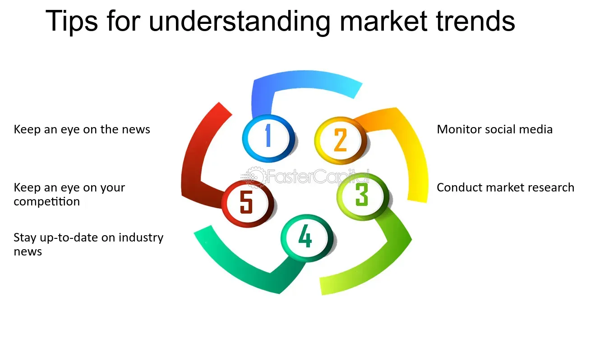

## Table of Contents

## What are market trends?

Market trends are patterns or changes in the way people buy and sell things. They show what is popular or in demand at a certain time. Businesses and investors watch these trends to make smart choices about what to sell or where to put their money. For example, if more people start buying electric cars, that's a market trend that car companies and investors would pay attention to.

These trends can be influenced by many things, like new technology, changes in what people like, or even big events like a global health crisis. For instance, the rise of smartphones changed how people shop and communicate, creating new market trends in apps and online services. By understanding these trends, companies can plan better and stay ahead of their competition.

## Why is it important to understand market trends?

Understanding market trends is important because it helps businesses and investors make good decisions. If you know what people want to buy, you can sell those things and make more money. For example, if you see that more people are buying bikes, you might decide to open a bike shop. This way, you can meet the demand and do well in your business.

It also helps companies stay ahead of their competition. If a business sees a new trend starting, like people wanting more eco-friendly products, they can start making those products before other companies do. This can give them an advantage and help them grow. By keeping an eye on market trends, businesses can plan better and avoid missing out on big opportunities.

## How can market trends be identified?

Market trends can be identified by looking at data and watching what people are doing. Businesses often use tools like surveys, sales data, and social media to see what is popular. For example, if a lot of people are talking about a new type of food on social media, that could be a sign of a new trend. Companies also look at numbers from their sales to see if certain products are selling more than others. This helps them understand what people want right now.

Another way to spot market trends is by keeping an eye on the news and big events. Things like new laws, technology changes, or even a big sports event can start new trends. For instance, if a new law makes electric cars cheaper, more people might start buying them, creating a trend. By staying informed about what's happening in the world, businesses can predict what might become popular next.

Sometimes, talking to people directly can also help identify trends. This can be done through focus groups or customer feedback. If many customers say they want a certain feature in a product, that could be the start of a new trend. By listening to what people say and combining it with data, businesses can get a good picture of where the market is heading.

## What are the different types of market trends?

Market trends can be short-term or long-term. Short-term trends are changes that happen quickly and might not last long. For example, a new toy might be very popular for a few months but then people stop buying it. Long-term trends are changes that last for a long time. An example of a long-term trend is the growing use of the internet, which has changed how people shop and communicate over many years.

There are also different kinds of trends based on what they affect. Product trends are about what people want to buy. For instance, if more people start buying organic food, that's a product trend. Industry trends are about changes in a whole business area. For example, the move to online shopping is an industry trend that affects many different kinds of stores. Economic trends are about big changes in the economy, like when prices go up or down, which can affect what people buy and how much they spend.

Understanding these different types of trends helps businesses and investors make better choices. By knowing if a trend is short-term or long-term, they can decide how to react. And by knowing if it's a product, industry, or economic trend, they can plan their business strategies to match what's happening in the market.

## How do market trends affect businesses?

Market trends can have a big impact on businesses. When a new trend starts, like more people wanting to buy electric cars, businesses that make or sell those cars can do really well. They can make more money because they are selling what people want. But if a business doesn't pay attention to trends, they might keep selling things that people don't want anymore. For example, if a toy store keeps selling old toys that kids don't like anymore, they might lose customers and money.

Trends can also change how businesses work. If there's a trend towards online shopping, a store might need to start selling things on the internet to keep up. This can mean changing how they do business, like setting up a website or using social media to reach customers. If a business can adapt to new trends, they can stay successful. But if they don't change, they might fall behind other businesses that are keeping up with what people want.

## What tools and resources can be used to analyze market trends?

Businesses can use many tools and resources to analyze market trends. One common tool is market research software, which helps collect and analyze data from surveys, sales, and customer feedback. This software can show patterns in what people are buying and help businesses understand what's popular. Another useful resource is social media analytics, which tracks what people are talking about online. By looking at social media, businesses can see what's trending and what people are interested in right now.

Another important tool is industry reports and publications. These reports give detailed information about what's happening in different business areas. They can help businesses see big trends that might affect their industry, like new technology or changes in laws. Economic data from government websites is also helpful. This data shows things like how much people are spending and how the economy is doing, which can affect what people buy. By using these tools and resources, businesses can get a good picture of market trends and make smart decisions.

## How can historical data be used to predict future market trends?

Historical data is like a record of what happened in the past. By looking at this data, businesses can see patterns and trends that happened before. For example, if they see that people bought more ice cream every summer for the last ten years, they might guess that people will buy more ice cream next summer too. This helps businesses plan what to sell and when to sell it. They can also see if there were any big events, like a new law or a big sale, that changed what people bought. This can help them predict how similar events might affect the market in the future.

But, using historical data isn't just about looking at the past. It's also about understanding why things happened. If a business sees that people started buying more bikes when gas prices went up, they might think that if gas prices go up again, people might buy more bikes. By understanding these reasons, businesses can make better guesses about what might happen next. They can use this information to make smart choices about what to sell, how much to sell, and when to sell it, helping them stay ahead in the market.

## What are the common pitfalls in interpreting market trends?

One common pitfall in interpreting market trends is relying too much on short-term data. Sometimes, businesses see a quick change in what people are buying and think it's a big trend. But it might just be a short fad that doesn't last. For example, if a new toy becomes popular for a few weeks, a business might think it's a long-term trend and start making a lot of those toys. But if the trend doesn't last, they could be left with a lot of toys they can't sell.

Another pitfall is not looking at the bigger picture. Sometimes, businesses focus too much on one part of the market and miss other important trends. For instance, if a company only looks at what's happening in their own country, they might miss big changes happening around the world that could affect their business. It's important to look at different kinds of data and think about how different trends might connect.

Lastly, businesses can make mistakes by not understanding why a trend is happening. They might see that people are buying more of something, but if they don't know why, they might not be able to predict if the trend will continue. For example, if people start buying more bikes because gas prices went up, a business needs to know that. If they don't, they might not see that if gas prices go down, people might stop buying bikes. Understanding the reasons behind trends helps businesses make better guesses about the future.

## How do global events influence market trends?

Global events can change what people buy and how businesses work. For example, if there's a big health crisis like a pandemic, people might start buying more things online because they can't go to stores. This can start a trend towards more online shopping. Or, if there's a big sports event like the Olympics, people might buy more sports gear or watch more sports on TV. These events can make new trends start quickly and change what businesses need to do to keep up.

Sometimes, global events can also affect the economy in big ways. If there's a war or a big natural disaster, it can make prices go up or down and change how much money people have to spend. This can start economic trends that affect what people buy. For example, if prices go up a lot, people might buy less of some things and more of cheaper things. Businesses need to watch these events and understand how they might change what people want to buy so they can plan better.

## What role does consumer behavior play in shaping market trends?

Consumer behavior is a big reason why market trends happen. When people start wanting different things or doing things in new ways, it can start a trend. For example, if more people start caring about the environment, they might start buying more eco-friendly products. This can make businesses start making more of those products because they see that's what people want. So, what people do and what they care about can change what's popular in the market.

Businesses watch consumer behavior closely to see what's happening. They look at things like what people are buying, what they're talking about online, and even what they're complaining about. By understanding these things, businesses can guess what might become popular next. If they see that people are starting to like a new type of food, they might start selling that food before other businesses do. This way, they can stay ahead of the competition and meet the new demands of their customers.

## How can companies adapt their strategies based on market trend analysis?

Companies can change their plans based on what they learn from market trends. If they see that people are starting to buy more of something, like electric cars, they might decide to start making or selling those cars too. This way, they can meet what people want and make more money. They might also change how they sell things. For example, if more people are shopping online, a company might start selling things on the internet to keep up with the trend. By understanding what's happening in the market, companies can make smart choices about what to sell and how to sell it.

Sometimes, companies need to look at long-term trends to plan for the future. If they see that people are starting to care more about the environment, they might start making products that are good for the earth. This can help them stay successful over a long time. They can also use trend analysis to find new opportunities. If a new technology becomes popular, like smartphones, a company might start making apps or other things that work with that technology. By keeping an eye on trends and adapting their strategies, companies can stay ahead and do well in their business.

## What advanced statistical methods are used in expert market trend analysis?

In expert market trend analysis, one common advanced statistical method is time series analysis. This method looks at data over time to find patterns and trends. For example, it can show if sales of a product go up every summer or if there's a slow increase in demand over years. Time series analysis can help predict what might happen next by looking at what happened before. It's like looking at the weather history to guess if it will rain tomorrow. Businesses use this method to plan when to sell more of something or to predict future sales.

Another method is regression analysis, which helps understand how different things affect what people buy. For example, it can show if higher prices make people buy less of a product or if a new ad campaign makes sales go up. Regression analysis can look at many different factors at the same time, like price, advertising, and the economy, to see which ones matter the most. This helps businesses make better decisions about what to change to meet customer needs. By using these advanced methods, companies can get a clearer picture of market trends and plan their strategies more effectively.

## References & Further Reading

[1]: Bergstra, J., Bardenet, R., Bengio, Y., & Kégl, B. (2011). ["Algorithms for Hyper-Parameter Optimization."](https://papers.nips.cc/paper/4443-algorithms-for-hyper-parameter-optimization) Advances in Neural Information Processing Systems 24.

[2]: ["Advances in Financial Machine Learning"](https://www.amazon.com/Advances-Financial-Machine-Learning-Marcos/dp/1119482089) by Marcos Lopez de Prado

[3]: ["Evidence-Based Technical Analysis: Applying the Scientific Method and Statistical Inference to Trading Signals"](https://www.amazon.com/Evidence-Based-Technical-Analysis-Scientific-Statistical/dp/0470008741) by David Aronson

[4]: ["Machine Learning for Algorithmic Trading"](https://github.com/stefan-jansen/machine-learning-for-trading) by Stefan Jansen

[5]: ["Quantitative Trading: How to Build Your Own Algorithmic Trading Business"](https://www.amazon.com/Quantitative-Trading-Build-Algorithmic-Business/dp/1119800064) by Ernest P. Chan