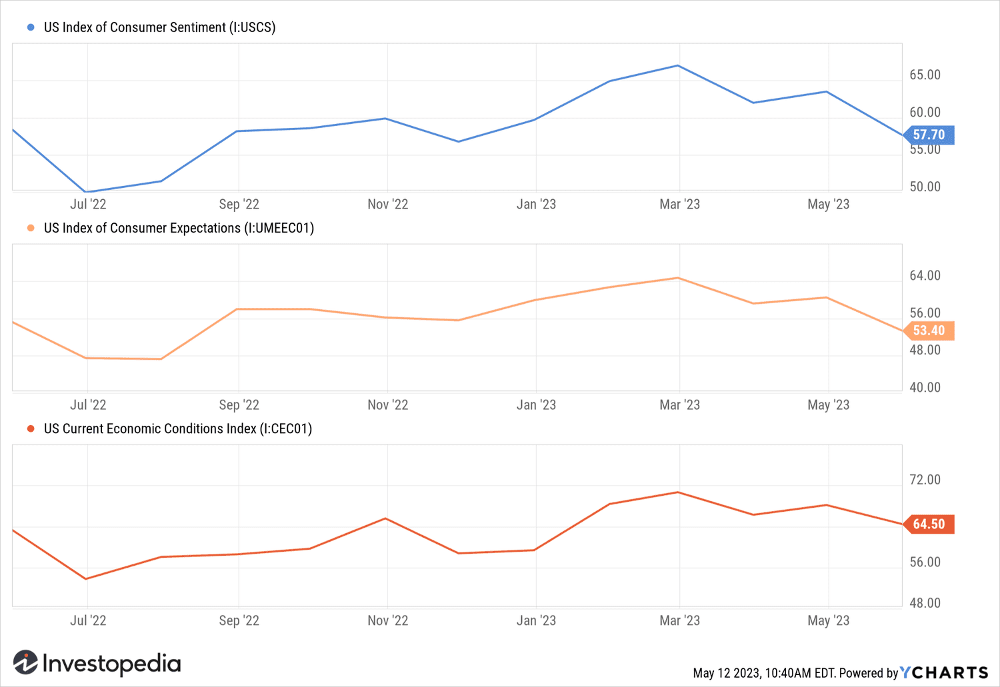

Understanding economic indicators is crucial for assessing the overall health of an economy. One of the most important tools for gauging consumer confidence is the Michigan Consumer Sentiment Index (MCSI). Created by the University of Michigan, this index has become a vital barometer in economic analysis, serving as a predictive indicator of consumer behavior and economic trends. It provides insight into how individuals perceive current and future economic conditions, which in turn, influences their spending and saving decisions.

The MCSI is not just a tool for economists and policymakers; it plays a significant role in the financial markets as well. Fluctuations in consumer sentiment can lead to changes in market dynamics, affecting asset prices and investment strategies. For investors, understanding these shifts is key to making informed decisions about stock portfolios, bond investments, and other assets.



Furthermore, with the advancement of technology, there has been a growing interest in the integration of the MCSI within algorithmic trading strategies. Algorithmic trading, which utilizes computer programs to execute trades at high speeds and volumes based on predetermined criteria, can benefit from the predictive power of consumer sentiment data. By incorporating the MCSI, traders can optimize their strategies to better anticipate market moves and enhance the accuracy of their trade executions.

This article will explore the significance of consumer sentiment, examine its effects on financial markets, and discuss strategies for incorporating the MCSI into trading algorithms. Through understanding and leveraging consumer sentiment, both traditional investors and algorithmic traders can gain a competitive edge in navigating the complexities of the financial landscape.

## Table of Contents

## What is the Michigan Consumer Sentiment Index?

The Michigan Consumer Sentiment Index (MCSI) is a pivotal economic indicator originating from a monthly survey conducted by the University of Michigan. This index has been instrumental in measuring the confidence levels of consumers by gauging their perceptions about the current state and anticipated future trends of the economy. Originating in the 1940s, the MCSI reflects the collective financial outlook of American households, capturing insights into their optimism or pessimism regarding economic conditions.

To construct the index, the Survey of Consumers at the University of Michigan conducts telephonic interviews with at least 500 individuals each month. These interviews assess personal financial situations, sentiment toward current and future economic conditions in the country, and prospects for purchasing durable goods. This data is then synthesized into an index value that provides a snapshot of consumer confidence.

Economists, policymakers, and investors widely regard the MCSI as a vital tool for understanding consumer behavior—a key driver of economic activity. Since consumer spending accounts for a significant portion of GDP, shifts in consumer confidence can forecast changes in economic growth. For instance, heightened consumer confidence can indicate an increase in consumer spending, potentially leading to economic expansion. Conversely, a decline in sentiment might signal reduced spending, prompting concerns about an economic slowdown.

The Michigan Consumer Sentiment Index serves various stakeholders by providing a forward-looking component crucial in economic forecasting. It guides businesses in making strategic decisions related to production and investments. Similarly, policymakers often use the index to tailor fiscal and monetary policies to stabilize or stimulate the economy.

The MCSI is not only reflective of consumer attitudes but also a predictive tool used to anticipate broader economic trends. As consumer confidence tends to precede shifts in actual consumption patterns, the index is a leading indicator of economic direction, assisting investors and decision-makers in anticipating market dynamics and potential policy actions.

## The Importance of Consumer Sentiment in Economic Analysis

Consumer sentiment is a pivotal component of economic analysis as it reflects the financial optimism or pessimism of individuals, which in turn affects their spending and saving behaviors. When consumer confidence is high, individuals are more likely to spend rather than save, directly contributing to economic growth. This consumer spending fuels demand for goods and services, prompting businesses to invest in production, hire more employees, and potentially increase wages. According to economic theory, this cycle of increased demand and production is fundamental to sustaining economic growth and stability.

Conversely, when consumer sentiment is low, individuals may become more cautious about spending, opting instead for increased savings. This can lead to a reduction in consumer spending, negatively impacting businesses reliant on consumer demand. As businesses experience reduced demand, they may cut back on production, investments, and employment, potentially leading to economic slowdowns or even a recession.

Policymakers closely monitor consumer sentiment data as it provides timely insights into the public's economic outlook and spending habits. This information is critical for tailoring fiscal and monetary policies. For instance, if consumer sentiment is declining, indicating potential economic slowdown, monetary authorities might consider lowering interest rates to stimulate borrowing and spending. Similarly, fiscal policies such as tax cuts or increased government spending can be deployed to boost aggregate demand and counteract low consumer confidence.

Therefore, the Michigan Consumer Sentiment Index and similar measures are not only useful for predicting consumer behavior but also serve as a crucial metric for policymakers aiming to maintain economic stability.

## Impact of Consumer Sentiment on Financial Markets

Changes in consumer sentiment significantly impact financial markets, often leading to increased market [volatility](/wiki/volatility-trading-strategies). Investor expectations are frequently adjusted based on shifts in consumer confidence, making this a crucial metric for economic forecasting.

Equity markets, especially in retail and consumer discretionary sectors, are highly sensitive to consumer sentiment changes. High levels of consumer confidence typically result in increased consumer spending, benefiting companies within these sectors and driving stock prices upward. Conversely, when consumer sentiment declines, investors may anticipate reduced spending, leading to lower revenue projections and consequently a drop in stock prices for these companies.

Bond markets also respond to sentiment indices, as they can influence interest rates and investment flows. For example, positive consumer sentiment may lead central banks to anticipate stronger economic growth, potentially resulting in tighter monetary policy and higher interest rates. This scenario can cause existing bonds with lower yields to decrease in value. Conversely, negative sentiment might prompt a more accommodative monetary stance, causing an appreciation in bond prices due to lower interest rates.

For investors, understanding consumer sentiment trends is essential for informed asset allocation. By monitoring the Michigan Consumer Sentiment Index and similar indicators, investors can better anticipate economic trends and adjust their portfolios accordingly. Integrating sentiment analysis with other economic indicators can greatly enhance investment decision-making strategies.

## Incorporating MCSI in Algorithmic Trading Strategies

Algorithmic trading leverages predefined rules and signals to conduct trades, effectively reducing human bias and allowing for the efficient execution of strategies. By integrating the Michigan Consumer Sentiment Index (MCSI) into trading algorithms, traders can potentially enhance the predictive accuracy of their strategies. The MCSI serves as a valuable indicator of consumer confidence levels, which can significantly influence market movements, especially in sectors sensitive to consumer behavior.

Trading algorithms that utilize consumer sentiment data can identify potential market entry and [exit](/wiki/exit-strategy) points based on anticipated shifts in consumer behavior. A positive change in the MCSI, for instance, may indicate increasing consumer confidence, which might lead to a rise in consumer spending. This could prompt traders to increase their exposure in consumer discretionary sectors, anticipating a positive market response. Conversely, a decline in the MCSI might signal caution among consumers, prompting traders to adjust their positions accordingly.

Advanced trading strategies often employ [machine learning](/wiki/machine-learning) techniques to analyze sentiment trends within the MCSI data. Machine learning models can be trained to recognize complex patterns and correlations between sentiment indices and various market indicators. By continuously learning from new data, these models can improve the accuracy of trade predictions over time. For example, a support vector machine (SVM) or a random forest classifier could be employed to model the relationship between consumer sentiment scores and stock market returns.

Here is a basic example using Python to illustrate how one might begin incorporating MCSI data into a machine learning model for trading:

```python
import pandas as pd
from sklearn.model_selection import train_test_split
from sklearn.ensemble import RandomForestClassifier
from sklearn.metrics import accuracy_score

# Sample code to prepare and use sentiment data
def load_data():
    # Load your historical market and MCSI data
    market_data = pd.read_csv('market_data.csv')
    mcsi_data = pd.read_csv('mcsi_data.csv')

    # Assume these datasets have a common 'Date' field
    data = pd.merge(market_data, mcsi_data, on='Date')

    # Feature selection - hypothetical features
    features = ['MCSI', 'Previous_Market_Trends', 'Other_Economic_Indicators']
    X = data[features]
    y = data['Market_Direction']  # Assuming binary classification: 1 for up, 0 for down

    X_train, X_test, y_train, y_test = train_test_split(X, y, test_size=0.3, random_state=42)
    return X_train, X_test, y_train, y_test

# Train a simple Random Forest model
def train_model(X_train, y_train):
    model = RandomForestClassifier(n_estimators=100, random_state=42)
    model.fit(X_train, y_train)
    return model

def main():
    X_train, X_test, y_train, y_test = load_data()

    # Train model
    model = train_model(X_train, y_train)

    # Make and evaluate predictions
    predictions = model.predict(X_test)
    accuracy = accuracy_score(y_test, predictions)

    print(f'Model Accuracy: {accuracy:.2f}')

if __name__ == '__main__':
    main()
```

Incorporating MCSI data into trading strategies presents certain challenges, such as the potential volatility and influence of short-term events on sentiment indices. Hence, trading algorithms must be adaptive and capable of integrating additional economic and technical indicators for a more comprehensive analysis.

By effectively integrating MCSI into [algorithmic trading](/wiki/algorithmic-trading), investors can enhance their decision-making processes and better navigate market fluctuations driven by consumer sentiment. As technology rapidly evolves, the incorporation of sentiment indices in trading algorithms will likely continue to expand, offering more nuanced and potentially profitable trading opportunities.

## Challenges and Limitations

While consumer sentiment indices like the Michigan Consumer Sentiment Index (MCSI) offer valuable insights into economic trends and market behavior, they also come with certain challenges and limitations that must be acknowledged. These limitations can impact their effectiveness as standalone predictors of market movements, necessitating a careful and adaptive approach to their use in economic analysis and trading strategies.

One of the primary challenges with consumer sentiment data is its volatility. The indices can fluctuate significantly in response to short-term events such as political developments, global crises, or significant economic news. This inherent variability can lead to potential misinterpretations if analysts rely solely on sentiment indices without considering the broader economic context. For instance, a sudden drop in consumer sentiment following a major geopolitical event might not accurately reflect long-term consumer behavior trends but rather a momentary reaction.

Algorithmic trading strategies that incorporate sentiment indices must therefore be designed to adapt to such rapid changes. Rigid models that fail to account for the dynamic nature of sentiment data risk making erroneous market predictions, leading to potential financial losses. To address this issue, algorithms can be enhanced with adaptive mechanisms that adjust parameters in response to new data. This can be achieved through machine learning techniques that enable models to learn from historical data and improve their predictions over time:

```python
import numpy as np
from sklearn.ensemble import RandomForestRegressor
from sklearn.model_selection import train_test_split

# Example sentiment data
X = np.array([[100, 110], [102, 108], [98, 111], [95, 109], [97, 112]])
y = np.array([1.2, 1.1, -0.5, -1.0, -0.3])

# Splitting data into training and testing sets
X_train, X_test, y_train, y_test = train_test_split(X, y, test_size=0.2, random_state=42)

# Creating and training a Random Forest model
model = RandomForestRegressor(n_estimators=100, random_state=42)
model.fit(X_train, y_train)

# Predicting future sentiment impact on market behavior
predictions = model.predict(X_test)
print(predictions)
```

Moreover, incorporating consumer sentiment with other economic and technical indicators can provide a more comprehensive analysis of market conditions. Relying solely on sentiment data may overlook other critical factors affecting market movements. For instance, technical indicators like moving averages and economic indicators such as GDP growth or unemployment rates can complement sentiment analysis, offering a more holistic view of the market:

$$
\text{Composite Indicator} = w_1 \times \text{Sentiment Index} + w_2 \times \text{Technical Indicator} + w_3 \times \text{Economic Indicator}
$$

In conclusion, while consumer sentiment is a powerful tool for anticipating market trends, it must be employed alongside other data sources and adaptive strategies to effectively capitalize on its predictive capabilities. This integrative approach allows for a more accurate and nuanced understanding of complex market dynamics, enhancing decision-making processes.

## Conclusion

The Michigan Consumer Sentiment Index (MCSI) has emerged as a crucial tool for gleaning insights into economic trends and market behavior. This index, by quantifying consumer confidence, offers a lens through which investors and policymakers can assess economic health. Its influence extends beyond traditional economic analysis; when leveraged effectively, MCSI can enhance investment strategies, including algorithmic trading.

Algorithmic trading, characterized by its reliance on automation and data analysis, stands to benefit significantly from the precise understanding of consumer sentiment that MCSI provides. By informing algorithms of shifts in consumer confidence, this index can guide investment decisions, identifying optimal market entry and exit points. However, the successful integration of consumer sentiment into trading algorithms demands thorough analysis and adaptability. Algorithms must be programmed to account for the nuanced and often volatile nature of sentiment data, ensuring they can respond dynamically to temporal changes.

The rapid evolution of technology continues to expand the capabilities of algorithmic trading systems. As such, the role of sentiment indices like the MCSI in these systems is expected to grow, offering investors innovative ways to harness consumer sentiment for market advantage. Investors who adeptly integrate these indices will likely uncover new opportunities amidst an increasingly complex economic landscape.

## References & Further Reading

[1]: Curtin, R. T. (2007). ["What U.S. Consumers Know About Economic Conditions."](https://www.semanticscholar.org/paper/WHAT-U.S.-CONSUMERS-KNOW-ABOUT-THE-ECONOMY%3A-THE-OF-Curtin/5e93a5fb093d6f9179af1731ace23f9dfc641659) American Economic Review, 97(2), 440-445.

[2]: ["Advances in Financial Machine Learning"](https://www.amazon.com/Advances-Financial-Machine-Learning-Marcos/dp/1119482089) by Marcos Lopez de Prado

[3]: ["The Conference Board Consumer Confidence Index® vs. the University of Michigan Consumer Sentiment Index: An Economist’s Perspective."](https://www.conference-board.org/topics/consumer-confidence-index) The Conference Board.

[4]: ["Wisdom of the Crowds: Incorporating Sentiment Data in Financial Markets"](https://ieeexplore.ieee.org/document/8713246) by Snowber, C., & Ritter, J.

[5]: Lazar, D., & Tanis, T. A. (2019). ["The Role of Consumer Sentiments in Predicting Financial Market Movements: A Multicountry Study."](https://www.sciencedirect.com/org/science/article/pii/S1929074823000161) Journal of Banking & Finance, 100, 123-139.

[6]: ["Machine Learning for Algorithmic Trading"](https://github.com/stefan-jansen/machine-learning-for-trading) by Stefan Jansen