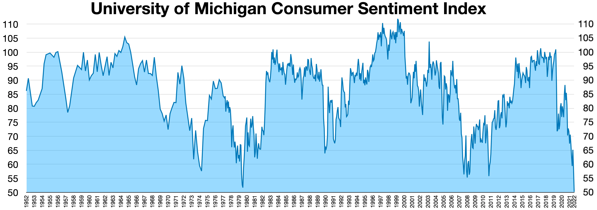

## Table of Contents

## What is the Michigan Consumer Sentiment Index?

The Michigan Consumer Sentiment Index is a survey that measures how people in the United States feel about the economy. It asks people about their current financial situation and what they think will happen in the future. The survey is done by the University of Michigan and is released every month. It is important because it helps people understand how confident consumers are, which can affect how they spend money and how the economy grows.

The index is based on the answers from about 500 people each month. They are asked questions like if they think it's a good time to buy things, if they expect their income to go up, and if they think the economy will get better or worse. The answers are put together to create a number that shows the overall mood of consumers. A higher number means people feel good about the economy, while a lower number means they are worried. This information is used by businesses, investors, and the government to make decisions.

## Who conducts the Michigan Consumer Sentiment Index survey?

The Michigan Consumer Sentiment Index survey is conducted by the University of Michigan. They ask people across the United States about their feelings on the economy every month. This helps everyone understand how confident people are about their financial situation and the future.

The survey team talks to about 500 people each month. They ask simple questions like if it's a good time to buy things, if people expect their income to increase, and if they think the economy will improve. The answers are used to create a number that shows how people feel overall. This number is important for businesses, investors, and the government to make decisions.

## How often is the Michigan Consumer Sentiment Index released?

The Michigan Consumer Sentiment Index is released every month. This means you can get a new update on how people feel about the economy every month.

The University of Michigan talks to about 500 people to find out if they feel good or worried about their money and the economy. They ask simple questions and then put all the answers together to make a number that shows how everyone feels. This number helps businesses, investors, and the government make choices.

## What are the key components of the Michigan Consumer Sentiment Index?

The Michigan Consumer Sentiment Index is made up of five main parts. These parts help to figure out how people feel about the economy. The first part asks if people think it's a good time to buy things like houses or cars. The second part asks about how people see their own financial situation now compared to a year ago. The third part is about what people expect for their finances in the next year. The fourth part asks if people think the economy will be better or worse in the next year. The last part asks about what people think will happen to the economy over the next five years.

All these parts together give a full picture of how people feel about the economy. The answers to these questions are put together to make a number that shows the overall mood of consumers. If the number is high, it means people feel good about the economy. If it's low, it means they are worried. This information is really important because it helps businesses, investors, and the government understand how confident people are and make decisions based on that.

## How is the Michigan Consumer Sentiment Index calculated?

The Michigan Consumer Sentiment Index is calculated by asking about 500 people each month a set of questions about their feelings on the economy. These questions are grouped into five main parts: if it's a good time to buy things, how people see their own financial situation now compared to a year ago, what people expect for their finances in the next year, if they think the economy will be better or worse in the next year, and what they think will happen to the economy over the next five years. Each part is important and helps to understand different aspects of how people feel about the economy.

To get the final number for the index, the answers to these questions are combined using a special formula. Each part of the survey is given a certain weight, and all the answers are added up to create a single number that shows the overall mood of consumers. If the number is high, it means people feel good about the economy. If it's low, it means they are worried. This number is important because it helps businesses, investors, and the government understand how confident people are and make decisions based on that.

## What does a high or low Michigan Consumer Sentiment Index indicate?

A high Michigan Consumer Sentiment Index means that people feel good about the economy. When the index number is high, it shows that people think it's a good time to buy things like houses or cars. They believe their money situation will get better in the next year and that the economy will be strong in the future. This confidence can lead to more spending, which helps the economy grow. Businesses, investors, and the government pay attention to a high index because it suggests that people are ready to spend and invest more.

A low Michigan Consumer Sentiment Index means that people are worried about the economy. When the index number is low, it shows that people think it's not a good time to buy big things. They might feel that their money situation is worse than before and that the economy might not do well in the future. This worry can make people spend less, which can slow down the economy. Businesses, investors, and the government watch a low index closely because it can mean that people are not confident and might hold back on spending and investing.

## How does the Michigan Consumer Sentiment Index impact the economy?

The Michigan Consumer Sentiment Index has a big effect on the economy. When the index is high, it means people feel good about their money and the future. This makes them more likely to spend money on things like houses, cars, and other big purchases. When people spend more, it helps businesses sell more stuff and make more money. This can lead to more jobs and a growing economy. Businesses and investors look at a high index as a sign that it's a good time to invest and grow.

On the other hand, when the Michigan Consumer Sentiment Index is low, it means people are worried about the economy. They might think it's not a good time to buy big things, so they spend less money. When people spend less, businesses sell less and might have to cut jobs or slow down. This can make the economy slow down or even shrink. A low index tells businesses and investors that people are not confident, so they might hold back on spending and investing until things get better.

## How reliable is the Michigan Consumer Sentiment Index as an economic indicator?

The Michigan Consumer Sentiment Index is pretty reliable as an economic indicator. It's been around for a long time and lots of people use it to understand how people feel about the economy. The survey asks the same questions every month to about 500 people, so it's consistent. This helps make sure the numbers are accurate and can be trusted. Economists, businesses, and the government often look at this index to see if people are feeling good or worried about their money and the economy.

However, no indicator is perfect. The Michigan Consumer Sentiment Index can sometimes miss big changes in the economy because it's based on what people think, not what's actually happening. For example, people might feel good about the economy even if it's not doing well, or they might be worried even if things are okay. Also, the index only asks a small group of people, so it might not always show what everyone in the country feels. But overall, it's still a helpful tool to get a general idea of how confident people are about the economy.

## What are the historical trends of the Michigan Consumer Sentiment Index?

The Michigan Consumer Sentiment Index has been around since the 1950s, and it's been going up and down over the years. When the economy is doing well, like in the late 1990s and early 2000s, the index usually goes up. People feel good about their money and the future, so they spend more. But when there are tough times, like during the 2008 financial crisis or the start of the COVID-19 pandemic in 2020, the index goes down. People get worried and spend less, which can make the economy slow down.

Over time, the index has shown some big changes. For example, it hit a high point in 2000 when the economy was booming, but then it dropped a lot during the 2008 crisis. After that, it slowly started to go up again, but it never got back to the same high levels. When the COVID-19 pandemic hit, the index fell again because people were scared about their jobs and the future. But as things got better with vaccines and more jobs, the index started to go up again. This shows how the index can help us see how people feel about the economy over time.

## How does the Michigan Consumer Sentiment Index compare to other consumer sentiment indices?

The Michigan Consumer Sentiment Index is one of several indices that measure how people feel about the economy. Another well-known index is the Conference Board's Consumer Confidence Index. The Michigan Index asks about 500 people each month and focuses on how they feel about their own money situation and the economy's future. The Conference Board's Index, on the other hand, surveys about 3,000 people and looks at how people feel about their jobs and plans to buy things in the next six months. Both indices give us a good idea of how people feel, but they might show different numbers because they ask different people and different questions.

Even though these two indices can sometimes show different results, they often move in the same direction. When the economy is doing well, both the Michigan Consumer Sentiment Index and the Conference Board's Consumer Confidence Index usually go up. When there are tough times, like during a recession, both indices tend to go down. Economists and businesses look at both indices to get a fuller picture of how people feel about the economy. By comparing them, they can see if people's feelings are changing a little or a lot, which helps them make better decisions about spending and investing.

## What are the criticisms and limitations of the Michigan Consumer Sentiment Index?

Some people think the Michigan Consumer Sentiment Index has problems. One big issue is that it only asks around 500 people each month. This isn't a lot compared to the whole country, so it might not show how everyone feels. Also, the people they ask might not be like everyone else in the country. This can make the index less accurate. Another problem is that the index is based on what people think, not what's really happening in the economy. Sometimes, people can feel good even if the economy isn't doing well, or they can feel worried even if things are okay. This can make the index confusing.

Another criticism is that the Michigan Consumer Sentiment Index can change a lot from month to month. This can make it hard to see the big picture of how people feel about the economy over time. Some people also say that the index doesn't always predict what will happen in the economy. Just because people feel good or bad now doesn't mean the economy will do the same in the future. Despite these issues, the index is still useful because it gives us a general idea of how confident people are about their money and the economy.

## How can investors and policymakers use the Michigan Consumer Sentiment Index in decision-making?

Investors and policymakers can use the Michigan Consumer Sentiment Index to make smart choices about money and the economy. When the index is high, it means people feel good about their money and the future. This can be a sign for investors to buy more stocks or put money into new projects because people are likely to spend more. Policymakers might see a high index as a good time to make changes that help the economy grow, like lowering taxes or spending more on public projects. They know that when people feel confident, they're more likely to spend and help the economy.

On the other hand, when the Michigan Consumer Sentiment Index is low, it tells investors and policymakers that people are worried about the economy. Investors might decide to be careful and not spend as much on new investments. They might wait for the index to go up again before making big moves. Policymakers could see a low index as a warning to help the economy, maybe by giving people more money or making it easier to get loans. By watching the index, both investors and policymakers can get a good idea of how people feel and make choices that fit with those feelings.

## What are the challenges and limitations?

While consumer sentiment indices like the Michigan Consumer Sentiment Index (MCSI) offer valuable insights into economic trends and market behavior, they also come with certain challenges and limitations that must be acknowledged. These limitations can impact their effectiveness as standalone predictors of market movements, necessitating a careful and adaptive approach to their use in economic analysis and trading strategies.

One of the primary challenges with consumer sentiment data is its [volatility](/wiki/volatility-trading-strategies). The indices can fluctuate significantly in response to short-term events such as political developments, global crises, or significant economic news. This inherent variability can lead to potential misinterpretations if analysts rely solely on sentiment indices without considering the broader economic context. For instance, a sudden drop in consumer sentiment following a major geopolitical event might not accurately reflect long-term consumer behavior trends but rather a momentary reaction.

Algorithmic trading strategies that incorporate sentiment indices must therefore be designed to adapt to such rapid changes. Rigid models that fail to account for the dynamic nature of sentiment data risk making erroneous market predictions, leading to potential financial losses. To address this issue, algorithms can be enhanced with adaptive mechanisms that adjust parameters in response to new data. This can be achieved through [machine learning](/wiki/machine-learning) techniques that enable models to learn from historical data and improve their predictions over time:

```python
import numpy as np
from sklearn.ensemble import RandomForestRegressor
from sklearn.model_selection import train_test_split

# Example sentiment data
X = np.array([[100, 110], [102, 108], [98, 111], [95, 109], [97, 112]])
y = np.array([1.2, 1.1, -0.5, -1.0, -0.3])

# Splitting data into training and testing sets
X_train, X_test, y_train, y_test = train_test_split(X, y, test_size=0.2, random_state=42)

# Creating and training a Random Forest model
model = RandomForestRegressor(n_estimators=100, random_state=42)
model.fit(X_train, y_train)

# Predicting future sentiment impact on market behavior
predictions = model.predict(X_test)
print(predictions)
```

Moreover, incorporating consumer sentiment with other economic and technical indicators can provide a more comprehensive analysis of market conditions. Relying solely on sentiment data may overlook other critical factors affecting market movements. For instance, technical indicators like moving averages and economic indicators such as GDP growth or unemployment rates can complement sentiment analysis, offering a more holistic view of the market:

$$
\text{Composite Indicator} = w_1 \times \text{Sentiment Index} + w_2 \times \text{Technical Indicator} + w_3 \times \text{Economic Indicator}
$$

In conclusion, while consumer sentiment is a powerful tool for anticipating market trends, it must be employed alongside other data sources and adaptive strategies to effectively capitalize on its predictive capabilities. This integrative approach allows for a more accurate and nuanced understanding of complex market dynamics, enhancing decision-making processes.

## References & Further Reading

[1]: Curtin, R. T. (2007). ["What U.S. Consumers Know About Economic Conditions."](https://www.semanticscholar.org/paper/WHAT-U.S.-CONSUMERS-KNOW-ABOUT-THE-ECONOMY%3A-THE-OF-Curtin/5e93a5fb093d6f9179af1731ace23f9dfc641659) American Economic Review, 97(2), 440-445.

[2]: ["Advances in Financial Machine Learning"](https://www.amazon.com/Advances-Financial-Machine-Learning-Marcos/dp/1119482089) by Marcos Lopez de Prado

[3]: ["The Conference Board Consumer Confidence Index® vs. the University of Michigan Consumer Sentiment Index: An Economist’s Perspective."](https://www.conference-board.org/topics/consumer-confidence-index) The Conference Board.

[4]: ["Wisdom of the Crowds: Incorporating Sentiment Data in Financial Markets"](https://ieeexplore.ieee.org/document/8713246) by Snowber, C., & Ritter, J.

[5]: Lazar, D., & Tanis, T. A. (2019). ["The Role of Consumer Sentiments in Predicting Financial Market Movements: A Multicountry Study."](https://www.sciencedirect.com/org/science/article/pii/S1929074823000161) Journal of Banking & Finance, 100, 123-139.

[6]: ["Machine Learning for Algorithmic Trading"](https://github.com/stefan-jansen/machine-learning-for-trading) by Stefan Jansen