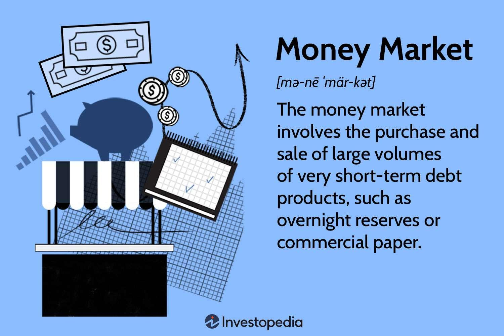

## Table of Contents

## What is the money market?

The money market is a part of the financial market where short-term borrowing and lending happen. It involves trading in very liquid assets that can be quickly turned into cash. These assets usually have a maturity of one year or less. Banks, financial institutions, and big companies use the money market to manage their short-term cash needs. For example, a company might use it to get quick cash to pay its bills, while a bank might use it to lend out extra money it has.

The money market includes different types of instruments like Treasury bills, commercial paper, and certificates of deposit. Treasury bills are short-term government securities that are considered very safe. Commercial paper is a type of short-term debt issued by companies. Certificates of deposit are time deposits offered by banks with a fixed interest rate and maturity date. These instruments help keep the financial system stable by providing a way for money to move quickly and safely between those who need it and those who have it to lend.

## What are the main instruments traded in the money market?

In the money market, people trade different types of short-term financial tools. The main ones are Treasury bills, commercial paper, and certificates of deposit. Treasury bills, or T-bills, are like IOUs from the government. They are very safe because they are backed by the government. They usually last for a few weeks to a year. Companies use commercial paper to borrow money quickly. It's like a short-term loan that companies promise to pay back soon, usually within 270 days.

Certificates of deposit, or CDs, are another common tool in the money market. Banks offer these, and they work like a savings account where you agree to leave your money in the bank for a set time. In return, the bank gives you a fixed interest rate. These are popular because they are safe and give a bit more interest than regular savings accounts. All these tools help keep money moving smoothly in the economy, making sure that businesses and banks can manage their cash needs effectively.

## Who are the typical participants in the money market?

The money market has many different players, but the main ones are banks, financial institutions, and big companies. Banks use the money market to manage their cash flow. They might lend out extra money they have or borrow money if they need it quickly. Financial institutions, like investment firms, also play a big role. They help move money around and make sure it goes where it's needed.

Big companies are another key group in the money market. They use it to get quick cash to pay for things like bills or to keep their business running smoothly. Sometimes, governments also participate in the money market. They issue Treasury bills to borrow money for short periods. All these players work together to keep the money market running smoothly, making sure there's always enough cash flowing to meet everyone's needs.

## How does the money market differ from the capital market?

The money market and the capital market are both parts of the financial world, but they work in different ways. The money market is all about short-term borrowing and lending. It deals with things like Treasury bills, commercial paper, and certificates of deposit, which usually last less than a year. Banks, big companies, and financial institutions use the money market to manage their cash quickly and safely. It's like a place where they can get or lend money for a short time.

On the other hand, the capital market is focused on long-term investments. It includes things like stocks and bonds, which can last for many years. Companies and governments use the capital market to raise money for big projects or long-term needs. For example, a company might issue stocks to get money to build a new factory, or a government might issue bonds to fund a new highway. The capital market helps connect people who want to invest their money for a long time with those who need it for big projects.

## What role does the money market play in the overall financial system?

The money market is like the heart of the financial system, keeping money flowing smoothly. It helps banks, big companies, and financial institutions manage their short-term cash needs. For example, if a company needs quick cash to pay its bills, it can use the money market to borrow money for a short time. Banks can also lend out extra money they have, making sure it doesn't just sit idle. This quick movement of money helps keep the economy stable and makes sure everyone has the cash they need when they need it.

The money market also helps control interest rates and keeps the financial system safe. When banks and companies can easily borrow and lend money, it helps set fair interest rates for everyone. Plus, the money market uses safe tools like Treasury bills and certificates of deposit, which are backed by the government or banks. This safety helps prevent big financial problems and keeps the whole system running smoothly. In short, the money market is crucial for making sure money moves quickly and safely, helping the entire financial system work well.

## How do money market funds work and what are their benefits?

Money market funds are a type of investment where people pool their money together to buy short-term, safe financial tools like Treasury bills and commercial paper. These funds are managed by professionals who aim to keep the value of the fund stable and provide a small amount of interest to investors. When you invest in a money market fund, you're basically lending your money to the fund, and in return, you get a share of the interest earned from the short-term investments the fund makes.

The main benefit of money market funds is that they are very safe and easy to get your money out of. Because they invest in short-term, high-quality securities, the risk of losing money is low. This makes them a good place to park your cash if you want to keep it safe but still earn a little interest. Another benefit is that money market funds are very liquid, meaning you can usually get your money back quickly if you need it. This makes them a good choice for people who want to keep their money safe and accessible while still earning a bit of interest.

## What are the risks associated with investing in the money market?

Investing in the money market is usually seen as safe, but there are still some risks to think about. One risk is interest rate risk. This means that if interest rates go up, the value of the money market instruments you own might go down. For example, if you have a certificate of deposit that pays a fixed interest rate, and then interest rates go up, new CDs will offer higher rates, making your old CD less valuable. Another risk is credit risk, which is the chance that the issuer of the money market instrument, like a company issuing commercial paper, might not be able to pay you back. This is less common with government-backed securities like Treasury bills, but it can happen with other types of money market instruments.

Another risk to consider is liquidity risk. This is the chance that you might not be able to sell your money market instrument quickly or at a fair price when you need to. While money market instruments are generally very liquid, there can be times when the market is not working smoothly, and it might be harder to get your money out. Lastly, there's the risk of inflation. If the interest you earn from your money market investments is less than the rate of inflation, the buying power of your money could go down over time. Even though these risks are usually small, it's good to know about them before you decide to invest in the money market.

## How do interest rates affect the money market?

Interest rates have a big impact on the money market. When interest rates go up, it usually means that the cost of borrowing money goes up too. This can make people and companies think twice about borrowing money through the money market. On the other hand, higher interest rates can be good for people who want to lend money. They can earn more interest on their money market investments like Treasury bills or certificates of deposit. So, when interest rates rise, there might be more people wanting to lend money and fewer people wanting to borrow it.

When interest rates go down, the opposite happens. Borrowing money becomes cheaper, so more people and companies might want to use the money market to get quick cash. This can make the money market busier. But for people who want to lend money, lower interest rates mean they earn less interest on their investments. So, they might not be as interested in putting their money into the money market. Overall, interest rates help decide how much people want to borrow or lend in the money market, which keeps the whole financial system moving.

## What is the significance of the money market in monetary policy?

The money market is very important for monetary policy because it helps central banks control the amount of money in the economy. Central banks, like the Federal Reserve in the U.S., use tools like setting interest rates to make sure there's not too much or too little money floating around. When they want to slow down the economy and stop inflation, they might raise interest rates. This makes borrowing money more expensive, so fewer people and companies borrow from the money market. On the other hand, if they want to help the economy grow, they might lower interest rates, making borrowing cheaper and encouraging more activity in the money market.

The money market also helps central banks see how well their policies are working. By watching what's happening in the money market, like how much people are borrowing and lending, central banks can tell if their interest rate changes are having the effect they want. If the money market is busy and interest rates are low, it might mean the economy is growing well. But if the money market is quiet and interest rates are high, it might mean the economy needs more help. So, the money market is a key part of how central banks manage the economy and keep it stable.

## How can one invest in the money market and what are the entry requirements?

Investing in the money market is pretty straightforward. You can start by putting your money into money market funds, which are like big pools of money from many people that are used to buy short-term, safe investments like Treasury bills and commercial paper. To invest in a money market fund, you usually need to open an account with a financial institution like a bank or a brokerage firm. The entry requirements can be different depending on the fund, but many funds let you start with a small amount of money, sometimes as little as $1,000 or even less.

Another way to invest in the money market is by buying money market instruments directly, like Treasury bills or certificates of deposit. To do this, you might need to have a bit more money and know-how. For example, you can buy Treasury bills through the U.S. Department of the Treasury's website, and you usually need to buy them in larger amounts, like $100 or more. Certificates of deposit can be bought from banks, and the entry requirements can vary, but you might need to put in at least $1,000. Both ways of investing in the money market are safe and can help you earn a little interest on your money while keeping it easy to get to if you need it.

## What advanced strategies can be used to optimize returns in the money market?

To optimize returns in the money market, one advanced strategy is to use a laddering approach. This means you spread out your investments over different maturity dates. For example, instead of putting all your money into one certificate of deposit that matures in a year, you could buy several CDs that mature at different times, like one in three months, another in six months, and another in nine months. This way, you can take advantage of changing interest rates. If rates go up, you can reinvest the money from the CDs that mature earlier at the new, higher rate. This strategy helps you earn more interest over time and keeps your money more flexible.

Another strategy is to actively manage your money market investments. This means you keep an eye on interest rates and economic news, and you move your money around to where you can get the best returns. For example, if you see that interest rates are going up, you might want to move your money into shorter-term investments so you can quickly reinvest at the higher rates. Or, if you think rates are going to go down, you might choose longer-term investments to lock in the current higher rates. This takes more work and knowledge, but it can help you get better returns from the money market.

## How do global money markets interact and influence each other?

Global money markets are connected and can affect each other a lot. When something big happens in one country's money market, like a change in interest rates, it can spread to other countries. For example, if the U.S. raises its interest rates, it might make people from other countries want to move their money to the U.S. to get better returns. This can make money move out of other countries' money markets, which might cause their interest rates to change too. It's like a chain reaction where what happens in one place can have a big impact on other places.

This connection also means that global events, like economic crises or big policy changes, can shake up money markets all over the world. If there's a financial problem in one country, it can make people worried and less willing to lend or borrow money in other countries' money markets. Central banks around the world watch each other closely and often work together to keep things stable. They might change their own interest rates or take other steps to help calm things down if they see trouble coming from another country's money market. So, even though each country has its own money market, they are all linked together and can influence each other in big ways.

## References & Further Reading

[1]: ["Money Market Instruments"](https://www.investopedia.com/terms/m/moneymarket.asp) - Investopedia

[2]: Stefan Jansen, ["Machine Learning for Algorithmic Trading"](https://github.com/stefan-jansen/machine-learning-for-trading), Packt Publishing.

[3]: Ernest P. Chan, ["Quantitative Trading: How to Build Your Own Algorithmic Trading Business"](https://www.amazon.com/Quantitative-Trading-Build-Algorithmic-Business/dp/0470284889), Wiley Trading.

[4]: Marcos Lopez de Prado, ["Advances in Financial Machine Learning"](https://www.amazon.com/Advances-Financial-Machine-Learning-Marcos/dp/1119482089), Wiley.

[5]: David Aronson, ["Evidence-Based Technical Analysis: Applying the Scientific Method and Statistical Inference to Trading Signals"](https://www.amazon.com/Evidence-Based-Technical-Analysis-Scientific-Statistical/dp/0470008741), Wiley.

[6]: ["Algorithmic Trading"](https://www.investopedia.com/articles/active-trading/101014/basics-algorithmic-trading-concepts-and-examples.asp) - Investopedia

[7]: ["The Handbook of Electronic Trading"](https://iqpc.com/media/1003808/45039.pdf) by Joseph Rosen

[8]: ["Trading and Exchanges: Market Microstructure for Practitioners"](https://archive.org/details/tradingexchanges0000harr) by Larry Harris

