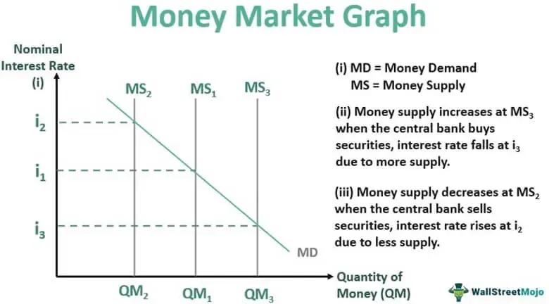

The evolving landscape of financial markets has consistently introduced new avenues for investment, providing opportunities through various financial instruments, money market ventures, and the innovative sphere of algorithmic trading. These developments present both challenges and opportunities for investors keen on maximizing their returns while managing risks effectively. 

This article aims to explore the complexities surrounding money market investments and the operational dynamics and benefits of algorithmic trading. By examining these elements, investors can better leverage financial instruments to craft optimal investment strategies that balance risk and return. Money market instruments, known for their safety and liquidity, are highlighted for their advantages to individual investors seeking stable returns. In contrast, algorithmic trading, which automates trading decisions, represents a significant technological advancement in financial markets, facilitating speed and precision.



Understanding the intricacies of money market investments along with the mechanics of algorithmic trading is essential for any investor aiming to broaden their financial knowledge and embrace diversified investment opportunities. These concepts form the foundation for developing robust strategies that accommodate both current market trends and foreseeable future advancements.

## Table of Contents

## Understanding Financial Instruments

Financial instruments represent a wide spectrum of tradeable assets, including stocks, bonds, options, and various derivatives. These instruments are integral for investors who seek to allocate resources effectively, aiming to generate potential returns aligned with their risk tolerance.

A key category of financial instruments is equities or stocks, representing ownership in a corporation and entitling the holder to a portion of the profits, typically through dividends. Equities are considered high-risk but also offer potentially high returns, making them attractive to investors looking for growth.

Bonds signify a loan made by the investor to a borrower, which could be a corporation, government, or other entity. Bonds typically provide regular interest payments and the return of principal at maturity. They are generally perceived as lower risk compared to stocks, suiting investors with a preference for stable income.

Options are contracts that provide the buyer the right, but not the obligation, to buy or sell an asset at a predetermined price before a specified date. Options are versatile, allowing investors to hedge against fluctuations or speculate on the future price movements of an asset.

Derivatives are complex financial instruments whose value is derived from underlying assets, such as stocks, bonds, currencies, or interest rates. They can be used for hedging risks or speculating on asset price changes, offering significant leverage but also increasing potential risk.

Money market instruments, including Treasury bills (T-bills), commercial papers, and certificates of deposit (CDs), are typically short-term, offering high [liquidity](/wiki/liquidity-risk-premium) and safety. They are ideal for conservative investors or those who require quick access to their funds. T-bills are considered risk-free, being backed by the government, while commercial papers are unsecured and rely on the issuing corporation's creditworthiness. CDs provide higher interest rates than savings accounts due to their fixed-term nature.

When constructing a diversified investment portfolio, understanding the role of each financial instrument is crucial. Equities may drive growth, bonds can provide income stability, options offer flexibility in strategy implementation, and derivatives allow for risk management and speculative opportunities. A balanced portfolio considers the investor's risk tolerance, time horizon, and financial goals, incorporating a mix of these instruments to optimize returns while managing risk exposure.

 to Money Market Investing

The money market is a crucial segment of the financial market where short-term borrowing and lending occur, typically for durations of one year or less. This market is instrumental in providing high liquidity solutions while prioritizing safety for both individual and institutional investors. Money market investments are often structured to meet immediate financial needs with minimal risk, which makes them an attractive choice for conservative investors seeking stability and liquidity over high returns.

Key features of money market investments include their emphasis on preserving capital and providing liquidity. This is achieved through the deployment of instruments such as Treasury bills, commercial papers, and money market funds. Each of these instruments is designed to offer a relatively stable return, contributing to a well-balanced investment portfolio.

Treasury bills, often referred to as T-bills, are short-term government securities issued to finance national debt obligations. They are considered one of the safest investments as they are backed by the full faith and credit of the issuing government. Commercial papers are unsecured, promissory notes with fixed maturity dates, generally issued by corporations to meet short-term liabilities such as payroll or inventory needs. These instruments offer higher returns compared to Treasury bills but come with slightly higher risk due to their reliance on the issuing company's creditworthiness.

Money market funds are mutual funds that invest in short-term, high-quality debt securities. They provide investors with diversified exposure to the money market, offering both safety and a reasonable degree of liquidity. These funds aim to keep their net asset value (NAV) stable, typically at $1 per share, while [earning](/wiki/earning-announcement) interest from the underlying debt securities. 

Incorporating money market instruments into a diversified investment strategy can enhance an investor's ability to manage liquidity risk and provide a buffer against market [volatility](/wiki/volatility-trading-strategies). Thus, money market investments serve as an integral component of strategic asset allocation, ensuring that investors have access to liquid assets while mitigating exposure to market risks.

## Types of Money Market Instruments

Money market instruments encompass a broad spectrum of financial products, each distinguished by its particular utilities and associated risks. These instruments are primarily employed for short-term borrowing and lending, generally with maturities of one year or less. They are valued for their liquidity, security, and relatively stable returns, making them appealing to both individual and institutional investors seeking to manage cash reserves and mitigate risk.

**Treasury Bills (T-Bills):** Treasury bills are short-term government securities issued by a country’s treasury department. In the United States, for instance, T-Bills are issued by the U.S. Department of the Treasury and are considered one of the most secure investments available due to government backing. They are typically sold at a discount to face value, and the return on investment is the difference between the purchase price and the amount paid at maturity. T-Bills can be issued with various maturities, such as four, eight, thirteen, twenty-six, and fifty-two weeks, providing flexibility and reliable liquidity for investors. Their risk-free nature makes them an essential tool in financing government deficits and a foundational component of many investment portfolios.

**Commercial Paper:** Commercial paper is a short-term, unsecured debt instrument issued by corporations to meet immediate funding needs, such as payroll or inventory financing. These instruments typically have maturities ranging from a few days to a few months and are issued at a discount from face value. Given their unsecured status, commercial papers are typically issued by corporations with high credit ratings, as these instruments rely heavily on the issuer's creditworthiness. They offer a higher yield than Treasury bills, compensating for the additional credit risk. Commercial paper is a critical aspect of corporate funding strategies, providing a cost-effective alternative to other short-term borrowing options.

**Certificates of Deposit (CDs):** Certificates of deposit are time deposits offered by banks and financial institutions, which provide higher interest rates compared to regular savings accounts. Investors commit their funds for a fixed term, and in return, they receive an agreed-upon interest rate. The maturity periods for CDs can range from a few weeks to several years. In general, the longer the term, the higher the interest rate. While CDs are low-risk investments insured by the Federal Deposit Insurance Corporation (FDIC) up to the applicable limits, early withdrawal can result in penalties, thus affecting their liquidity compared to other money market instruments. CDs are a popular choice for investors requiring assured returns over a specific period.

**Money Market Funds:** Money market funds are mutual funds that invest primarily in short-term, high-quality debt securities such as Treasury bills, commercial paper, and certificates of deposit. These funds aim to offer investors high liquidity, capital preservation, and a slight yield enhancement over traditional savings accounts. The diversification inherent to money market funds allows for reduced risk exposure, although they are not risk-free. Unlike the individual instruments themselves, these funds provide a mechanism for investors to gain broad exposure to the money market sector without having to purchase individual securities directly. Money market funds adjust their portfolios to maintain a stable net asset value (NAV), often pegged at $1 per share, although there is no guarantee this will always be maintained.

These instruments collectively help investors manage short-term cash needs while contributing to financial stability in the broader economy. Each instrument offers unique characteristics and benefits, influencing individual and institutional approaches to managing liquidity and risk.

## Algorithmic Trading: An Overview

Algorithmic trading, often referred to as algo-trading, is a method of executing orders using automated and pre-programmed trading instructions. These computer programs consider variables such as time, price, and [volume](/wiki/volume-trading-strategy) to make decisions, reducing the need for direct human intervention. By leveraging the power of algorithms, traders can achieve higher execution speed and accuracy, which is one of the primary benefits of this technology over manual trading.

One of the strengths of [algorithmic trading](/wiki/algorithmic-trading) is its capacity to remove human emotions from the trading process. Emotional trading can lead to irrational decisions, impacting the overall performance. By relying on algorithms, traders can ensure more consistent and disciplined strategies. Furthermore, the speed at which these algorithms operate enables them to capitalize on fleeting market opportunities that are often missed by human traders.

Algorithmic trading supports a wide array of strategies tailored to different market conditions and trader objectives. Trend-following strategies, for example, attempt to capture gains through the analysis of an asset's [momentum](/wiki/momentum) in a particular direction. These strategies might use moving averages or other technical indicators as triggers for trade execution. Arbitrage strategies exploit price differentials of the same asset across different markets or platforms. When a discrepancy is detected, the algorithm executes simultaneous buy and sell orders to lock in profits. Market making, another prevalent strategy, involves providing liquidity to the markets by quoting both a buy and a sell price to earn the bid-ask spread.

The role of algo-trading extends beyond mere execution improvements. It enhances market liquidity and contributes to a more efficient market environment. By providing systematic and consistent trading activity, algorithmic trading mechanisms help stabilize prices and reduce the volatility typically associated with manual order entries.

In essence, algorithmic trading represents a pivotal development in modern finance. Its impact on trading efficiency, market liquidity, and the reduction of manual errors underscores its importance. As financial markets become increasingly complex, reliance on automated trading strategies is likely to intensify, further embedding algorithmic trading as a cornerstone of contemporary trading practices.

## How Algorithmic Trading Works

Algorithmic trading systems are designed to implement trading strategies by executing trades according to a predefined set of rules. These rules typically involve parameters such as timing, price, quantity, or mathematical models. For instance, a simple example of a trading rule might be to buy a stock when a fast-moving average of its price crosses above a slow-moving average (a popular trend-following strategy).

To execute such rules efficiently, algorithmic trading systems heavily rely on the analysis of large datasets. This analysis involves processing current and historical market data to identify trading opportunities. Algorithms can scan and interpret data across multiple markets within milliseconds, allowing traders to capitalize on fleeting market inefficiencies.

Core components of an algorithmic trading system include market data feeds, which supply real-time price and transaction data; robust network connectivity, ensuring prompt data transmission and trade execution; and sophisticated software for decision-making and order placement. Additionally, the ability to backtest strategies is a crucial element, allowing traders to evaluate the performance of algorithms against historical market data to refine their rules and maximize profitability.

Python, a widely used programming language in finance, offers tools for building algorithmic trading systems. Here's a simple Python example illustrating a moving average crossover strategy:

```python
import pandas as pd

# Sample market data
data = {'price': [100, 102, 101, 105, 107, 108, 110, 108, 109, 112]}
df = pd.DataFrame(data)

# Calculate moving averages
df['fast_ma'] = df['price'].rolling(window=3).mean()
df['slow_ma'] = df['price'].rolling(window=5).mean()

# Generate trading signals
df['signal'] = 0
df['signal'][3:] = np.where(df['fast_ma'][3:] > df['slow_ma'][3:], 1, 0)  # Buy signal
df['position'] = df['signal'].diff()

print(df)
```

This code snippet calculates fast and slow moving averages for a series of prices and generates buy signals when the fast moving average crosses above the slow moving average.

Algorithmic trading's ability to execute trades at optimal prices and minimize trading fees without human intervention is a major benefit. By responding to market changes swiftly and precisely, these systems help traders gain a competitive edge. However, reliance on technology also means they are susceptible to technical glitches and require continuous monitoring to ensure the robustness of strategies in dynamic market conditions.

## Pros and Cons of Algorithmic Trading

Algorithmic trading, or algo-trading, provides several advantages to traders and investors, significantly enhancing efficiency and decision-making precision. One of the primary benefits is the faster execution of trades. By using advanced algorithms, traders can execute orders in fractions of a second, capturing price movements that might be imperceptible to human traders. This speed ensures that traders can take advantage of market opportunities as they arise.

Another advantage is the reduction in transaction costs. Automated systems can execute large numbers of trades more efficiently than humans, optimizing the timing and routing of orders to minimize expenses. By eliminating human intervention, algorithmic trading also removes emotional decision-making, which can lead to more disciplined and objective trading strategies.

Furthermore, algorithmic trading algorithms can simultaneously monitor and analyze multiple market conditions. This capability allows traders to manage vast datasets and integrate diverse indicators into their trading strategies, potentially leading to better-informed decisions and diversified investment approaches.

Despite these advantages, algorithmic trading also introduces several challenges. One significant concern is the dependence on technology. Given that algo-trading heavily relies on complex software and systems, there is an inherent risk of technical failures, such as software bugs or unexpected shutdowns, which can result in substantial financial losses.

Algorithmic trading can also contribute to market volatility. The rapid execution of large volumes of trades can exacerbate price fluctuations, particularly during periods of low liquidity or when many traders use similar strategies. Additionally, the automated nature of algo-trading requires extensive regulatory oversight to ensure market stability and prevent manipulative practices, posing challenges for compliance with evolving legal frameworks.

Ultimately, while algorithmic trading can offer enhanced efficiency and effectiveness, its reliance on technology makes it susceptible to certain risks. Therefore, investors should carefully evaluate these factors before incorporating algorithmic solutions into their trading activities, taking care to implement robust risk management protocols and staying abreast of regulatory developments to mitigate potential negative impacts.

## Combining Money Market Instruments and Algorithmic Trading

Investors can leverage algorithmic trading to enhance strategies involving money market instruments, thereby ensuring the optimal execution of trades while minimizing operational risks. Algorithmic trading employs sophisticated mathematical models and high-speed computational power to execute trades based on pre-defined criteria, enabling precise entry and [exit](/wiki/exit-strategy) points in the market. This precision is particularly beneficial in money markets where liquidity and timing are crucial for investment success.

One of the primary advantages of integrating algorithmic trading with money market investments is the ability to capitalize on [arbitrage](/wiki/arbitrage) opportunities. Arbitrage involves exploiting price inefficiencies between similar financial instruments across different markets or platforms. By employing algorithms, investors can rapidly identify these discrepancies and execute trades at speeds unattainable by human traders, thus enhancing returns while carefully managing exposure.

In money markets, characterized by short-term lending and borrowing, the use of algorithms ensures that trades are executed at the most favorable times, which is critical for maximizing liquidity benefits. This is achieved by automatically analyzing vast amounts of market data to identify optimal trading conditions, allowing for swift response to market fluctuations. The result is not only enhanced liquidity management but also reduced exposure to the volatility inherent in short-term instruments.

Implementing algorithmic trading strategies in conjunction with money market instruments necessitates a robust technical infrastructure. This includes reliable market data feeds, high-speed network connectivity, and sophisticated analytics platforms capable of both real-time and historical data processing. Furthermore, a comprehensive understanding of both financial instruments and algorithmic processes is essential for successful integration. Such expertise enables investors to refine trading algorithms continuously, ensuring they adapt to evolving market conditions and maintain optimal performance.

To implement a simple algorithmic trading strategy in Python, one might use libraries such as `pandas` for data manipulation, `numpy` for numerical calculations, and [machine learning](/wiki/machine-learning) tools like `scikit-learn` for predictive analyses. Here's a basic example of a trading algorithm structure:

```python
import pandas as pd
import numpy as np
from sklearn.linear_model import LinearRegression

# Load market data
data = pd.read_csv('market_data.csv')
prices = data['prices'].values

# Feature engineering
X = np.arange(len(prices)).reshape(-1, 1)
y = prices

# Train a simple predictive model
model = LinearRegression()
model.fit(X, y)

# Predict future prices
predicted_prices = model.predict(X)

# Generate buy/sell signals based on predictions
signals = np.where(predicted_prices > y, 'Buy', 'Sell')

# Output signals for action
for time, signal in enumerate(signals):
    print(f"Time {time}: {signal}")
```

Integrating algorithmic trading with money market instruments provides a potent combination for investors aiming to achieve superior efficiency and profitability in fast-paced financial environments.

## The Future of Investing with AI and Automation

The advent of [artificial intelligence](/wiki/ai-artificial-intelligence) (AI) and automation is significantly transforming the landscape of investing, particularly in the domain of algorithmic trading. AI-driven trading strategies rely on advanced machine learning algorithms that can analyze vast datasets more efficiently and effectively than human traders. These technologies are adept at identifying patterns and trends in market behavior, enabling traders to make informed decisions rapidly.

One of the key developments is the integration of [deep learning](/wiki/deep-learning) techniques, which enhance the predictive analytics capabilities of trading systems. These techniques allow models to learn from historical market data and adjust their strategies in real time. This adaptability not only improves the precision of trade executions but also minimizes risks associated with unpredictable market shifts.

Investors and financial advisors are increasingly turning to automated systems to manage portfolios. These systems can perform numerous tasks such as portfolio rebalancing, risk assessment, and trade execution without direct human intervention. Automation ensures that trading actions are executed with high precision and at optimal speed, which is crucial in high-frequency trading environments where milliseconds can make a significant difference.

Moreover, AI and machine learning facilitate the development of robo-advisors, which are automated platforms providing financial advice based on algorithms. These platforms offer personalized investment strategies to retail investors, democratizing access to sophisticated trading tools and eliminating biases inherent in traditional advisory services.

The incorporation of AI in trading is also enhancing the ability of systems to perform sentiment analysis, using natural language processing (NLP) to gauge market sentiment from news articles, social media, and other textual data sources. Sentiment analysis complements quantitative data analysis, providing a more nuanced understanding of market dynamics.

Understanding advancements in AI and automation is crucial for investors aiming to stay competitive. Financial professionals must keep abreast of emerging technologies and adapt their strategies accordingly to leverage the full potential of these innovations. As technology progresses, the symbiosis between AI and financial markets is expected to deepen, driving further efficiencies and unveiling new avenues for wealth creation. 

In conclusion, the fusion of AI and automation in investing signifies a fundamental shift toward more intelligent and responsive trading environments. Embracing these advancements will be essential for navigating the evolving financial ecosystem.

## Conclusion

Both money market instruments and algorithmic trading offer significant potential for enhancing investment strategies, yet they also come with distinct challenges. When effectively leveraged, these financial tools can provide enhanced risk management and the potential for higher returns. Money market instruments, known for their safety and liquidity, enable investors to manage short-term needs while maintaining a strategic financial posture. On the other hand, algorithmic trading offers the advantage of speed and precision, allowing for quick execution and the elimination of human emotions from trading decisions.

In the fast-evolving financial landscape, staying abreast of technological advancements in trading is essential for maintaining competitiveness. Algorithmic trading, powered by sophisticated algorithms and artificial intelligence, continues to transform the investment field by automating decision-making processes and streamlining trade execution. As technology develops, traders and investors must adapt to leverage these systems effectively, ensuring they remain at the forefront of innovation in financial markets.

Investors aiming to diversify and optimize their portfolios must grasp the interaction between traditional instruments and cutting-edge trading technologies. The integration of algorithmic strategies with money market investments offers a dual approach that maximizes benefits while mitigating risks. By understanding the dynamics of these financial tools, investors can achieve a more balanced and successful investment strategy, leading to sustained growth and financial success.

## References & Further Reading

[1]: ["Money Market Instruments"](https://www.investopedia.com/terms/m/moneymarket.asp) - Investopedia

[2]: Stefan Jansen, ["Machine Learning for Algorithmic Trading"](https://github.com/stefan-jansen/machine-learning-for-trading), Packt Publishing.

[3]: Ernest P. Chan, ["Quantitative Trading: How to Build Your Own Algorithmic Trading Business"](https://www.amazon.com/Quantitative-Trading-Build-Algorithmic-Business/dp/0470284889), Wiley Trading.

[4]: Marcos Lopez de Prado, ["Advances in Financial Machine Learning"](https://www.amazon.com/Advances-Financial-Machine-Learning-Marcos/dp/1119482089), Wiley.

[5]: David Aronson, ["Evidence-Based Technical Analysis: Applying the Scientific Method and Statistical Inference to Trading Signals"](https://www.amazon.com/Evidence-Based-Technical-Analysis-Scientific-Statistical/dp/0470008741), Wiley.

[6]: ["Algorithmic Trading"](https://www.investopedia.com/articles/active-trading/101014/basics-algorithmic-trading-concepts-and-examples.asp) - Investopedia

[7]: ["The Handbook of Electronic Trading"](https://iqpc.com/media/1003808/45039.pdf) by Joseph Rosen

[8]: ["Trading and Exchanges: Market Microstructure for Practitioners"](https://archive.org/details/tradingexchanges0000harr) by Larry Harris

