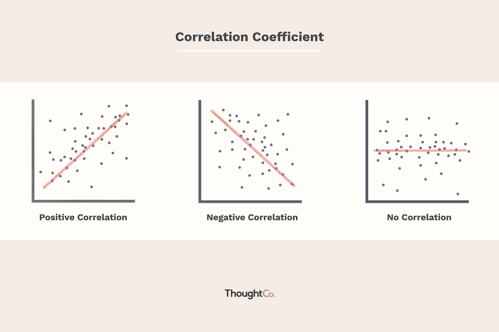

## Table of Contents

## What is negative correlation?

Negative correlation is when two things move in opposite directions. For example, if one thing goes up, the other thing goes down. Imagine the relationship between the amount of time you spend studying and the number of mistakes you make on a test. If you study more, you usually make fewer mistakes. So, the time spent studying and the number of mistakes have a negative correlation.

This kind of relationship is important in many fields, like science and finance. Scientists might look at the negative correlation between the amount of exercise people do and their blood pressure. In finance, people might notice a negative correlation between the price of a stock and the unemployment rate. Understanding negative correlations helps people make better decisions and predictions.

## How is negative correlation different from positive correlation?

Negative correlation and positive correlation are two ways to describe how two things relate to each other. Negative correlation means that when one thing goes up, the other thing goes down. For example, if you eat more vegetables, your cholesterol might go down. They move in opposite directions. On the other hand, positive correlation means that when one thing goes up, the other thing also goes up. Like if you study more, your test scores might go up. They move in the same direction.

Understanding the difference between these two types of correlations is important. If you know that two things have a negative correlation, you can predict that if one increases, the other will decrease. This can help in making decisions, like choosing to eat more vegetables to lower cholesterol. With positive correlation, knowing that two things move together can also guide decisions, like studying more to improve test scores. Both types of correlations help us see patterns and make better choices.

## Can you provide a simple example of negative correlation?

Imagine you have a garden and you want to grow tomatoes. The more water you give your tomato plants, the fewer bugs you see on them. This is an example of negative correlation. When the amount of water goes up, the number of bugs goes down.

In this case, watering your plants more helps keep the bugs away. So, if you want fewer bugs on your tomatoes, you know you should water them more. Understanding this negative correlation helps you take better care of your garden.

## What is the range of the correlation coefficient for negative correlation?

The correlation coefficient is a number that tells us how strong the relationship is between two things. For negative correlation, this number is always less than zero but more than negative one. So, it goes from -1 to 0, but not including 0. If the number is closer to -1, it means the negative correlation is very strong. If it's closer to 0, the negative correlation is weaker.

For example, if the correlation coefficient between the time you spend studying and the number of mistakes you make on a test is -0.8, that's a strong negative correlation. It means that the more you study, the fewer mistakes you make, and this relationship is pretty reliable. But if the correlation coefficient is -0.2, it's a weak negative correlation. It still means that studying more might lead to fewer mistakes, but the relationship isn't as strong or reliable.

## How can negative correlation be visualized on a scatter plot?

Negative correlation on a scatter plot looks like a line that goes down from left to right. Imagine you have dots on the graph. If you draw a line through these dots, it will start high on the left side and end low on the right side. This shows that as one thing gets bigger, the other thing gets smaller. For example, if you plot the amount of time you spend studying on the x-axis and the number of mistakes you make on a test on the y-axis, you'll see that more study time (moving right on the x-axis) leads to fewer mistakes (moving down on the y-axis).

The strength of the negative correlation can be seen by how closely the dots follow this downward line. If the dots are very close to the line, it means the negative correlation is strong. This shows a clear pattern where one thing going up really does make the other thing go down. If the dots are more spread out, the negative correlation is weaker. It still shows that one thing going up tends to make the other thing go down, but the pattern isn't as clear or reliable.

## What are common statistical methods used to measure negative correlation?

One common way to measure negative correlation is by using the Pearson correlation coefficient. This method looks at how two sets of numbers move together. If the Pearson correlation coefficient is a number between -1 and 0, it shows a negative correlation. The closer the number is to -1, the stronger the negative correlation. This method is widely used because it's easy to understand and calculate, and it works well when the relationship between the two things is a straight line.

Another method is the Spearman's rank correlation coefficient. This is useful when the relationship between the two things isn't a straight line, but you still want to see if they move in opposite directions. It looks at the order of the numbers instead of their exact values. Like the Pearson method, if the Spearman's coefficient is between -1 and 0, it shows a negative correlation. This method is good for situations where the data might not be perfectly linear but still has a clear pattern of one thing going up while the other goes down.

## How does negative correlation impact data analysis and interpretation?

Negative correlation is important in data analysis because it helps us understand how two things relate to each other. When we see a negative correlation, it means that as one thing increases, the other thing decreases. This can guide our decisions and predictions. For example, if we know there's a negative correlation between the amount of exercise people do and their blood pressure, we can encourage more exercise to help lower blood pressure. Understanding this relationship allows us to make informed choices based on the data.

In data interpretation, negative correlation helps us see patterns that might not be obvious at first. If we're looking at a lot of data, spotting a negative correlation can help us explain why certain things happen. For instance, if we find a negative correlation between the number of hours students spend on social media and their grades, we can start to understand why some students might be struggling. This insight can lead to better strategies for helping students improve their academic performance. Recognizing and interpreting negative correlations is key to making sense of complex data and using it effectively.

## What are some real-world applications of negative correlation?

Negative correlation is useful in many real-world situations. In healthcare, doctors might notice a negative correlation between the amount of exercise people do and their risk of heart disease. This means that the more people exercise, the lower their risk of heart disease. Knowing this can help doctors encourage patients to be more active to improve their health. In schools, teachers might see a negative correlation between the time students spend playing video games and their test scores. This means that the more time students spend playing games, the lower their test scores tend to be. Teachers can use this information to advise students on how to balance their time better.

In the world of finance, investors might look at the negative correlation between the unemployment rate and the stock market. When unemployment goes up, the stock market often goes down. This helps investors predict how the market might move based on economic reports. In environmental science, researchers might find a negative correlation between the amount of pollution in a river and the number of fish living in it. More pollution leads to fewer fish. This helps scientists and policymakers make decisions about how to protect the environment. Understanding negative correlations helps people in many fields make better decisions and predictions.

## How can negative correlation be misinterpreted or misused in data analysis?

Sometimes, people can get the wrong idea about negative correlation. They might see two things that move in opposite directions and think one causes the other. But just because two things have a negative correlation doesn't mean one makes the other happen. For example, if someone sees that ice cream sales go down when the temperature drops, they might think that lower temperatures cause fewer people to buy ice cream. But really, it's just that people don't want ice cream as much when it's cold. This kind of mistake can lead to wrong decisions or predictions.

Another way negative correlation can be misused is when people ignore other factors that might be affecting the data. Imagine a study that finds a negative correlation between the time kids spend watching TV and their grades. Someone might say that watching TV causes lower grades. But they might not think about other things, like how much time the kids spend studying or if they get help with homework. If these other factors are not considered, the negative correlation can be misunderstood or used to make claims that aren't really true. It's important to look at all the possible reasons why two things might be related before drawing conclusions.

## What are the limitations of using correlation coefficients to understand negative correlation?

Using correlation coefficients to understand negative correlation has some limits. One big problem is that a correlation coefficient only shows how two things move together, but it doesn't tell us why they move that way. For example, if we see a negative correlation between the time kids spend playing video games and their test scores, it doesn't mean playing video games causes lower test scores. There could be other reasons, like not studying enough, that affect the test scores. So, we need to be careful not to think that one thing causes the other just because they have a negative correlation.

Another limit is that correlation coefficients can be affected by outliers, which are unusual data points. If there's an outlier in the data, it can make the negative correlation look stronger or weaker than it really is. For instance, if most students spend a normal amount of time playing video games and have average test scores, but one student spends a lot of time gaming and has very low test scores, this outlier can make the negative correlation seem stronger. It's important to check the data carefully and understand that correlation coefficients give us a general idea, but they don't tell the whole story.

## How does negative correlation relate to causation?

Negative correlation means that when one thing goes up, another thing goes down. But just because two things move in opposite directions doesn't mean one thing causes the other to happen. For example, if you see that the more time kids spend playing video games, the lower their test scores are, it might look like playing video games causes lower test scores. But it could be that the kids who play a lot of video games also don't study as much, and that's what really affects their test scores. So, negative correlation shows a pattern, but it doesn't explain why the pattern exists.

It's important to be careful when looking at negative correlations and not jump to conclusions about what causes what. To really understand if one thing causes another, you need to do more than just look at the correlation. You need to think about other things that might be affecting the data, like how much time kids spend studying or if they get help with homework. Scientists often do experiments or look at more data to figure out if there's a real cause-and-effect relationship. Just seeing a negative correlation is a start, but it's not enough to say for sure that one thing causes another.

## What advanced techniques can be used to explore negative correlation in complex datasets?

One advanced technique to explore negative correlation in complex datasets is regression analysis. This method helps us understand how one thing affects another by looking at many factors at the same time. For example, if we want to see how playing video games affects test scores, regression analysis can consider other things like study time and homework help. This way, we get a clearer picture of the relationship between video games and test scores, and we can see if the negative correlation holds up even when we account for other factors. It's like looking at a puzzle from different angles to understand how all the pieces fit together.

Another technique is using [machine learning](/wiki/machine-learning) algorithms, like random forests or neural networks. These methods can find patterns in big and complicated datasets that might be hard to see otherwise. They can help us see if the negative correlation we notice is strong and reliable, even when there are many other things going on in the data. For instance, if we're studying the relationship between exercise and blood pressure, machine learning can look at lots of different people and their habits to see if the pattern of more exercise leading to lower blood pressure is true for everyone. These advanced techniques help us dig deeper into the data and understand negative correlations better.

## What is Understanding Negative Correlation?

Negative correlation is a statistical relationship between two variables in which an increase in one variable is associated with a decrease in the other. Mathematically, if two variables, X and Y, have a negative correlation, an increase in X results in a decrease in Y and vice versa. This inverse relationship is quantified by the correlation coefficient, which ranges between -1 and 1. A correlation coefficient close to -1 indicates a strong negative correlation, while a coefficient near 0 implies no apparent correlation.

Examples of negative correlation can be found across various fields. In finance, consider the relationship between bonds and stocks. Typically, when stock prices rise, bond prices fall, and vice versa, creating a hedging opportunity for investors to balance their portfolios. Economically, this relationship is crucial as it assists in diversifying risk. In psychology, an example can be seen in the relationship between the amount of time spent practicing mindfulness and levels of stress; generally, as mindfulness practice increases, stress levels tend to decrease.

The correlation coefficient, often represented as $r$, measures the strength and direction of a linear relationship between two variables. It is commonly calculated using Pearson's correlation coefficient formula:

$$
r = \frac{n(\sum{XY}) - (\sum{X})(\sum{Y})}{\sqrt{[n\sum{X^2} - (\sum{X})^2][n\sum{Y^2} - (\sum{Y})^2]}}
$$

where $n$ is the number of data pairs, $\sum$ denotes summation, and $X$ and $Y$ are the individual data points.

By interpreting this measure, researchers and analysts can determine how strongly two variables are inversely related. Still, caution is advised as correlation does not imply causation. Thus, it is essential to consider the broader context and potential underlying factors influencing the observed relationship.

In summary, negative correlation signifies a critical concept in understanding relationships where one variable inversely predicts another, with applications in various fields that highlight its importance in strategic decision-making and analysis.

## What is the Correlation Coefficient and how does it measure relationships?

The correlation coefficient is a fundamental statistical measure used to quantify the degree to which two variables move in relation to each other. Among its various forms, Pearson's correlation coefficient is one of the most widely used because of its ability to measure linear relationships. It is denoted by $r$ and calculated using the formula:

$$
r = \frac{\sum (x_i - \bar{x})(y_i - \bar{y})}{\sqrt{\sum (x_i - \bar{x})^2 \cdot \sum (y_i - \bar{y})^2}}
$$

where $x_i$ and $y_i$ are the individual data points and $\bar{x}$ and $\bar{y}$ are the means of the variables. The value of $r$ ranges between -1 and 1. A value of +1 indicates a perfect positive linear relationship, -1 indicates a perfect negative linear relationship, and 0 indicates no linear relationship.

While Pearson's coefficient is highly effective for linear relationships, it presupposes that the data are normally distributed and that the relationship between the variables is linear. When these conditions are not met, Spearman's rank correlation coefficient is often a preferred alternative. This non-parametric measure assesses how well the relationship between two variables can be described by a monotonic function, without assuming normal distribution of the data. It is calculated by ranking the data points and then applying Pearson’s formula to the ranks. Spearman's rank correlation is particularly useful when dealing with ordinal data or non-linear relationships.

In practical scenarios, the interpretation of correlation coefficients requires careful consideration of context. Strong correlations, whether positive or negative, suggest a robust relationship between the variables. However, they do not imply causation. For example, a correlation coefficient of -0.8 suggests a strong inverse relationship, meaning that as one variable increases, the other tends to decrease, and vice versa.

In finance and trading, understanding the correlation between assets can aid in risk management and portfolio diversification. However, it is essential to recognize the limitations of correlation analysis. Factors such as non-linearity, outliers, and time-dependent changes in correlations need to be accounted for to avoid misleading conclusions. Thus, while correlation coefficients provide valuable insights, they should be part of a broader analytical toolkit.

## References & Further Reading

1. **"Advances in Financial Machine Learning" by Marcos Lopez de Prado**  
   Lopez de Prado provides a comprehensive guide on applying machine learning techniques in finance, with an emphasis on data-driven models that leverage correlation and other statistical measures to enhance decision-making. A pivotal reference for understanding the application of quantitative methods in financial markets.

2. **"The Elements of Statistical Learning" by Trevor Hastie, Robert Tibshirani, and Jerome Friedman**  
   This book is an authoritative resource on statistical learning, which covers the mathematical foundations and practical techniques, including understanding correlations and their implications in statistical predictions.

3. **"Quantitative Trading: How to Build Your Own Algorithmic Trading Business" by Ernest P. Chan**  
   A practical guide to the world of [quantitative trading](/wiki/quantitative-trading), Ernest P. Chan explores the mechanics of building automated trading systems, emphasizing the importance of understanding correlations in developing effective trading strategies.

4. **"Algorithmic Trading and DMA: An Introduction to Direct Access Trading Strategies" by Barry Johnson**  
   Johnson’s work provides insights into [algorithmic trading](/wiki/algorithmic-trading) methods and the strategic use of negative correlations for risk management and portfolio optimization.

5. **"Statistical Inference" by George Casella and Roger L. Berger**  
   This textbook offers a deep dive into statistical methodologies, including correlation analysis, providing foundational knowledge critical for analyzing and interpreting variable relationships.

6. **Online Resource: Investopedia's Guide on Correlation**  
   A practical online guide that explains correlation and its applications in finance, offering easy-to-understand concepts, examples, and real-world applications.

7. **Academic Journal Article: "Correlation and Dependence" by François B. Bessy in the Encyclopedia of Quantitative Finance**  
   This article discusses different types of correlation measures and their applications in quantitative finance, emphasizing the need for careful interpretation and understanding of statistical dependencies.

These references encompass a blend of theoretical expositions and practical implementations, offering valuable insights into statistical analysis and algorithmic trading. They serve as resources for further exploration into the strategic use of negative correlations in finance, enhancing both academic and practical understanding.

