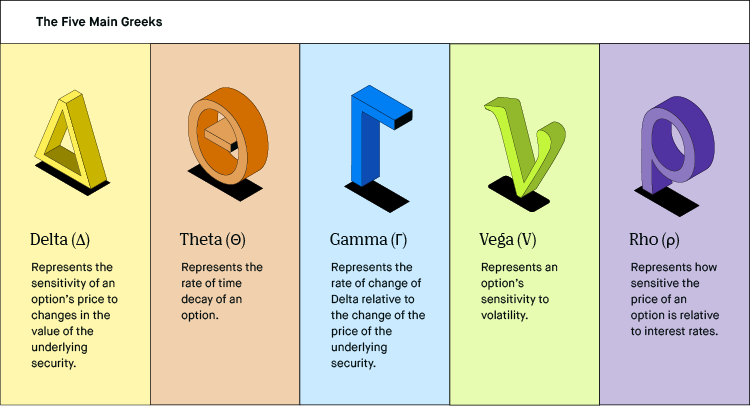

## Table of Contents

## What are options and why are they important in trading?

Options are financial contracts that give you the right, but not the obligation, to buy or sell an asset at a specific price before a certain date. They are like tickets that let you decide if you want to make a trade later. You can buy options on things like stocks, commodities, or currencies. There are two types of options: calls and puts. A call option lets you buy the asset, while a put option lets you sell it.

Options are important in trading because they offer flexibility and can help manage risk. Traders use options to make money from price movements without having to own the actual asset. For example, if you think a stock's price will go up, you can buy a call option instead of the stock itself. This can be cheaper and less risky. Options also allow traders to protect their investments. If you own a stock and are worried its price might fall, you can buy a put option to sell it at a set price, limiting your potential loss. This way, options can be a useful tool for both making profits and protecting against losses.

## What are the Greeks in options trading?

The Greeks in options trading are special measurements that help traders understand how different factors affect the price of an option. They are called "Greeks" because they are usually represented by Greek letters. The main Greeks are Delta, Gamma, Theta, Vega, and Rho. Each one tells you something different about your option. For example, Delta shows how much the option's price will change if the price of the underlying asset changes. Gamma tells you how Delta itself changes as the asset's price moves.

Theta is another important Greek that measures how much the option's value decreases over time, which is also known as time decay. Vega shows how the option's price is affected by changes in the market's expectation of future volatility. Lastly, Rho measures how sensitive the option's price is to changes in interest rates. By understanding these Greeks, traders can make better decisions and manage their risks more effectively. They help predict how the option's price might change with different market conditions.

## How does Delta measure the sensitivity of an option's price to changes in the underlying asset's price?

Delta measures how much the price of an option will change when the price of the underlying asset changes. It's like a scale that tells you how sensitive the option is to the asset's price movements. For example, if a call option has a Delta of 0.5, it means that for every $1 increase in the price of the underlying asset, the price of the option will go up by about $0.50. If the asset's price goes down by $1, the option's price will decrease by about $0.50 too.

Delta is always a number between -1 and 1. For call options, Delta is positive, which means the option's price goes up when the asset's price goes up. For put options, Delta is negative, so the option's price goes down when the asset's price goes up. The closer Delta is to 1 or -1, the more the option's price will move with the asset's price. This makes Delta a very useful tool for traders to predict how their options will behave as the market changes.

## What is Gamma and how does it affect the Delta of an option?

Gamma is a measure that tells you how fast the Delta of an option changes when the price of the underlying asset moves. Think of it as the speedometer for Delta. If Gamma is high, Delta can change quickly, which means the option's price can become more sensitive to the asset's price changes in a short time. If Gamma is low, Delta changes more slowly, so the option's price won't react as quickly to the asset's price movements.

Understanding Gamma helps traders know how stable their Delta is. For example, if you have an option with a high Gamma, you need to keep an eye on it because its Delta could change a lot if the asset's price moves even a little. This can be good if you're trying to make quick profits, but it can also be risky because the option's price can become more unpredictable. So, Gamma is important for managing the risk and potential rewards of your options trades.

## How does Theta measure the time decay of an option's value?

Theta measures how much an option's value goes down as time passes. It's like a clock ticking away at the option's price. Every day that goes by, the option loses a little bit of its value, and Theta tells you how much. If Theta is -0.05, it means the option's price will drop by about 5 cents each day, as long as nothing else changes.

This time decay happens because options have an expiration date. The closer you get to that date, the less time there is for the option to become profitable, so it becomes less valuable. Theta is really important for traders to know because it helps them understand how much time is working against them. If you're holding an option, you need to think about Theta to decide if you should keep it or sell it before it loses too much value.

## What is Vega and how does it relate to the volatility of the underlying asset?

Vega measures how much an option's price changes when the expected volatility of the underlying asset changes. It's like a gauge that shows how sensitive your option is to the ups and downs in the market. If Vega is high, even a small change in expected volatility can make the option's price go up or down a lot. If Vega is low, the option's price won't be affected as much by changes in volatility.

Understanding Vega is important because it helps traders know how their options might react to shifts in the market's mood. If you think the market is going to get more unpredictable, and you have an option with a high Vega, you might see a bigger profit or loss than you expected. So, Vega is a key tool for managing the risks and rewards that come with trading options in a changing market.

## How does Rho measure an option's sensitivity to interest rate changes?

Rho measures how much an option's price changes when interest rates go up or down. It's like a little indicator that tells you how sensitive your option is to changes in what banks charge for loans. If Rho is high, even a small change in interest rates can make the option's price move a lot. If Rho is low, the option's price won't be affected as much by interest rate changes.

Rho is more important for some options than others. For example, options that last a long time are more sensitive to interest rate changes, so they have a higher Rho. Traders who care about Rho are usually thinking about how interest rates might change in the future and how that could affect their options. By keeping an eye on Rho, they can make better decisions about which options to buy or sell.

## What are some practical strategies for using the Greeks in options trading?

When trading options, understanding the Greeks can help you make smarter choices. One common strategy is using Delta to manage your portfolio's risk. If you want to protect your stock investments, you can buy put options with a Delta close to -1. This means the put option will move a lot if your stock price goes down, helping to limit your losses. On the other hand, if you're looking to make a quick profit, you might choose call options with a high Delta, so they'll go up a lot if the stock price rises.

Another strategy involves Theta and Vega, which are about time and volatility. If you think the market will stay calm and you want to earn from time passing, you could sell options with a high Theta. These options lose value quickly as time goes by, so you can make money as they get closer to expiring. But if you expect the market to become more unpredictable, buying options with a high Vega can be a good move. These options will gain value if the market starts moving a lot, letting you profit from the increased volatility.

Lastly, Rho can be useful if you're thinking about long-term options and interest rates. If you believe interest rates will go up, you might want to buy call options with a high Rho, as they'll become more valuable. But if you think rates will drop, selling options with a high Rho could be better, since their value will decrease. By keeping an eye on all the Greeks, you can better predict how your options will behave and adjust your trading strategies accordingly.

## How can the Greeks be used to manage and hedge risk in a portfolio?

Using the Greeks to manage and hedge risk in a portfolio can be really helpful. Delta is a big one for this. If you own stocks and want to protect them from going down in value, you can buy put options with a Delta close to -1. This means the put option will go up a lot if your stock price drops, helping to limit how much money you could lose. If you're worried about your whole portfolio, you can use Delta to balance it out. For example, if your portfolio has a Delta of 100, meaning it will go up $100 if the market goes up $1, you can buy put options to bring that Delta down to zero, making your portfolio safer.

Theta and Vega are also important for managing risk. Theta tells you how much an option loses value as time goes by. If you think the market will stay calm, you can sell options with a high Theta to make money as they get closer to expiring. Vega helps with volatility. If you expect the market to get more unpredictable, buying options with a high Vega can protect your portfolio because these options will gain value if the market starts moving a lot. By using Theta and Vega, you can adjust your strategy to make the most of calm or wild markets.

Rho can be useful too, especially if you're dealing with long-term options and interest rates. If you think interest rates will go up, buying call options with a high Rho can be a good idea because they'll become more valuable. But if you think rates will go down, selling options with a high Rho could help you earn money as their value decreases. By understanding and using all the Greeks, you can better predict how your options will behave and make your portfolio safer and more profitable.

## What are the limitations and potential pitfalls of relying on the Greeks in options trading?

While the Greeks are very helpful for understanding how options might behave, they have some limitations. One big problem is that they are based on models that make assumptions about how the market works. These models don't always get it right, especially during big market changes or when things are very unpredictable. For example, Delta might tell you how an option's price will change if the stock goes up or down, but if the market suddenly crashes or jumps, the real change might be different from what Delta predicted. Also, the Greeks are usually calculated one at a time, but in real life, all the factors like price, time, and volatility can change together, making it hard to predict exactly what will happen.

Another issue is that the Greeks can give you a false sense of security. Traders might think they know exactly how their options will behave, but the market can be full of surprises. For instance, Theta tells you how much an option loses value over time, but if there's big news that changes the stock's price, the effect of Theta can be different. Vega helps with understanding how volatility affects options, but if the market's volatility changes a lot, Vega might not be as useful. So, while the Greeks are important tools, it's smart to use them carefully and not rely on them too much. Always be ready for the unexpected in the market.

## How do the Greeks interact with each other, and what are the implications for options pricing?

The Greeks in options trading are like a team that works together to affect the price of an option. Delta tells you how much the option's price will change if the stock's price changes. But Delta itself can change, and that's where Gamma comes in. Gamma shows how fast Delta changes when the stock's price moves. So, if you have a high Gamma, your Delta can change a lot, making the option's price more sensitive to the stock's price. Theta, on the other hand, measures how much the option loses value as time goes by. It's like a clock ticking away at the option's price. Vega tells you how the option's price changes with the market's expected ups and downs. If Vega is high, the option's price can change a lot if the market gets more unpredictable. Rho is about how interest rates affect the option's price, but it's usually less important unless you're dealing with long-term options.

When all these Greeks work together, they can make options pricing pretty complicated. For example, if you have an option with a high Delta and a high Gamma, the option's price can change a lot if the stock's price moves even a little. But as time goes by, Theta will start to eat away at the option's value, no matter what the stock does. If the market gets more volatile, Vega will make the option's price go up, but if the volatility goes down, Vega will make it go down. And if interest rates change, Rho will have its say too. So, understanding how the Greeks interact helps traders predict how their options will behave, but it's also important to remember that the market can be full of surprises.

## What advanced techniques can be used to model and predict the behavior of options using the Greeks?

One advanced technique for modeling and predicting the behavior of options using the Greeks is called dynamic hedging. This involves constantly adjusting your options portfolio to keep the Delta neutral. That means you're trying to make sure that if the stock price goes up or down, your overall position doesn't change much. You do this by buying or selling more options or the underlying stock based on the changing Delta and Gamma. It's like keeping a balance, and it can help you manage risk better, but it needs a lot of attention and quick actions.

Another technique is using options pricing models like the Black-Scholes model, which calculates the Greeks to help predict how an option's price will change. This model takes into account Delta, Gamma, Theta, Vega, and Rho to give you a better idea of what might happen. You can use these calculations to make smarter trades, like buying options with a high Vega if you think the market will get more unpredictable, or selling options with a high Theta if you think time will work in your favor. But remember, these models are based on assumptions, so they're not perfect. The real market can be different, so it's important to keep an eye on what's actually happening and be ready to change your plan.

## What is the understanding of options and their Greeks?

Options are financial contracts that grant the buyer the right, but not the obligation, to buy (call option) or sell (put option) an underlying asset at a predetermined price, known as the strike price, on or before a specific date. This unique feature allows the holder to capitalize on favorable market movements while limiting potential losses to the premium paid for the option. Options can be used for hedging, speculation, or increasing leverage in a trading strategy.

Central to options trading are the Greeks, a set of metrics that quantify how an option's price reacts to various market variables. These variables include changes in the underlying asset’s price, time decay, volatility, and interest rates. Understanding these metrics is crucial for traders to manage risk effectively and optimize trade performance.

### Delta
Delta (Δ) measures the sensitivity of an option’s price to changes in the price of the underlying asset. It indicates how much the price of an option is expected to move per $1 change in the underlying asset's price. For example, a call option with a Delta of 0.5 would increase in price by $0.50 if the underlying asset increases by $1. Delta values range from 0 to 1 for call options and from -1 to 0 for put options.

$$
\Delta = \frac{\partial C}{\partial S}
$$

Where $C$ is the option's price, and $S$ is the price of the underlying asset.

### Gamma
Gamma (Γ) represents the rate of change of Delta with respect to the change in the underlying asset’s price. It provides insight into the stability of Delta and helps traders understand the option's risk profile in reaction to large price movements of the underlying asset. High Gamma values suggest that Delta can change significantly with minor price shifts.

$$
\Gamma = \frac{\partial^2 C}{\partial S^2}
$$

### Theta
Theta (Θ) measures the sensitivity of the option’s price to the passage of time, commonly referred to as time decay. As time progresses and approaches the expiration date, options typically lose value, especially those that are out-of-the-money. Theta quantifies this erosion, indicating how much the price is expected to decrease as the expiration date approaches, assuming all other variables remain constant.

$$
\Theta = \frac{\partial C}{\partial t}
$$

### Vega
Vega (ν) gauges the sensitivity of an option’s price to changes in the [volatility](/wiki/volatility-trading-strategies) of the underlying asset. Higher volatility increases the likelihood of the option finishing in-the-money, thus increasing its value. Vega is particularly important during periods of market uncertainty, where volatility can be unpredictable.

$$
ν = \frac{\partial C}{\partial σ}
$$

Where $σ$ is the volatility of the underlying asset.

### Rho
Rho (ρ) assesses the impact of [interest rate](/wiki/interest-rate-trading-strategies) changes on the price of an option. It measures the expected change in the option’s price for a 1% change in interest rates. Rho is more significant for long-duration options and less so for short-term ones, as interest rates have a more pronounced effect over longer periods.

$$
ρ = \frac{\partial C}{\partial r}
$$

Where $r$ is the risk-free interest rate.

Each of these Greeks plays a vital role in constructing and managing an options portfolio, aiding traders in making informed decisions and crafting strategies to align with their risk tolerance and market outlook. Understanding how these metrics interact provides traders with the ability to anticipate pricing changes and create precise hedging strategies.

## What is Algorithmic Trading with Options and Greeks?

Algorithmic trading has revolutionized the financial markets by enabling traders to execute complex strategies with speed and precision. When applied to options trading, algorithms incorporate various data points to make informed decisions, including the Greeks, which play a pivotal role in formulating these strategies.

The Greeks—Delta, Gamma, Theta, Vega, and Rho—are instrumental in measuring different sensitivities of an option's price to market variables. By incorporating the Greeks into algorithmic models, traders can dynamically adjust their strategies to optimize risk and return profiles. Algorithms can, therefore, efficiently process these sensitivities to design strategies that respond to market fluctuations with precision.

1. **Delta-Neutral Strategies**: Delta ($\Delta$) measures the sensitivity of an option's price to changes in the price of the underlying asset. A delta-neutral strategy aims to hedge against small price movements in the asset. Algorithmically, this involves maintaining a portfolio where the sum of the deltas is close to zero. In practice, the algorithm would continuously rebalance the portfolio by buying or selling options and the underlying asset, using the formula:
$$
   \Delta_{\text{portfolio}} = \sum (\Delta_{\text{option}} \times \text{position size}) + \Delta_{\text{underlying}}

$$

2. **Gamma Scalping**: Gamma ($\Gamma$) reflects the rate at which Delta changes as the underlying asset price moves. Gamma scalping aims to profit from this convexity, adjusting portfolios to benefit from volatility. Through algorithmic trading, traders can monitor Gamma and adjust Delta positions through frequent trades to exploit this non-linear relationship effectively.

3. **Vega-Neutral Strategies**: Vega captures sensitivity to volatility changes of the underlying asset. A vega-neutral approach maintains a position insensitivity to volatility shifts. The algorithm can dynamically execute trades by assessing Vega values to offset changes, thus stabilizing the portfolio against implied volatility fluctuations.

By leveraging these strategies, [algorithmic trading](/wiki/algorithmic-trading) systems can autonomously react to market conditions, adjusting exposure levels in real time, which is essential for managing risks in volatile environments. Consequently, the automated application of the Greeks in trading algorithms not only refines risk management capabilities but also enhances the overall efficiency and profitability of options trading strategies.

## References & Further Reading

[1]: Black, F., & Scholes, M. (1973). ["The Pricing of Options and Corporate Liabilities."](https://www.cs.princeton.edu/courses/archive/fall09/cos323/papers/black_scholes73.pdf) Journal of Political Economy, 81(3), 637-654.

[2]: Hull, J. C. (2018). ["Options, Futures, and Other Derivatives"](https://www.semanticscholar.org/paper/Options%2C-Futures%2C-and-Other-Derivatives-Hull/89bdee500c8623864fc9eb7a471546aa713acc44) (10th Edition). Pearson.

[3]: Natenberg, S. (1994). ["Option Volatility and Pricing: Advanced Trading Strategies and Techniques"](https://www.amazon.com/Option-Volatility-Pricing-Strategies-Techniques/dp/0071818774). McGraw-Hill.

[4]: Wilmott, P. (2006). ["Paul Wilmott on Quantitative Finance"](https://books.google.com/books/about/Paul_Wilmott_on_Quantitative_Finance.html?id=zdLDAQAAQBAJ). John Wiley & Sons.

[5]: Armstrong, M. A., & Carter, D. A. (2020). ["Algorithmic and High-Frequency Trading"](https://assets.cambridge.org/97811070/91146/frontmatter/9781107091146_frontmatter.pdf). McGraw-Hill.

[6]: Gatheral, J. (2006). ["The Volatility Surface: A Practitioner’s Guide"](https://www.wiley.com/en-us/The+Volatility+Surface%3A+A+Practitioner%27s+Guide-p-9780471792512). John Wiley & Sons.

[7]: Taleb, N. N. (1997). ["Dynamic Hedging: Managing Vanilla and Exotic Options"](https://www.amazon.com/Dynamic-Hedging-Managing-Vanilla-Options/dp/0471152803). John Wiley & Sons.