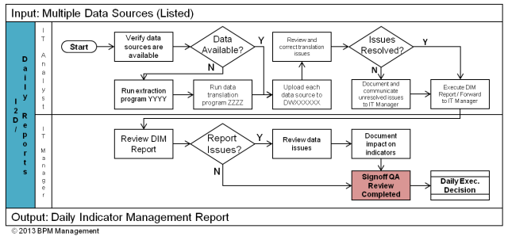

## Table of Contents

## What is a report in the context of data analysis?

A report in the context of data analysis is a document that presents information in an organized way. It helps people understand data by showing facts, numbers, and findings from the analysis. Reports can include graphs, tables, and written explanations to make the data easier to understand.

Reports are important because they help people make decisions based on the data. For example, a business might use a report to see how well it is doing and decide what to do next. A good report should be clear and easy to read so that anyone can understand the main points and use the information to take action.

## What are the basic steps involved in creating a report?

Creating a report starts with gathering the right data. You need to know what information you want to include and where to find it. This might mean collecting data from surveys, databases, or other sources. Once you have the data, you need to clean it up. This means checking for mistakes and making sure everything is correct. After cleaning the data, you can start analyzing it to find patterns and important points.

Next, you organize your findings into a clear structure. This usually includes an introduction, a section for the main findings, and a conclusion. In the introduction, you explain what the report is about and why it's important. The main findings section is where you show your data using graphs, tables, and written explanations. Make sure to highlight the most important points. Finally, in the conclusion, you summarize what you found and suggest what should be done next. It's helpful to get feedback from others to make sure your report is clear and useful.

## How do you gather data for a report?

Gathering data for a report starts with figuring out what information you need. You might need numbers, opinions, or facts. Once you know what you need, you can decide where to get it from. Common places to gather data include surveys, where you ask people questions; databases, where you can find stored information; and public records, like government reports. Sometimes, you might also use data from other reports or studies that have already been done.

After deciding on your sources, you collect the data. This can be done in many ways. For example, if you're using a survey, you might send it out online or hand it out in person. If you're using a database, you might need to search for the right information and download it. It's important to keep track of where your data comes from so you can check it later if needed. Once you have all your data, you need to make sure it's correct and ready to use in your report.

## What are the common types of reports and their purposes?

There are many types of reports, but some common ones are business reports, research reports, and progress reports. Business reports help companies understand how they are doing. They can show things like how much money the company made, how many products they sold, or how happy their customers are. Research reports are used to share the results of a study or experiment. They help people learn new things and make decisions based on facts. Progress reports are used to show how a project is going. They tell people what has been done so far and what still needs to be done.

Each type of report has a different purpose. Business reports help managers and owners make smart choices about their company. They can see what is working well and what needs to change. Research reports are important for scientists and students because they help spread new knowledge. They can be used to explain new discoveries or to suggest new ways of doing things. Progress reports are useful for keeping everyone on a project team informed. They help make sure the project stays on track and that everyone knows what is happening.

## How do you structure a report to ensure clarity and effectiveness?

To structure a report for clarity and effectiveness, start with a clear introduction. In the introduction, explain what the report is about and why it's important. This helps readers understand the purpose of the report right away. After the introduction, move on to the main findings section. This is where you show your data using graphs, tables, and written explanations. Make sure to highlight the most important points and use headings and subheadings to break up the text. This makes it easier for readers to follow along and find the information they need.

Next, include a conclusion that summarizes what you found and suggests what should be done next. The conclusion should be clear and to the point, so readers know the main takeaways from the report. It's also helpful to add an executive summary at the beginning of the report. This is a short overview of the whole report, so busy people can quickly understand the key points without reading everything. Finally, make sure your report looks neat and professional. Use a clear font, add page numbers, and include a table of contents if the report is long. This helps keep everything organized and easy to read.

## What tools and software are commonly used for report generation?

Many tools and software are used to make reports easier and look better. Microsoft Excel is a popular choice because it's good at handling numbers and making charts. People use it to organize data and create graphs that show important information. Another common tool is Microsoft Word, which is great for writing the text parts of a report. It helps you format your report to make it look neat and professional. Google Sheets and Google Docs are also used a lot, especially when people need to work together on a report from different places.

There are also special software programs made just for making reports. Tableau is one of these, and it's really good at turning data into easy-to-understand pictures and graphs. It's often used for business reports because it can show complex information in a simple way. Another tool is Power BI, which is also used for business reports. It can connect to many different data sources and make interactive reports that people can explore. For research reports, software like SPSS or R can be used to analyze data and make detailed reports with statistics.

## How can data visualization enhance the impact of a report?

Data visualization can make a report much easier to understand and more interesting. When you use pictures like graphs, charts, and maps, you can show information in a way that is quick to see and remember. Instead of reading long lists of numbers, people can look at a colorful chart and get the main idea right away. This helps them see patterns and trends that might be hard to notice in a table full of numbers. For example, a pie chart can show how different parts add up to a whole, making it clear how much each part contributes.

Using data visualization also helps keep people interested in the report. When a report has only text and numbers, it can be boring and hard to read. But when you add pictures, it breaks up the text and makes the report more fun to look at. This can make people more likely to read the whole report and remember the important points. Plus, good visualizations can help tell a story with the data, making the report more powerful and convincing.

## What are the key functions of a report in business decision-making?

A report in business decision-making helps leaders understand what is happening in their company. It shows them important information like how much money they are making, how many products they are selling, and how happy their customers are. By looking at this information, leaders can see what is working well and what needs to change. For example, if a report shows that sales are going down, the leaders might decide to start a new marketing campaign to bring sales back up.

Reports also help businesses plan for the future. They can show trends and patterns that help leaders predict what might happen next. If a report shows that a certain product is becoming more popular, the company might decide to make more of that product. Reports give leaders the facts they need to make smart choices, so the business can grow and succeed. By using reports, businesses can make decisions based on real data instead of just guessing.

## How do you ensure the accuracy and reliability of data in reports?

To make sure the data in reports is accurate and reliable, you need to start by collecting data from good sources. This means using trusted places like official databases, well-designed surveys, or reliable public records. It's important to check these sources to make sure they are up-to-date and correct. Once you have the data, you should clean it up. This means looking for mistakes, like numbers that don't make sense or missing information, and fixing them. If you find any errors, you need to go back to your sources and double-check everything.

After cleaning the data, you should use good methods to analyze it. This means using the right tools and following clear steps to make sure your analysis is correct. It's also a good idea to have someone else look over your work. They can check your numbers and make sure you didn't miss anything important. By being careful at every step, from collecting the data to writing the report, you can make sure your report is accurate and reliable. This helps people trust the information and make good decisions based on it.

## What advanced techniques can be used to analyze data for complex reports?

For complex reports, one advanced technique is using machine learning algorithms. These can help find patterns in large amounts of data that might be hard to see otherwise. For example, machine learning can be used to predict future trends based on past data. This is useful for businesses that want to know what might happen next. Another technique is data mining, which involves looking through big sets of data to find useful information. Data mining can help find hidden connections between different pieces of data, which can lead to new insights and better decisions.

Another advanced method is using statistical analysis, like regression analysis or cluster analysis. Regression analysis can show how different factors affect an outcome, helping to understand what causes certain results. Cluster analysis groups similar data points together, which can help identify different types of customers or products. These techniques require special software and skills, but they can make reports much more detailed and informative. By using these advanced methods, you can turn a simple report into a powerful tool for understanding complex data.

## How do you tailor a report to meet the needs of different stakeholders?

To tailor a report for different stakeholders, you need to think about what each group cares about. For example, if you're writing a report for business owners, they might want to see numbers about how much money the company is making and how well it's doing compared to other companies. They might not care as much about the small details of how the data was collected. On the other hand, if you're writing for a team of researchers, they might want to know all about the methods you used to gather and analyze the data. They might be more interested in the details and less in the big picture.

To make sure your report meets the needs of different stakeholders, you can use different sections or versions of the report. You could have a short summary at the beginning that gives the main points for busy people like managers or executives. This summary should be clear and easy to understand, so they can quickly get the information they need. For people who want more details, like researchers or analysts, you can include more in-depth sections later in the report. These sections can explain the data collection methods, the analysis techniques, and any other information they might need. By doing this, you can make sure your report is useful for everyone who reads it.

## What are the best practices for presenting and distributing reports within an organization?

When presenting and distributing reports within an organization, it's important to make sure the report is easy to understand and reaches the right people. Start by using clear and simple language in your report. Avoid using too many technical words that might confuse some readers. Use graphs and charts to show the data in a way that's easy to see. When you present the report, explain the main points clearly and be ready to answer questions. This helps everyone understand the report better.

Distributing the report should be done in a way that fits your organization. You can send the report by email to everyone who needs to see it. Make sure to use a clear subject line so people know what the email is about. If the report is important for a meeting, you might want to print copies or share it on a screen during the meeting. It's also a good idea to have the report available on a shared drive or a company website, so people can look at it whenever they need to. By doing these things, you can make sure your report gets to the right people and helps them make good decisions.

## References & Further Reading

[1]: Bergstra, J., Bardenet, R., Bengio, Y., & Kégl, B. (2011). ["Algorithms for Hyper-Parameter Optimization."](https://dl.acm.org/doi/10.5555/2986459.2986743) Advances in Neural Information Processing Systems 24.

[2]: ["Advances in Financial Machine Learning"](https://www.amazon.com/Advances-Financial-Machine-Learning-Marcos/dp/1119482089) by Marcos Lopez de Prado

[3]: ["Evidence-Based Technical Analysis: Applying the Scientific Method and Statistical Inference to Trading Signals"](https://www.amazon.com/Evidence-Based-Technical-Analysis-Scientific-Statistical/dp/0470008741) by David Aronson

[4]: ["Machine Learning for Algorithmic Trading"](https://github.com/stefan-jansen/machine-learning-for-trading) by Stefan Jansen

[5]: ["Quantitative Trading: How to Build Your Own Algorithmic Trading Business"](https://www.amazon.com/Quantitative-Trading-Build-Algorithmic-Business/dp/1119800064) by Ernest P. Chan