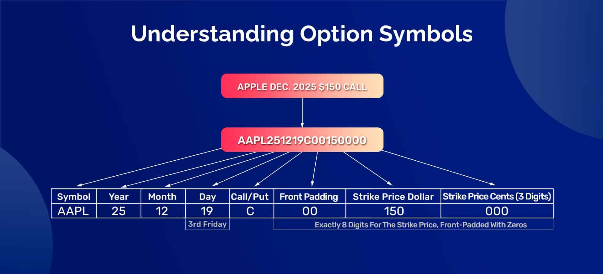

## Table of Contents

## What is a stock option ticker symbol?

A stock option ticker symbol is a unique series of letters used to identify a specific stock option in the financial markets. It helps traders and investors quickly find and track the performance of the option they are interested in. The ticker symbol for an option usually includes the symbol of the underlying stock, followed by additional characters that indicate the expiration date and the strike price of the option.

For example, if you are looking at options for a company called XYZ, the ticker symbol might start with "XYZ". Then, it could have additional letters or numbers to show when the option expires and at what price the option can be bought or sold. This makes it easier for people to keep track of different options without getting confused, especially when there are many options available for the same stock.

## How do stock option ticker symbols differ from stock ticker symbols?

Stock ticker symbols are short codes made of letters that represent a company's stock on the stock market. For example, if a company is called "Apple," its stock ticker symbol might be "AAPL." These symbols help people quickly find and track the price of a company's stock. They are used on stock exchanges and financial news websites to show how a stock is doing.

Stock option ticker symbols are a bit more complicated. They not only represent the company's stock but also include extra information about the option itself. This includes the expiration date and the strike price of the option. For example, an option for "Apple" might have a ticker symbol like "AAPL230120C00150000," which tells you it's an Apple option expiring on January 20, 2023, with a strike price of $150. This extra detail helps traders know exactly which option they are looking at, making it easier to buy or sell the right one.

## What are the components of a stock option ticker symbol?

A stock option ticker symbol is made up of several parts that help identify the option. The first part is the root symbol, which is the same as the stock's ticker symbol. For example, if the stock is from a company called "XYZ," the root symbol would be "XYZ." This part tells you which company the option is for.

The rest of the ticker symbol gives more details about the option. It includes a code for the expiration date, which tells you when the option will expire. For example, "230120" might mean the option expires on January 20, 2023. There's also a letter that shows if it's a call option (usually "C") or a put option (usually "P"). Finally, there's a code for the strike price, which is the price at which you can buy or sell the stock if you use the option. For example, "00150000" might mean a strike price of $150. All these parts together make up the full ticker symbol for the option, like "XYZ230120C00150000."

## How can I identify the expiration date from a stock option ticker symbol?

The expiration date in a stock option ticker symbol is shown by a set of numbers that come right after the root symbol of the stock. For example, if you see "XYZ230120C00150000," the "230120" part tells you the expiration date. This code is made up of the last two digits of the year, followed by the month and day. So, "230120" means the option will expire on January 20, 2023.

Knowing how to read this part of the ticker symbol is important because it helps you understand how long you have before the option expires. If you want to use the option or sell it to someone else, you need to do it before this date. This way, you can plan your trading strategy around the expiration date and make sure you don't miss any important deadlines.

## What does the strike price represent in a stock option ticker symbol?

The strike price in a stock option ticker symbol is the price at which you can buy or sell the stock if you decide to use the option. It's like a set price that you agree on when you buy the option. For example, if you see "XYZ230120C00150000," the "00150000" part means the strike price is $150. This number is usually shown without the decimal point, so you need to add it back in to get the actual price.

Knowing the strike price is important because it helps you decide if using the option is a good idea. If the current price of the stock is higher than the strike price for a call option, or lower than the strike price for a put option, then using the option could make you money. The strike price, along with the expiration date, helps you plan your trading strategy and decide when to buy or sell the option.

## How do I distinguish between call and put options using ticker symbols?

To tell if an option is a call or a put, look at the letter right after the expiration date in the ticker symbol. If you see a "C," it means the option is a call option. A call option gives you the right to buy the stock at the strike price before the option expires. If you see a "P," it means the option is a put option. A put option gives you the right to sell the stock at the strike price before the option expires.

For example, if the ticker symbol is "XYZ230120C00150000," the "C" tells you it's a call option for the stock XYZ, expiring on January 20, 2023, with a strike price of $150. If the ticker symbol is "XYZ230120P00150000," the "P" tells you it's a put option for the same stock, with the same expiration date and strike price. Knowing whether an option is a call or a put is important because it affects how you can use the option to make money.

## What is the significance of the root symbol in an option ticker?

The root symbol in an option ticker is the first part of the ticker symbol and it's the same as the stock's ticker symbol. For example, if the stock is from a company called "XYZ," the root symbol would be "XYZ." This part of the ticker symbol tells you which company the option is for. It's like the name tag for the stock, making it easy to find and track options for that specific company.

Knowing the root symbol is important because it helps you quickly identify the company you're interested in. When you're looking at a list of options, the root symbol is the first thing you see, so you can easily sort through options for different companies. This makes it simpler to focus on the options that matter to you and make decisions based on the performance of the company's stock.

## How do stock option ticker symbols indicate different contract sizes?

Stock option ticker symbols usually don't show the contract size directly. Instead, the contract size is a standard amount set by the options exchange. For example, in the U.S., one stock option contract typically represents 100 shares of the underlying stock. So, if you see an option ticker symbol like "XYZ230120C00150000," it means you're looking at an option for 100 shares of XYZ stock, even though the ticker symbol itself doesn't say "100 shares."

However, there are some exceptions where the contract size might be different. For example, options on certain indexes or mini-options might have different standard sizes. In these cases, you would need to check the specific details of the option from the exchange or a financial data provider. But for most regular stock options, the contract size is always 100 shares, and you won't see this information in the ticker symbol itself.

## Can you explain how to read European-style option ticker symbols?

European-style option ticker symbols are similar to American-style ones but with a key difference: you can only use them on the expiration date, not before. Just like with American options, the ticker symbol starts with the root symbol, which is the same as the stock's ticker symbol. For example, if the stock is from a company called "XYZ," the root symbol would be "XYZ." This tells you which company the option is for.

After the root symbol, you'll see numbers that show the expiration date. For example, "230120" means the option expires on January 20, 2023. Then, there's a letter that tells you if it's a call option ("C") or a put option ("P"). Finally, the ticker symbol ends with numbers that show the strike price, like "00150000" for a strike price of $150. So, a full European-style option ticker symbol might look like "XYZ230120C00150000." This tells you it's an option for XYZ stock, expiring on January 20, 2023, that you can use to buy the stock at $150 on that date.

## What are the differences in ticker symbols for index options versus equity options?

Index options and equity options both use ticker symbols to identify them, but there are some key differences. For equity options, the ticker symbol starts with the root symbol, which is the same as the stock's ticker symbol. For example, if the stock is from a company called "XYZ," the root symbol would be "XYZ." After that, the ticker symbol includes numbers for the expiration date, a letter to show if it's a call or put option, and numbers for the strike price. So, an equity option ticker symbol might look like "XYZ230120C00150000," which means it's an option for XYZ stock expiring on January 20, 2023, with a strike price of $150.

Index options, on the other hand, use a different root symbol that represents the index, not a specific company. For example, the S&P 500 index might use "SPX" as its root symbol. The rest of the ticker symbol for index options follows a similar format to equity options, with numbers for the expiration date, a letter for call or put, and numbers for the strike price. So, an index option ticker symbol might look like "SPX230120C4000," which means it's an option for the S&P 500 index expiring on January 20, 2023, with a strike price of 4000. The main difference is that index options are based on the performance of a whole index, not just one company's stock.

## How do ticker symbols for weekly options differ from standard monthly options?

Weekly options and standard monthly options both use ticker symbols to identify them, but there's a small difference in how they show the expiration date. For both types of options, the ticker symbol starts with the root symbol, which is the same as the stock's ticker symbol. For example, if the stock is from a company called "XYZ," the root symbol would be "XYZ." After that, the ticker symbol includes numbers for the expiration date, a letter to show if it's a call or put option, and numbers for the strike price.

The main difference is in the expiration date part of the ticker symbol. For standard monthly options, the expiration date is usually the third Friday of the month. The ticker symbol shows this with the last two digits of the year, followed by the month and day. For example, "230120" means the option expires on January 20, 2023. Weekly options, on the other hand, expire every Friday, and their ticker symbols show this with a special code. For example, "230120W1" might mean the option expires on the first Friday of January 2023. The "W1" part tells you it's a weekly option, and the number after "W" shows which week of the month it is.

## What advanced strategies can be inferred from analyzing patterns in option ticker symbols?

By looking at patterns in option ticker symbols, traders can figure out some advanced strategies. For example, if you see a lot of call options with the same expiration date but different strike prices, it might mean traders are using a strategy called a "vertical spread." In this strategy, a trader buys one call option and sells another call option with a different strike price but the same expiration date. This can help them make money if they think the stock price will go up but not too much. By looking at the ticker symbols, you can see which strike prices are popular and guess what other traders might be planning.

Another strategy you might spot by looking at ticker symbols is the "straddle." If you see a lot of call and put options with the same expiration date and strike price, it could mean traders are using this strategy. A straddle involves buying both a call and a put option at the same strike price and expiration date. Traders use this when they think the stock price will move a lot but aren't sure which way. By analyzing the ticker symbols, you can see if there's a lot of interest in both call and put options at the same price, which might suggest other traders are expecting big moves in the stock price.

## References & Further Reading

[1]: ["Options, Futures, and Other Derivatives"](https://www.pearson.com/en-us/subject-catalog/p/options-futures-and-other-derivatives/P200000005938/9780136939917) by John C. Hull

[2]: ["Algorithmic Trading: Winning Strategies and Their Rationale"](https://www.wiley.com/en-us/Algorithmic+Trading%3A+Winning+Strategies+and+Their+Rationale-p-9781118460146) by Ernest P. Chan

[3]: ["Python for Finance: Analyze Big Financial Data"](https://books.google.com/books/about/Python_for_Finance.html?id=E93SBQAAQBAJ) by Yves Hilpisch

[4]: ["Trading and Exchanges: Market Microstructure for Practitioners"](https://www.amazon.com/Trading-Exchanges-Market-Microstructure-Practitioners/dp/0195144708) by Larry Harris

[5]: Association, C. (2004). ["The Technology Transformation in Financial Markets."](https://www.researchgate.net/publication/377960925_The_Role_of_Fintech_in_Transforming_Traditional_Financial_Services)

[6]: ["The Financial Ecosystem: The Role of Finance in Economic Growth"](https://link.springer.com/chapter/10.1007/978-3-030-05624-7_2) by Jan A. Kregel and Leonardo Burlamaqui