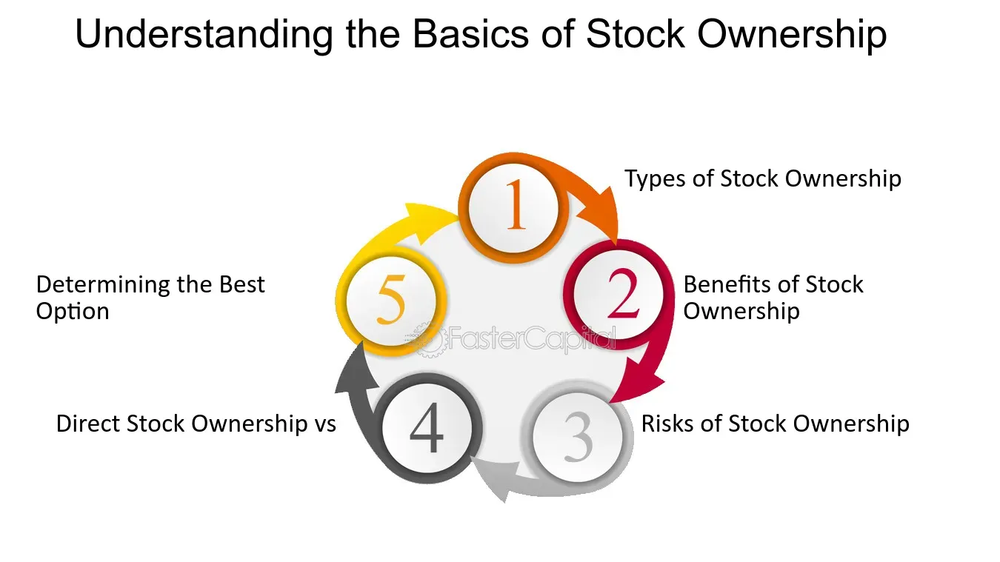

## Table of Contents

## What is stock ownership?

Stock ownership means you own a part of a company. When you buy a stock, you are buying a small piece of that company. This piece is called a share. The more shares you own, the bigger your part of the company is. Companies sell stocks to raise money, and people buy stocks hoping the company will do well and the value of their shares will go up.

When a company does well, the price of its stock usually goes up. This means the value of your shares goes up too. You can then sell your shares for more money than you paid for them. This is called making a profit. On the other hand, if the company does not do well, the stock price can go down, and you might lose money. Also, some companies pay dividends, which are like small payments to shareholders, usually every few months. This is another way you can make money from owning stocks.

## How does one become a stock owner?

To become a stock owner, you first need to open a brokerage account. A brokerage account is like a special bank account where you can buy and sell stocks. You can open this account with a brokerage firm, which is a company that helps people buy and sell stocks. You'll need to fill out some forms and provide some personal information, like your name, address, and social security number. Once your account is set up, you can put money into it, just like you would put money into a regular bank account.

After you have money in your brokerage account, you can start buying stocks. You can do this by searching for the company you want to invest in on your brokerage's website or app. Once you find the company, you can place an order to buy its stock. You'll need to decide how many shares you want to buy and at what price. When your order is filled, you'll own a part of that company. From then on, you can watch your stocks and decide if you want to buy more, sell what you have, or just hold onto them and see what happens.

## What are the benefits of owning stocks?

Owning stocks can help you make money in two main ways. First, if the stock price goes up, you can sell your shares for more than you paid for them. This is called capital gains. Second, some companies pay dividends, which are like small payments to shareholders. If you own stocks that pay dividends, you can get these payments usually every few months. This can give you a regular income, even if the stock price doesn't go up.

Another benefit of owning stocks is that it can help your money grow over time. Historically, stocks have given higher returns than things like savings accounts or bonds. This means if you keep your money in stocks for a long time, it can grow a lot more than if you put it in a savings account. This is called long-term investment growth. Plus, owning stocks can help you spread out your risk. Instead of putting all your money in one place, you can buy stocks in different companies and industries. This way, if one company does badly, you might still make money from other stocks.

## What are the risks associated with stock ownership?

Owning stocks can be risky because the stock market can go up and down a lot. If the price of a stock goes down after you buy it, you might lose money if you sell it at that lower price. This is called a loss. Sometimes, big events like economic downturns or company problems can make stock prices drop a lot very quickly. This means you could lose a lot of money in a short time.

Another risk is that not all companies do well. If a company you own stock in does badly, its stock price might go down. If the company goes bankrupt, you could lose all the money you put into that stock. Also, some stocks are more risky than others. Smaller companies or newer companies might have more ups and downs in their stock prices, which can be more risky for you as an investor.

## How do dividends work in stock ownership?

Dividends are payments that some companies give to people who own their stocks. When a company makes money, it might decide to share some of that money with its shareholders. The company's board of directors decides how much to pay and when to pay it. Usually, dividends are paid every few months, like every three months or every six months. If you own a stock that pays dividends, you'll get a little bit of money for each share you own.

To get a dividend, you need to own the stock on a certain date, called the record date. If you own the stock on that date, you'll get the dividend payment on the payment date, which is usually a few weeks later. You can either keep the dividend money or use it to buy more shares of the same stock or other stocks. Dividends can be a nice way to make some extra money from your stocks, even if the stock price doesn't go up.

## What is the difference between owning common and preferred stocks?

Common stocks and preferred stocks are two types of stocks that you can own in a company. Common stocks are the most common type of stock. When you own common stocks, you get to vote on important company decisions, like who should be on the board of directors. You also have a chance to make money if the company does well and the stock price goes up. However, if the company has a bad year, common stockholders are the last to get paid, after everyone else like the banks and bondholders. This means common stocks can be riskier.

Preferred stocks are different. When you own preferred stocks, you usually don't get to vote on company decisions. But, preferred stockholders get paid before common stockholders if the company makes money. This means you might get regular dividend payments, which can be nice if you want a steady income from your stocks. Also, if the company goes bankrupt, preferred stockholders get paid back before common stockholders, which makes preferred stocks a bit less risky. But, preferred stocks usually don't go up in price as much as common stocks when the company does well.

## How can stock ownership impact a company's decision-making?

When people own stocks in a company, they can help decide some things about how the company is run. If you own common stocks, you get to vote on important choices, like who should be on the board of directors. The board of directors is a group of people who make big decisions for the company. So, by voting, stock owners can help pick the people who will lead the company. This means that stock owners can have a say in the direction the company goes.

However, not all stock owners have the same power. People who own preferred stocks usually don't get to vote on company decisions. They might get paid before common stockholders if the company makes money, but they don't have a say in who runs the company. This means that while all stock owners have a stake in the company, only common stockholders can directly impact the company's decision-making through voting.

## What are stock options and how do they relate to stock ownership?

Stock options are like special tickets that give you the right to buy a company's stock at a certain price, called the strike price, before a certain date. They are not the same as owning stocks. When you have stock options, you don't own the stock yet. You just have the chance to buy it later if you want to. Companies sometimes give stock options to their employees as a way to reward them and make them feel like they have a part in the company's success.

If you decide to use your stock options and buy the stock, then you become a stock owner. You'll own the shares at the price you got the options for, which might be lower than the current stock price. This can be a good deal if the stock price goes up a lot. But, if the stock price stays the same or goes down, using your stock options might not be worth it. So, stock options can be a way to maybe own stocks in the future, but they are different from actually owning stocks right now.

## How does stock ownership affect voting rights in a company?

When you own common stocks in a company, you get to vote on important decisions. One of the main things you vote on is who should be on the board of directors. The board of directors is a group of people who make big choices for the company. So, by voting, you help decide who will lead the company. The more shares of common stock you own, the more votes you get. This means if you own a lot of common stock, you have more say in the company's decisions.

If you own preferred stocks, it's different. Usually, people who own preferred stocks don't get to vote on company decisions. They might get paid before common stockholders if the company makes money, but they don't have a say in who runs the company. So, the type of stock you own—common or preferred—makes a big difference in whether you can vote and help shape the company's future.

## What are the tax implications of owning stocks?

When you own stocks, you have to think about taxes. If you sell a stock for more money than you paid for it, you have to pay taxes on the profit. This profit is called a capital gain. If you hold the stock for more than a year before selling it, you pay a lower tax rate on the gain. This is called a long-term capital gain. But if you sell the stock within a year of buying it, you pay a higher tax rate. This is called a short-term capital gain. The tax rates can change, so it's good to check with a tax expert to know what you'll owe.

Another tax thing to know about is dividends. If a company pays you dividends because you own their stock, you have to pay taxes on that money too. But, the tax rate on dividends can be different from the tax rate on your regular income. Sometimes, it's lower. It depends on how much money you make and what kind of dividends you get. So, owning stocks can mean you have to pay taxes on your gains and dividends, but the rates and rules can be different based on how long you own the stock and what kind of dividends you receive.

## How do stock splits and reverse stock splits affect stock ownership?

A stock split happens when a company decides to split its stock into more shares. If you own a stock that does a 2-for-1 split, you'll get twice as many shares, but each share will be worth half as much. So, if you had 100 shares worth $100 each before the split, you'd have 200 shares worth $50 each after the split. The total value of your investment stays the same, but you own more shares. Companies do stock splits to make their stock price lower, which can make it easier for more people to buy the stock.

A reverse stock split is the opposite. It happens when a company decides to combine its shares into fewer, more expensive shares. If you own a stock that does a 1-for-2 reverse split, you'll have half as many shares, but each share will be worth twice as much. So, if you had 100 shares worth $10 each before the split, you'd have 50 shares worth $20 each after the split. The total value of your investment stays the same, but you own fewer shares. Companies might do reverse stock splits to make their stock price higher, which can make the stock look more valuable or meet the rules of some stock markets.

## What advanced strategies can be used to maximize returns from stock ownership?

One advanced strategy to maximize returns from stock ownership is called dollar-cost averaging. This means you put the same amount of money into a stock regularly, no matter what the stock price is. Over time, this can help you buy more shares when the price is low and fewer shares when the price is high. This can lower the average price you pay for the stock and might help you make more money in the long run. Another strategy is diversification, which means you spread your money across different stocks and industries. This can help reduce your risk because if one stock goes down, you might still make money from other stocks.

Another strategy is to use stop-loss orders. A stop-loss order is a way to tell your broker to sell a stock if it drops to a certain price. This can help you limit your losses if the stock price goes down a lot. You can also use a strategy called dividend reinvestment, where you take the dividend payments you get from a stock and use them to buy more shares of the same stock. This can help your investment grow over time because you're buying more shares without spending more money. These strategies can help you make the most of your stock ownership, but they also need careful planning and understanding of the stock market.

## What are the different strategies in algorithmic trading?

Algorithmic trading incorporates a variety of strategies, offering traders diverse approaches to navigate financial markets. These strategies harness the power of algorithms to optimize trading processes, capitalizing on market inefficiencies and trends.

### Trend-Following Strategies

Trend-following strategies aim to capitalize on persistent market movements, whether upward or downward. The core principle is to buy assets that display upward trends and sell those with downward trajectories. Trend-following strategies often utilize technical indicators, such as moving averages and [momentum](/wiki/momentum) indicators. For instance, the Moving Average Crossover strategy involves buying a stock when a short-term moving average crosses above a long-term moving average, indicating an upward trend, and selling when it crosses below.

### Arbitrage Opportunities

Arbitrage strategies exploit price discrepancies between correlated assets or markets. The goal is to achieve risk-free profits by simultaneously buying and selling equivalent assets. One common form is [statistical [arbitrage](/wiki/arbitrage)](/wiki/statistical-arbitrage), where algorithms identify short-term pricing inefficiencies among similar securities. Highly liquid markets with low transaction costs are ideal for such strategies, as they enhance the feasibility of capturing small price differentials.

### Mathematical Model-Based Strategies

These strategies use mathematical models to predict price movements and assess risk. A popular example is the mean reversion strategy, which assumes that asset prices will revert to their historical averages over time. Quantitative models apply statistical methods, such as autoregressive integrated moving averages (ARIMA), to forecast prices and execute trades based on predicted deviations from mean values. Here's a simple example of calculating moving averages in Python:

```python
import numpy as np

def moving_average(data, window_size):
    return np.convolve(data, np.ones(window_size), 'valid') / window_size
```

### Volume-Weighted Average Price (VWAP)

The VWAP strategy seeks to execute buy or sell orders at an average price weighted by [volume](/wiki/volume-trading-strategy) over a specific time frame. This strategy is particularly beneficial for large institutional investors aiming to minimize market impact. The VWAP is calculated by dividing the total traded value (price times volume) by the total traded volume over the trading period. Programmatically, it is represented as:

$$
\text{VWAP} = \frac{\sum_{i}(P_i \times V_i)}{\sum_{i}V_i}
$$

where $P_i$ is the price and $V_i$ is the volume at transaction $i$.

### Importance of a Systematic Approach

A systematic approach to [algorithmic trading](/wiki/algorithmic-trading) ensures consistency and discipline, reducing emotional bias. It involves rigorous [backtesting](/wiki/backtesting), which evaluates strategy performance on historical data to assess efficacy and risk. Moreover, continuous monitoring and adjustment based on changing market conditions are essential components of maintaining robust algorithms. Thus, integrating a systematic framework is crucial for adapting to evolving market dynamics and sustaining profitability.

## References & Further Reading

[1]: Bergstra, J., Bardenet, R., Bengio, Y., & Kégl, B. (2011). ["Algorithms for Hyper-Parameter Optimization."](https://dl.acm.org/doi/10.5555/2986459.2986743) Advances in Neural Information Processing Systems 24.

[2]: ["Advances in Financial Machine Learning"](https://www.amazon.com/Advances-Financial-Machine-Learning-Marcos/dp/1119482089) by Marcos Lopez de Prado

[3]: ["Evidence-Based Technical Analysis: Applying the Scientific Method and Statistical Inference to Trading Signals"](https://www.amazon.com/Evidence-Based-Technical-Analysis-Scientific-Statistical/dp/0470008741) by David Aronson

[4]: ["Machine Learning for Algorithmic Trading"](https://github.com/stefan-jansen/machine-learning-for-trading) by Stefan Jansen

[5]: ["Quantitative Trading: How to Build Your Own Algorithmic Trading Business"](https://github.com/LucindaYa/quant-resources/blob/master/Quantitative%20Trading%20How%20to%20Build%20Your%20Own%20Algorithmic%20Trading%20Business.pdf) by Ernest P. Chan