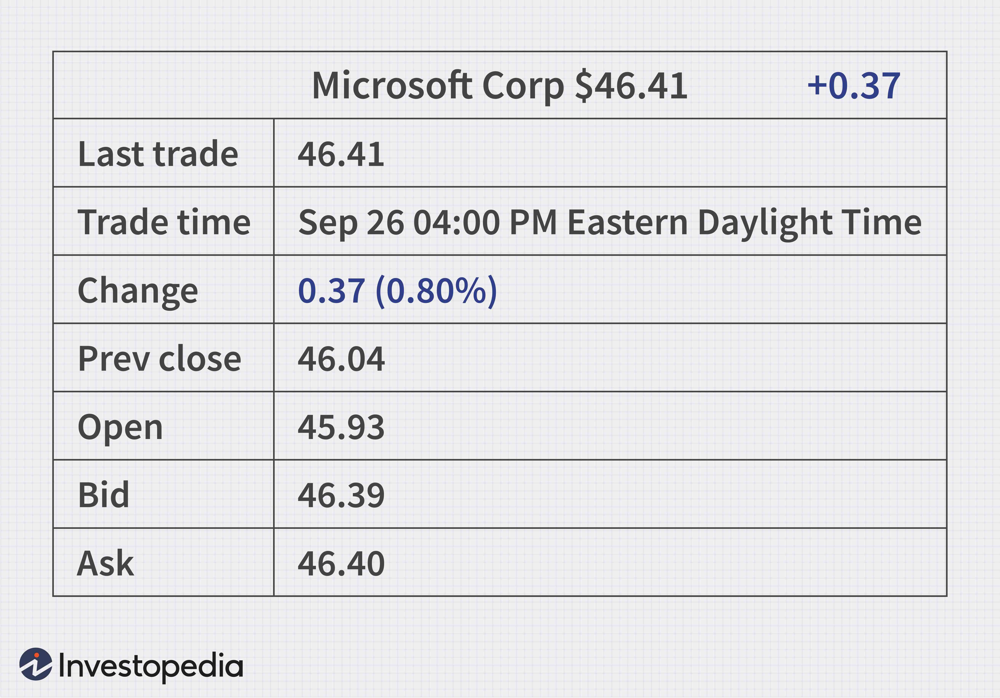

The financial market is a complex ecosystem where stock quotes, investing, and algorithmic trading converge to create intricate trading scenarios. This article explores the intersection of these components, providing insight into how stock quotes inform investment strategies and the role of algorithmic trading in modern finance. Understanding the interaction between these elements is crucial for both novice and seasoned investors navigating the market effectively.

Stock quotes, representing real-time prices of financial securities, are pivotal for market participants. They are not merely numbers; they encapsulate market sentiment, investor confidence, and company performance. Each quote carries valuable data, such as bid and ask prices, last traded price, and trading volumes, all of which influence investment decisions.



Investing, on the other hand, is a strategic activity. Investors rely on various techniques, from fundamental analysis to technical analysis, to enhance their portfolios. Stock quotes serve as vital information points that investors scrutinize. Metrics derived from stock quotes, such as price-to-earnings ratios and market capitalization, help investors ascertain the value and potential of their investments.

Algorithmic trading introduces a technological dimension to this ecosystem. By automating the trading process based on pre-set criteria, it seeks to optimize efficiency and reduce human error. It operates at speeds unattainable by human traders, thereby increasing market liquidity and providing broader access to trading sophisticated strategies.

This article aims to break down the complexities of the financial market into digestible insights. It examines how algorithmic trading, through its precision and speed, has emerged as a key player, reshaping the financial market landscape. We will explore both the benefits and challenges presented by this technological shift. With the financial market continually evolving, understanding these elements and their interplay helps investors make informed decisions and stay competitive.

## Table of Contents

## Understanding Stock Quotes

Stock quotes are a fundamental aspect of trading, offering vital data about the price movements of stocks. A comprehensive understanding of stock quotes allows investors to make informed decisions by analyzing market trends and company performance. 

One primary component of a stock quote is the bid and ask prices. The bid price represents the maximum price a buyer is willing to pay for a stock, while the ask price indicates the minimum price a seller is willing to accept. The difference between these prices is known as the spread, a critical metric for traders to assess market [liquidity](/wiki/liquidity-risk-premium) and potential profit margins. Additionally, the last trade price, which is the most recent price at which a stock has traded, provides a real-time reflection of market activity.

Other key elements of a stock quote include the opening and closing prices, as well as high and low data points. The opening price is the price at which a stock first trades upon the opening of the market, and the closing price is the price at the end of the trading session. High and low data points refer to the highest and lowest prices a stock achieves during a trading period, offering insights into the stock's [volatility](/wiki/volatility-trading-strategies).

Interpreting stock quotes also involves understanding fundamental [statistics](/wiki/bayesian-statistics) and financial ratios that reveal a company's market position. Market capitalization, calculated as the stock price multiplied by the number of outstanding shares, provides a measure of a company’s size and market value. Earnings per share (EPS), calculated as a company's net income divided by the outstanding shares, indicates a company's profitability. The price-to-earnings (P/E) ratio, derived by dividing the stock price by EPS, measures a stock’s valuation against its earnings, helping investors assess if a stock is overvalued or undervalued.

```python
def calculate_market_cap(stock_price, shares_outstanding):
    return stock_price * shares_outstanding

def calculate_eps(net_income, shares_outstanding):
    return net_income / shares_outstanding

def calculate_pe_ratio(stock_price, eps):
    return stock_price / eps

# Example usage
stock_price = 100
shares_outstanding = 1000000
net_income = 500000

market_cap = calculate_market_cap(stock_price, shares_outstanding)
eps = calculate_eps(net_income, shares_outstanding)
pe_ratio = calculate_pe_ratio(stock_price, eps)

print(f"Market Cap: ${market_cap}")
print(f"Earnings Per Share: ${eps}")
print(f"Price-to-Earnings Ratio: {pe_ratio}")
```

Stock quotes provide a snapshot of a company’s financial status, influencing investor decisions. They are foundational tools for traders and investors, enabling them to make informed decisions based on current market data and financial metrics. By dissecting stock quotes and understanding their components, investors can better strategize their trades and investments.

## The Role of Financial Markets

Financial markets are essential infrastructures that facilitate the buying and selling of various types of securities, including stocks, bonds, commodities, and derivatives. They operate as a sophisticated network where stock quotes play an instrumental role in conveying the prevailing market sentiment. A stock quote provides real-time data concerning the trading price of a stock, thus offering investors immediate insights into a company's financial health and potential market movements.

The functionality of financial markets extends beyond mere transaction platforms; they are pivotal in enabling the exchange of investment products. This dynamic exchange supports economic growth and wealth accumulation by allocating capital to projects and companies that demonstrate potential for innovation and expansion. Consequently, financial markets are crucial in promoting efficient capital allocation, which in turn fosters economic development and expansion.

To strategize investment decisions effectively, investors must grasp how these markets function. They need to interpret diverse stock-related data and metrics, which requires a keen understanding of financial principles and market mechanics. For instance, in evaluating a stock, an investor might employ formulas like the Price-to-Earnings (P/E) ratio, given by:

$$
\text{P/E Ratio} = \frac{\text{Market Value per Share}}{\text{Earnings per Share (EPS)}}
$$

Understanding such metrics can help investors identify undervalued or overvalued securities, thereby enabling more informed and strategic investment choices.

Furthermore, financial markets are subject to influences from a myriad of external factors. Economic indicators such as interest rates, inflation, and employment reports can significantly affect market behavior. Government policies, including taxation and regulatory changes, also play critical roles in shaping market dynamics. Additionally, global events—ranging from geopolitical tensions to pandemics—can lead to market volatility and influence investor behavior. Therefore, a comprehensive understanding of these factors is vital for investors trying to navigate the complexities of financial markets.

In summary, financial markets are integral to the functioning of modern economies, offering platforms for trade and opportunities for prosperity. A robust understanding of these markets, combined with awareness of influential external factors, equips investors to craft effective strategies and optimize their investment decisions.

 to Algorithmic Trading

Algorithmic trading, commonly referred to as algo trading, represents a significant evolution in financial market operations, characterized by the use of sophisticated computerized systems to execute trades based on well-defined criteria. This automation is celebrated for its speed and efficiency, significantly reducing the lag between trade signals and execution, which is crucial in capturing market opportunities. Moreover, by eliminating the emotional component inherent in human decision-making, algo trading enhances consistency in trading performance.

Several strategies are prevalent in [algorithmic trading](/wiki/algorithmic-trading), each designed to exploit different market behaviors. Trend-following strategies, for example, aim to capitalize on continuing price movements by buying securities showing an upward trajectory or shorting those showing a decline. This is often achieved using simple moving averages or more complex linear regression models to predict future price movements.

Statistical [arbitrage](/wiki/arbitrage) is another commonly deployed strategy, based on the notion that price discrepancies between correlated securities are temporary and will eventually correct. This approach involves analyzing large datasets to identify stock price differentials that deviate from historical norms, allowing traders to profit from the reversion to the mean.

Mean reversion strategies, similarly, operate on the theory that prices will revert to their historical averages over time. This method involves algorithms programmed to identify deviations from these historical norms and execute trades that anticipate a return to equilibrium.

The presence of algorithmic trading in financial markets provides substantial liquidity, enabling smoother transactions and enhanced market efficiency. However, it also introduces complexities regarding market volatility. High-frequency trading, a subset of algorithmic trading characterized by high turnover rates and short holding periods, can contribute to sharp price movements and increased volatility.

The integration of advanced technology in trading has cemented algorithmic trading as an integral component of the financial markets. The continuous advancements in computing power and data processing capabilities have lowered the barriers to entry, allowing a broader range of market participants to engage in sophisticated trading strategies. This democratization of access ensures that algorithmic trading will remain a pivotal element in the landscape of modern finance.

## Advantages and Challenges of Algorithmic Trading

Algorithmic trading, commonly known as algo trading, is a transformative innovation in the financial sector, providing numerous benefits to investors. One of the primary advantages is increased precision in trade execution. Algorithms can analyze market data swiftly and accurately, allowing trades to be executed at optimal price points without human error. Such precision is further enhanced by the ability to backtest strategies, which involves simulating the trading strategy on historical data to determine its viability and profitability. This process ensures that only strategies with a proven record of success are deployed, minimizing risk.

Another significant advantage of algo trading is reduced transaction costs. By leveraging high-frequency trading ([HFT](/wiki/high-frequency-trading-strategies)), algorithms can execute numerous trades within milliseconds. This allows traders to capitalize on small price changes, optimizing profitability through economies of scale. The automation of trade execution also significantly cuts down the costs associated with manual trading, such as labor expenses.

Despite these advantages, algorithmic trading does present several challenges. One major concern is the technological dependency inherent in such systems. The reliance on sophisticated software and hardware means that any technical glitch or failure can lead to substantial financial loss. Moreover, the complexity of these systems requires a deep understanding of both programming and financial markets for successful implementation. Developing robust and effective algorithms involves significant expertise in coding, statistical analysis, and financial theory.

Regulatory scrutiny is another challenge that algo traders face. As algorithmic trading can impact market stability, especially during periods of high volatility, it attracts increased oversight from regulatory bodies. Ensuring compliance with financial regulations can be both time-consuming and costly.

Lastly, while algorithmic trading can increase market liquidity, it can also lead to enhanced volatility. The rapid execution of a large [volume](/wiki/volume-trading-strategy) of trades can magnify market moves, leading to sharp price swings. Traders, therefore, must weigh the pros and cons of integrating algo trading into their strategies carefully.

To sum up, while algorithmic trading offers numerous advantages such as precision, cost efficiency, and [backtesting](/wiki/backtesting) capabilities, it also poses challenges related to technology, regulation, and market volatility. Investors need to assess these factors comprehensively to successfully implement algorithmic trading in their investment strategies.

## How Algorithmic Trading is Reshaping Investing

Algorithmic trading, also known as algo trading, represents a paradigm shift in the field of investing by leveraging computer algorithms to execute trading strategies. This approach democratizes access to complex strategies, enabling retail investors to utilize methods once reserved for institutional investors. Algo trading employs pre-defined rules to conduct trades based on data analysis, optimizing the timing and pricing of transactions, thus enhancing market efficiency.

The impact of algorithmic trading extends across various asset classes, including stocks, [forex](/wiki/forex-system), and cryptocurrencies. By executing trades with speed and precision, algo trading minimizes the lag between market signal recognition and trade execution. This capability is particularly beneficial in volatile markets where rapid price fluctuations can significantly affect trading outcomes.

For instance, in forex markets, algorithmic systems can capitalize on minute price discrepancies, executing high-frequency trades that cumulatively result in substantial profits. Similarly, in the [cryptocurrency](/wiki/cryptocurrency) market, where volatility is higher, algo trading plays a crucial role in executing timely trades that can exploit price trends and arbitrage opportunities.

The automation trend in finance highlights the importance of skillsets such as coding and data analysis. Proficiency in programming languages like Python is increasingly valuable, allowing traders to develop custom algorithms tailored to their specific investment goals and market conditions. The ability to backtest these algorithms on historical data is another significant advantage, providing traders with insights into the potential performance of their strategies under different market scenarios.

Moreover, algorithmic trading is expected to play an increasingly critical role in the investment landscape as it evolves. This evolution includes integrating [machine learning](/wiki/machine-learning) and [artificial intelligence](/wiki/ai-artificial-intelligence) to refine trading models further, enhance decision-making processes, and improve predictive analytics capabilities. As this technology advances, it not only reshapes how trades are executed but also influences the broader landscape of investment strategies, making adaptability and continued learning essential for capitalizing on these innovations.

In summary, algorithmic trading is transforming the investment domain by making sophisticated trading strategies accessible to a broader range of investors, improving market efficiency, and fostering the development of critical technical skills. Its ongoing evolution signifies a permanent and growing influence on the financial markets, necessitating vigilance and adaptability among investors to harness its full potential.

## Conclusion

Investing, stock quotes, and algorithmic trading are vital components of the financial market, each playing a crucial role in informing and executing investment decisions. Understanding these elements equips investors with the tools needed to interpret market signals more accurately, thereby optimizing their trading strategies. Stock quotes provide real-time data essential for assessing market conditions, while algorithmic trading offers the precision and efficiency required for executing trades in an increasingly complex market environment.

Despite the challenges associated with algorithmic trading, such as technological dependencies and regulatory scrutiny, its benefits—ranging from enhanced precision to the ability to process vast amounts of data rapidly—make it indispensable for modern investors. Algorithmic trading reduces human emotional biases and allows for the swift execution of trades, thus enhancing investment strategy effectiveness.

As technology evolves, the integration of investing, stock quotes, and algorithmic trading continues to reshape financial markets. The synergy among these components fosters a more efficient and dynamic marketplace. Investors must remain informed and adaptable to leverage these advancements successfully. This adaptability not only ensures better investment decisions but also enhances the potential for financial gain in a rapidly changing economic landscape. Maintaining a focus on continuous learning and technological proficiency will be crucial for investors aiming to succeed in the transformative era of finance.

## References & Further Reading

[1]: ["Advances in Financial Machine Learning"](https://www.amazon.com/Advances-Financial-Machine-Learning-Marcos/dp/1119482089) by Marcos Lopez de Prado

[2]: ["Evidence-Based Technical Analysis: Applying the Scientific Method and Statistical Inference to Trading Signals"](https://www.amazon.com/Evidence-Based-Technical-Analysis-Scientific-Statistical/dp/0470008741) by David Aronson

[3]: ["Machine Learning for Algorithmic Trading"](https://github.com/stefan-jansen/machine-learning-for-trading) by Stefan Jansen

[4]: ["Quantitative Trading: How to Build Your Own Algorithmic Trading Business"](https://www.amazon.com/Quantitative-Trading-Build-Algorithmic-Business/dp/1119800064) by Ernest P. Chan

[5]: Hasbrouck, J. (2004). ["Empirical Market Microstructure: The Institutions, Economics, and Econometrics of Securities Trading"](https://academic.oup.com/book/52241) 

[6]: Narang, R. (2013). ["Inside the Black Box: The Simple Truth About Quantitative Trading"](https://www.amazon.com/Inside-Black-Box-Quantitative-Trading/dp/0470432063)
