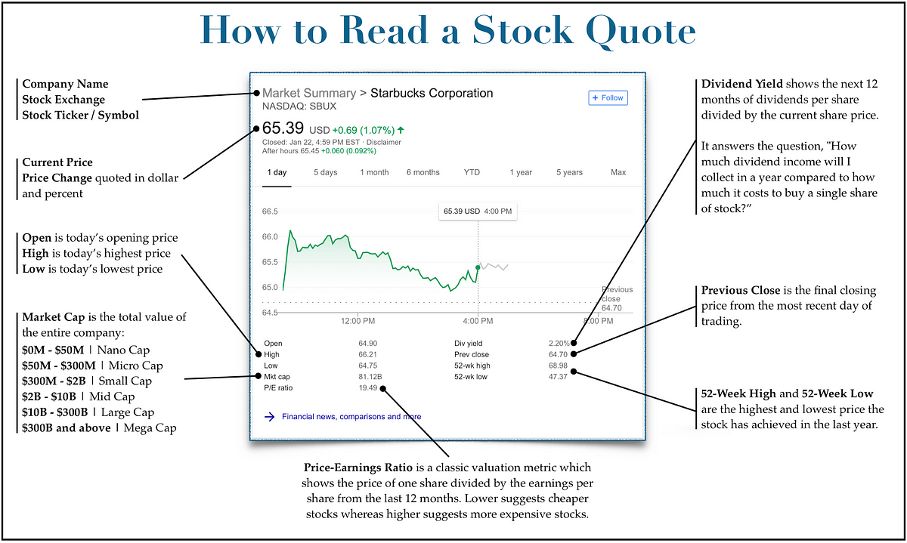

## Table of Contents

## What is a stock quote?

A stock quote is the price of a stock at a specific time. It shows you how much one share of a company's stock costs right now. You can find stock quotes on financial websites, in newspapers, or through your broker.

Stock quotes are important because they help you decide if you want to buy or sell a stock. If the quote is lower than you expected, you might want to buy. If it's higher, you might want to sell. The quote can change quickly because many people are buying and selling stocks all the time.

## Where can you find stock quotes?

You can find stock quotes on many websites that focus on finance and money. Some popular ones are Yahoo Finance, Google Finance, and Bloomberg. These sites show you the current price of stocks and often give you more information like how the price has changed over time.

Another place to find stock quotes is through your stockbroker. If you have an account with a broker like E*TRADE or Charles Schwab, you can log in and see the prices of stocks you are interested in. They might also send you updates or alerts about stock prices.

You can also find stock quotes in newspapers and financial magazines. The Wall Street Journal and the Financial Times are two examples. They print stock quotes every day, but remember, these will be a bit outdated because they are not updated in real-time like on websites.

## What information is included in a basic stock quote?

A basic stock quote shows the current price of a stock. This is the most important piece of information because it tells you how much you would have to pay to buy one share of the stock right now. The quote also includes the stock's ticker symbol, which is a short code used to identify the company on the stock market. For example, Apple's ticker symbol is AAPL.

In addition to the current price and ticker symbol, a basic stock quote usually shows the day's high and low prices. The high price is the most the stock cost at any point during the day, and the low price is the least it cost. You might also see the stock's trading volume, which tells you how many shares were bought and sold that day. This can give you an idea of how popular the stock is among investors.

Sometimes, a basic stock quote will also include the stock's previous closing price, which is what the stock was worth at the end of the last trading day. This helps you see how much the stock's price has changed since then. These pieces of information together give you a quick snapshot of what's happening with the stock right now.

## How do you read the price in a stock quote?

The price in a stock quote tells you how much one share of a company's stock costs right now. It's shown as a number, like $50.00, which means you would need to pay fifty dollars to buy one share of that stock. The price can change a lot during the day because many people are buying and selling stocks all the time.

Sometimes, you might see the price written with a plus or minus sign next to it, like $50.00 (+$0.50) or $50.00 (-$0.50). This shows how much the price has gone up or down since the last time it was checked. If it says $50.00 (+$0.50), it means the price went up by fifty cents since the last check. If it says $50.00 (-$0.50), it means the price went down by fifty cents.

## What does the volume in a stock quote represent?

The volume in a stock quote shows how many shares of a company's stock were bought and sold on that day. It's like counting how many times people traded that stock. If the volume is high, it means a lot of people were interested in buying or selling that stock.

Looking at the volume can help you understand how popular the stock is. If the volume is low, it might mean fewer people are trading it, and the stock might not be as popular. High volume can also mean that the stock's price might change more because there's more activity.

## What is the significance of the 52-week high and low in stock quotes?

The 52-week high and low in stock quotes show the highest and lowest prices that a stock has reached over the past year. The 52-week high tells you the most expensive the stock has been, and the 52-week low tells you the cheapest it has been. This information is important because it gives you an idea of how much the stock's price can change over time.

Looking at the 52-week high and low can help you decide if you want to buy or sell the stock. If the current price is close to the 52-week high, it might mean the stock is expensive right now and could be a good time to sell. If it's close to the 52-week low, it might be a good time to buy because the stock could be cheaper than usual. This helps you see the bigger picture of the stock's price movement over the year.

## How can you interpret the bid and ask prices in a stock quote?

The bid price in a stock quote is the highest price that someone is willing to pay to buy the stock right now. It's like someone saying, "I will pay this much to buy this stock." On the other hand, the ask price is the lowest price that someone is willing to sell the stock for. It's like someone saying, "I will sell this stock for this price."

The difference between the bid and ask prices is called the bid-ask spread. This spread can tell you how easy or hard it might be to buy or sell the stock. If the spread is small, it means there's a lot of activity and it's easy to trade the stock. If the spread is big, it might be harder to buy or sell because fewer people are interested in trading it. Knowing the bid and ask prices helps you understand what you might actually pay to buy a stock and what you might get if you sell it.

## What do the P/E ratio and other financial ratios tell you in a stock quote?

The P/E ratio, or price-to-earnings ratio, is a number that shows how much investors are willing to pay for each dollar of a company's earnings. It's calculated by dividing the current stock price by the company's earnings per share over the last year. A high P/E ratio might mean that investors think the company will grow a lot in the future, so they're willing to pay more for it. On the other hand, a low P/E ratio might mean the company is not expected to grow as much, or it could be a sign that the stock is a good deal.

Other financial ratios you might see in a stock quote include the dividend yield, which tells you how much money you get back each year from owning the stock, and the debt-to-equity ratio, which shows how much the company is borrowing compared to what it owns. The dividend yield is important if you want to earn money from your stocks without selling them, while the debt-to-equity ratio helps you understand if the company is taking on too much risk with its borrowing. All these ratios together give you a better picture of the company's health and what to expect from your investment.

## How do stock quotes change throughout the trading day?

Stock quotes change all the time during the trading day because people are always buying and selling stocks. When someone wants to buy a stock, they might be willing to pay more than the last price, which makes the stock's price go up. If someone wants to sell their stock, they might accept less than the last price, which makes the stock's price go down. This buying and selling happens a lot, so the price can change many times in a single day.

The stock market has set times when it's open for trading, usually from 9:30 AM to 4:00 PM Eastern Time in the United States. During these hours, you can see the stock quotes change in real-time. Outside of these hours, the stock market is closed, and the stock quotes don't change until it opens again. Sometimes, big news or events can make the stock prices jump a lot during the day, so it's good to keep an eye on them if you're interested in buying or selling stocks.

## What are pre-market and after-hours stock quotes?

Pre-market and after-hours stock quotes show the prices of stocks before and after the regular trading hours. Regular trading hours are usually from 9:30 AM to 4:00 PM Eastern Time in the United States. Pre-market trading happens before the market opens, and after-hours trading happens after it closes. These times are important because big news or events can happen outside of regular trading hours, and people might want to buy or sell stocks right away.

The prices during pre-market and after-hours can be different from the prices during regular trading hours. This is because fewer people are trading at these times, so the prices can move more quickly. If you see a stock quote during these times, it might not be the same when the market opens again. It's good to keep an eye on these quotes if you're thinking about buying or selling stocks, but remember that the prices can change a lot until the market opens again.

## How can historical stock quotes be used for investment analysis?

Historical stock quotes can help you see how a stock's price has changed over time. By looking at these past prices, you can see if the stock goes up and down a lot, or if it stays pretty steady. This can tell you how risky the stock might be. If the price jumps around a lot, it might be more risky than a stock that stays pretty much the same. You can also see if there are times of the year when the stock does better or worse, which can help you decide when to buy or sell.

Another way to use historical stock quotes is to compare them with what's happening in the world or with the company. If you see that the stock's price went down when the company had bad news, like losing money or a big lawsuit, you can learn from that. You can also see if the stock's price goes up when the economy is doing well. By looking at these patterns, you can make better guesses about what might happen to the stock's price in the future. This can help you make smarter choices about when to buy or sell the stock.

## What advanced metrics should an expert look for in detailed stock quotes?

An expert looking at detailed stock quotes might focus on metrics like the beta, which shows how much a stock's price moves compared to the overall market. A beta higher than 1 means the stock is more volatile than the market, while a beta lower than 1 means it's less volatile. Another important metric is the earnings per share (EPS), which tells you how much profit the company makes for each share of stock. This can help you understand if the company is doing well or not. The price-to-book ratio (P/B ratio) is also useful because it compares the stock's market value to its book value, which can show if the stock is overvalued or undervalued.

Other advanced metrics include the return on equity (ROE), which measures how well a company is using the money shareholders have invested to generate profit. A high ROE can mean the company is doing a good job at making money for its investors. The price-to-sales ratio (P/S ratio) compares the stock's price to the company's revenue, giving you another way to see if the stock is priced fairly. Finally, an expert might look at the stock's moving averages, like the 50-day and 200-day moving averages, to see the stock's trend over time. These metrics together give a deeper understanding of the stock's performance and potential.

## What is the Role of Financial Markets?

Financial markets are essential infrastructures that facilitate the buying and selling of various types of securities, including stocks, bonds, commodities, and derivatives. They operate as a sophisticated network where stock quotes play an instrumental role in conveying the prevailing market sentiment. A stock quote provides real-time data concerning the trading price of a stock, thus offering investors immediate insights into a company's financial health and potential market movements.

The functionality of financial markets extends beyond mere transaction platforms; they are pivotal in enabling the exchange of investment products. This dynamic exchange supports economic growth and wealth accumulation by allocating capital to projects and companies that demonstrate potential for innovation and expansion. Consequently, financial markets are crucial in promoting efficient capital allocation, which in turn fosters economic development and expansion.

To strategize investment decisions effectively, investors must grasp how these markets function. They need to interpret diverse stock-related data and metrics, which requires a keen understanding of financial principles and market mechanics. For instance, in evaluating a stock, an investor might employ formulas like the Price-to-Earnings (P/E) ratio, given by:

$$
\text{P/E Ratio} = \frac{\text{Market Value per Share}}{\text{Earnings per Share (EPS)}}
$$

Understanding such metrics can help investors identify undervalued or overvalued securities, thereby enabling more informed and strategic investment choices.

Furthermore, financial markets are subject to influences from a myriad of external factors. Economic indicators such as interest rates, inflation, and employment reports can significantly affect market behavior. Government policies, including taxation and regulatory changes, also play critical roles in shaping market dynamics. Additionally, global events—ranging from geopolitical tensions to pandemics—can lead to market volatility and influence investor behavior. Therefore, a comprehensive understanding of these factors is vital for investors trying to navigate the complexities of financial markets.

In summary, financial markets are integral to the functioning of modern economies, offering platforms for trade and opportunities for prosperity. A robust understanding of these markets, combined with awareness of influential external factors, equips investors to craft effective strategies and optimize their investment decisions.

 to Algorithmic Trading

Algorithmic trading, commonly referred to as algo trading, represents a significant evolution in financial market operations, characterized by the use of sophisticated computerized systems to execute trades based on well-defined criteria. This automation is celebrated for its speed and efficiency, significantly reducing the lag between trade signals and execution, which is crucial in capturing market opportunities. Moreover, by eliminating the emotional component inherent in human decision-making, algo trading enhances consistency in trading performance.

Several strategies are prevalent in [algorithmic trading](/wiki/algorithmic-trading), each designed to exploit different market behaviors. Trend-following strategies, for example, aim to capitalize on continuing price movements by buying securities showing an upward trajectory or shorting those showing a decline. This is often achieved using simple moving averages or more complex linear regression models to predict future price movements.

Statistical [arbitrage](/wiki/arbitrage) is another commonly deployed strategy, based on the notion that price discrepancies between correlated securities are temporary and will eventually correct. This approach involves analyzing large datasets to identify stock price differentials that deviate from historical norms, allowing traders to profit from the reversion to the mean.

Mean reversion strategies, similarly, operate on the theory that prices will revert to their historical averages over time. This method involves algorithms programmed to identify deviations from these historical norms and execute trades that anticipate a return to equilibrium.

The presence of algorithmic trading in financial markets provides substantial liquidity, enabling smoother transactions and enhanced market efficiency. However, it also introduces complexities regarding market volatility. High-frequency trading, a subset of algorithmic trading characterized by high turnover rates and short holding periods, can contribute to sharp price movements and increased volatility.

The integration of advanced technology in trading has cemented algorithmic trading as an integral component of the financial markets. The continuous advancements in computing power and data processing capabilities have lowered the barriers to entry, allowing a broader range of market participants to engage in sophisticated trading strategies. This democratization of access ensures that algorithmic trading will remain a pivotal element in the landscape of modern finance.

## References & Further Reading

[1]: ["Advances in Financial Machine Learning"](https://www.amazon.com/Advances-Financial-Machine-Learning-Marcos/dp/1119482089) by Marcos Lopez de Prado

[2]: ["Evidence-Based Technical Analysis: Applying the Scientific Method and Statistical Inference to Trading Signals"](https://www.amazon.com/Evidence-Based-Technical-Analysis-Scientific-Statistical/dp/0470008741) by David Aronson

[3]: ["Machine Learning for Algorithmic Trading"](https://github.com/stefan-jansen/machine-learning-for-trading) by Stefan Jansen

[4]: ["Quantitative Trading: How to Build Your Own Algorithmic Trading Business"](https://www.amazon.com/Quantitative-Trading-Build-Algorithmic-Business/dp/1119800064) by Ernest P. Chan

[5]: Hasbrouck, J. (2004). ["Empirical Market Microstructure: The Institutions, Economics, and Econometrics of Securities Trading"](https://academic.oup.com/book/52241) 

[6]: Narang, R. (2013). ["Inside the Black Box: The Simple Truth About Quantitative Trading"](https://www.amazon.com/Inside-Black-Box-Quantitative-Trading/dp/0470432063)
