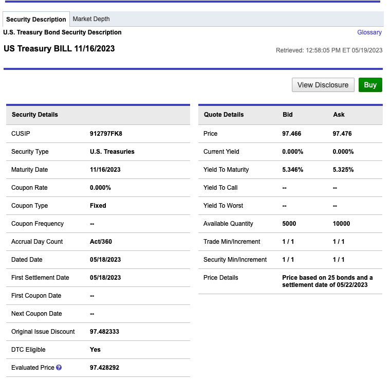

## Table of Contents

## What is a T-Bill?

A T-Bill, or Treasury Bill, is a short-term debt instrument issued by the U.S. government to help finance its operations. It's considered one of the safest investments because it's backed by the full faith and credit of the U.S. government. T-Bills have maturities ranging from a few days to a year, and they are sold at a discount from their face value. When the bill matures, the government pays the investor the full face value, and the difference between the purchase price and the face value is the interest earned.

Investors often use T-Bills to manage their cash reserves or as a safe place to park money temporarily. They are popular among individual and institutional investors because they offer a low-risk way to earn a return on cash that might otherwise sit idle. T-Bills can be bought directly from the U.S. Department of the Treasury through TreasuryDirect or through banks and brokers. They are also highly liquid, meaning they can be easily bought and sold in the secondary market before they mature.

## What does a T-Bill quote represent?

A T-Bill quote shows the discount rate or yield at which the T-Bill is being offered. It tells you how much less than the face value you will pay to buy the T-Bill. For example, if a T-Bill has a face value of $1,000 and is quoted at a 2% discount rate, you will pay $980 to buy it. When the T-Bill matures, you get the full $1,000 back, so your profit is $20.

The quote can also be shown as a yield, which is the annualized return you would get if you held the T-Bill until it matures. This helps you compare T-Bills with different maturities or with other investments. The yield is calculated based on the discount rate and the time until the T-Bill matures. So, a T-Bill quote gives you important information to decide if it's a good investment for you.

## How are T-Bills quoted differently from other securities?

T-Bills are quoted differently from other securities because they are sold at a discount and do not pay interest in the traditional sense. When you see a T-Bill quote, it shows the discount rate or the yield. The discount rate tells you how much less than the face value you'll pay to buy the T-Bill. For example, if a T-Bill has a face value of $1,000 and is quoted at a 2% discount, you'll pay $980 to buy it. When it matures, you get the full $1,000 back, so your profit is the difference, which is $20.

The yield on a T-Bill quote is a bit different. It's the annualized return you would get if you held the T-Bill until it matures. This helps you compare T-Bills with different lengths of time until they mature or with other investments. The yield is calculated based on the discount rate and how long you have to wait until the T-Bill matures. So, the quote gives you important information to decide if buying the T-Bill is a good choice for you.

## What is the difference between the face value and the purchase price of a T-Bill?

The face value of a T-Bill is the amount of money the government promises to pay you when the T-Bill matures. It's like the full price of the T-Bill. The purchase price, on the other hand, is the amount you actually pay to buy the T-Bill. This price is less than the face value because T-Bills are sold at a discount.

The difference between the face value and the purchase price is what you earn as interest. For example, if you buy a T-Bill with a face value of $1,000 for $980, you will get $1,000 back when it matures. The $20 difference is your profit, which is the interest you earn on your investment. This way, T-Bills help you make money by buying them at a lower price and getting the full face value later.

## How do you calculate the yield of a T-Bill?

To calculate the yield of a T-Bill, you need to know the face value, the purchase price, and the time until it matures. The yield is the annualized rate of return you earn on your investment. First, find out the interest you earn by subtracting the purchase price from the face value. Then, divide this interest by the purchase price to get the rate of return for the time period the T-Bill is held.

To annualize this rate, you need to consider how long you hold the T-Bill. If it matures in less than a year, you multiply the rate of return by the number of periods in a year that match the T-Bill's term. For example, if the T-Bill matures in 90 days, you multiply the rate by 365/90 to get the annual yield. This way, you can compare the yield of T-Bills with different maturities or with other investments.

## What is the discount rate in relation to T-Bills?

The discount rate for T-Bills is the percentage off the face value that you pay when you buy them. If a T-Bill has a face value of $1,000 and is sold at a 2% discount rate, you pay $980 to buy it. The difference between the $980 you pay and the $1,000 you get back when it matures is your profit, which is the interest you earn.

This discount rate is important because it helps you figure out how much money you will make on your T-Bill investment. It's different from other investments that might pay you interest regularly. With T-Bills, you earn all your interest at once when the T-Bill matures, and the discount rate tells you how much of a discount you get when you buy it.

## How does the maturity date affect the T-Bill quote?

The maturity date of a T-Bill is when you get your money back, and it affects the T-Bill quote in a big way. The quote shows either a discount rate or a yield. The discount rate tells you how much less than the face value you pay to buy the T-Bill. The yield is the annualized return you get if you hold the T-Bill until it matures. The time until the T-Bill matures changes how these rates are calculated.

If a T-Bill matures in a short time, like 90 days, the yield is calculated differently than if it matures in a longer time, like a year. To find the annual yield, you need to adjust the discount rate based on how many days are left until the T-Bill matures. This means that T-Bills with different maturity dates will have different quotes, even if they have the same face value and are sold at the same discount rate. Understanding the maturity date helps you compare T-Bills and decide which one is the best investment for you.

## What are the common terms (lengths) for T-Bills?

T-Bills come in different lengths, usually 4 weeks, 8 weeks, 13 weeks, 26 weeks, and 52 weeks. These lengths are how long you have to wait before the T-Bill matures and you get your money back. The shortest T-Bill, which is 4 weeks, is good if you need your money back quickly. The longest one, which is 52 weeks, means you have to wait a whole year before you get your money back.

Each length of T-Bill has its own discount rate and yield. The discount rate is how much less than the face value you pay to buy the T-Bill. The yield is how much money you make from the T-Bill each year. If you want to compare T-Bills with different lengths, you need to look at their yields because they tell you how much money you will make over a year, no matter how long you have to wait for the T-Bill to mature.

## How can investors use T-Bill quotes to compare different investment options?

Investors can use T-Bill quotes to compare different investment options by looking at the yield. The yield tells you how much money you will make from the T-Bill each year. If you see two T-Bills with different lengths, like one that matures in 13 weeks and another that matures in 52 weeks, you can compare their yields to see which one gives you a better return for your money. The yield helps you understand if the T-Bill is a good investment compared to other options like savings accounts or bonds.

When comparing T-Bills to other investments, it's important to consider the risk and how long you need to wait for your money. T-Bills are very safe because they are backed by the U.S. government, but they might not give you as high a return as riskier investments like stocks. If you need your money back quickly, you might choose a T-Bill with a short maturity date, like 4 weeks. But if you can wait longer, a T-Bill with a longer maturity date, like 52 weeks, might give you a higher yield. By looking at the T-Bill quotes and understanding the yield, you can make a smart choice about where to invest your money.

## What are the tax implications of investing in T-Bills?

When you invest in T-Bills, you need to know about the taxes you might have to pay. The interest you earn from T-Bills is subject to federal income tax. This means you have to report the difference between what you paid for the T-Bill and what you get back when it matures as income on your federal tax return. However, the good news is that this interest is not subject to state or local income taxes. So, you don't have to worry about paying state or city taxes on the money you make from T-Bills.

If you hold T-Bills in a tax-advantaged account like an IRA or a 401(k), the tax rules can be different. In these accounts, the interest you earn might not be taxed until you take the money out of the account. This can be a good way to save on taxes if you plan to keep your money invested for a long time. Always talk to a tax professional to understand how T-Bills will affect your taxes, as everyone's situation is different.

## How do market conditions influence T-Bill quotes?

Market conditions can have a big impact on T-Bill quotes. When the economy is doing well, people might want to invest their money in riskier options like stocks, so they might not buy as many T-Bills. This means the government might have to offer a higher yield to attract investors, which makes the T-Bill quotes go up. On the other hand, if the economy is not doing well, people might want to keep their money safe, so they buy more T-Bills. This can make the yield go down because the government doesn't have to offer as much to get people to buy them.

Another thing that can affect T-Bill quotes is what the Federal Reserve is doing with interest rates. If the Federal Reserve raises interest rates, it can make other investments more attractive, so T-Bill yields might need to go up to compete. If the Federal Reserve lowers interest rates, T-Bill yields might go down because other investments are less appealing. So, keeping an eye on what's happening in the economy and with interest rates can help you understand why T-Bill quotes are changing.

## What advanced strategies can be used with T-Bill quotes for portfolio management?

Investors can use T-Bill quotes to manage their portfolios by laddering their investments. This means buying T-Bills that mature at different times, like some in 4 weeks, some in 13 weeks, and some in 52 weeks. By doing this, you can have money coming back to you at different times, which helps you keep some cash available while still [earning](/wiki/earning-announcement) interest. When a T-Bill matures, you can use the money to buy a new T-Bill or invest it somewhere else, depending on what the current T-Bill quotes and market conditions are.

Another strategy is to use T-Bill quotes to manage risk. If you think the economy might get worse, you might want to buy more T-Bills because they are very safe. T-Bill quotes can help you see if the yield is good enough to make this a smart move. If the economy is doing well, you might want to invest less in T-Bills and more in riskier investments that could give you a higher return. By watching T-Bill quotes, you can decide when to move money into or out of T-Bills to balance the risk in your portfolio.

## What is the understanding of Treasury Bills?

Treasury Bills, or T-Bills, are short-term debt securities issued by the U.S. government. As instruments of fiscal policy, T-Bills are designed to finance the national debt and provide a tool for managing liquidity within the economy. These securities have maturities of one year or less and are issued at a discount, meaning they are sold for less than their face value. Upon reaching maturity, investors are reimbursed the full face value, resulting in a profit equal to the difference between the purchase price and the redemption value.

The absence of periodic interest payments characterizes T-Bills as zero-coupon securities. Instead of receiving interest regularly, the investor’s return is embedded in the discounted purchase price. The effective yield or return on investment can be understood by the formula:

$$
\text{Yield} = \left(\frac{\text{Face Value} - \text{Purchase Price}}{\text{Purchase Price}}\right) \times \left(\frac{365}{\text{Days to Maturity}}\right)
$$

T-Bills are widely regarded as a low-risk investment primarily due to the implicit backing by the full faith and credit of the U.S. government, making the likelihood of default extraordinarily low. This secure backing has entrenched T-Bills as a critical component of secure investment portfolios, particularly for risk-averse investors.

Potential investors can acquire T-Bills through competitive and non-competitive bidding processes in auctions organized by the U.S. Treasury Department. Competitive bidding allows investors to specify the yield they are willing to accept, potentially influencing the T-Bill allocation they receive. In contrast, non-competitive bidding guarantees the purchase of desired amounts at the yield determined by the auction, ensuring accessibility even to individual investors without extensive market knowledge. 

The strategic issuance of T-Bills continues to reflect the federal government's monetary policy objectives, influencing short-term interest rates and contributing to broader economic stability.

## How do you read T-Bill quotes?

Treasury Bill (T-Bill) quotes are essential for investors looking to navigate the T-Bill market effectively. These quotes encompass several key elements: maturity, bid, ask, and yield.

**Maturity** refers to the time remaining until the T-Bill reaches its redemption date. T-Bills are short-term securities with maturities ranging from a few days to one year. Understanding the maturity period is crucial as it influences liquidity preferences and aligning investment timing with financial goals.

**Bid and Ask Prices** are crucial for understanding market interest and dynamics. The bid price is the highest price that a buyer is willing to pay for a T-Bill, while the ask price is the lowest price a seller is willing to accept. The difference between these two prices is known as the “spread.” A narrower spread often indicates higher liquidity and less uncertainty in the market. These prices are reflected in discount rates, which determine the implied yield of the T-Bill.

**Yield** represents the annualized rate of return an investor can expect if the T-Bill is held until maturity. Yield is calculated based on the purchase price, face value, and the time until maturity. It's an important measure for evaluating the potential return on investment. The yield can be expressed using the following formula:

$$
\text{Yield} = \left(\frac{\text{Face Value} - \text{Purchase Price}}{\text{Purchase Price}}\right) \times \left(\frac{360}{\text{Days to Maturity}}\right)
$$

This formula highlights the return on the initial investment relative to the purchase price and accounts for the time [factor](/wiki/factor-investing) by annualizing the return over a 360-day year, commonly used in money market calculations.

In conclusion, comprehending T-Bill quotes involves assessing the maturity, bid, ask, and yield. Each component provides valuable insights into the return potential, market conditions, and [liquidity](/wiki/liquidity-risk-premium) of the investment. By accurately interpreting these quotes, investors can make informed decisions and optimize their investment outcomes.

## References & Further Reading

[1]: ["Treasury Securities & Programs."](https://www.investopedia.com/articles/investing/073113/introduction-treasury-securities.asp) U.S. Department of the Treasury.

[2]: Tse, Y., & Williams, M. (2004). ["The Market Microstructure of the U.S. Treasury Market: Recent Developments and Lessons from the Eurex U.S. Treasury Products."](https://www.cureus.com/articles/323229-complications-of-post-roux-en-y-gastric-bypass-a-case-of-excluded-stomach-perforation#!/) Financial Review, 39(4), 597-617.

[3]: Aldridge, I. (2010). ["High-Frequency Trading: A Practical Guide to Algorithmic Strategies and Trading Systems."](https://www.ahmetbeyefendi.com/wp-content/uploads/2020/07/High-Frequency-Trading-Irene-Aldridge.pdf) Wiley.

[4]: Lopez de Prado, M. (2018). ["Advances in Financial Machine Learning."](https://www.amazon.com/Advances-Financial-Machine-Learning-Marcos/dp/1119482089) Wiley.

[5]: Harris, L. (2003). ["Trading and Exchanges: Market Microstructure for Practitioners."](https://academic.oup.com/book/52292) Oxford University Press.