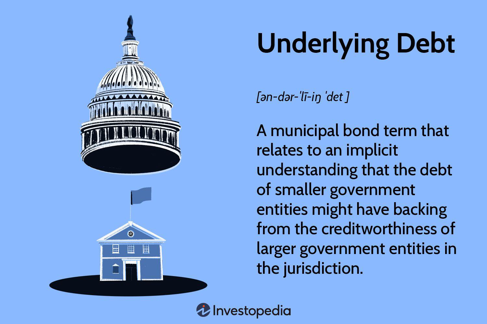

Debt is a fundamental concept in finance that represents an obligation to repay borrowed money. It plays a critical role in the financial landscape, influencing the decisions of investors and traders. In the context of algorithmic trading, understanding debt and its related financial dynamics is crucial. Algorithmic trading involves using computer algorithms to execute trades at high speeds, and debt-related financial metrics can significantly impact trading strategies and risk management.

Investors and traders must be aware of debt-related metrics such as debt ratios, which assess a company's financial health by indicating its leverage levels. These metrics are essential as they help in evaluating the company's ability to meet its financial obligations. Notably, the debt ratio is a crucial indicator used in financial analysis and trading decisions. It is calculated as:



$$
\text{Debt Ratio} = \frac{\text{Total Liabilities}}{\text{Total Assets}}
$$

A high debt ratio indicates that a company has more liabilities compared to its assets, which could suggest financial instability or aggressive growth strategies funded by borrowing. Conversely, a low debt ratio may imply a conservative approach to financing. These ratios can significantly influence algorithmic trading strategies by informing the risk levels and potential returns of investments.

Algorithmic trading systems use quantitative models to analyze market data and execute trades. By incorporating debt-related metrics, these models can develop strategies that consider the financial leverage of target investments. For instance, a strategy might involve favoring companies with low debt ratios during periods of economic uncertainty, when the ability to service debt obligations might be strained.

Algorithmic traders use advanced computing technologies and large datasets to optimize their trades. Debt instruments, such as bonds, are often included in algorithmic trading models due to their predictable income streams and relative stability. However, traders must also account for the implications of changing interest rates and credit conditions, which can affect debt instruments' market values.

This article aims to explore various debt instruments, their significance, and their implications in automated trading, providing insights into how understanding debt-related financial metrics can influence trading strategies and contribute to more informed investment decisions.

## Table of Contents

## Understanding Debt in Financial Markets

Debt is a fundamental aspect of finance and economics, representing an obligation that one party, the borrower, owes to another, the lender. It's pivotal in facilitating economic transactions and expansion, often used by individuals, corporations, and governments to finance projects and operations. Debt is crucial in financial markets as it provides necessary capital flow, stimulating economic growth and [liquidity](/wiki/liquidity-risk-premium).

Several forms of debt include loans, bonds, and mortgages, each serving distinct purposes. Loans are typically agreements between private parties, often used for personal or business needs. They encompass terms defining repayment schedules, interest rates, and penalties. Bonds, in contrast, are debt securities issued by companies or governments to raise funds from investors for various projects. They usually come with fixed interest payments at defined intervals and have a maturity date, the point by which the principal must be repaid. Mortgages are specific types of loans secured by real property, frequently utilized in real estate transactions. They involve long-term repayment plans and are collateralized by the property itself.

Crucial terms related to debt include the principal, interest, maturity, and collateral. The principal is the initial amount borrowed, while interest is the cost of borrowing this principal, expressed as a percentage over time. Maturity refers to the specified date when the debt must be repaid in full. Collateral is an asset pledged by the borrower to secure a loan, offering protection to the lender in cases of default.

Debt markets are integral to the broader financial system, acting as platforms where debt instruments are issued and traded. They facilitate the efficient allocation of resources by providing liquidity – the ease of converting assets into cash without significant loss in value – and funding options, enabling investors and institutions to meet short-term obligations and long-term investment goals. These markets play a vital role in setting interest rates and enabling price discovery, thereby allowing participants to assess creditworthiness and risk. 

Through bonds and other debt instruments, these markets help distribute economic resources effectively, thereby maintaining economic stability and growth. Understanding the dynamics of debt markets is essential for traders and investors, as it affects pricing, risk assessment, and investment strategy.

## Algorithmic Trading and Debt Markets

Algorithmic trading has significantly transformed modern financial markets by automating and optimizing the trading process. By leveraging sophisticated algorithms, traders can execute orders at speeds and efficiencies that surpass human capabilities. In debt markets, [algorithmic trading](/wiki/algorithmic-trading) has become increasingly consequential, particularly in the trading of bonds and other debt instruments.

Debt instruments such as bonds provide unique opportunities for algorithmic trading due to their distinct characteristics and market structures. Bonds are essentially loans made by investors to borrowers, typically corporations or governments, in exchange for periodic interest payments and the return of the bond's face value at maturity. The automation of bond trading involves complex algorithms that capitalize on market inefficiencies and exploit small price discrepancies.

One key strategy in algorithmic trading of debt instruments is [arbitrage](/wiki/arbitrage). This involves simultaneously buying and selling securities across different markets to take advantage of price differentials. In bond markets, arbitrage can occur between various maturities or between different issuers with similar credit profiles. Yield curve analysis is another crucial strategy. It involves evaluating the yield curve, which plots interest rates across different maturities of debt. Trading strategies based on the shape and movements of the yield curve can be automated to predict [interest rate](/wiki/interest-rate-trading-strategies) changes and identify profitable trades.

Credit spread trading is similarly important. It focuses on the difference in yields between bonds of different credit qualities or durations. Algorithims can be programmed to monitor and trade on these spread differentials, balancing the potential for higher yields with underlying credit risks.

The role of data is profound in debt-based algorithmic trading. Algorithms rely heavily on historical and real-time data to make informed predictions and trading decisions. This data encompasses interest rates, credit ratings, economic indicators, and issuer financials. Tools and technologies used in this domain include [machine learning](/wiki/machine-learning) models, statistical analysis software, and data visualization platforms.

Python, with libraries such as Pandas for data manipulation and NumPy for numerical computations, is widely used in developing and implementing trading algorithms. Here is a simplistic example in Python to demonstrate a basic trend analysis for trading bonds:

```python
import pandas as pd

# Load historical bond yield data
data = pd.read_csv('bond_yield_data.csv')

# Calculate moving averages to identify trends
data['short_ma'] = data['yield'].rolling(window=5).mean()
data['long_ma'] = data['yield'].rolling(window=20).mean()

# Generate trading signals
data['signal'] = 0
data['signal'][data['short_ma'] > data['long_ma']] = 1
data['signal'][data['short_ma'] <= data['long_ma']] = -1

# Trading strategy based on signals
data['position'] = data['signal'].shift()
```

The provided code outlines a simple strategy where a trader buys a bond when the short-term moving average surpasses the long-term moving average and sells when the opposite occurs. This algorithmic approach is elementary but exemplifies how debt instrument trading can be automated to enhance efficiency and profitability.

Through sophisticated algorithms and data-driven strategies, algorithmic trading in debt markets continues to evolve, contributing to market liquidity and price discovery. As technology progresses, the integration of advanced analytics and machine learning models is expected to further revolutionize the landscape of debt trading.

## Debt Ratios and Financial Analysis

Debt ratios are critical metrics used to assess a company's financial leverage and its ability to manage and repay its debts. The debt ratio is calculated as the total debt of a company divided by its total assets, often expressed as a percentage:

$$
\text{Debt Ratio} = \frac{\text{Total Debt}}{\text{Total Assets}}
$$

A higher ratio indicates more leverage and potentially greater financial risk as it suggests a company is heavily reliant on borrowed funds. Hence, understanding a company's debt ratio is vital for investors and traders using algorithmic models, as it provides insights into a firm's financial structure and solvency risk.

The leverage ratio, particularly the debt-to-equity ratio, is another crucial measure indicating a firm's financial strategy. It compares the total liabilities to shareholders' equity:

$$
\text{Debt-to-Equity Ratio} = \frac{\text{Total Liabilities}}{\text{Shareholders' Equity}}
$$

This ratio helps investors understand the balance between debt-related financing and equity financing. A high debt-to-equity ratio may indicate that a company is aggressive in financing its growth with debt, which can result in higher returns but also increased [volatility](/wiki/volatility-trading-strategies).

In algorithmic trading, these ratios influence trading decisions by affecting the assessment of a company's risk and return profile. Algorithms can incorporate these metrics to adjust trading strategies based on the perceived risk. For instance, models may reduce exposure to firms with unusually high debt ratios due to heightened default risk, or alternatively, capitalize on potential high returns from leveraged growth strategies.

Industry-specific variations in acceptable debt ratios are significant for financial analysis. Sectors like utilities or telecommunications commonly [carry](/wiki/carry-trading) higher debt ratios due to stable cash flows and significant infrastructure investment needs, while technology companies might maintain lower debt ratios due to rapid innovation cycles and lower capital intensity. Understanding these variations ensures that algorithms can replicate or formulate industry-specific investment strategies, optimizing returns while managing risk.

Here is a Python example that calculates the debt-to-equity ratio:

```python
def calculate_debt_to_equity(total_liabilities, shareholders_equity):
    if shareholders_equity == 0:
        return float('inf')  # Avoid division by zero
    return total_liabilities / shareholders_equity

# Example usage
total_liabilities = 500000  # Example value in dollars
shareholders_equity = 250000  # Example value in dollars

de_ratio = calculate_debt_to_equity(total_liabilities, shareholders_equity)
print(f"Debt-to-Equity Ratio: {de_ratio:.2f}")
```

Algorithmic trading strategies leverage these calculations to dynamically adjust portfolios based on company-specific and market-wide financial health indicators, ensuring an adept balance between risk and opportunity in the ever-evolving financial landscape.

## Impact of Debt Ratios on Algorithmic Trading Strategies

Debt ratios are crucial financial metrics that significantly influence algorithmic trading strategies. These ratios, such as the debt-to-equity ratio and debt coverage ratios, provide insight into a company's financial leverage and risk profile. Understanding how these ratios affect trading strategies and risk management is essential for optimizing algorithmic models.

High debt ratios typically indicate a company’s reliance on borrowed funds, which may lead to higher financial risk. Algorithmic trading strategies need to account for this risk by potentially avoiding investments in companies with very high leverage or by shorting such stocks if anticipating a downturn in their market value. Conversely, low debt ratios may suggest stability and lower financial risk, making such investments appealing for long positions. However, excessively low debt leverage might also imply underutilization of growth opportunities via financial leverage, an aspect that some algorithmic models might consider for potential downside in growth trajectories.

Algorithmic trading systems can dynamically adjust their strategies based on financial ratios. For example, a model can be programmed to automatically rebalance a portfolio when debt ratios of certain securities exceed predefined thresholds. This dynamic adjustment not only ensures alignment with risk tolerance levels but also takes advantage of market movements that might not be apparent from a static analysis.

Python’s robust analytical capabilities facilitate the calculation and evaluation of debt ratios for trading purposes. Consider the following Python example that calculates the debt-to-equity ratio:

```python
def calculate_debt_to_equity(total_debt, total_equity):
    """
    Calculates the debt-to-equity ratio.

    :param total_debt: Total debt of the company
    :param total_equity: Total equity of the company
    :return: Debt-to-equity ratio
    """
    if total_equity == 0:
        raise ValueError("Total equity cannot be zero for ratio calculation.")
    return total_debt / total_equity

# Example data
company_debt = 1500000
company_equity = 500000

# Calculate ratio
de_ratio = calculate_debt_to_equity(company_debt, company_equity)
print(f"Debt-to-Equity Ratio is: {de_ratio}")
```

In this script, the `calculate_debt_to_equity` function computes the debt-to-equity ratio, providing traders with precise metrics to guide their algorithmic strategies.

Through effective use of such calculations, algorithmic trading models can mitigate risks by opting for assets with favorable debt profiles and adapt strategies in real-time to maximize returns while managing financial risks associated with high or low leverage scenarios.

## Risks and Opportunities in Debt-Related Algorithmic Trading

Algorithmic trading with debt instruments introduces various risks and opportunities, key among them being market risks, credit risks, and interest rate risks. Market risk arises from the potential for financial losses due to adverse price movements of debt securities. For example, in the event of a bond market decline, algorithmic strategies holding large positions in bonds may incur substantial losses.

Credit risk in debt-related algorithmic trading refers to the possibility that an issuer of a debt instrument, such as a bond, may default on its obligations. This risk is vital when trading corporate bonds or other instruments where the issuer's creditworthiness is a fundamental concern. To manage this risk, traders can employ credit default swaps (CDS) or diversify their portfolios across a range of issuers to mitigate potential impacts from the default of a single entity.

Interest rate risk is another critical [factor](/wiki/factor-investing), particularly for debt instruments with fixed returns, like bonds. Changes in interest rates can affect the market value of these securities. For instance, an increase in interest rates typically leads to a decrease in bond prices, affecting trading strategy valuations. Algorithmic traders may use interest rate derivatives to hedge against these risks, or implement dynamic adjustments to their portfolios in response to interest rate changes.

Despite these risks, algorithmic trading presents various opportunities in the debt markets. One such opportunity is the ability to exploit arbitrage possibilities. For example, discrepancies in bond prices across different markets or platforms can be capitalized upon through algorithmic strategies designed to buy low in one market and sell high in another. Additionally, algorithmic trading enables the rapid analysis of vast amounts of data, aiding in the identification of favorable yield spreads or credit opportunities.

To mitigate the risks associated with algorithmic debt trading while leveraging opportunities, traders must employ advanced analytical tools and risk management strategies. Techniques such as stress testing and scenario analysis allow traders to evaluate the potential impact of extreme market conditions on their portfolios. Utilization of financial metrics and models can further enhance decision-making processes. For instance, Python can be employed for real-time data analysis and algorithm [backtesting](/wiki/backtesting):

```python
import numpy as np

def stress_test(portfolio, shock_scenario):
    """Apply a shock scenario to a portfolio to assess potential impact."""
    return {asset: value * (1 + shock_scenario.get(asset, 0)) for asset, value in portfolio.items()}

portfolio = {'bond_A': 10000, 'bond_B': 20000}
shock_scenario = {'bond_A': -0.05, 'bond_B': -0.10}

stressed_portfolio = stress_test(portfolio, shock_scenario)
print(stressed_portfolio)
```

In summary, debt-related algorithmic trading involves navigating various risks, but also offers lucrative opportunities through precise execution and advanced data analysis. By understanding and managing the inherent risks, traders can optimize their strategies in the dynamic financial landscape.

## Conclusion

The relationship between debt financial concepts and algorithmic trading is a complex interplay that underscores the significance of financial acumen in crafting efficient trading strategies. Debt instruments, such as bonds and loans, form a critical component of financial markets, offering liquidity and structured funding options. Algorithmic trading, with its reliance on data-driven and automated decision-making processes, requires a thorough understanding of these debt instruments and their associated financial metrics to effectively manage risks and seize market opportunities.

In algorithmic trading, debt ratios, such as the debt-to-equity ratio, are pivotal in assessing a company's financial leverage. These ratios influence risk management strategies and trading decisions within algorithmic models. Traders must be equipped to integrate such financial metrics to optimize trade execution and maximize returns while minimizing exposure to adverse market movements.

The landscape of debt trading in automated financial systems is rapidly evolving. Advances in technology and data analytics continue to transform how traders approach debt markets, facilitating more sophisticated strategies like arbitrage, yield curve analysis, and credit spread trading. This evolution necessitates an ongoing commitment to learning and adaptation, ensuring that market participants remain informed about emerging trends and the latest computational tools.

To succeed in this dynamic environment, traders and investors are encouraged to build a solid foundation in both financial principles and algorithmic techniques. By leveraging resources like online courses, financial literature, and practical coding exercises, individuals can enhance their understanding and capabilities in this field, thereby positioning themselves to take advantage of the opportunities presented by debt-related algorithmic trading. Continued exploration and education will be key for those looking to thrive in the ever-advancing world of finance and automated trading.

## References & Further Reading

[1]: ["Advances in Financial Machine Learning"](https://www.amazon.com/Advances-Financial-Machine-Learning-Marcos/dp/1119482089) by Marcos Lopez de Prado

[2]: ["Evidence-Based Technical Analysis: Applying the Scientific Method and Statistical Inference to Trading Signals"](https://www.amazon.com/Evidence-Based-Technical-Analysis-Scientific-Statistical/dp/0470008741) by David Aronson

[3]: ["Quantitative Trading: How to Build Your Own Algorithmic Trading Business"](https://www.amazon.com/Quantitative-Trading-Build-Algorithmic-Business/dp/1119800064) by Ernest P. Chan

[4]: ["Fixed Income Analysis"](https://en.wikipedia.org/wiki/Fixed_income_analysis) by Barbara S. Petitt

[5]: ["Algorithmic Trading: Winning Strategies and Their Rationale"](https://www.amazon.com/Algorithmic-Trading-Winning-Strategies-Rationale-ebook/dp/B00CY5HC0U) by Ernie Chan

[6]: ["Bond and Money Markets: Strategy, Trading, Analysis"](https://books.google.com/books/about/Bond_and_Money_Markets.html?id=c1N36C7LxU4C) by Moorad Choudhry

[7]: Bergstra, J., Bardenet, R., Bengio, Y., & Kégl, B. (2011). ["Algorithms for Hyper-Parameter Optimization."](https://dl.acm.org/doi/10.5555/2986459.2986743) Advances in Neural Information Processing Systems 24.