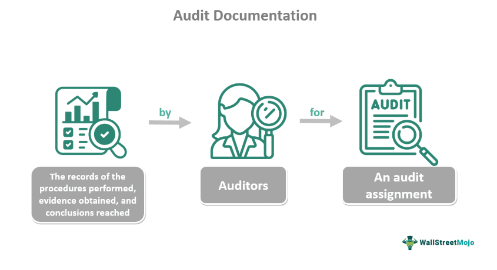

Email marketing remains one of the most effective digital marketing strategies for businesses across various industries. Its ability to deliver targeted and personalized content directly to customers makes it a preferred choice for marketers aiming to enhance customer engagement and drive sales. According to a study by Statista, global email users are expected to reach 4.6 billion by 2025, indicating the vast potential for businesses to connect with a broad audience through email marketing.

However, email marketing does not come without its challenges. Among the primary concerns are subscriber satisfaction and compliance with legal frameworks. Subscribers often receive a high volume of marketing emails, making it critical for businesses to prioritize the quality and relevance of their email campaigns. Failure to do so can result in increased unsubscribe rates and damage to brand reputation. Legal compliance further complicates the landscape, as regulations such as the General Data Protection Regulation (GDPR) in Europe and the CAN-SPAM Act in the United States require companies to adhere to specific guidelines around email communications.



Understanding the unsubscription and opt-out processes is crucial for companies to maintain a positive relationship with their audience and ensure legal compliance. A seamless opt-out process not only aligns with legal requirements but also reinforces the trust and respect a brand commands among its subscribers. Opt-out processes need to be straightforward to avoid frustrating users, which can adversely impact brand image and customer loyalty.

This article will explore the nuances of email marketing unsubscription techniques, discussing various methods and their implications. Additionally, we will examine how understanding these processes can enhance strategic decisions in algorithmic trading, drawing parallels between prediction models in finance and targeted marketing tactics in business. Through this exploration, we aim to demonstrate how businesses can improve their email marketing strategies by achieving a harmonious balance between compliance and subscriber experience.

## Table of Contents

## Understanding the Unsubscription Opt-out Process

Unsubscription, or opting out, is an essential part of email marketing strategies where recipients have the choice to cease receiving promotional communications. This process is central to respecting user autonomy and maintaining positive relationships between businesses and their audience. Legal frameworks such as the General Data Protection Regulation (GDPR) in the European Union and the Controlling the Assault of Non-Solicited Pornography And Marketing (CAN-SPAM) Act in the United States are critical in governing these opt-out processes. These laws mandate that businesses provide clear, simple, and effective means for individuals to unsubscribe from electronic communications.

Under the GDPR, organizations are required to provide individuals with the right to withdraw consent as easily as it was given. Articles 6 and 7 of the GDPR emphasize the necessity for clear consent mechanisms, and consequently, similarly straightforward unsubscription methods. The CAN-SPAM Act, on the other hand, specifically requires that every commercial email includes an obvious opt-out option, and mandates that opt-out requests be honored within ten business days. Failure to comply with these regulations can result in significant penalties and damage to a company's reputation.

An easy opt-out process is not solely about adhering to legal requirements but also about maintaining trust and credibility with consumers. Providing a user-friendly and accessible unsubscription mechanism demonstrates respect for consumer preferences and acknowledges their control over personal data. This consideration can foster loyalty and long-term engagement, even if the user opts out initially. 

Moreover, businesses that prioritize ease of unsubscription are likely to see benefits in consumer perception and brand integrity. Trust can be built through transparent interactions, and respecting unsubscription requests is a crucial component of this transparency. While non-compliance can alienate users and lead to disengagement, a seamless opt-out experience reinforces a brand's commitment to consumer rights and privacy.

In summary, understanding and implementing clear opt-out processes is crucial for both compliance with legal standards and the cultivation of trust and respect with consumers. By doing so, businesses not only adhere to necessary regulations but also promote a culture of transparency and respect that can enhance their overall reputation and customer relations.

## Types of Opt-Out Options in Email Marketing

Email marketing presents a range of opt-out options, each designed to offer recipients a seamless and efficient way to discontinue receiving communications if they choose. Understanding and implementing these options correctly is crucial for businesses aiming to respect their audience's preferences and maintain a positive brand image.

Explicit opt-out links are the most direct method of opting out,. Positioned typically at the bottom of marketing emails, these links allow users to unsubscribe from mailing lists with a single click. This approach, mandated by legislation such as the CAN-SPAM Act in the United States and the General Data Protection Regulation (GDPR) in the European Union, is designed to make the unsubscription process straightforward and user-friendly. Offering an uncomplicated opt-out link enhances transparency and reinforces a brand's commitment to consumer privacy. 

Passive opt-outs, also known as "soft" or "implied" opt-outs, are generally less explicit. These may include mechanisms where inactivity over a period, such as not opening emails for several months, results in automatic removal from mailing lists. While not as overt as explicit opt-out links, passive opt-outs can cater to users who might not take proactive steps to unsubscribe but are nevertheless disengaged from the content. Implementing passive opt-outs requires businesses to have robust data analytics in place to track user interaction accurately and make informed decisions about subscription management.

Data deletion requests offer users the ability to request the complete removal of their personal data from a company's database. This option is crucial for companies operating under jurisdictions with stringent data protection laws, such as GDPR, which grants individuals the right to be forgotten. Data deletion extends beyond mere unsubscription by ensuring that a user's data is no longer stored or processed in any manner.

The business choice of opt-out methods significantly influences user experience and brand perception. An intuitive and clear opt-out process reflects a company's respect for consumer autonomy and willingness to prioritize user comfort over aggressive marketing tactics. On the other hand, complex or hidden opt-out procedures could lead to user frustration, potentially harming customer relationships and brand loyalty.

Ultimately, businesses must strategically select and manage opt-out options to reflect their brand values and consumer expectations effectively. By combining explicit links, passive options, and data deletion requests, companies can offer a comprehensive and consumer-friendly approach to unsubscription, thereby enhancing trust and satisfaction among their audience.

## The Role of Algorithmic Trading in Email Marketing Opt-out Processes

Algorithmic trading, characterized by its ability to process large datasets and make rapid, data-driven decisions, shares similarities with modern email marketing strategies, particularly in predicting user opt-out behavior. This capability is critical as it allows businesses to proactively address factors leading to unsubscription and thereby retain their audience.

To anticipate when a user might opt-out, analytics tools harness algorithmic techniques to sift through user engagement data, such as open rates, click-through rates, and interaction histories. By employing [machine learning](/wiki/machine-learning) algorithms, marketers can identify patterns and trends that signal potential opt-outs. For instance, a sharp decline in open rates combined with negative feedback might serve as a predictor, prompting personalized engagement efforts tailored to individual user preferences.

Investing in algorithmic systems enhances personalization by creating a feedback loop where each user interaction refines the prediction model. Machine learning algorithms can, over time, offer highly individualized content, ensuring that communications align closely with user interests. This reduces the risk of unsolicited communication, which is often a precursor to opt-outs.

Consider a Python-based example illustrating how algorithms might predict opt-out likelihood. A marketer could use a logistic regression model, a fundamental machine learning technique, to analyze user data:

```python
from sklearn.model_selection import train_test_split
from sklearn.linear_model import LogisticRegression
from sklearn.metrics import accuracy_score

# Sample dataset: features include open rate, click rate, and previous opt-out behavior
X = [[0.3, 0.1, 0], [0.6, 0.4, 1], [0.7, 0.6, 0], [0.2, 0.05, 1]]
y = [0, 1, 0, 1]  # 0: No opt-out, 1: Opt-out

# Splitting data into training and testing sets
X_train, X_test, y_train, y_test = train_test_split(X, y, test_size=0.2, random_state=42)

# Logistic regression model
model = LogisticRegression()
model.fit(X_train, y_train)

# Prediction and accuracy
y_pred = model.predict(X_test)
accuracy = accuracy_score(y_test, y_pred)

print(f'Opt-out prediction accuracy: {accuracy * 100}%')
```

This example demonstrates how businesses can use machine learning models to predict opt-out likelihood, thereby allowing for strategic interventions. By understanding which users are likely to opt-out, companies can tailor their communications more effectively, offering incentives or altering content recency or type before unsubscription occurs.

Algorithmic systems also aid in fine-tuning communication strategies by dynamically adjusting content based on real-time data insights. For example, algorithms can suggest optimal sending times derived from historical response data, maximizing engagement and minimizing opt-outs.

In summary, leveraging the capabilities of algorithmic systems in email marketing provides significant advantages. These systems not only foster personalized user experiences but also actively sustain subscriber bases through strategic communication interventions, ultimately enhancing marketing outcomes.

## Legal Implications and Compliance Strategies

Non-compliance with opt-out regulations in email marketing can lead to severe financial penalties and tarnish a brand’s reputation. Legal frameworks such as the General Data Protection Regulation (GDPR) and the CAN-SPAM Act outline specific requirements that businesses must adhere to, ensuring recipients have a clear and accessible means to unsubscribe from communications. For example, under the GDPR, violations can result in fines up to 20 million euros or 4% of annual global turnover, whichever is higher. The CAN-SPAM Act allows fines of up to $46,517 per violation, underlining the importance of compliance.

One of the best practices for compliance is implementing one-click opt-outs. This method allows subscribers to easily unsubscribe without having to navigate complex processes. According to the CAN-SPAM Act, any opt-out mechanism should be designed in a way that is easy for consumers to recognize, read, and understand. The simpler the process, the less frustration and dissatisfaction users may experience, leading to higher trust and loyalty towards the brand.

Respecting user preferences is another fundamental aspect. It involves honoring unsubscribe requests promptly and not sending any further communications to individuals who have opted out. A commonly used best practice is the inclusion of a confirmation page that reassures users their request has been successfully processed. Additionally, businesses should regularly update their email lists to reflect opt-out requests accurately.

Staying updated with international laws is essential as regulations regarding data protection and privacy rights are continually evolving. For instance, the GDPR applies to companies operating within the European Union as well as those handling data of EU residents, irrespective of their location. On the other hand, the CAN-SPAM Act is applicable for all commercial emails sent to or from the United States. Tools and platforms that track legislative changes and provide compliance guidelines can be invaluable for businesses operating across multiple jurisdictions.

To ensure compliance, businesses might consider conducting regular audits of their email marketing practices. These audits could include reviewing consent mechanisms, opt-out processes, and data handling practices to identify and rectify any potential shortcomings. Incorporating algorithmic systems capable of processing large datasets can further help in maintaining compliance by automating the monitoring of unsubscribe requests and ensuring timely updates to mailing lists.

In summary, adhering to legal requirements related to opt-out processes in email marketing is non-negotiable for maintaining brand integrity and avoiding costly fines. By implementing straightforward opt-out methods and staying informed of international regulations, businesses can safeguard customer trust and ensure ongoing legal compliance.

## Benefits of a Seamless Opt-Out Process

A seamless opt-out process is integral to maintaining brand trust and enhancing customer satisfaction in email marketing. When businesses provide an uncomplicated and transparent mechanism for opting out, it fosters a sense of respect and understanding between the company and its audience. This approach acknowledges the recipient's autonomy and preferences, reinforcing trust, even if they choose to unsubscribe.

One of the critical advantages of a straightforward opt-out process is that it creates positive associations with the brand, despite the act of unsubscribing. This means that recipients are more likely to view the business favorably, which can translate to a willingness to engage with the brand in different contexts, whether through other communication channels or at a later point in time. Such positive perception can stem from the appreciation of a non-intrusive user experience, where their choice to disengage is honored without obstacles.

Furthermore, implementing a respectful opt-out process can significantly improve engagement metrics over time. When subscribers feel they can easily and effortlessly control their interactions with email communications, they are more inclined to remain actively engaged with content that they find relevant. This can lead to higher open and click-through rates, as the remaining subscriber base is more likely to consist of genuinely interested individuals.

Enhanced customer satisfaction through seamless opt-out processes often results in a more committed audience. By respecting user choices and focusing on delivering value to those who opt to stay, businesses can cultivate a dedicated subscriber list. This commitment is essential for long-term engagement and meaningful interactions, as it prioritizes quality over quantity in audience retention strategies.

In conclusion, a well-executed opt-out process does more than comply with legal standards—it serves as a foundational element for establishing lasting, respectful relationships with audiences, ultimately supporting business objectives by promoting trust, satisfaction, and sustained engagement.

## Conclusion

For successful email marketing, understanding and respecting the unsubscription process is paramount. A well-managed opt-out system not only ensures compliance with regulations like GDPR and the CAN-SPAM Act but also fosters trust and respect between businesses and their audience. This trust is crucial for maintaining long-term engagement and customer satisfaction.

Integrating algorithmic insights into the email marketing strategy enables businesses to personalize content effectively. By analyzing user behavior and preferences, algorithms can predict which subscribers might opt out and adjust email strategies accordingly. This predictive capability helps businesses focus on delivering relevant content, thereby minimizing unsubscribes and enhancing user experience. For instance, machine learning models can be deployed to identify patterns in subscriber data and tailor email content to individual preferences, reducing the likelihood of opt-out requests. A simple Python example that demonstrates this approach could be:

```python
from sklearn.cluster import KMeans
import pandas as pd

# Sample data
data = pd.DataFrame({
    'email_open_rate': [0.2, 0.6, 0.7, 0.1],
    'click_through_rate': [0.1, 0.4, 0.5, 0.2],
    'purchase_history': [1, 3, 4, 0]
})

# K-means clustering to segment users
kmeans = KMeans(n_clusters=2)
data['cluster'] = kmeans.fit_predict(data)

# Personalizing message based on cluster
def personalize_email(user_cluster):
    return "Personalized content for cluster {}".format(user_cluster)

data['personalized_content'] = data['cluster'].apply(personalize_email)
```

Achieving a balance between compliance and user preference is critical. It paves the way for sustained engagement and growth by ensuring that communications are both legally compliant and tailored to user expectations. By adhering to legal standards while leveraging technology to understand and anticipate subscriber needs, businesses can enhance engagement rates and build a more loyal and committed audience. Ultimately, respecting the unsubscription process and utilizing data-driven insights can lead to a more fruitful and mutually beneficial relationship with subscribers, ensuring the success of email marketing efforts over time.

## References & Further Reading

[1]: Statista. (2021). ["Number of email users worldwide 2017-2025."](https://www.statista.com/statistics/255080/number-of-e-mail-users-worldwide/)

[2]: European Parliament and the Council of the European Union. (2016). ["General Data Protection Regulation (GDPR)."](https://eur-lex.europa.eu/eli/reg/2016/679/oj/eng)

[3]: Federal Trade Commission. (2003). ["Controlling the Assault of Non-Solicited Pornography and Marketing (CAN-SPAM) Act."](https://www.ftc.gov/legal-library/browse/statutes/controlling-assault-non-solicited-pornography-marketing-act-2003-can-spam-act)

[4]: Lopez-de-Prado, M. (2018). ["Advances in Financial Machine Learning."](https://www.amazon.com/Advances-Financial-Machine-Learning-Marcos/dp/1119482089)

[5]: Jansen, S. (2018). ["Machine Learning for Algorithmic Trading."](https://github.com/stefan-jansen/machine-learning-for-trading)