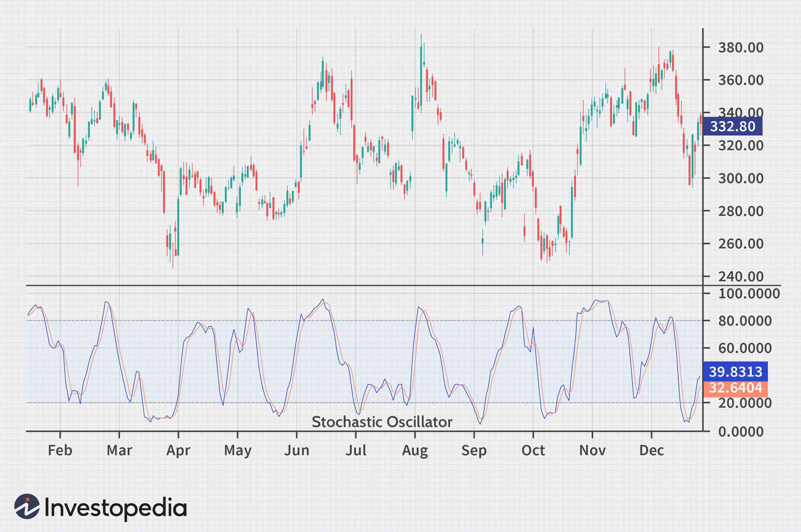

The world of trading is vast and complex, comprising a multitude of tools and strategies designed to enhance decision-making and optimize outcomes in financial markets. Among these numerous tools, the stochastic oscillator is a prominent momentum indicator, widely recognized for its capacity to anticipate potential market reversals. Developed by George C. Lane in the 1950s, the stochastic oscillator remains a favorite among traders due to its ability to signal overbought and oversold conditions, which can indicate probable points of reversal in a market's trend.

This article explores the stochastic oscillator's significant role in technical analysis and its integration into algorithmic trading systems. The stochastic oscillator measures the relative position of a stock's closing price within its price range over a specified period, typically helping traders identify shifts in market momentum. Understanding how to calculate the stochastic oscillator involves the use of two key components: the %K line, which is the primary line representing the oscillator, and the %D line, which serves as a signal line. These components enable traders to discern potential buying or selling opportunities through their intersections and extreme values.



The article will also address the stochastic oscillator's practical applications, detailing how traders employ it to enhance their trading strategies. By examining the benefits and limitations of the stochastic oscillator, we aim to provide insights into its strength in range-bound markets while acknowledging the false signals it may produce in strongly trending markets. Furthermore, the integration of the stochastic oscillator into algorithmic trading setups highlights the advantages of using automated systems to streamline trading processes and maximize efficiency.

By exploring various aspects of this pivotal indicator, we aim to equip readers with a comprehensive understanding of the stochastic oscillator's functionality and versatility, ensuring its effective application within diverse trading contexts.

## Table of Contents

## Understanding the Stochastic Oscillator

The stochastic oscillator, crafted by George C. Lane in the 1950s, is a well-regarded momentum indicator designed to compare a stock's closing price to its price range over a defined period. Its primary utility is in helping traders identify overbought and oversold conditions, thereby aiding predictions of potential market reversals. The fundamental premise of the stochastic oscillator is that closing prices tend to close near the high in bullish markets and near the low in bearish markets.

The stochastic oscillator is composed of two lines, %K and %D, each integral to its functioning. The %K line reflects current data, calculated as a percentage that illustrates the position of the closing price relative to the range between the high and low over a set timeframe, typically 14 periods. The formula for the %K line is as follows:

$$

\%K = \frac{(C - L_n)}{(H_n - L_n)} \times 100 
$$

where $C$ is the latest closing price, $L_n$ is the lowest low over the last $n$ periods, and $H_n$ is the highest high over the same number of periods.

The %D line acts as a smoothed average, generally a three-day simple moving average (SMA) of the %K values. This line is critical as it provides a clearer signal of [momentum](/wiki/momentum) by filtering out short-term fluctuations, thereby allowing traders to see trends more distinctly.

Operating within a bounded range of 0 to 100, the stochastic oscillator offers insights into market momentum shifts. Values above 80 typically indicate overbought conditions, suggesting a potential reversal downward, while values below 20 indicate oversold conditions, signaling a potential upward reversal. However, these thresholds are not absolute and should be interpreted with caution, often in conjunction with other market indicators to enhance accuracy.

Understanding the stochastic oscillator's role is crucial for traders aiming to capitalize on market trends and potential reversals, providing a strategic advantage in both technical analysis and [algorithmic trading](/wiki/algorithmic-trading) settings.

## How to Calculate the Stochastic Oscillator

The stochastic oscillator is a momentum indicator that evaluates the relative position of a closing price within its high-low range over a predetermined period, typically 14 days. This calculation helps traders identify potential reversals in market trends by indicating overbought or oversold conditions.

The primary component of the stochastic oscillator is the %K line, which is calculated using the formula:

$$

\%K = \left( \frac{C - L_n}{H_n - L_n} \right) \times 100 
$$

Here, $C$ represents the current closing price, $L_n$ is the lowest low, and $H_n$ is the highest high over the specified period. This formula computes the position of the current closing price relative to the overall price range, scaling the result to a percentage between 0 and 100.

Once the %K line is calculated, the %D line can be derived. The %D line is essentially a smoothed version of the %K line and is obtained by calculating a three-day simple moving average (SMA) of the %K values. This smoothing function helps to mitigate short-term fluctuations, providing a clearer picture of the momentum trend.

Python can be used to calculate these values efficiently. The following code snippet demonstrates how to compute the stochastic oscillator using pandas, a popular data analysis library:

```python
import pandas as pd

def stochastic_oscillator(high, low, close, period=14, smooth=3):
    # Calculate the lowest low and highest high over the specified period
    lowest_low = low.rolling(window=period).min()
    highest_high = high.rolling(window=period).max()

    # Compute the %K line
    k_percent = 100 * ((close - lowest_low) / (highest_high - lowest_low))

    # Compute the %D line as a moving average of the %K line
    d_percent = k_percent.rolling(window=smooth).mean()

    return k_percent, d_percent

# Example usage
data = pd.DataFrame({
    'High': [126.59, 127.64, 126.99, ...],
    'Low': [124.89, 125.84, 124.67, ...],
    'Close': [126.82, 126.10, 126.00, ...]
})

k_percent, d_percent = stochastic_oscillator(data['High'], data['Low'], data['Close'])

print(k_percent, d_percent)
```

In this code, the function `stochastic_oscillator` calculates the %K and %D lines for a given DataFrame containing high, low, and closing prices. The period and smoothing parameters can be adjusted as desired. By applying this methodology, traders can systematically compute and integrate stochastic oscillator data into their trading strategies to better predict potential market movements.

## Using the Stochastic Oscillator in Trading

The stochastic oscillator is widely used in trading to pinpoint potential market reversal points by focusing on the intersections of the %K and %D lines. These lines reflect the oscillator's sensitivity to changes in market momentum. Typically, %K is a faster line that reacts to price changes, while %D is a slower line, offering a smoothed perspective of the %K's movements.

Overbought and oversold conditions are two critical trading signals generated by the stochastic oscillator. When the oscillator reading exceeds 80, it suggests overbought conditions, implying that an asset may be due for a price correction downward. Conversely, readings below 20 indicate oversold conditions, suggesting the potential for a price rebound upward. However, traders often use these signals as a prompt to conduct a more comprehensive analysis, rather than action points in isolation.

Crossovers between %K and %D are another significant signal derived from the stochastic oscillator. A bullish signal is indicated when the %K line crosses above the %D line, suggesting a possible buying opportunity. Conversely, a sell or bearish signal might be generated when %K crosses below the %D line. These crossover points are particularly significant when they occur in the overbought or oversold zones, reinforcing the oscillator's indications.

Enhancing the stochastic oscillator's effectiveness often involves combining it with other technical indicators. For instance, integrating moving averages can provide additional confirmation of buy or sell signals, helping filter out false readings, especially in volatile market conditions. A moving average acts as a lagging indicator but can substantiate the trend direction indicated by the stochastic oscillator, improving the robustness of trading strategies. 

Traders might implement a strategy where a crossover in the overbought zone directs attention to a detailed moving average analysis, adding layers of confirmation before executing a decision. Thus, the use of the stochastic oscillator in conjunction with supplementary indicators allows for a more comprehensive and nuanced approach to trading decisions.

## Algorithmic Trading with the Stochastic Oscillator

Algorithmic trading integrates the stochastic oscillator to enhance decision-making processes by automating trading strategies based on technical indicators. This momentum oscillator, which identifies potential market reversals by comparing closing prices to a specific price range, becomes particularly powerful when used in algorithmic trading systems.

### Implementing the Stochastic Oscillator in Python

Python, a popular language in algorithmic trading due to its versatility and extensive libraries, facilitates the implementation of the stochastic oscillator. Utilizing Python, traders can streamline the integration of this indicator into their trading algorithms. The `pandas` library, for example, is commonly used for handling data, while `numpy` aids in numerical calculations.

Below is a simple implementation of the stochastic oscillator using Python:

```python
import pandas as pd

def stochastic_oscillator(df, period=14):
    df['Low'] = df['Close'].rolling(window=period).min()
    df['High'] = df['Close'].rolling(window=period).max()
    df['%K'] = 100 * ((df['Close'] - df['Low']) / (df['High'] - df['Low']))
    df['%D'] = df['%K'].rolling(window=3).mean()  # %D is a 3-day SMA of %K
    return df

# Example usage
data = pd.DataFrame({
    'Close': [10, 11, 12, 9, 10, 14, 13, 15, 16, 18, 19, 17, 16, 18, 20]
})

stochastic_data = stochastic_oscillator(data)
print(stochastic_data[['%K', '%D']])
```

This code snippet calculates the %K and %D lines, which are critical for identifying buying and selling signals based on specific thresholds such as oversold or overbought levels.

### Backtesting Algorithmic Strategies

Backtesting is a crucial step in refining algorithmic trading strategies, allowing traders to evaluate the performance of stochastic oscillator-based strategies using historical data. By simulating trades, traders can assess whether the strategy yields favorable outcomes, enabling them to optimize parameters for improved performance. Python's `[backtrader](/wiki/backtrader)` library is a popular choice for implementing [backtesting](/wiki/backtesting), providing a framework to test algorithmic strategies comprehensively.

### Benefits and Limitations

The integration of the stochastic oscillator within algorithmic trading systems offers numerous benefits. The foremost advantage is the automation of trading decisions, which eliminates emotional biases and enables faster execution. Furthermore, the systematic approach allows for consistent strategy application, particularly beneficial in markets with frequent fluctuations.

However, reliance on purely algorithmic strategies can have limitations. The stochastic oscillator may produce false signals in trending markets, as its efficacy is stronger in range-bound conditions. Thus, it is essential to use additional indicators or risk management techniques to mitigate potential false positives. Moreover, the dependency on historical data during backtesting highlights another limitation — past performance is not always indicative of future results. Robust algorithmic strategies should account for changing market dynamics and adapt accordingly.

In summary, algorithmic trading with the stochastic oscillator provides a structured approach to trading, with opportunities for automation and optimization. By leveraging programming tools like Python, traders can enhance their technical analysis and make data-driven decisions, albeit with an awareness of the tool's inherent limitations.

## Benefits and Limitations of the Stochastic Oscillator

The stochastic oscillator is a straightforward tool widely used in technical analysis, offering several benefits and facing certain limitations. It is accessible to traders at all levels due to its simplicity and ease of interpretation. Traders appreciate its ability to provide signals about potential market reversals through its range-bound signals.

**Benefits**:

1. **Accessibility and Ease of Use**: The stochastic oscillator is one of the most straightforward indicators to understand, making it accessible for both novice and experienced traders. Its calculation relies on well-defined formulas that can be easily implemented and interpreted, providing traders with clear entry and exit signals.

2. **Effective in Range-Bound Markets**: The stochastic oscillator excels in sideways or range-bound markets. In these market conditions, it can accurately signal potential reversals when the %K and %D lines indicate overbought (above 80) or oversold (below 20) levels. These signals help traders anticipate and capitalize on turning points within a trading range.

3. **Enhancement of Trading Strategies**: When used in conjunction with other technical indicators such as moving averages, the stochastic oscillator can enhance trading strategies by providing additional confirmation signals. This helps traders create more robust trading plans that adapt to various market conditions.

**Limitations**:

1. **False Signals in Trending Markets**: A significant limitation of the stochastic oscillator is its tendency to produce false signals during strong trending markets. In such scenarios, the overbought and oversold signals can be misleading, resulting in potential losses if traders act solely on these indications without considering the broader market context.

2. **Need for Careful Interpretation**: The effectiveness of the stochastic oscillator is highly dependent on careful analysis and interpretation. Traders need to account for market trends, volumes, and other indicators to differentiate between genuine signals and noise, especially in volatile markets.

3. **Dependence on Market Context**: Understanding the market context is crucial for the effective application of the stochastic oscillator. Traders must adapt their strategies based on whether the market is trending or ranging, as the reliability of the oscillator varies significantly under different market conditions.

In summary, the stochastic oscillator is a valuable tool for traders aiming to identify potential market reversals, particularly in range-bound markets. However, successful application requires cautious interpretation and combination with other indicators, especially in trending environments. By understanding its benefits and limitations, traders can better integrate the stochastic oscillator into their trading practices.

## Conclusion

The stochastic oscillator remains an indispensable component in technical analysis for traders seeking to anticipate market movements. When utilized with a solid understanding of its mechanics, traders can effectively identify potential reversals, thereby optimizing their trading strategies. Its ability to predict overbought and oversold conditions enhances decision-making processes, offering valuable insights even in volatile markets.

Furthermore, the versatility of the stochastic oscillator is amplified when combined with other indicators, such as moving averages. This combination can filter out noise and improve signal reliability. It is also a powerful tool in algorithmic trading systems, where it can be integrated to automate decisions, streamline operations, and potentially increase efficiency and returns. Using programming languages like Python, traders can develop algorithms that incorporate the stochastic oscillator for backtesting and strategy refinement. Here is an example of implementing a stochastic oscillator in Python:

```python
import pandas as pd
import numpy as np

def stochastic_oscillator(df, n=14):
    df['L14'] = df['Low'].rolling(window=n).min()
    df['H14'] = df['High'].rolling(window=n).max()
    df['%K'] = 100 * ((df['Close'] - df['L14']) / (df['H14'] - df['L14']))
    df['%D'] = df['%K'].rolling(window=3).mean()
    return df

# Example DataFrame setup
df = pd.DataFrame({'High': [...], 'Low': [...], 'Close': [...]})
df = stochastic_oscillator(df)
print(df[['%K', '%D']])
```

As markets and instruments evolve, continuous learning and adaptation are crucial. Traders must stay attuned to market conditions to maximize the stochastic oscillator's potential while avoiding its pitfalls, such as the possibility of false signals in trending markets. By enhancing their analytical skills and adapting to evolve trading environments, traders can further capitalize on the stochastic oscillator's strengths, maintaining its relevance as a key analytical tool.

## References & Further Reading

[1]: Lane, G. C. (1984). [Technical Analysis of Stocks & Commodities](http://technical.traders.com/archive/volume-2014.asp?yr=1984), November 1984 issue, "Stochastics," where George C. Lane provides detailed insights into the development and application of the stochastic oscillator.

[2]: Pring, M. J. (2002). ["Technical Analysis Explained, Fifth Edition: The Successful Investor's Guide to Spotting Investment Trends and Turning Points"](https://www.amazon.com/Technical-Analysis-Explained-Fifth-Successful/dp/0071825177), McGraw-Hill Education.

[3]: Murphy, J. J. (1999). ["Technical Analysis of the Financial Markets: A Comprehensive Guide to Trading Methods and Applications"](https://archive.org/details/technicalanalysi0000murp), New York Institute of Finance.

[4]: Bloomberg Terminal User Guide for Trading and Risk Management, includes practical usage of stochastic oscillators within professional trading platforms.

[5]: Chande, T. S. (1997). ["Beyond Technical Analysis: How to Develop and Implement a Winning Trading System"](https://cdn.preterhuman.net/texts/finance_and_marketing/stock_market/Chande,%20Tushar%20-%20Technical%20Analysis%20-%20How%20To%20Develop%20And%20Imp.pdf), John Wiley & Sons.