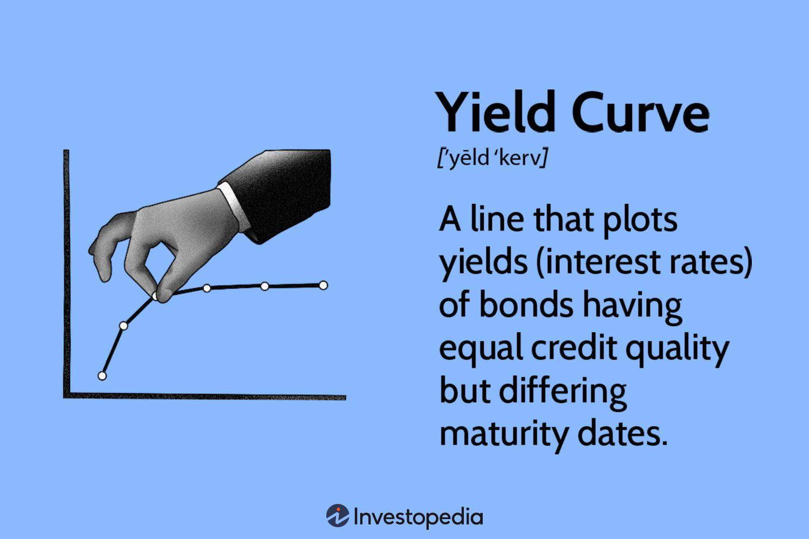

Fixed income investments and algorithmic trading play crucial roles in modern financial systems. Fixed income investments are financial instruments that offer predictable returns, such as bonds, certificates of deposit (CDs), and treasuries. These instruments are favored by investors seeking stability and consistent income streams. Central to the valuation and performance of fixed income investments is the concept of the yield curve, which is a graphical representation of interest rates on bonds with varying maturity dates.

Understanding the yield curve is vital for optimizing returns on fixed income investments. The yield curve typically presents as either normal, inverted, or flat, with each shape indicating different economic conditions. A normal yield curve suggests economic expansion, while an inverted curve can signal an impending recession. Thus, analyzing the yield curve allows investors to anticipate changes in economic conditions and adjust their investment strategies accordingly.



Algorithmic trading, which involves using computer algorithms to execute trades at high speeds and volumes, can leverage yield curve analysis to inform trading decisions. By integrating yield curve data, algorithmic trading systems can identify trends and make faster, more data-driven decisions to optimize financial outcomes.

This article examines how fixed-income financial analysis, yield curves, and algorithmic trading interconnect, offering insights into how these elements can be used together to enhance investment strategy and the decision-making process.

## Table of Contents

## Understanding Fixed Income Investments

Fixed income investments refer to a variety of financial instruments that provide investors with regular and predictable interest payments until maturity. These instruments include bonds, certificates of deposit (CDs), and treasury securities. They are essential components of diversified investment portfolios due to their stability and the assurance of regular returns.

**Bonds:** Bonds are debt securities issued by corporations, municipalities, and governments to raise capital. They obligate the issuer to pay a specific amount of interest to the bondholder at predetermined intervals and return the principal amount on maturity. The interest rate, or coupon rate, is influenced by several factors, including the issuer's creditworthiness and prevailing market interest rates.

**Certificates of Deposit (CDs):** CDs are savings certificates entitling the bearer to receive interest. They are issued by commercial banks and have a specific fixed term and interest rate. They are low-risk investments insured by the Federal Deposit Insurance Corporation (FDIC) in the United States up to a certain limit.

**Treasuries:** Treasury securities are government debt instruments issued by the U.S. Department of the Treasury. These include Treasury bills (T-bills), Treasury notes (T-notes), and Treasury bonds (T-bonds), differentiated by their maturity periods and interest structures. They are considered one of the safest investments due to government backing.

The valuation of fixed income investments is heavily influenced by yield curves, which depict the relationship between interest rates and different maturities of debt. A yield curve can be normal, inverted, or flat, each reflecting various economic conditions. For instance, a normal yield curve suggests future economic growth and higher interest rates, typically offering higher yields for long-term securities compared to short-term ones.

Understanding yield curves is crucial for investors as they impact the pricing and potential returns of fixed income securities. For example, if the yield curve shifts upwards, existing bonds with lower coupon rates become less attractive, reducing their market price. Conversely, a downward shift can increase their price. Therefore, monitoring yield curve dynamics helps investors make informed decisions about buying or selling fixed income assets to optimize returns.

In summary, fixed income investments provide a reliable income stream and are subject to valuation changes influenced by yield curve fluctuations. Recognizing the structure and movements of these curves allows investors to better manage risks and adjust their portfolios accordingly.

## Yield Curve Explained

A yield curve is a graph that illustrates the relationship between interest rates and the maturity dates of debt securities, such as government bonds, at a given point in time. It is an essential tool for investors, policymakers, and economists as it provides insights into the general health of an economy and the direction in which interest rates might head in the future.

There are three primary types of yield curves:

1. **Normal Yield Curve**: This is the most common yield curve shape and occurs when long-term interest rates are higher than short-term interest rates. It suggests that the economy is expected to grow in the future, as longer-term investments are perceived to carry more risk and, consequently, command higher yields. This upward slope is generally interpreted as a sign of economic expansion and expectations of rising inflation or an increase in interest rates over time.

2. **Inverted Yield Curve**: This occurs when short-term interest rates are higher than long-term rates, creating a downward sloping curve. An inverted yield curve is often considered a predictor of economic recession. It reflects a situation where investors expect future interest rates to fall, possibly due to anticipated cuts by central banks in response to slow economic growth or deflationary pressures.

3. **Flat Yield Curve**: A flat or humped yield curve occurs when there is little difference between short-term and long-term rates. This shape can signal a transitional phase in the economy, often preceding either a shift towards a normal or inverted curve. A flat yield curve may indicate uncertainty in the market, where investors are unsure about future economic conditions or believe that interest rates will remain stable for a considerable period.

The yield curve is a pivotal economic indicator, often analyzed for clues about future [interest rate](/wiki/interest-rate-trading-strategies) changes, inflation, and economic growth. For instance, central banks, such as the Federal Reserve in the United States, monitor the shape of the yield curve to guide their monetary policy decisions.

Mathematically, the yield curve can be modeled using various interest rate models, such as the Nelson-Siegel or the Svensson models, to quantitatively analyze how the curve evolves over time. These models help in fitting the yield curve data to create a smooth curve that reflects the term structure of interest rates, allowing for precise interpretation and forecasting.

Python libraries like `numpy` and `scipy` can be used to fit such models to yield curve data for better analysis and prediction. Here is a basic example of fitting a simple linear model to a set of yield curve data:

```python
import numpy as np
from scipy.optimize import curve_fit

# Define a function to model and create data
def linear_model(x, a, b):
    return a * x + b

# Example data: bond maturities and corresponding interest rates
maturities = np.array([1, 2, 3, 5, 10, 20, 30])  # maturities in years
interest_rates = np.array([2.0, 2.1, 2.2, 2.5, 2.8, 3.1, 3.4])  # example rates in %

# Fit the model to the data
params, _ = curve_fit(linear_model, maturities, interest_rates)

# Print out the parameters
print(f"Fitted parameters: Slope (a) = {params[0]}, Intercept (b) = {params[1]}")
```

This code establishes a basic linear relationship between bond maturities and interest rates. By deriving such models, analysts can gain valuable insights into the yield curve dynamics, thereby making more informed investment and policy decisions. Yield curves' analysis is crucial since they reflect the complex interplay between market perception, economic fundamentals, and expectations.

## Financial Analysis of Yield Curves

Yield curve analysis plays a crucial role in predicting economic downturns or growth, making it an essential tool for investors and financial analysts. By examining the yield curve, which represents the interest rates of bonds with equal credit quality but different maturity dates, one can infer valuable insights about future economic activity and interest rate changes.

The shape of the yield curve often provides indicators of the economic climate. A normal yield curve, where long-term yields are higher than short-term yields, suggests expectations of economic expansion and rising interest rates. Conversely, an inverted yield curve, marked by higher short-term yields than long-term yields, is frequently seen as a precursor to economic recession. This inversion signals that investors expect future interest rates to decline due to weakening economic conditions.

Yield curve shifts can mitigate risks by allowing investors to adjust their portfolios in response to anticipated economic changes. For instance, in anticipation of rising interest rates, investors might shorten the duration of their bond portfolios to maintain stability and minimize potential losses. Conversely, in a declining interest rate environment, extending the duration could enhance returns as bond prices rise.

Portfolio adjustments based on yield curve analysis not only aim to protect investments from adverse economic conditions but also to maximize returns. Investors may use strategies such as yield curve trading, where they exploit deviations or changes in the yield curve. These strategies, which involve buying undervalued bonds and selling overvalued ones, depend heavily on precise predictions of yield curve movements.

Understanding the nuances of the yield curve requires sophisticated models and tools. By leveraging historical data and statistical methods, these models forecast future yield curve changes and their impact on fixed-income securities. The continuous refinement of these models is essential, as even slight misjudgments in yield curve analysis can lead to significant financial repercussions.

In summary, yield curve analysis not only aids in anticipating economic fluctuations but also equips investors to strategically adjust their portfolios. By scrutinizing both the shape and shifts of the yield curve, investors can mitigate risks and optimize returns in their fixed-income investments.

## Algorithmic Trading in Fixed Income Markets

Algorithmic trading represents a transformative approach within fixed income markets, employing computer algorithms to execute trades with increased speed and precision. This method leverages quantitative models and data-driven insights to enhance trading efficiency and capitalize on fleeting market opportunities.

One pivotal aspect involves incorporating yield curve analysis to anticipate market movements. By examining the shape and shifts in the yield curve, traders can discern valuable signals regarding potential changes in interest rates and economic conditions. This information enables traders to make informed decisions, adjust positions swiftly, and optimize investment strategies.

Several algo trading strategies are prevalent in fixed income markets. Yield spread strategies focus on exploiting differences in yield between bonds with varying maturities. By identifying discrepant spreads, traders can position themselves to benefit from the convergence or divergence of these spreads over time.

Statistical [arbitrage](/wiki/arbitrage) is another strategy grounded in mathematical models that identify statistical relationships between instrument prices. By tracking historical price patterns and deviations from expected correlations, algorithms execute trades to profit from temporary mispricing, typically reverting to mean values.

Mean reversion is an additional tactic, relying on the premise that interest rates and bond prices will revert to their historical averages after significant deviations. This approach involves identifying periods when bond prices or yields significantly deviate from their long-term trends and executing trades based on expected reversion.

The implementation of these strategies necessitates sophisticated mathematical models and robust computational infrastructure. Python, a popular programming language in finance, offers a rich ecosystem for developing [algorithmic trading](/wiki/algorithmic-trading) systems. By combining libraries such as NumPy for numerical computation, Pandas for data manipulation, and libraries like Scikit-learn for [machine learning](/wiki/machine-learning), traders can build models that effectively interpret yield curve data and inform trading strategies.

In conclusion, algorithmic trading within fixed income markets harnesses the power of computational tools and yield curve analysis to enhance trading outcomes. By deploying strategies like yield spread, [statistical arbitrage](/wiki/statistical-arbitrage), and mean reversion, market participants can navigate the intricate dynamics of interest rates and optimize their investment portfolios.

## Building Yield Curve Models for Trading

Building yield curve models for trading involves leveraging mathematical frameworks that effectively represent interest rate movements over varying maturities. Two prominent models used in this domain are the Vasicek model and the Cox-Ingersoll-Ross (CIR) model, both of which serve a critical function in capturing the dynamics of interest rates for different trading strategies.

The Vasicek model, named after Oldřich Vašíček, is a mean-reverting model that expresses the evolution of interest rates as:

$$
dr_t = a(b - r_t)dt + \sigma dW_t
$$

where $r_t$ is the interest rate at time $t$, $a$ is the speed of mean reversion, $b$ is the long-term mean level, $\sigma$ is the volatility, and $dW_t$ is a Wiener process. This model assumes that interest rates will revert to a long-term average, making it useful for estimating the future path of interest rates and pricing bonds, particularly in a more stable interest rate environment.

In contrast, the Cox-Ingersoll-Ross (CIR) model, developed by John Cox, Jonathan Ingersoll, and Stephen Ross, improves upon the Vasicek model by ensuring that the interest rates remain positive. The CIR model is expressed as:

$$
dr_t = a(b - r_t)dt + \sigma \sqrt{r_t} dW_t
$$

The inclusion of the $\sqrt{r_t}$ term effectively prevents negative interest rates, providing a more realistic depiction of rates in volatile markets. This model is particularly suitable for managing interest rate risks in sensitive bond pricing environments.

Yield curve models are pivotal in pricing bonds and managing interest rate risks. They help traders and investors estimate the present value of future cash flows by appropriately discounting them using modeled interest rates for varying maturities. These models are integral in assessing the potential impact of interest rate shifts on bond portfolios and developing strategies to hedge against such risks.

The implementation of algorithmic trading strategies based on yield curve models has been revolutionized by advancements in Python and machine learning techniques. Python's rich ecosystem of libraries such as NumPy, SciPy, and Pandas enables the efficient processing and analysis of large datasets to simulate yield curve scenarios. Machine learning algorithms can further optimize model parameters by identifying patterns and predicting future movements in the yield curve.

Here's a basic example of how the Vasicek model can be simulated using Python:

```python
import numpy as np

# Vasicek parameters
a = 0.1  # Speed of reversion
b = 0.05  # Long-term mean
sigma = 0.02  # Volatility
r0 = 0.03  # Initial rate
T = 1.0  # Time horizon
dt = 0.01  # Time step
N = int(T / dt)  # Number of steps

# Simulation
rates = np.zeros(N)
rates[0] = r0

for t in range(1, N):
    dr = a * (b - rates[t-1]) * dt + sigma * np.sqrt(dt) * np.random.normal()
    rates[t] = rates[t-1] + dr

# Result
print("Simulated interest rate path:", rates)
```

This code segment illustrates a basic simulation of interest rate paths under the Vasicek model assumptions. By simulating various paths, algorithmic trading systems can better assess potential market scenarios, enabling more informed trading decisions.

In summary, mathematical yield curve models like Vasicek and CIR are indispensable tools for quantitatively assessing interest rate dynamics, essential for the pricing of bonds and the development of risk management strategies. Implementing these models in trading through advanced programming and machine learning techniques significantly enhances their utility in anticipating and responding to market movements.

## Challenges in Yield Curve Trading

Yield curve trading is a sophisticated approach in financial markets, but it faces several challenges primarily stemming from the quality of data and economic uncertainties. These hurdles can significantly impact the effectiveness of yield curve predictions, posing risks to investors and traders.

Data quality is a fundamental concern in yield curve trading. The integrity of data collected on bond prices, interest rates, and economic indicators is crucial for accurate analysis. Inaccurate or incomplete data can lead to misguided yield curve interpretations and flawed trading decisions. High-frequency trading amplifies this issue, as even minor discrepancies in data can cause large-scale miscalculations. To mitigate this, traders rely on advanced data processing and validation techniques to ensure that the information driving their models is both accurate and current.

Economic uncertainties are another formidable challenge. Yield curve predictions are sensitive to macroeconomic shifts, such as changes in monetary policy, geopolitical events, or economic downturns. These events can cause abrupt changes in interest rate expectations, resulting in unexpected yield curve movements. Traders must remain vigilant and adaptable to these changes by constantly refining their strategies.

Model risk is inherent in any yield curve trading strategy, especially those dependent on complex algorithms. These mathematical models, while powerful, might overlook real-world nuances or fail to adapt quickly enough to new market conditions. The assumptions embedded within these models, such as interest rate changes being normally distributed, may not always hold true. For instance, the Cox-Ingersoll-Ross (CIR) model used for modeling the evolution of interest rates might fail under extreme market conditions due to its dependency on continuous stochastic processes:

$$
dr_t = a(b - r_t)dt + \sigma \sqrt{r_t}dW_t
$$

where $r_t$ represents the short-term interest rate at time $t$, $a$ is the speed of reversion, $b$ is the long-term mean level, $\sigma$ is the volatility, and $dW_t$ is a Wiener process.

To overcome these challenges, robust data analysis tools can be instrumental. Advanced machine learning algorithms can process large datasets more effectively, identifying patterns and adjustments that traditional statistical methods might miss. For example, Python libraries such as pandas and scikit-learn can be used to preprocess data and implement predictive models. Moreover, real-time data feeds and sophisticated analytics platforms provide continuous updates and insights, enabling traders to adjust their strategies promptly.

Implementing strategies such as model validation, scenario analysis, and stress testing can minimize model risk. These strategies involve testing algorithms under various simulated market conditions to evaluate their robustness and reliability. Continuous model improvement, driven by new data and feedback, helps refine predictive accuracy.

In conclusion, while challenges in yield curve trading are substantial, integrating advanced data analytics and maintaining a flexible approach to model development can help overcome these obstacles. Traders who proactively address these challenges can enhance the precision and effectiveness of their trading strategies, navigating the complexities of yield curve dynamics with greater confidence.

## Future of Yield Curve Analysis in Algorithmic Trading

The future of yield curve analysis in algorithmic trading is poised to be significantly transformed by advancements in [artificial intelligence](/wiki/ai-artificial-intelligence) (AI), machine learning, blockchain technology, and big data analytics. These technologies have the potential to refine and enhance the precision of financial forecasts, transparency in trading, and the development of sophisticated trading strategies.

The integration of AI and machine learning techniques into the analysis of yield curves holds the promise of improving the accuracy of forecasting interest rate movements and economic conditions. Machine learning models, such as neural networks and support vector machines, can process large data sets and identify complex patterns that might be missed by traditional analytical methods. These models can adapt and learn from new data, continuously improving their predictive capabilities. 

Python has become a favored programming language for implementing these techniques, thanks to its robust libraries like TensorFlow and PyTorch, which facilitate the construction and training of advanced machine learning models. For instance, a Python script utilizing a recurrent [neural network](/wiki/neural-network) (RNN) might look like this:

```python
import tensorflow as tf
from tensorflow.keras.models import Sequential
from tensorflow.keras.layers import LSTM, Dense

# Define RNN model
model = Sequential([
    LSTM(50, input_shape=(timesteps, features)),
    Dense(1)
])

model.compile(optimizer='adam', loss='mean_squared_error')
model.fit(train_data, train_labels, epochs=100, batch_size=32)
```

In parallel, blockchain technology is paving the way for enhanced transparency in bond trading by providing a decentralized and immutable ledger that records each transaction. This can lead to increased trust and efficiency in the fixed income markets, as market participants can verify transactions without relying on a centralized authority. Furthermore, smart contracts, which are self-executing contracts with the terms of the agreement directly written into lines of code, can automate and streamline bond settlements, reducing counterparty risk and operational costs.

The proliferation of big data is another driving force behind the evolution of yield curve analysis and fixed income trading strategies. By capturing and analyzing vast amounts of financial, economic, and [alternative data](/wiki/best-alternative-data), traders can gain insights into market trends and investor behavior that were previously inaccessible. This analytical capability allows for the development of more sophisticated and responsive trading algorithms that can swiftly adjust to shifts in the yield curve, optimizing returns and managing risks effectively.

In conclusion, the future of yield curve analysis in algorithmic trading is on the cusp of a technological revolution. The adoption and integration of AI, machine learning, blockchain, and big data will enable traders and investors to make more informed and timely decisions in the complex landscape of fixed income markets. Through the use of these advanced tools, they can harness the full potential of yield curve analysis for strategic advantage.

## Conclusion

Yield curve analysis plays a crucial role in the landscape of fixed income investments and algorithmic trading. By providing insights into the relationship between interest rates and different maturity dates, yield curves equip investors and traders with the tools necessary to interpret economic signals and adjust their portfolios accordingly. Understanding the dynamics of yield curves allows for effective risk management and the exploration of opportunities for maximizing returns.

The future holds promising advancements in technology and data analytics that will significantly enhance the applicability of yield curve analysis. Artificial intelligence (AI) and machine learning (ML) are expected to contribute to more accurate predictions by identifying patterns and trends that may not be immediately apparent through traditional analysis methods. This integration will likely lead to more sophisticated models and algorithms, further optimizing decision-making in financial markets.

Blockchain technology offers the potential for increased transparency and efficiency in bond trading, providing a secure platform for executing and recording transactions. This can improve the reliability of data and foster greater trust in market processes.

Big data analytics will continue to drive the evolution of fixed income trading strategies by enabling the processing and examination of large volumes of information. This facilitates deeper insights into market trends and investor behavior, allowing more responsive and informed trading decisions.

Investors and traders who harness these advancements will be better positioned to navigate the complexities of financial markets. By leveraging continuous improvements in technology and analytics, those involved in fixed income investments and algorithmic trading can make more optimal financial decisions, leading to enhanced performance and profitability.

## References & Further Reading

[1]: Estrella, A., & Mishkin, F. S. (1998). ["Predicting U.S. recessions: Financial variables as leading indicators."](https://www.jstor.org/stable/2646728) Review of Economics and Statistics, 80(1), 45-61.

[2]: Fabozzi, F. J., & Mann, S. V. (2005). ["The Handbook of Fixed Income Securities."](https://www.amazon.com/Handbook-Fixed-Income-Securities-Ninth/dp/1260473899) McGraw-Hill.

[3]: James, J., & Webber, N. (2000). ["Interest Rate Modelling."](https://archive.org/details/interestratemode0000jame) John Wiley & Sons.

[4]: Lopez de Prado, M. (2018). ["Advances in Financial Machine Learning."](https://www.amazon.com/Advances-Financial-Machine-Learning-Marcos/dp/1119482089) Wiley.

[5]: Nelson, C. R., & Siegel, A. F. (1987). ["Parsimonious Modeling of Yield Curves."](https://www.researchgate.net/publication/24103017_Parsimonious_Modeling_of_Yield_Curves) Journal of Business, 60(4), 473-489.