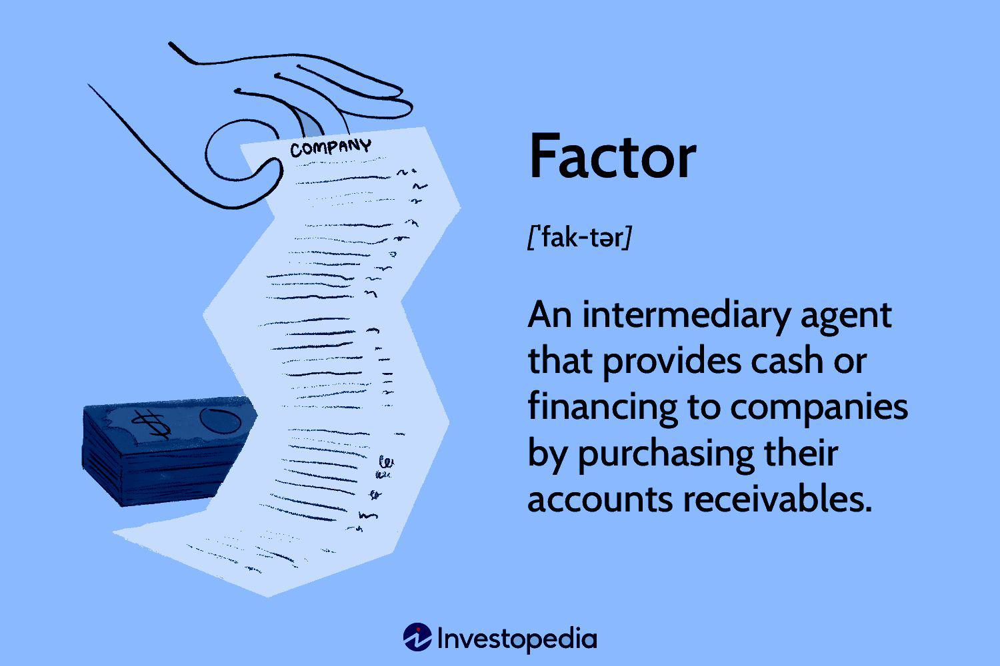

Algorithmic trading has reshaped financial markets by implementing automated strategies capable of executing trades at high speeds and with increased precision. Such power and efficiency in trading offer significant advantages, yet they bring about challenges, one of which is the mismatch between the demand for these trading algorithms and their supply, a phenomenon known as undersubscription. 

Undersubscription, in the context of algorithmic trading, refers to situations where the demand for trading algorithms falls short of what is available, leading to inefficiencies in market operations. This can result from a variety of factors, including misalignment of trading strategies with current market conditions, unrealistic pricing, or significant shifts in market dynamics. Traders and financial institutions face potential challenges because these elements can cause notable market disruptions, hindering their ability to fully capitalize on high-frequency transactions.

The scope of this article is to provide a detailed examination of undersubscription issues in algorithmic trading, focusing on the causes and implications of these occurrences. Key factors such as market sentiment, economic indicators, and other critical elements, which play vital roles in shaping market demand, will be thoroughly analyzed to assess their impact on trading strategies and performance. By grasping these elements, traders can strategically adjust their algorithms to address shifting market demands more effectively.

In addition to the exploration of causes, understanding demand analysis remains critical in optimizing algorithmic trading strategies. Accurate demand forecasting, facilitated by advanced machine learning techniques and tools like sentiment analysis, is essential for traders to make informed decisions. This capability enables traders to predict market movements more reliably and adjust their strategies to enhance trading efficiency and mitigate potential risks associated with undersubscription.

The intention of this article is to furnish traders with a comprehensive comprehension of how undersubscription affects market demand in algorithmic trading, equipping them with the insights necessary to optimize their trading strategies for improved performance and risk management.

## Table of Contents

## Understanding Undersubscription in the Market

Undersubscription in financial markets occurs when the demand for securities, such as stocks or bonds during an initial public offering (IPO), is lower than the available supply. This scenario often suggests that the securities may be overpriced or that the marketing efforts were insufficient to generate adequate interest among investors. In algorithmic trading, undersubscription can arise from a variety of factors, particularly those related to the misalignment between algorithmic strategies and the current market conditions.

Algorithmic strategies are typically designed to exploit specific market patterns or inefficiencies. However, if these strategies are not adapted to reflect the prevailing market environment, which can be highly dynamic and influenced by multiple factors, undersubscription may occur. An algorithm too focused on historical trends without considering real-time data or shifts in market sentiment can lead to poor performance, as it fails to attract the expected level of trading interest.

To address undersubscription, it is essential to understand the contributing factors. These can include incorrect initial pricing, where securities are priced higher than what the market perceives as fair value, or inadequate promotional strategies that fail to communicate the value proposition of the securities effectively. Adjusting these factors requires a comprehensive understanding of market demand, coupled with the flexibility to modify strategies based on real-time data and feedback.

In the context of [algorithmic trading](/wiki/algorithmic-trading), analyzing market demand is crucial, as it offers the necessary insights needed to calibrate algorithms effectively. This analysis requires integrating data-driven methods such as [machine learning](/wiki/machine-learning), which can incorporate vast datasets to predict demand patterns more accurately. By tailoring algorithms to align with market demand and adjusting pricing and marketing approaches, traders can reduce the risk of undersubscription and enhance the potential for successful trading outcomes.

## Factors Influencing Undersubscription

Undersubscription in financial markets occurs when the demand for a particular security is insufficient to meet the issued supply. In algorithmic trading, the phenomenon can be attributed to a multitude of factors that traders must recognize and address to optimize their trading strategies effectively.

One primary cause of undersubscription is incorrect pricing strategies. When securities are priced too high relative to their perceived value, investors may refrain from purchasing them, resulting in insufficient demand. This is particularly critical in new offerings like Initial Public Offerings (IPOs) where an overpriced security can significantly deter investors.

In algorithmic trading, market sentiment is a powerful influencer of demand levels. Traders continuously analyze news and social media feeds to gauge public mood and expectations concerning specific securities. This analysis informs buying or selling decisions processed by trading algorithms. News events, whether economic updates or geopolitical developments, can cause rapid shifts in market interest and demand.

Economic indicators further complicate the demand landscape. Metrics such as inflation rates, unemployment figures, and GDP growth provide context for traders to anticipate market trends. Shifts in these indicators can influence investor behavior, leading to dynamic changes in demand patterns. A volatile economy might reduce investor confidence, causing undersubscription as traders hold back from engaging in the market.

Liquidity is another critical [factor](/wiki/factor-investing). Highly liquid markets imply a greater ease of buying or selling securities without affecting their price, which fosters investor confidence. Conversely, a lack of [liquidity](/wiki/liquidity-risk-premium) can dissuade investment due to the fear of being unable to [exit](/wiki/exit-strategy) a position easily.

Investor behavior, often unpredictable, plays a significant role in market dynamics. Behavioral finance suggests that psychological factors and herd behavior can lead to demand inaccuracies. Traders employing algorithmic strategies must account for the likelihood of such human factors affecting demand forecasts.

Furthermore, unforeseen geopolitical events can disrupt market stability, prompting sudden changes in demand for certain securities. Such events can lead to increased [volatility](/wiki/volatility-trading-strategies), where algorithmic models might struggle to keep up with rapidly changing conditions.

A technical challenge within algorithmic trading is overfitting. This occurs when algorithms are excessively tailored to historical market data, which can limit their adaptability to new market behaviors. Algorithms that have been overfitted may perform well in [backtesting](/wiki/backtesting) but fail in real-time trading, leading to misalignments with current market demand and consequently, undersubscription.

An understanding of these factors is essential for traders to recognize the potential for undersubscription and implement strategies to mitigate its effects. By adjusting pricing, aligning algorithmic models with real-time data, and staying alert to market sentiment and external indicators, traders can enhance their engagement strategies and reduce the risk of undersubscription.

## Demand Analysis in Algorithmic Trading

Analyzing demand with precision is crucial for the development and success of algorithmic trading strategies. High-frequency trading ([HFT](/wiki/high-frequency-trading-strategies)) and statistical [arbitrage](/wiki/arbitrage) are prime examples where detailed demand analysis directly impacts trading outcomes. Demand analysis involves utilizing algorithms to predict future market movements by employing historical market data, recognizing patterns, and incorporating various machine learning techniques to improve decision-making accuracy.

For traders, the process begins with leveraging historical market data to identify trends and patterns that may influence future demand. Machine learning algorithms are particularly effective in this context, allowing traders to parse extensive datasets to detect subtle correlations and trends that might not be apparent through traditional analysis methods. For instance, regression models and neural networks can be trained to predict price movements based on historical data, providing traders with a strategic edge.

Sentiment analysis and AI-driven data analytics play substantial roles in assessing market demand. Sentiment analysis, which involves natural language processing techniques, gauges the emotional tone in news reports, social media, and other textual data that can influence market sentiment. This analysis can reveal shifts in investor sentiment, which often precedes market movements. 

Furthermore, tools like Bloomberg Terminal and QuantConnect are integral to the demand analysis process in algorithmic trading. Bloomberg Terminal provides traders with a wealth of real-time data critical for making informed trading decisions. Access to real-time information enables traders to execute trades with greater precision, responding swiftly to market changes. Meanwhile, QuantConnect offers backtesting capabilities, allowing traders to test their algorithms against historical data before applying them in live trading conditions. This testing phase is essential for refining algorithmic strategies and ensuring their robustness.

Overall, the synergy between advanced analytics, sentiment analysis tools, and real-time data platforms empowers traders to craft highly responsive algorithmic trading strategies. This meticulous approach to demand analysis not only enhances the efficiency and accuracy of trading but also significantly mitigates the potential risks associated with market volatility and unforeseen events.

## Challenges in Demand Analysis

Accurate demand analysis in algorithmic trading faces numerous challenges, with data quality standing as a critical concern. High-quality data is indispensable for building reliable predictive algorithms, yet data often comes with errors, gaps, or inconsistencies. Ensuring data integrity requires meticulous preprocessing steps such as cleaning and normalization. Algorithms rely on this data for accurate forecasting; otherwise, flawed data can propagate errors leading to suboptimal trading decisions.

Market volatility adds another layer of complexity to demand analysis. Rapid price changes within financial markets can obscure genuine demand signals, making it difficult for traders to distinguish between transient market noise and significant trend shifts. Volatility-induced uncertainty compounds the challenge of timely decision-making, pushing algorithmic models to the brink as they attempt to adapt and recalibrate in real-time.

The behavior of investors, particularly its unpredictability, further exacerbates these challenges. Investor sentiment can swing quickly in reaction to news events or economic indicators, influencing demand patterns. Algorithms must continuously adapt to capture emerging trends or risk becoming outdated. To address fast-moving sentiment changes, traders often employ advanced techniques like sentiment analysis, integrating data from social media, news articles, and market reports.

Technical glitches and cybersecurity threats pose additional hurdles. System failures or latency issues can result in significant delays, affecting the execution of trades based on stale or inaccurate demand forecasts. Moreover, cyber threats can lead to data breaches or manipulation, undermining the integrity of demand analysis processes and potentially causing substantial financial losses.

Managing these challenges requires robust systems and processes. Traders must invest in advanced technologies, including [artificial intelligence](/wiki/ai-artificial-intelligence) and machine learning, to enhance data processing capabilities and improve predictive accuracy. Developing comprehensive risk management protocols is equally critical to safeguard against technical and security vulnerabilities. By solidifying these aspects, traders can better navigate demand fluctuations, ensuring more resilient and effective algorithmic trading strategies.

## Conclusion

Understanding the complexities of undersubscription and demand analysis is crucial for traders aiming to fine-tune their algorithmic trading strategies. By effectively navigating the factors influencing demand, traders gain a significant edge in predicting market movements and adjusting their algorithms in response. This proactive approach not only bolsters the overall efficiency of trading strategies but also serves as a safeguard against the challenges posed by undersubscription. 

Leveraging advancements in technology, particularly in artificial intelligence and machine learning, presents promising opportunities for refining demand analyses and adapting to evolving market trends. AI-driven tools can process vast amounts of data to extract actionable insights, allowing traders to adapt their algorithms swiftly to reflect real-time market conditions. Machine learning models further enhance predictive accuracy by recognizing patterns that may not be immediately apparent through traditional analysis techniques.

In conclusion, maintaining a robust understanding of market demand dynamics and integrating advanced technological tools into trading practices positions traders to effectively manage risk and capitalize on opportunities, ensuring sustained success in the fast-paced environment of algorithmic trading. As technology continues to evolve, these strategies will inevitably play a pivotal role in shaping the future of financial markets.

## References & Further Reading

[1]: Bergstra, J., Bardenet, R., Bengio, Y., & Kégl, B. (2011). ["Algorithms for Hyper-Parameter Optimization."](https://dl.acm.org/doi/10.5555/2986459.2986743) Advances in Neural Information Processing Systems 24.

[2]: ["Advances in Financial Machine Learning"](https://www.amazon.com/Advances-Financial-Machine-Learning-Marcos/dp/1119482089) by Marcos Lopez de Prado

[3]: ["Evidence-Based Technical Analysis: Applying the Scientific Method and Statistical Inference to Trading Signals"](https://www.amazon.com/Evidence-Based-Technical-Analysis-Scientific-Statistical/dp/0470008741) by David Aronson

[4]: ["Machine Learning for Algorithmic Trading"](https://github.com/stefan-jansen/machine-learning-for-trading) by Stefan Jansen

[5]: ["Quantitative Trading: How to Build Your Own Algorithmic Trading Business"](https://www.amazon.com/Quantitative-Trading-Build-Algorithmic-Business/dp/1119800064) by Ernest P. Chan