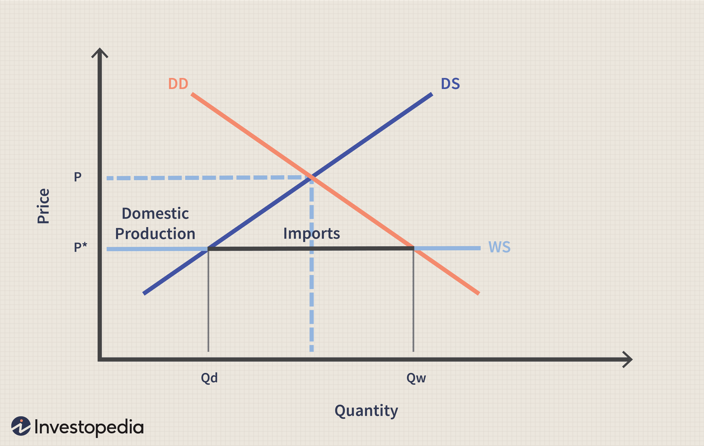

In trading, achieving a balance between overtrading and undertrading is essential for maintaining financial health and promoting market stability. The rapid evolution of trading environments, especially with the integration of algorithmic trading, highlights the intricacies of trading behaviors and their significant impact on financial markets.

Overtrading, characterized by excessive trading activities, and undertrading, marked by insufficient engagement with the market, are two extreme behaviors that can undermine a trader's strategic objectives. These practices are not merely byproducts of poor decision-making but can be deeply rooted in emotional responses and technological influences, which can have robust and far-reaching effects on both individual profitability and broader market dynamics.

This article investigates into the causes behind these behaviors and examines their effects, both on a micro level, affecting individual trader outcomes, and on a macro level, influencing market efficiency and stability. In an era where algorithmic trading plays a pivotal role, the tendency towards overtrading can be exacerbated by automated systems, leading to increased market volatility and potential disruptions.

To foster a more disciplined and profitable trading environment, it is critical to address these imbalances with strategic measures. This involves recognizing the symptoms and causes of overtrading and undertrading, understanding their impact, and implementing strategies to mitigate their effects. The goal is to equip traders with the tools needed to navigate the complexities of modern trading, ultimately contributing to a more stable and efficient market landscape.

## Table of Contents

## Understanding Overtrading and Undertrading

Overtrading is characterized by an excessive frequency of trade execution, often driven by emotional impulses such as greed or anxiety, or due to misinterpretation of market indicators. This tendency can lead to a significant deviation from an individual trader's strategic plan, as it prompts numerous trades without considerable consideration of market conditions or rational analysis. Overtrading can result in increased transaction costs, diminished returns, and heightened stress levels for the trader.

Undertrading is the antithesis, where a trader engages in fewer transactions than would be optimal, resulting in missed opportunities for profit. This behavior may occur due to an overabundance of caution, lack of confidence in market interpretation, or aversion to risk. By failing to capitalize on favorable market conditions, undertrading can impede growth and reduce the potential for significant portfolio gains.

Both overtrading and undertrading can impair the effectiveness of a planned trading approach. Effective trading strategies typically involve careful analysis, disciplined execution, and strategic management of positions, all of which can be undermined by these tendencies. Recognizing these behaviors is the first step in addressing them. Traders must strive to maintain emotional discipline, honing their ability to interpret market signals accurately without succumbing to emotional influence or unwarranted hesitation.

## Causes and Symptoms

Overtrading, a common pitfall in trading practices, is often driven by emotional responses such as fear or greed. These emotions can lead traders to make impulsive decisions, deviating from their predetermined trading strategies. Fear may cause a trader to hastily enter or [exit](/wiki/exit-strategy) trades in response to market fluctuations, expecting losses where there might be none. Conversely, greed can prompt traders to buy or sell assets excessively, driven by the desire for quick gains. Both fear and greed disrupt rational decision-making processes, causing traders to deviate from their plans.

Technological advancements have significantly impacted trading behaviors, exacerbating tendencies towards overtrading. The ease of accessing financial markets through online platforms and mobile applications enables constant market participation, encouraging frequent trades. High-frequency trading algorithms, designed for rapid transaction execution, can further amplify this effect. These systems quickly interpret market data and execute numerous trades in milliseconds, contributing to potential overtrading scenarios as they respond to short-term market signals rather than longer-term strategic goals.

Undertrading presents a contrasting set of challenges. Key symptoms of undertrading include a reluctance to act on established trading strategies, even when market conditions are favorable. This behavior often stems from risk aversion or an overly cautious approach to trading. Traders who undertrade may miss out on profitable opportunities, as their hesitation prevents them from capitalizing on advantageous market movements. This cautiousness could result from previous negative experiences in the market, leading to a fear of loss that outweighs the potential for gain.

Both overtrading and undertrading can significantly impair trading performance, highlighting the importance of emotional discipline and strategic adherence in trading practices. Recognizing these tendencies allows traders to implement corrective measures, such as emotional regulation techniques and stricter adherence to trading strategies, to mitigate their adverse effects on trading outcomes.

## Impact on Trading and Markets

Overtrading, characterized by excessive trading actions, can lead to heightened market [volatility](/wiki/volatility-trading-strategies). This volatility arises because frequent buying and selling often exaggerate price movements, creating abrupt spikes and drops. Such fluctuations can foster uncertainty, making it difficult for other market participants to gauge true asset values. This, in turn, undermines market efficiency—a critical component for fair pricing and decision-making. Specifically, overtrading inflates transaction costs, as traders incur fees with each executed trade. These costs accumulate rapidly, eroding gains and deterring potential investors from engaging with the market. For individual traders, increased costs can substantially diminish profit margins, sometimes turning profitable strategies into losses solely due to excessive fees.

Undertrading presents its own set of challenges, primarily through a lack of engagement in potentially profitable trades. This tendency can lead to forgone revenue and slow portfolio growth. Traders who engage in undertrading risk missing out on favorable market conditions, leaving potential gains unexploited. Furthermore, if a significant portion of market participants abstain from trading, there can be insufficient [liquidity](/wiki/liquidity-risk-premium) in the markets. This scarcity of buyers and sellers causes inefficient pricing, where prices become less reflective of the underlying true value.

Both overtrading and undertrading can skew market dynamics. Excessive trading activity may lead to inflated asset prices during bubbles, driven by speculative behavior rather than fundamentals. Conversely, undertrading can suppress asset prices, preventing them from reaching their intrinsic value. Such inefficiencies can attract arbitrageurs who seek to exploit price discrepancies, but persistent inefficiency signals a market failing to function optimally. Crucially, these practices can also contribute to financial bubbles. Overtrading during optimistic market phases can inflate asset prices beyond sustainable levels. If the bubble bursts, as often happens, it can result in dramatic price falls, harming both markets and participants involved.

In summary, both overtrading and undertrading pose significant risks to market stability and individual trading success. Balancing trading activities is essential to maintaining efficient market operations and supporting growth across various trading ecosystems.

## Algorithmic Trading and Its Influence

Algorithmic trading, often heralded for its ability to enhance trading efficiency, also poses significant challenges regarding market stability and trader behavior. This form of trading leverages complex algorithms to make rapid trading decisions, often based on a multitude of market signals. While these algorithms aim to optimize trading strategies and reduce the time between decision-making and trade execution, they can inadvertently contribute to overtrading, especially when employed in high-frequency trading ([HFT](/wiki/high-frequency-trading-strategies)).

High-frequency trading represents the epitome of [algorithmic trading](/wiki/algorithmic-trading), characterized by the execution of a large number of orders at extremely high speeds. HFT firms utilize sophisticated algorithms to analyze market data and execute trades in fractions of a second, often benefiting from the smallest price discrepancies. However, the speed and [volume](/wiki/volume-trading-strategy) associated with HFT can amplify existing market trends. For instance, algorithms might react simultaneously to a particular market event, amplifying moves and potentially leading to unintended price volatility. Events such as the "Flash Crash" of 2010 underscore the potential for such technology-driven volatility, where rapid, automated trading led to a dramatic plunge in major indices within minutes, followed by a swift recovery.

The complexities of algorithmic trading necessitate a nuanced understanding of potential risks and benefits. Improper management of these systems can lead to overtrading, where the sheer volume of trades increases transaction costs and negatively impacts market liquidity. Moreover, the automated nature of algorithmic trading can sometimes cause a disconnect between trading strategies and market fundamentals, as algorithms might execute trades based on technical signals without considering broader economic contexts.

Mitigating the risks associated with algorithmic trading requires the integration of robust risk management practices. Traders and firms employing these systems must establish stringent protocols to monitor algorithmic performance, ensuring that trading activities align with strategic goals rather than merely responding to transient market signals. Additionally, regulatory oversight is crucial to prevent systemic risks associated with high-speed and high-volume trading strategies. By setting guidelines and providing oversight, regulators can help to ensure that algorithmic trading contributes to rather than detracts from market stability.

In conclusion, while algorithmic trading offers substantial benefits in terms of efficiency and execution speed, it is essential to manage its influence carefully to prevent overtrading and maintain market integrity. Through thoughtful regulation and strategic oversight, the financial markets can harness the advantages of algorithmic trading while mitigating its inherent risks.

## Developing a Balanced Trading Strategy

Creating a balanced trading strategy necessitates a structured approach, beginning with the formulation of a comprehensive trading plan. A key component of this plan is the establishment of clearly defined entry and exit points for trades, which serve as guidelines to help traders execute decisions with precision and minimize impulsive reactions to market fluctuations. A well-structured plan articulates the criteria for entering and exiting trades, grounded in technical analysis, [fundamental analysis](/wiki/fundamental-analysis), or a combination of both.

Risk management is a critical aspect of developing a balanced trading strategy. Implementing effective risk management practices can significantly mitigate potential losses. One essential practice is position sizing, which involves determining the appropriate amount of capital to allocate to each trade. This decision should be based on the trader's overall portfolio size, risk tolerance, and the volatility of the asset. Position sizing can be calculated using a simple formula:

$$
\text{Position Size} = \frac{\text{Total Capital} \times \text{Risk per Trade}}{\text{Stop-Loss Distance}}
$$

where "Risk per Trade" is the maximum percentage of total capital the trader is willing to lose on a single trade, and "Stop-Loss Distance" is the difference between the entry price and stop-loss price.

Stop-loss orders are another indispensable tool in risk management, allowing traders to limit potential losses by pre-defining the maximum loss they are willing to incur on a trade. By setting stop-loss orders, traders can protect their portfolios from significant downturns and prevent emotions from dictating trade closure decisions.

Regular review and adjustment of trading strategies are imperative for adapting to ever-changing market conditions and personal performance insights. Traders should periodically evaluate their strategies' effectiveness by analyzing past trades, assessing the accuracy of entry and exit points, and confirming whether risk management techniques effectively preserved capital. This reflection allows traders to identify strengths and weaknesses and refine their approaches accordingly.

Adapting strategies might involve integrating new technological tools, such as algorithmic trading platforms or advanced analytical software, which offer enhanced data analysis capabilities. Staying informed on the latest market trends and continuously educating oneself on new trading techniques and technologies are also essential for maintaining an edge in competitive markets.

In summary, developing a balanced trading strategy involves creating a detailed plan, implementing stringent risk management practices, and continually reassessing and adapting one's approach. This disciplined and thorough process ultimately facilitates sustained trading success and contributes to market stability.

## Conclusion

Striking a balance between overtrading and undertrading is essential for sustainable trading success. Overtrading, characterized by excessive trading activities, often leads to increased transaction costs and market volatility, while undertrading may result in missed opportunities and insufficient portfolio growth. Both scenarios hinder traders from achieving their strategic objectives and destabilize the markets.

To achieve equilibrium, traders should engage in strategic planning and maintain disciplined execution. Developing a trading plan with well-defined goals and entry and exit points is fundamental. By adhering to this plan, traders can avoid impulsive decisions driven by emotions such as fear and greed. Additionally, robust risk management practices, including position sizing and the implementation of stop-loss orders, serve as critical elements in maintaining discipline.

Continual education and adaptation to evolving market conditions are also crucial. This involves staying informed about market trends, technological advancements, and economic indicators that impact trading environments. By embracing ongoing learning and regularly revising their strategies, traders can optimize their market performance and contribute to overall market stability.

In conclusion, achieving sustainable success in trading requires a balanced approach that minimizes the risks associated with overtrading and undertrading. Through a combination of strategic planning, disciplined execution, and adaptive learning, traders can enhance their trading practices and ensure positive contributions to market dynamics.

## References & Further Reading

[1]: Bergstra, J., Bardenet, R., Bengio, Y., & Kégl, B. (2011). ["Algorithms for Hyper-Parameter Optimization."](https://dl.acm.org/doi/10.5555/2986459.2986743) Advances in Neural Information Processing Systems 24.

[2]: ["Advances in Financial Machine Learning"](https://www.amazon.com/Advances-Financial-Machine-Learning-Marcos/dp/1119482089) by Marcos Lopez de Prado

[3]: ["Evidence-Based Technical Analysis: Applying the Scientific Method and Statistical Inference to Trading Signals"](https://www.amazon.com/Evidence-Based-Technical-Analysis-Scientific-Statistical/dp/0470008741) by David Aronson

[4]: ["Machine Learning for Algorithmic Trading"](https://github.com/stefan-jansen/machine-learning-for-trading) by Stefan Jansen

[5]: ["Quantitative Trading: How to Build Your Own Algorithmic Trading Business"](https://www.amazon.com/Quantitative-Trading-Build-Algorithmic-Business/dp/1119800064) by Ernest P. Chan