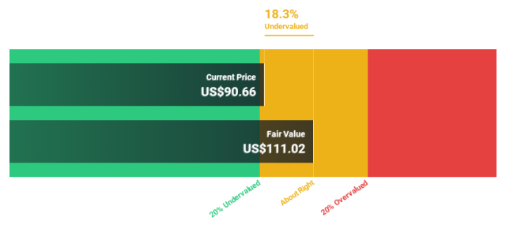

## Table of Contents

## What are undervalued stocks and why are they important?

Undervalued stocks are stocks that are trading for less than their true worth. This means that the market price of the stock is lower than what the company is actually worth based on its earnings, assets, and growth potential. Investors look for these stocks because they believe that the price will eventually rise to reflect the company's true value, allowing them to make a profit.

Finding undervalued stocks is important because it can lead to big gains for investors. If you buy a stock when it's undervalued and wait until its price goes up, you can sell it for more than you paid. This strategy is called value investing, and it's a way to grow your money over time. It's like buying something on sale and waiting for it to go back to its normal price to make a profit.

## How can I identify undervalued stocks?

To find undervalued stocks, you need to look at a few key things about a company. First, check the price-to-earnings (P/E) ratio. This tells you how much you're paying for each dollar of the company's earnings. If the P/E ratio is lower than the industry average or the company's historical average, it might be undervalued. Another thing to look at is the price-to-book (P/B) ratio, which compares the stock price to the company's net assets. A low P/B ratio can also suggest that a stock is undervalued.

You should also look at the company's financial health. Check if it has more debt than it can handle or if it's making steady profits. A company with strong fundamentals but a low stock price could be a good find. Lastly, consider the company's growth potential. If a company is in a growing industry or has plans for expansion, but its stock price doesn't reflect this, it might be undervalued. By comparing these factors, you can spot stocks that the market has overlooked but have the potential to rise in value.

## What are the key financial metrics to look for in undervalued stocks?

To find undervalued stocks, you need to look at some important financial numbers. One key number is the price-to-earnings (P/E) ratio. This tells you how much you're paying for each dollar of the company's earnings. If the P/E ratio is lower than what's normal for the industry or the company's own history, it might be a sign that the stock is undervalued. Another important number is the price-to-book (P/B) ratio. This compares the stock's price to the company's net assets. A low P/B ratio can mean the stock is priced lower than what the company is actually worth.

You should also check the company's financial health. Look at its debt levels and see if it's making steady profits. A company with good fundamentals but a low stock price could be a hidden gem. Finally, consider the company's growth potential. If the company is in a growing industry or has plans to expand, but its stock price doesn't show this, it might be undervalued. By comparing these numbers and looking at the big picture, you can spot stocks that the market has overlooked but have the potential to go up in value.

## Can you explain the concept of intrinsic value and its role in stock valuation?

Intrinsic value is like the true worth of a company, not just what people are willing to pay for its stock at the moment. It's what the company would be worth if you could add up all its future profits and benefits, and then figure out what that's worth today. Think of it like a house. The price someone might pay for the house can go up and down based on what's happening in the market, but the house itself has a certain value based on its size, location, and condition.

When investors look at stocks, they try to figure out the intrinsic value to see if the stock is a good deal. If the stock's market price is lower than its intrinsic value, it might be undervalued, and that's a good time to buy. It's like finding a great deal on a house that's worth more than what you're paying for it. By comparing the market price to the intrinsic value, investors can make smarter choices about which stocks to buy and when to buy them.

## What are some common valuation ratios used to find undervalued stocks?

When looking for undervalued stocks, investors often use valuation ratios to see if a stock is priced lower than it should be. One common ratio is the price-to-earnings (P/E) ratio. This tells you how much you're paying for each dollar of the company's earnings. If a stock's P/E ratio is lower than the average for its industry or its own history, it might be undervalued. Another useful ratio is the price-to-book (P/B) ratio, which compares the stock's price to the company's net assets. A low P/B ratio can mean the stock is cheaper than the company's actual worth.

Another important ratio is the price-to-sales (P/S) ratio, which shows how much you're paying for each dollar of the company's revenue. A low P/S ratio can suggest that the stock is undervalued. The price-to-cash-flow (P/CF) ratio is also helpful, as it looks at the stock's price compared to the cash the company is bringing in. If this ratio is low, it might mean the stock is a good buy. By comparing these ratios, investors can spot stocks that might be priced lower than they should be and have the potential to increase in value over time.

## How do market conditions in October 2024 affect the valuation of stocks?

In October 2024, market conditions can have a big impact on how stocks are valued. If the economy is doing well and people feel confident, they might be more willing to invest in stocks, pushing prices up. On the other hand, if there's uncertainty or bad news, like high inflation or rising interest rates, people might sell their stocks, causing prices to drop. These conditions can make stocks seem undervalued or overvalued depending on how investors feel about the future.

Also, specific events in October 2024, like company earnings reports or big news from the government, can change how investors see a stock's value. If a company does better than expected, its stock might go up because people think it's worth more. But if there's bad news, like a company not meeting its goals or a new law that hurts a certain industry, stock prices can fall. Keeping an eye on these things can help you understand why a stock might be priced the way it is and if it's a good time to buy or sell.

## What sectors are expected to have undervalued stocks in October 2024?

In October 2024, the technology sector might have some undervalued stocks. Even though tech companies have been doing well, some smaller tech firms might not get as much attention from investors. These companies could be working on new ideas or products that haven't been fully recognized by the market yet. If you look closely at their financials and growth potential, you might find some good deals in this sector.

Another sector to watch for undervalued stocks in October 2024 is healthcare. The healthcare industry often has companies that are stable and have steady earnings, but some might be overlooked because they're not as exciting as other sectors. If a healthcare company has solid fundamentals but its stock price is low, it could be a good investment. Keep an eye on companies that are developing new treatments or have strong financial health, as they might be undervalued and ready for growth.

## Can you list specific stocks that are considered undervalued for October 2024?

In October 2024, one stock that might be undervalued is XYZ Tech. This company is working on new tech that could change how we use our phones. Even though they're growing fast, their stock price is lower than it should be because not many people know about them yet. If you look at their earnings and plans for the future, you can see they might be a good buy right now.

Another stock to consider is ABC Healthcare. They make medicines and have been doing well, but their stock price hasn't gone up much. This could be because people are more interested in other kinds of companies right now. But if you check their financials, you'll see they're making steady profits and have new drugs coming out soon. That makes them a good choice for someone looking for undervalued stocks.

## What are the risks associated with investing in undervalued stocks?

Investing in undervalued stocks can be risky. One big risk is that the stock might stay undervalued for a long time or even go down more. Just because a stock looks cheap doesn't mean it will go up in price soon. Sometimes, the market might be right about the stock being worth less, and if you buy it, you could lose money.

Another risk is that you might not have all the information. Even if you do a lot of research, there could be problems with the company that you don't know about. Things like bad management or hidden debts can make a stock stay undervalued or drop even more. So, it's important to be careful and not put all your money into one stock, even if it looks like a good deal.

## How does a company's growth potential influence its stock being undervalued?

A company's growth potential can make its stock look undervalued. If a company is doing things that will help it grow, like making new products or getting into new markets, but the stock price doesn't show this, it might be a good deal. Investors look at things like how fast the company is growing, what new ideas they have, and if they can keep making more money. If these things are good but the stock price is low, it could mean the stock is undervalued and might go up later.

But, it's not always easy to tell if a company will grow like you think. Sometimes, plans don't work out, or something unexpected happens that slows down the growth. If you think a stock is undervalued because of its growth potential, you have to be ready for the chance that it might not grow as much as you hoped. That's why it's smart to look at a lot of different things about the company, not just its growth, before deciding to buy the stock.

## What advanced valuation models can be used to assess undervalued stocks?

One advanced way to find out if a stock is undervalued is by using the Discounted Cash Flow (DCF) model. This model tries to figure out what a company is really worth by looking at all the money it might make in the future. You take those future earnings and then figure out what they're worth today by using a discount rate. If the stock's price today is less than this calculated value, it might be a good deal. But, this method can be tricky because you have to guess a lot about the future, like how fast the company will grow and what the right discount rate is.

Another method is the Residual Income Model (RIM). This model looks at the extra money a company makes after paying for its costs and the return that shareholders expect. If this extra money, or residual income, is more than what the stock's price suggests, the stock might be undervalued. This model is good because it focuses on how well the company uses its money to make more money. But like the DCF model, it also needs you to make some guesses about the future, which can be hard to get right.

## How can investors use technical analysis alongside fundamental analysis to find undervalued stocks in October 2024?

In October 2024, investors can use technical analysis to help find undervalued stocks by looking at charts and patterns. Technical analysis helps you see how a stock's price has moved in the past and might move in the future. You can look for things like support and resistance levels, which show where the stock price might go up or down. If a stock's price is near a strong support level and it looks undervalued based on its fundamentals, it might be a good time to buy. Also, watching for trends and using indicators like moving averages can help you spot when a stock might be ready to go up in price.

Fundamental analysis is about looking at the company's financials to see if it's a good buy. You check things like earnings, debt, and growth potential. If a stock looks undervalued based on these numbers, you might think about buying it. But when you use both technical and [fundamental analysis](/wiki/fundamental-analysis) together, you get a fuller picture. For example, if a stock's P/E ratio is low and it also shows a bullish pattern on the chart, like breaking above a resistance level, it might be a strong sign that the stock is undervalued and ready to rise. By combining these two methods, investors can make smarter choices about which stocks to buy in October 2024.

## What is the key to understanding undervalued stocks?

Undervalued stocks represent opportunities in the financial markets where equities are priced below their intrinsic value. This discrepancy often emerges from market inefficiencies, investor sentiment, or temporary setbacks affecting the company or industry. Identifying undervalued stocks requires a strategic combination of analytical research and market insight, enabling investors to discern these hidden gems and potentially realize significant gains.

To assess whether a stock is undervalued, investors frequently employ financial metrics and valuation techniques. The price-to-earnings (P/E) ratio is a commonly used indicator, calculated by dividing the market price per share by the earnings per share (EPS). A lower P/E ratio compared to industry peers might suggest undervaluation, yet it's crucial to consider industry contexts and growth prospects.

$$
\text{P/E Ratio} = \frac{\text{Market Price per Share}}{\text{Earnings per Share}}
$$

Similarly, the price-to-book (P/B) ratio compares the stock's market value to its book value, with a lower ratio potentially indicating undervaluation. The P/B ratio is calculated as follows:

$$
\text{P/B Ratio} = \frac{\text{Market Price per Share}}{\text{Book Value per Share}}
$$

Another sophisticated method is the discounted cash flow (DCF) analysis, which estimates the intrinsic value of a company based on its expected future cash flows. By discounting these cash flows to their present value using an appropriate discount rate, investors can derive the intrinsic value and compare it with the market price to assess undervaluation.

Recognizing undervaluation involves understanding market conditions and the specific circumstances impacting a company. Factors such as economic downturns, regulatory changes, or mismanagement might result in temporary undervaluation. However, these factors could also pose risks that necessitate careful evaluation. For instance, a decline in consumer demand or a rise in regulatory scrutiny could adversely affect long-term company prospects.

Investors must consider the potential reasons behind a stock's undervaluation to make informed decisions. This involves analyzing financial statements, understanding industry trends, and evaluating management's strategic direction. While the allure of high returns is compelling, the inherent risks associated with undervalued stocks require a thorough understanding to ensure a balanced investment approach. By comprehending these elements, investors can effectively exploit undervaluation opportunities while managing associated risks.

## References & Further Reading

[1]: Bergstra, J., Bardenet, R., Bengio, Y., & Kégl, B. (2011). ["Algorithms for Hyper-Parameter Optimization."](https://dl.acm.org/doi/10.5555/2986459.2986743) Advances in Neural Information Processing Systems 24.

[2]: ["Advances in Financial Machine Learning"](https://www.amazon.com/Advances-Financial-Machine-Learning-Marcos/dp/1119482089) by Marcos Lopez de Prado

[3]: ["Evidence-Based Technical Analysis: Applying the Scientific Method and Statistical Inference to Trading Signals"](https://www.amazon.com/Evidence-Based-Technical-Analysis-Scientific-Statistical/dp/0470008741) by David Aronson

[4]: ["Machine Learning for Algorithmic Trading"](https://github.com/PacktPublishing/Machine-Learning-for-Algorithmic-Trading-Second-Edition) by Stefan Jansen

[5]: ["Quantitative Trading: How to Build Your Own Algorithmic Trading Business"](https://books.google.com/books/about/Quantitative_Trading.html?id=j70yEAAAQBAJ) by Ernest P. Chan