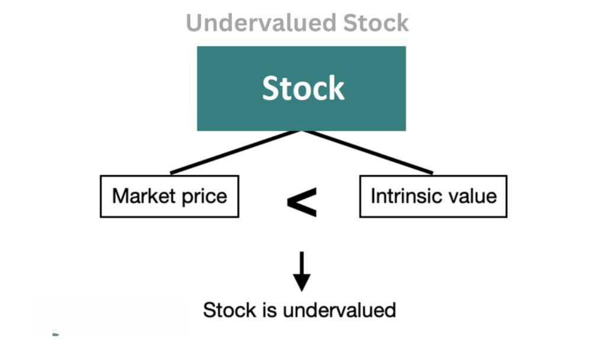

Value investing and algorithmic trading are two distinctive strategies that have garnered significant attention in the financial markets. Each strategy provides its own unique advantages and methodologies aimed at optimizing investment decisions. Value investing is an approach where investors seek to identify and invest in securities deemed to be undervalued by the market. This technique relies heavily on traditional financial analysis and evaluation of intrinsic value, expecting that the market will eventually recognize and reflect the true worth of these assets.

On the other hand, algorithmic trading employs computer programs to automate and execute trades based on predefined criteria. The main advantages of this approach include faster execution, increased accuracy, and elimination of emotional biases, which can often hinder human decision-making.



This article examines the convergence of these two strategies. By integrating the principles of value investing into the algorithms used in trading, investors can potentially enhance their strategies, achieving better performance outcomes. The interplay between these approaches offers a comprehensive framework that allows investors to navigate complex market dynamics more effectively. Combining the time-tested wisdom of value investing with the technological advancements of algorithmic trading can offer a more disciplined and informed investment process, expanding the scope and impact of traditional methodologies. Understanding this synergy not only provides insights into current trends but also opens doors to innovative solutions in the fast-evolving financial landscape.

## Table of Contents

## Understanding Value Investing

Value investing is an established investment paradigm predicated on the careful evaluation of stocks or securities that appear to be undervalued relative to their intrinsic value. The intrinsic value of a stock is often determined by assessing the fundamental aspects of a business, including its earnings, dividends, assets, and liabilities. This investing strategy seeks to capitalize on market inefficiencies by identifying assets priced below their true worth, with the anticipation that prices will eventually adjust to reflect intrinsic values.

Warren Buffett, one of the most successful investors of all time, is a prominent advocate of this approach. Buffett's investment philosophy involves acquiring undervalued assets and holding them over a long period, allowing the market time to recognize and correct the mispricing. He emphasizes the importance of patience and thorough analysis in successful value investing.

A few key metrics are instrumental in the practice of value investing:

1. **Intrinsic Value**: The intrinsic value is an estimate of the true worth of a company based on quantitative analysis without regard to its current market price. Value investors often use discounted cash flows (DCF) to calculate intrinsic value. The formula for DCF is:
$$
   \text{Intrinsic Value} = \sum_{t=1}^{n} \frac{CF_t}{(1 + r)^t}

$$

   where $CF_t$ is the cash flow in year $t$, $r$ is the discount rate, and $n$ is the total number of years.

2. **Margin of Safety**: Introduced by Benjamin Graham, the margin of safety represents the difference between the intrinsic value of a stock and its market price. It serves as a buffer to protect against errors in valuation or unforeseen adverse events. A larger margin of safety offers greater protection, making it a crucial component of disciplined investment decisions.

3. **Financial Ratios**:
   - **Price-to-Earnings (P/E) Ratio**: This ratio compares a company's current share price to its per-share earnings, serving as an indicator of whether the stock is over or undervalued. A low P/E ratio might suggest that the stock is undervalued.
$$
     \text{P/E Ratio} = \frac{\text{Market Price per Share}}{\text{Earnings per Share (EPS)}}

$$

   - **Price-to-Book (P/B) Ratio**: Used to compare a firm's market value to its book value, the P/B ratio provides insight into how much investors are willing to pay for a company relative to its net assets. A P/B ratio below 1 could indicate that a stock is undervalued.
$$
     \text{P/B Ratio} = \frac{\text{Market Price per Share}}{\text{Book Value per Share}}

$$

These metrics form the cornerstone of value investing, aiding investors in conducting comprehensive evaluations to identify promising opportunities to achieve favorable long-term returns. By focusing on intrinsic value, maintaining a margin of safety, and employing critical financial ratios, value investors strive to mitigate risk while maximizing potential gains.

## Algorithmic Trading: An Overview

Algorithmic trading leverages sophisticated computer algorithms and software to automate and execute trades, optimizing the timing and conditions of entries and exits in financial markets. At its core, this approach utilizes a set of predefined rules that dictate trading decisions, exploiting opportunities that may arise even in milliseconds. 

One of the significant advantages of [algorithmic trading](/wiki/algorithmic-trading) is its speed. Unlike human traders, algorithms can process vast amounts of data instantly and execute trades at a [high frequency](/wiki/high-frequency-trading), significantly faster than manual trading. This speed is a crucial [factor](/wiki/factor-investing), especially in volatile markets, where price discrepancies or short-lived opportunities can appear and vanish within seconds.

Accuracy is another key benefit, as algorithms minimize the risks of human errors, such as incorrect calculations or emotional decision-making. By adhering strictly to predetermined rules, algorithms eliminate emotional bias, often considered a significant hindrance in manual trading. This disciplined approach helps maintain consistency and reliability in executing trades irrespective of market conditions.

The effectiveness of algorithmic trading lies in its three critical components: models, data analysis, and execution strategies. 

Models in algorithmic trading are mathematical formulations that define the trading logic. They evaluate historical and real-time market data to identify trading opportunities. For example, a simple moving average crossover model might generate buy and sell signals when a short-term moving average crosses a long-term moving average.

Data analysis plays a pivotal role in algorithmic trading. Algorithms rely on sophisticated data-processing capabilities to analyze historical trading data and current market conditions. This analysis might involve statistical techniques, [machine learning](/wiki/machine-learning) models, or other advanced computational methods to predict price movements or identify market inefficiencies.

Execution strategies refer to the specific methods used to place trades in the market. These strategies ensure that trades are conducted efficiently and effectively, considering factors such as market impact, transaction costs, and [liquidity](/wiki/liquidity-risk-premium). Algorithms can use tactics like slicing large orders into smaller chunks to minimize market disruption or employ dark pool trading to execute large transactions discreetly.

In summary, algorithmic trading offers a disciplined, efficient, and accurate framework for executing trades, powered by complex models, comprehensive data analysis, and precise execution strategies. Its ability to operate without the emotional biases that often affect human traders provides a significant advantage in today's fast-paced financial markets.

## Integrating Value Investing into Algorithmic Trading

Integrating value investing into algorithmic trading involves leveraging algorithms to identify undervalued stocks on a large scale, merging the core principles of value investing with the precision of automated systems. This integration employs machine learning to improve the accuracy of stock evaluations, enabling trading systems to execute based on calculated intrinsic values.

Machine learning models can analyze vast datasets, encompassing historical stock prices, financial statements, and macroeconomic indicators, to discern patterns and relationships indicative of value. For instance, by employing regression models or decision trees, machine learning can estimate a stock's intrinsic value based on fundamental financial metrics. These models can be trained to recognize undervaluation by incorporating inputs such as price-to-earnings (P/E) ratios, book values, and cash flow analysis.

Moreover, data analytics complements traditional value metrics, providing more informed decision-making capabilities. By using techniques like natural language processing (NLP), algorithms can process unstructured data such as news articles or earnings call transcripts, extracting sentiments or uncovering hidden insights that may impact stock valuations. Sentiment analysis, for example, can predict market trends or potential price movements by understanding market sentiments from textual data.

### Python Example

Using Python, analysts can apply machine learning algorithms such as linear regression to estimate the intrinsic value of stocks. Below is a simple example using scikit-learn to predict stock valuations:

```python
import pandas as pd
from sklearn.model_selection import train_test_split
from sklearn.linear_model import LinearRegression

# Sample financial data
data = pd.read_csv('financial_data.csv')  # Assume this includes features like P/E, P/B, etc.
X = data.drop('intrinsic_value', axis=1)
y = data['intrinsic_value']

# Splitting the dataset
X_train, X_test, y_train, y_test = train_test_split(X, y, test_size=0.2, random_state=42)

# Linear regression model
model = LinearRegression()
model.fit(X_train, y_train)

# Predictions
predictions = model.predict(X_test)
```

This example demonstrates a basic framework for estimating how close current stock prices are to their predicted intrinsic values. By integrating these predictions within an algorithmic trading strategy, buy or sell signals can be automated, achieving a higher scale and speed than traditional value investing.

The fusion of value investing and algorithmic trading thus creates a dynamic approach, empowering investors with enhanced capability to capture market opportunities while adhering to value-based principles.

## Benefits and Challenges of Value-Oriented Algorithmic Trading

The union of value investing and algorithmic trading provides several substantial benefits. One of the key advantages is increased precision in executing trades. Algorithms are capable of analyzing vast datasets and identifying undervalued stocks with high accuracy, minimizing human error and mitigating emotional biases. This precision leads to more efficient trade execution, capturing optimal prices on both entry and [exit](/wiki/exit-strategy).

Additionally, algorithmic systems facilitate disciplined investment strategies. By adhering strictly to predefined criteria, these systems prevent erratic trading decisions and help investors consistently adhere to their value investing principles. This discipline contributes to performance stability and can enhance risk management by reducing exposure to impulsive trading based on short-term market fluctuations.

However, the integration of value investing into algorithmic trading also poses challenges. Maintaining the accuracy of the models used to identify undervalued securities is paramount. Market conditions are not static; they evolve due to economic changes, geopolitical events, and other factors. As such, models must be regularly updated and validated to remain relevant and accurate.

Furthermore, the dynamic nature of financial markets necessitates that algorithmic trading systems be adaptable. Algorithms must consistently recalibrate to changing market dynamics without compromising their investment principles. Addressing market anomalies presents another challenge, as these can skew data and disrupt the assumptions underlying models.

To overcome these challenges, robust model validation processes are essential. This involves [backtesting](/wiki/backtesting) models against historical data to ensure their reliability and making iterative improvements based on performance outcomes. Monitoring systems are also crucial, requiring constant surveillance and adjustments to maintain their alignment with fluctuating market conditions.

In conclusion, while the combination of value investing and algorithmic trading offers significant benefits, such as precision and discipline, it also demands a meticulous approach to model accuracy and adaptability. By implementing comprehensive validation and monitoring protocols, investors can harness the synergy of these methodologies to optimize their investment strategies.

## Case Studies and Practical Examples

The implementation of value investing principles in algorithmic trading is exemplified by Acme Investment Fund and Quantum Value Partners, both of which have successfully harnessed fundamental financial metrics alongside machine learning to outperform market indices.

### Acme Investment Fund
Acme Investment Fund employs a quantitative value investing strategy that integrates financial ratios and machine learning algorithms to identify undervalued stocks. The fund's approach begins with a comprehensive screening process that filters stocks based on traditional value metrics such as the price-to-earnings (P/E) ratio and the price-to-book (P/B) ratio. This initial screening narrows down a universe of stocks to those with a high potential for being undervalued.

To enhance its decision-making process, Acme employs machine learning models that analyze historical price data, corporate earnings, and macroeconomic indicators. A recurrent [neural network](/wiki/neural-network) (RNN) is utilized to predict future stock prices and to refine the intrinsic value estimation of potential investments. By training the model on a vast dataset, the fund captures patterns and relationships that are not immediately evident through traditional analysis.

```python
import numpy as np
from sklearn.model_selection import train_test_split
from keras.models import Sequential
from keras.layers import Dense, LSTM

# Load data
X, y = load_financial_data() # Function to load dataset of financial metrics

# Split data
X_train, X_test, y_train, y_test = train_test_split(X, y, test_size=0.2, random_state=42)

# Define the RNN model
model = Sequential()
model.add(LSTM(units=50, activation='relu', input_shape=(X_train.shape[1], X_train.shape[2])))
model.add(Dense(1))

# Compile the model
model.compile(optimizer='adam', loss='mean_squared_error')

# Train the model
model.fit(X_train, y_train, epochs=100, batch_size=64, validation_data=(X_test, y_test))
```

### Quantum Value Partners
Quantum Value Partners takes a slightly different approach by tailoring algorithmic strategies that incorporate both [fundamental analysis](/wiki/fundamental-analysis) and sentiment analysis. The firm employs natural language processing (NLP) techniques to evaluate market sentiment based on news articles, earnings reports, and social media feeds. This additional layer of analysis improves the firm's ability to predict market movements and stock price adjustments.

One innovative aspect of Quantum's strategy is its continuous learning framework, which adapts to new data inputs and market conditions in real-time. The firm's models are continuously validated and refined, ensuring their predictive power remains robust against evolving market dynamics. This approach mitigates risks associated with model drift and market anomalies, thereby optimizing risk-adjusted returns.

### Insights from Case Studies
Both Acme Investment Fund and Quantum Value Partners underscore the critical importance of data quality, as erroneous or outdated data can lead to suboptimal investment decisions. Moreover, these case studies highlight the necessity of continuous learning mechanisms that can adapt to market changes, maintaining the relevance and accuracy of predictive models.

Effective risk management is also paramount, as it ensures that the algorithmic systems account for [volatility](/wiki/volatility-trading-strategies) and mitigate potential losses. By focusing on robust model validation and system monitoring, these firms exemplify how the integration of algorithms with value investing principles can lead to significant improvements in investment strategies and performance outcomes.

## Conclusion

The synergy between value investing and algorithmic trading offers a powerful framework for enhancing investment returns and optimizing risk management. By merging the time-honored principles of identifying undervalued assets with the precision and efficiency of automated trading systems, investors can harness the strengths of both approaches to exploit market inefficiencies. Value investing's focus on intrinsic value assessment provides a solid foundation upon which algorithmic models can be structured, facilitating evidence-based decision-making and systematic execution.

Despite the inherent challenges in marrying these methodologies, such as ensuring model robustness and adapting to market fluctuations, the potential rewards are significant. The integration enables investors to operate with greater discipline, reduces emotional biases, and leverages large datasets to improve forecast accuracy and trade execution. Advances in machine learning and data analytics further enrich this fusion, allowing for dynamic adjustments and ongoing optimization of investment strategies.

As the financial markets continue to evolve, the convergence of value investing and algorithmic trading is poised to unlock new opportunities for innovation. Investors dedicated to exploring this intersection will likely discover techniques that capitalize on historical insights while embracing technological progress, ultimately crafting more resilient and adaptable portfolios capable of navigating complex market dynamics.

## References & Further Reading

Graham, B. (2006). *The Intelligent Investor: The Definitive Book on Value Investing.* This book is widely considered a cornerstone for understanding the principles of value investing. Benjamin Graham provides insights into identifying undervalued securities through comprehensive analysis, establishing the importance of concepts like intrinsic value and margin of safety. The book's teachings are fundamental for investors looking to adopt a disciplined approach in securities selection and investment strategy.

Lopez de Prado, M. (2018). *Advances in Financial Machine Learning.* This text serves as a practical guide for integrating machine learning techniques within financial markets, making it a valuable resource for those involved in algorithmic trading. By discussing the application of data science and machine learning to financial problems, Lopez de Prado equips readers with knowledge on how advanced computational methods can enhance trading decisions and performance. The book offers strategies for robust data analysis and algorithm development, which are crucial for the successful implementation of quantitative value investing.

Chan, E. P. (2008). *Quantitative Trading: How to Build Your Own Algorithmic Trading Business.* Ernie Chan’s book addresses the practical aspects of starting and maintaining an algorithmic trading business. Covering topics such as backtesting strategies, risk management, and execution systems, Chan provides a framework for developing successful trading strategies. This resource is particularly useful for combining algorithmic trading with value investing by offering a systematic approach to strategy development, thus facilitating the execution of trades based on quantitative analysis of market opportunities.

