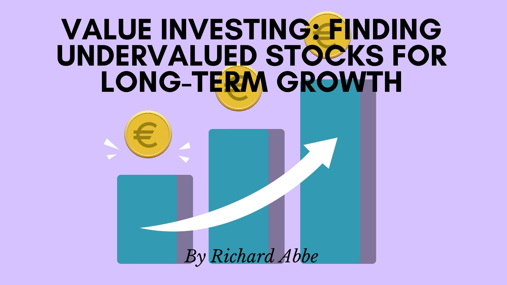

## Table of Contents

## What is value investing?

Value investing is a way of choosing stocks that seem to be priced lower than they should be. People who do value investing look for companies that they think are worth more than what the stock market says. They do this by studying the company's financial reports, like how much money it makes and how much it owes. They want to buy these stocks at a lower price and then hold onto them until the market realizes the true value, which they hope will make the stock price go up.

A famous person who does value investing is Warren Buffett. He looks for companies that have a strong business, good management, and a price that is lower than what he thinks the company is really worth. Value investors believe that over time, the stock price will go up to match the true value of the company. This means they need to be patient and willing to wait for the market to catch up with their own valuation of the company.

## How do you identify undervalued stocks?

To find undervalued stocks, you need to look at a company's financial numbers and compare them to what the stock is currently selling for. One way to do this is by using the price-to-earnings ratio, or P/E ratio. This tells you how much you're paying for each dollar of the company's earnings. If a company's P/E ratio is lower than others in the same industry, it might be undervalued. Another thing to check is the price-to-book ratio, which compares the stock price to the company's net assets. A low price-to-book ratio can also suggest that a stock is undervalued.

You should also look at the company's overall health. This means checking things like how much debt the company has, how much money it's making, and whether it's growing. If a company is doing well but its stock price is low, it could be a good sign that the stock is undervalued. It's also important to consider what's happening in the market and the economy. Sometimes, stocks can be undervalued because of temporary problems, like a bad year for the industry. If you think these problems will get better, it might be a good time to buy the stock.

## What are the key financial ratios used in value investing?

In value investing, people use several key financial ratios to find out if a stock is a good buy. One important ratio is the price-to-earnings ratio, or P/E ratio. This ratio tells you how much you are paying for each dollar of the company's earnings. A low P/E ratio compared to other companies in the same industry might mean the stock is undervalued. Another useful ratio is the price-to-book ratio, which compares the stock's price to the company's net assets. If this ratio is low, it can suggest that the stock is priced lower than its actual worth.

Another ratio to look at is the debt-to-equity ratio, which shows how much debt a company has compared to its equity. A lower ratio can be a good sign because it means the company isn't relying too much on borrowed money. The dividend yield is also important, especially for investors who want to earn money from dividends. It tells you how much a company pays out in dividends each year relative to its stock price. A high dividend yield can be attractive if the company is stable and the dividends are likely to continue. By using these ratios, value investors can make better decisions about which stocks to buy.

## Can you explain the concept of intrinsic value?

Intrinsic value is a way to figure out what a company is really worth, not just what the stock market says it's worth. It's like trying to find the true value of something by looking at all the important parts of the company, like how much money it makes, how much it owns, and how much it owes. People who do value investing, like Warren Buffett, use intrinsic value to find stocks that are priced lower than they should be. They believe that over time, the stock price will go up to match the true value of the company.

To find the intrinsic value, you need to look at a lot of numbers and make some guesses about the future. You might look at how much money the company is expected to make in the future and then figure out what that money is worth today. This can be tricky because it involves making predictions, but it helps you decide if a stock is a good buy. If the stock's price is lower than its intrinsic value, it might be undervalued, and that's when value investors see an opportunity to buy.

## What are common mistakes beginners make when looking for undervalued stocks?

Beginners often make the mistake of focusing too much on just one or two financial ratios, like the P/E ratio, without looking at the whole picture. They might see a low P/E ratio and think a stock is a great buy, but they forget to check other important things like the company's debt, how much money it's making, and what's happening in the industry. It's important to look at many different pieces of information to really understand if a stock is undervalued.

Another common mistake is not understanding the difference between a stock that's undervalued and one that's just cheap for a good reason. Sometimes a stock's price is low because the company is having problems, like losing money or facing big competition. Beginners might buy these stocks thinking they've found a bargain, but if the company's problems don't get better, the stock price might stay low or even go down more. It's important to do a lot of research and make sure the stock is undervalued because of a temporary issue, not because the company is in real trouble.

Lastly, beginners often don't have enough patience. Value investing can take a long time to pay off because it might take years for the market to realize a stock's true value. Some people get impatient and sell their stocks too soon, missing out on the potential for big gains later. It's important to be ready to hold onto undervalued stocks for a long time and not get discouraged if the price doesn't go up right away.

## How does market sentiment affect the valuation of stocks?

Market sentiment is how people feel about the stock market or a specific stock. It can make stock prices go up or down, even if the company's real value hasn't changed. When people are feeling good and optimistic, they might buy more stocks, pushing the prices up. This can make stocks seem overvalued because their prices are higher than what the company is actually worth. On the other hand, when people are worried or scared, they might sell their stocks, causing the prices to go down. This can make stocks seem undervalued because their prices are lower than what the company is really worth.

Value investors need to be careful with market sentiment. They try to find stocks that are undervalued because of bad market sentiment, not because the company is doing badly. If they can spot a good company that's just going through a rough patch, they might buy the stock and wait for the market to realize its true value. But it's tricky because market sentiment can change quickly, and it's hard to predict. So, while market sentiment can create opportunities for value investors, it can also make things more complicated and risky.

## What role does sector analysis play in identifying undervalued stocks?

Sector analysis is important when looking for undervalued stocks. It means looking at the different parts of the economy, like technology, health care, or energy, to see how they are doing. By understanding what's happening in a sector, you can find out if a stock is undervalued because of problems in the whole industry, or if it's just the company itself that's having issues. If a whole sector is doing badly, stocks in that sector might be priced lower than they should be. But if you think the sector will get better, it could be a good time to buy those stocks.

For example, if the tech sector is going through a tough time because of new rules or less demand, tech stocks might be undervalued. A value investor might look at this and think that the problems will go away soon, so the stocks are a good buy now. But it's important to look at the company too, not just the sector. If a company is doing well even when its sector is struggling, it might be an even better opportunity. So, sector analysis helps value investors see the bigger picture and find stocks that might be undervalued because of temporary problems in their industry.

## How can an investor use a margin of safety in value investing?

A margin of safety is like a cushion that helps protect investors from making big mistakes. In value investing, it means buying a stock for less than what you think it's really worth. This difference between the stock's price and its true value is the margin of safety. If you think a stock is worth $100 but you can buy it for $70, your margin of safety is $30. This extra room gives you some protection if you made a mistake in figuring out the stock's value or if something unexpected happens to the company.

Using a margin of safety can make investing less risky. If the stock's price goes down a bit, you still have that cushion to fall back on. It also gives you more confidence to hold onto the stock until its price goes up to match its true value. But finding a good margin of safety takes a lot of research and patience. You need to look at the company's financials, understand the industry, and be ready to wait for the market to catch up with your valuation. By doing this, you can find undervalued stocks that have a good chance of making you money in the long run.

## What are some advanced valuation models used by expert value investors?

Expert value investors often use advanced valuation models like the discounted cash flow (DCF) model. This model tries to figure out what a company is really worth by looking at how much money it will make in the future. You take those future earnings and bring them back to today's value, using a discount rate to account for the risk and the time value of money. If the value you get from the DCF model is higher than the stock's current price, it might be undervalued. This model needs a lot of guesses about the future, so it can be tricky to use, but it's a powerful tool for finding the true value of a company.

Another advanced model is the residual income model, which looks at the company's earnings after paying for the cost of its capital. This model says that a company's value comes from the profits it makes above what it needs to pay its investors. If a company can keep making more money than it costs to run the business, it might be worth more than its stock price suggests. Like the DCF model, the residual income model needs a lot of detailed financial information and some predictions about the future. But it can help investors see if a stock is undervalued by focusing on the company's ability to create extra value for its shareholders.

## How do macroeconomic factors influence the undervaluation of stocks?

Macroeconomic factors, like the health of the economy, interest rates, and inflation, can make stocks seem undervalued. When the economy is doing badly, people might feel scared and sell their stocks, making the prices go down. If interest rates go up, borrowing money becomes more expensive for companies, which can hurt their profits and make their stock prices drop. Inflation can also make things cost more, which can affect how much money companies make. If these things happen, even good companies might have low stock prices, making them look undervalued.

Value investors need to think about these macroeconomic factors when looking for undervalued stocks. If they believe the economy will get better, they might see a chance to buy stocks at a lower price and wait for them to go up. But it's tricky because macroeconomic factors can change a lot, and it's hard to predict what will happen. So, while these factors can create opportunities for finding undervalued stocks, they also add more risk and uncertainty to the investment.

## Can you discuss case studies of famously undervalued stocks and their outcomes?

One famous example of an undervalued stock is Apple in the late 1990s. At that time, Apple was struggling and its stock price was very low. Many people thought the company was in big trouble. But a value investor named Warren Buffett saw that Apple had great products and a loyal customer base. He believed that if Apple could turn things around, its stock would be worth a lot more. In 1997, he started buying Apple stock, and over the next few years, the company did turn things around under the leadership of Steve Jobs. By 2012, Apple's stock had gone up a lot, and Buffett made a big profit.

Another case study is Bank of America during the 2008 financial crisis. When the crisis hit, many banks were in trouble, and their stock prices dropped a lot. Bank of America's stock was no different. But some value investors saw that even though the bank was having problems, it still had a strong business and a lot of customers. They believed that once the economy got better, Bank of America's stock would go up. They were right. By 2012, the bank had recovered, and its stock price had gone up a lot, making those investors a lot of money.

These examples show how value investing can work. It's about finding good companies that are going through a tough time but have the potential to get better. If you can buy their stocks at a low price and wait for the company to turn things around, you might make a big profit. But it takes a lot of research and patience, and there's always a risk that things won't work out the way you hope.

## What strategies can be employed to manage a portfolio of undervalued stocks effectively?

Managing a portfolio of undervalued stocks means you need to keep an eye on the companies you've invested in and the market around them. It's important to stay updated on how each company is doing. Check their financial reports to see if they are making more money or if they are still struggling. Also, pay attention to news about the industry and the economy. If things are getting better, it might be a good sign that the stock's price will go up. But if things are getting worse, you might need to think about selling the stock before it loses more value. It's a good idea to spread your money across different stocks and sectors to lower your risk. If one stock goes down, the others might help balance things out.

Another strategy is to have a plan for when to sell your stocks. Decide ahead of time what would make you sell a stock, like if it reaches a certain price or if the company starts doing badly. This can help you make smart choices and not just sell because you're feeling scared or excited. Also, be patient. Value investing often takes a long time to pay off, so you need to be ready to hold onto your stocks even if the price doesn't go up right away. Keep checking your portfolio and making changes if needed, but don't change things too much. Sticking to your plan and being patient can help you do well with undervalued stocks.

## What is Understanding Value Investing?

Value investing is an established investment paradigm predicated on the careful evaluation of stocks or securities that appear to be undervalued relative to their intrinsic value. The intrinsic value of a stock is often determined by assessing the fundamental aspects of a business, including its earnings, dividends, assets, and liabilities. This investing strategy seeks to capitalize on market inefficiencies by identifying assets priced below their true worth, with the anticipation that prices will eventually adjust to reflect intrinsic values.

Warren Buffett, one of the most successful investors of all time, is a prominent advocate of this approach. Buffett's investment philosophy involves acquiring undervalued assets and holding them over a long period, allowing the market time to recognize and correct the mispricing. He emphasizes the importance of patience and thorough analysis in successful value investing.

A few key metrics are instrumental in the practice of value investing:

1. **Intrinsic Value**: The intrinsic value is an estimate of the true worth of a company based on quantitative analysis without regard to its current market price. Value investors often use discounted cash flows (DCF) to calculate intrinsic value. The formula for DCF is:
$$
   \text{Intrinsic Value} = \sum_{t=1}^{n} \frac{CF_t}{(1 + r)^t}

$$

   where $CF_t$ is the cash flow in year $t$, $r$ is the discount rate, and $n$ is the total number of years.

2. **Margin of Safety**: Introduced by Benjamin Graham, the margin of safety represents the difference between the intrinsic value of a stock and its market price. It serves as a buffer to protect against errors in valuation or unforeseen adverse events. A larger margin of safety offers greater protection, making it a crucial component of disciplined investment decisions.

3. **Financial Ratios**:
   - **Price-to-Earnings (P/E) Ratio**: This ratio compares a company's current share price to its per-share earnings, serving as an indicator of whether the stock is over or undervalued. A low P/E ratio might suggest that the stock is undervalued.
$$
     \text{P/E Ratio} = \frac{\text{Market Price per Share}}{\text{Earnings per Share (EPS)}}

$$

   - **Price-to-Book (P/B) Ratio**: Used to compare a firm's market value to its book value, the P/B ratio provides insight into how much investors are willing to pay for a company relative to its net assets. A P/B ratio below 1 could indicate that a stock is undervalued.
$$
     \text{P/B Ratio} = \frac{\text{Market Price per Share}}{\text{Book Value per Share}}

$$

These metrics form the cornerstone of value investing, aiding investors in conducting comprehensive evaluations to identify promising opportunities to achieve favorable long-term returns. By focusing on intrinsic value, maintaining a margin of safety, and employing critical financial ratios, value investors strive to mitigate risk while maximizing potential gains.

## References & Further Reading

Graham, B. (2006). *The Intelligent Investor: The Definitive Book on Value Investing.* This book is widely considered a cornerstone for understanding the principles of value investing. Benjamin Graham provides insights into identifying undervalued securities through comprehensive analysis, establishing the importance of concepts like intrinsic value and margin of safety. The book's teachings are fundamental for investors looking to adopt a disciplined approach in securities selection and investment strategy.

Lopez de Prado, M. (2018). *Advances in Financial Machine Learning.* This text serves as a practical guide for integrating machine learning techniques within financial markets, making it a valuable resource for those involved in algorithmic trading. By discussing the application of data science and machine learning to financial problems, Lopez de Prado equips readers with knowledge on how advanced computational methods can enhance trading decisions and performance. The book offers strategies for robust data analysis and algorithm development, which are crucial for the successful implementation of quantitative value investing.

Chan, E. P. (2008). *Quantitative Trading: How to Build Your Own Algorithmic Trading Business.* Ernie Chan’s book addresses the practical aspects of starting and maintaining an algorithmic trading business. Covering topics such as backtesting strategies, risk management, and execution systems, Chan provides a framework for developing successful trading strategies. This resource is particularly useful for combining algorithmic trading with value investing by offering a systematic approach to strategy development, thus facilitating the execution of trades based on quantitative analysis of market opportunities.

