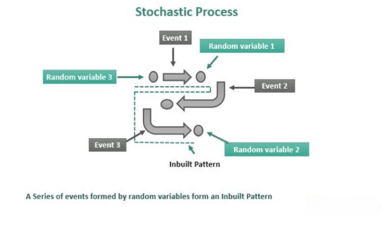

In the complex world of finance, terms such as underwater loans, negative equity, and algorithmic trading frequently appear, each with significant implications for financial health. These concepts are not merely buzzwords; they represent critical aspects of the financial landscape that affect both individual investors and the broader market. Understanding these terms is vital in making informed financial decisions and effectively managing one's economic resources.

An underwater loan or mortgage refers to a situation where the outstanding loan balance exceeds the current market value of the asset it was used to purchase, typically real estate. This scenario is particularly common in volatile real estate markets where property values can fluctuate significantly. Homeowners in this position often face limited options for refinancing or selling their properties without suffering financial losses. The challenges of underwater loans are compounded by various factors, including economic downturns, initially high loan-to-value ratios, and borrower overleveraging.

Negative equity, often synonymous with being underwater, describes a similar condition where an asset's market value falls below the amount owed by the borrower. This condition can cause severe financial strain as homeowners struggle to manage debts that outweigh asset values. Negative equity impacts an individual's financial stability by complicating refinancing opportunities and potentially damaging credit ratings, thus increasing the cost of future borrowing. The broader economic consequences can be significant, as widespread negative equity can dampen consumer spending and contribute to slower economic growth.

Algorithmic trading, or algo trading, introduces another layer of complexity to the financial environment. It involves using sophisticated computer algorithms to execute trades at speeds and frequencies that would be impossible for human traders. In the context of mortgages and real estate, algorithmic trading can influence macroeconomic factors like interest rates and fiscal policies, indirectly affecting property values. While algorithmic trading enhances market efficiency and liquidity, it can also introduce additional volatility, challenging the stability of housing markets.

This article explores these interconnected financial concepts, offering a detailed examination of the underlying causes, challenges, and potential solutions for those facing underwater mortgages. Readers will gain insights into how negative equity develops and how algorithmic trading impacts the financial ecosystems surrounding real estate. By understanding these dynamics, individuals and investors can better navigate the complexities of today's economic landscape, making informed decisions to manage financial risks and opportunities effectively.

## Table of Contents

## Understanding Underwater Loans and Mortgages

An underwater loan or mortgage arises when the outstanding balance on a loan exceeds the current market value of the asset securing the loan. This situation is most frequently encountered in the real estate sector, where property values are subject to fluctuations driven by varying market conditions. When a homeowner's mortgage is underwater, it significantly limits their ability to refinance or sell the property without incurring a financial loss. 

Several factors contribute to properties becoming underwater. Economic downturns play a significant role as they can lead to a decrease in property values. High loan-to-value (LTV) ratios at the time of purchase also increase vulnerability, as they imply that the initial equity in the property was minimal, leaving little buffer against declining property prices. Additionally, overleveraging by borrowers—taking on excessive debt relative to their financial situation—can exacerbate the risk of ending up with negative equity.

The implications of underwater loans are profound. They can leave homeowners trapped in their current financial situations, unable to move or renegotiate terms to align with more favorable conditions. This lack of flexibility can hinder financial planning and stress individual budgets. Therefore, it is crucial for borrowers to understand these dynamics thoroughly, equipping themselves with the knowledge to navigate and mitigate such circumstances effectively.

## The Consequences of Negative Equity

Negative equity, often referred to as being "underwater," arises when a borrower owes more on a loan than the asset's current market value. This situation poses multiple challenges for homeowners and has broader economic implications.

Firstly, negative equity significantly strains an individual's financial standing, as it generally restricts the homeowner's ability to sell or refinance their property. When the outstanding mortgage exceeds the property's worth, selling would result in a loss unless the homeowner can cover the difference out-of-pocket. Consequently, refinancing options, which typically require a certain level of equity in the home, become limited or entirely unavailable.

Moreover, negative equity can impact the homeowner's credit rating adversely. If the homeowner is unable to manage mortgage payments, this can lead to late payments or defaults, both of which damage credit scores. A damaged credit score makes it more challenging and costly to secure future loans, as lenders perceive such borrowers as higher risks.

The ramifications of negative equity extend beyond individual financial stress to the broader economy. Widespread negative equity can dampen consumer confidence and reduce spending, a critical driver of economic growth. Homeowners with negative equity are less likely to move or upgrade, thereby stalling transactions in the housing market and subsequent economic activity associated with real estate.

Addressing negative equity efficiently requires timely and strategic interventions. Solutions might involve loan modifications, where lenders and borrowers negotiate terms to make payments more manageable, or short sales, where the property is sold for less than the mortgage amount with lender approval. Such approaches necessitate careful financial planning and management to mitigate the long-term impact on both the individual's finances and the wider economy. 

Effective strategies to handle negative equity are essential, not only for personal recovery but also for maintaining economic stability and growth.

## The Role of Algo Trading in the Housing Market

Algorithmic trading, commonly referred to as algo trading, employs computational algorithms to automate the execution of trades. This approach significantly influences financial markets by enhancing efficiency and [liquidity](/wiki/liquidity-risk-premium) while simultaneously contributing to market [volatility](/wiki/volatility-trading-strategies).

For the housing market, algo trading's influence extends to various facets, including interest rates and fiscal policies—both critical determinants of property value fluctuations. Algorithms assess vast datasets to predict market trends, leading investment firms and individual investors to make rapid and informed decisions. By promptly responding to shifts in economic indicators such as [interest rate](/wiki/interest-rate-trading-strategies) changes or policy amendments, algo trading can amplify price movements, sometimes heightening market uncertainty.

The effect of algo trading can be twofold: On one hand, it brings transparency and improved market access, reducing transaction costs and narrowing bid-ask spreads. On the other hand, by potentially exacerbating volatility, it may destabilize housing markets. Such instability can pose risks for homeowners and investors, as abrupt market swings might affect property valuations and the ability to secure favorable financing.

Gaining an understanding of algo trading's impact on real estate markets is essential for investors and homeowners striving to make informed financial decisions. As technology advances, algorithms grow increasingly sophisticated, capable of handling more complex analyses and larger datasets. Investors equipped with insights into how these technological innovations influence market conditions can better navigate their investment strategies, optimizing decision-making to align with ongoing market shifts.

Continual technological progression necessitates that market participants stay informed about the dynamics of [algorithmic trading](/wiki/algorithmic-trading) in real estate. Recognizing its potential implications will empower investors and homeowners to adapt proactively, addressing the challenges posed by a rapidly evolving financial landscape.

## Solutions for Underwater Mortgages

Homeowners facing underwater mortgages have several potential solutions to consider, which can help alleviate the financial burden associated with owing more than a property is worth. These strategies may vary depending on personal circumstances and market conditions but generally aim to provide some form of financial relief or restructuring.

One of the primary methods for addressing underwater mortgages is through loan modifications. This process involves negotiating with the lender to alter the terms of the mortgage, potentially lowering the interest rate or extending the loan term to reduce monthly payments. This can make payments more manageable and prevent foreclosure. Successful loan modifications require a clear demonstration of financial hardship and the ability to maintain adjusted payments.

Short sales represent another viable option. In a short sale, homeowners sell their property for less than the outstanding mortgage balance, with the lender's approval, to avoid foreclosure. Although this does not make the homeowner financially whole, it can be less damaging to credit scores than foreclosure and may relieve some of the financial obligations.

Government programs have historically provided support for underwater homeowners. For example, the Home Affordable Refinance Program (HARP) was designed to assist those unable to refinance due to diminished home values. Although HARP is no longer available, it set a precedent for the type of assistance governments can offer to distressed homeowners. Homeowners should look for any local or national programs that might currently provide similar benefits.

Strategically negotiating with lenders can be essential for relief. Discussions might focus on principal reduction, where a portion of the loan's principal is forgiven, or on extending loan terms to lower monthly payments. These negotiations can sometimes lead to a more equitable solution for both the lender and borrower.

Renting out the property might also be a temporary strategy to manage an underwater mortgage. Generating rental income can help cover mortgage payments, though this decision brings additional responsibilities, such as property maintenance and tenant management. It requires an assessment of local rental markets and potential profitability before proceeding.

Financial counseling is a critical resource for homeowners in distress. Professional counselors can offer advice on sustainable financial practices and personalized strategies for recovery, helping homeowners make informed decisions about managing their underwater mortgages. They can also guide homeowners through available governmental or private assistance programs, ensuring they exploit every potential avenue for relief.

These solutions require careful consideration and a proactive approach. Homeowners must assess their financial situations and explore multiple options to find the most suitable resolution for their circumstances. Adopting a strategic and informed approach can help mitigate the challenges posed by underwater mortgages.

## Conclusion

Underwater mortgages and negative equity present considerable challenges for homeowners, yet they also create opportunities for those willing to engage in proactive financial management. Individuals facing these challenges can benefit from carefully considering financial strategies such as loan modifications or principal reduction negotiations to mitigate the associated risks. While these tactics demand a nuanced understanding of market conditions, they provide avenues for reducing financial strain.

Algorithmic trading, often criticized for increasing market volatility, can also be leveraged to uncover insights and opportunities within the financial landscape. Its capacity to process vast datasets swiftly allows for the anticipation of market trends and swift reactions to market shifts, which can be advantageous when navigating real estate investments. Although the volatility introduced by algo trading can be daunting, its strategic utilization can lead to informed decision-making, ultimately aiding in capitalizing on favorable market conditions.

For both homeowners and investors, grasping the interplay between underwater mortgages, negative equity, and algo trading is crucial for adeptly navigating today's complex real estate market. Advancing one's education in these areas not only aids in understanding potential risks but also arms individuals with the knowledge to take calculated risks and make informed decisions. Continuous learning and being attuned to market developments empower individuals to effectively manage their finances and reduce exposure to underwater loan scenarios.

Ultimately, the keys to overcoming the challenges posed by negative equity lie in awareness and preparedness. Staying informed about market trends and technological advancements in trading equips individuals to leverage these developments to their advantage. By proactively managing financial health and embracing the analytical advantages offered by algo trading, investors and homeowners can transform challenges into opportunities, thereby securing a more stable financial future.

## References & Further Reading

[1]: ["Algorithmic and High-Frequency Trading"](https://www.amazon.com/Algorithmic-High-Frequency-Trading-Mathematics-Finance/dp/1107091144) by Álvaro Cartea, Sebastian Jaimungal, and José Penalva

[2]: Di Maggio, M., & Kermani, A. (2016). ["Credit-Induced Boom and Bust."](https://business.columbia.edu/sites/default/files-efs/pubfiles/6473/CreditInduced_DiMaggioKermani_ssrn.pdf) The Quarterly Journal of Economics, 131(1), 579-631.

[3]: ["House of Debt: How They (and You) Caused the Great Recession, and How We Can Prevent It from Happening Again"](https://www.amazon.com/House-Debt-Recession-Prevent-Happening/dp/022608194X) by Atif Mian and Amir Sufi

[4]: Fabozzi, F. J., & Shiller, R. J. (1999). ["Mortgage-Backed Securities: Products, Structuring, and Analytical Techniques."](https://archive.org/details/mortgagebackedse0000fabo) New York: Oxford University Press.

[5]: Lo, A. W., & MacKinlay, A. C. (1999). ["A Non-Random Walk Down Wall Street."](https://www.jstor.org/stable/j.ctt7tccx) Princeton University Press.