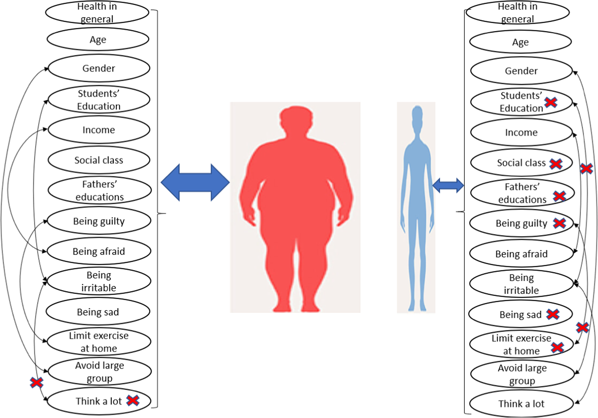

## Table of Contents

## What is considered underweight according to BMI standards?

Underweight is a term used when a person's Body Mass Index (BMI) is below a certain number. BMI is a way to measure if a person has a healthy weight for their height. According to the World Health Organization, a BMI of less than 18.5 is considered underweight. This means that if you calculate your BMI and it comes out to be less than 18.5, you might be underweight.

Being underweight can be a concern because it might mean that a person is not getting enough nutrients. This can affect their health and energy levels. If someone thinks they might be underweight, it's a good idea for them to talk to a doctor or a dietitian. These professionals can help figure out why someone might be underweight and suggest ways to reach a healthier weight.

## What are the common causes of being underweight?

Being underweight can happen for many reasons. One common cause is not eating enough food. This might happen because someone is too busy, doesn't have enough money for food, or just forgets to eat. Another reason could be that a person has a medical condition that makes it hard for their body to absorb nutrients from food. Conditions like celiac disease or Crohn's disease can do this. Also, mental health issues like depression or anxiety can make someone lose their appetite and eat less.

Sometimes, being underweight runs in families. If a person's parents or grandparents were underweight, they might be more likely to be underweight too. This can be because of genetics or because they grew up with similar eating habits. Another reason could be that a person is very active and burns more calories than they take in. Athletes, for example, might find it hard to keep their weight up if they don't eat enough to match their energy use.

Lastly, certain medications can cause weight loss as a side effect. If someone starts losing weight after beginning a new medicine, it might be because of that. Also, some people might intentionally try to lose weight and go too far, leading to being underweight. This can happen with eating disorders like anorexia or bulimia. If someone is underweight, it's important for them to see a doctor to figure out why and get help to reach a healthier weight.

## What are the health risks associated with being underweight?

Being underweight can lead to many health problems. When someone is underweight, their body might not get the nutrients it needs to work well. This can make their immune system weaker, so they get sick more often. They might also feel tired all the time because their body doesn't have enough energy. For women, being underweight can make it harder to have babies because it can affect their periods and fertility.

Over time, being underweight can hurt bones and muscles too. Without enough nutrients, bones can become weak and more likely to break. This is called osteoporosis. Muscles need protein and other nutrients to stay strong, so if someone is underweight, their muscles might not be as strong as they should be. This can make it harder to do everyday activities and can lead to more falls and injuries.

It's also important to know that being underweight can affect mental health. People who are underweight might feel self-conscious about their weight, which can lead to low self-esteem or even depression. If someone is underweight because of an eating disorder, they might need special help to get better. Talking to a doctor can help figure out the best way to reach a healthier weight and improve overall health.

## How is underweight diagnosed by healthcare professionals?

When a doctor thinks someone might be underweight, they start by measuring their height and weight. They use these numbers to calculate the person's Body Mass Index, or BMI. If the BMI is less than 18.5, the doctor might say the person is underweight. But doctors don't just look at BMI. They also ask about the person's eating habits, how much they exercise, and if they have any health problems that could make it hard to gain weight.

Besides BMI, doctors might do other tests to figure out why someone is underweight. They might check for medical conditions like thyroid problems or digestive issues that could be causing weight loss. They might also ask about mental health because things like depression or eating disorders can make someone lose weight. By looking at all these things, doctors can understand why someone is underweight and help them get to a healthier weight.

## What dietary changes can help someone who is underweight gain healthy weight?

To gain healthy weight, someone who is underweight should eat more calories than they burn. They can do this by eating bigger portions at meals and having snacks between meals. Choosing foods that are high in calories but also good for you is a good idea. For example, nuts, avocados, and full-fat dairy products like cheese and yogurt are high in calories and also have important nutrients. Adding healthy oils like olive oil to meals can also help increase calorie intake. It's also important to eat a variety of foods to make sure the body gets all the nutrients it needs.

Drinking calorie-rich smoothies or shakes can be an easy way to get more calories. These can be made with fruits, vegetables, milk, yogurt, or protein powder. Eating regularly throughout the day, instead of just at mealtimes, can help too. Sometimes, working with a dietitian can help someone figure out the best foods and meal plans to gain weight in a healthy way. They can give advice on how to eat more without feeling too full and make sure the person is getting all the nutrients they need.

## Are there specific exercises recommended for underweight individuals to gain muscle mass?

For underweight people who want to gain muscle mass, doing strength training exercises is a good idea. These exercises involve lifting weights or using resistance bands. They help build muscle because they make the muscles work harder. Some good strength training exercises include squats, push-ups, and lifting dumbbells. It's important to start with lighter weights and do more repetitions. This helps the muscles grow without getting too tired. Doing these exercises a few times a week can help someone gain muscle over time.

Eating enough protein is also important when trying to gain muscle. Foods like chicken, fish, eggs, beans, and nuts are good sources of protein. After doing strength training, eating a meal or snack with protein can help the muscles repair and grow. It's also a good idea to drink plenty of water and get enough rest. Sleep helps the body recover from exercise and build muscle. By combining strength training with a diet that has enough calories and protein, someone who is underweight can gain healthy muscle mass.

## What role do genetics play in being underweight?

Genetics can play a big part in whether someone is underweight. Some people might have genes that make it harder for them to gain weight. These genes can affect how fast their body burns calories or how their body uses the food they eat. If a person's parents or grandparents were underweight, they might be more likely to be underweight too. This is because they might have inherited the same genes that make it hard to gain weight.

Genetics can also affect how someone's body looks and feels. For example, some people might have a naturally fast metabolism because of their genes. This means their body uses up energy quickly, so they might need to eat more to keep their weight up. Also, genetics can influence things like appetite and how full someone feels after eating. If someone feels full quickly because of their genes, they might eat less and have a harder time gaining weight. Talking to a doctor can help someone understand if genetics are playing a role in their weight and what they can do about it.

## How can psychological factors contribute to being underweight?

Psychological factors can play a big role in someone being underweight. One common issue is stress. When people are stressed, they might lose their appetite and not feel like eating. This can lead to them not getting enough calories and losing weight. Another psychological [factor](/wiki/factor-investing) is depression. People who are depressed often don't feel like doing much, including eating. They might forget to eat or just not be interested in food, which can make them underweight over time.

Eating disorders are another important psychological factor. Disorders like anorexia nervosa and bulimia can make someone very scared of gaining weight. They might eat very little or try to get rid of the food they eat, which can lead to being underweight. These disorders can be serious and need help from doctors and therapists. Also, body image issues can make someone want to stay thin, even if it's not healthy. They might think they look better when they're underweight, so they keep their weight low on purpose.

Understanding these psychological factors is important. If someone thinks their weight issues might be related to stress, depression, or an eating disorder, it's a good idea to talk to a mental health professional. They can help figure out what's going on and suggest ways to feel better and reach a healthy weight.

## What are the differences in treatment approaches for underweight in adults versus children?

When treating underweight adults, doctors often focus on finding out why the person is underweight and then making a plan to help them gain weight in a healthy way. They might suggest eating more calories by having bigger meals and snacks throughout the day. They could also recommend strength training exercises to help build muscle. If the adult has a medical condition or an eating disorder causing their low weight, doctors might prescribe medicine or suggest therapy. It's important for adults to work closely with their healthcare team to make sure they are getting the right nutrients and support they need.

For children who are underweight, the approach is a bit different because they are still growing. Doctors will look at the child's growth charts to see if they are gaining weight and growing at a healthy rate. If a child is underweight, doctors might suggest giving them more frequent meals and snacks that are high in calories and nutrients. They might also recommend special nutritional drinks or supplements. It's really important to make sure children get enough nutrients for their growing bodies. If a psychological issue like an eating disorder is causing the child to be underweight, doctors might involve a therapist or a dietitian to help the whole family understand and address the problem.

## Can certain medications or medical conditions lead to being underweight, and how are these managed?

Yes, some medications and medical conditions can make someone underweight. Medications like those used for ADHD, some antidepressants, and certain cancer treatments can cause weight loss as a side effect. Medical conditions like hyperthyroidism, where the thyroid gland is too active, can speed up the body's metabolism and lead to weight loss. Digestive issues like celiac disease, Crohn's disease, or even chronic infections can make it hard for the body to absorb nutrients from food, leading to being underweight.

To manage these issues, doctors first need to find out what's causing the weight loss. If it's a medication, they might change the dose or switch to a different drug that doesn't cause weight loss. For medical conditions, treatment depends on the specific condition. For example, hyperthyroidism might be treated with medicine or surgery to control the thyroid. For digestive issues, doctors might suggest special diets or supplements to help the body get the nutrients it needs. It's important for anyone who is underweight because of a medication or medical condition to work closely with their doctor to find the best way to manage their weight and stay healthy.

## What are the latest research findings on the long-term effects of being underweight?

Recent research has shown that being underweight can have serious long-term effects on health. One study found that people who are underweight have a higher risk of developing osteoporosis, a condition where bones become weak and more likely to break. This is because being underweight often means not getting enough nutrients like calcium and vitamin D, which are important for keeping bones strong. Another finding is that underweight people might have a weaker immune system, making them more likely to get sick. This is because their bodies might not have the energy and nutrients needed to fight off infections.

Other studies have looked at the long-term effects on mental health. Being underweight can lead to issues like depression and anxiety. This might be because of the physical toll it takes on the body, or because of societal pressures and body image concerns. Research also suggests that underweight people might have a higher risk of heart problems. This is surprising because we often think of heart disease as a problem for people who are overweight, but it turns out that being underweight can also affect heart health. Overall, these findings show that it's important for underweight people to work with doctors to reach a healthier weight and reduce these long-term risks.

## How effective are different intervention strategies for managing underweight in clinical case studies?

In clinical case studies, different intervention strategies have shown varying levels of effectiveness in managing underweight. One common approach is nutritional counseling, where dietitians help patients plan meals that are high in calories and nutrients. Studies have shown that this can be very effective, especially when combined with regular follow-ups to monitor progress. For example, a study found that patients who received nutritional counseling gained weight more consistently than those who did not. Another strategy is the use of nutritional supplements like high-calorie shakes or protein powders. These can help increase calorie intake and have been shown to be effective in helping underweight people gain weight, particularly when they struggle to eat enough solid food.

Another intervention that has shown promise is strength training. When underweight individuals engage in regular strength training, they can build muscle mass, which helps increase their overall weight in a healthy way. Research has demonstrated that combining strength training with a high-calorie diet can lead to better outcomes than diet alone. In some cases, medications that stimulate appetite or improve nutrient absorption are used. These can be effective but need to be carefully managed by healthcare professionals to avoid side effects. Overall, the most successful interventions often involve a combination of these strategies, tailored to the individual's specific needs and monitored closely by a healthcare team.

## What is the understanding of underweight in nutrition?

Underweight, from a nutritional perspective, is defined as having a body mass index (BMI) below 18.5, indicating a body weight that is lower than what is considered healthy for a given height. BMI is calculated using the formula:

$$
BMI = \frac{\text{weight in kilograms}}{(\text{height in meters})^2}
$$

**Health Risks of Being Underweight**

Being underweight poses several health risks. Physically, it can lead to weakened immune function, increased susceptibility to infections, osteoporosis, and even fertility issues. Underweight individuals may also experience decreased muscle mass, fatigue, and nutrient deficiencies. From a mental health perspective, underweight can be associated with an increased risk of anxiety, depression, and social withdrawal. These risks are often compounded when underweight conditions stem from eating disorders or chronic illnesses.

**Addressing Underweight Through Diet and Lifestyle**

To address underweight issues, strategies centered on balanced diet planning and lifestyle adjustments are crucial. A diet rich in calories, proteins, and essential nutrients is recommended. Incorporating energy-dense foods, such as nuts, avocados, whole grains, and healthy oils, can help in gaining weight. Regular meals with balanced macro and micronutrients, along with snacks, ensure sustained energy intake.

Lifestyle changes, such as engaging in strength-building exercises, can promote muscle gain and improve overall health. Ensuring adequate sleep and stress management techniques are also vital in maintaining a healthy weight.

**Role of Healthcare Professionals**

Healthcare professionals, including dietitians, nutritionists, and doctors, play a critical role in managing and improving nutritional health. They provide individualized plans tailored to the unique needs and health conditions of the underweight individual. This often involves monitoring progress, adjusting dietary plans as necessary, and addressing any underlying health issues contributing to the underweight condition. Through professional guidance, individuals can work towards achieving and maintaining a healthy weight safely and effectively.

External references for further reading include resources from the World Health Organization and studies on nutrition and metabolic functions related to body weight.

## How can underweight strategies be applied in algorithmic trading?

Understanding underweight portfolios in the context of [algorithmic trading](/wiki/algorithmic-trading) involves recognizing the strategic allocation of resources when the proportion of a specific asset class in a portfolio is intentionally reduced, relative to a benchmark index. Underweighting is employed to potentially mitigate risk or reposition a portfolio based on predictive analytics and market forecasts. Algorithmic trading can effectively manage and execute these strategies by leveraging sophisticated computer programs designed to follow a set of predetermined instructions or algorithms.

### Significance of Adjusting Asset Weights

In algorithmic trading, adjusting asset weights according to market analysis and performance metrics is crucial. By systematically analyzing quantitative data, traders can identify opportunities to enhance performance or protect against downside risks. This adjustment is often guided by various factors including expected returns, [volatility](/wiki/volatility-trading-strategies), correlations among assets, and macroeconomic indicators. Algorithms adjust portfolio weightings by considering these quantitative measures alongside real-time data streams.

One common method of adjusting asset weights is through mean-variance optimization, where the goal is to maximize returns for a given level of risk. The formula governing this approach is:

$$
\min \, \frac{1}{2} w^T \Sigma w - \lambda w^T \mu
$$

where:
- $w$ is the vector of asset weights.
- $\Sigma$ is the covariance matrix of asset returns.
- $\lambda$ is the risk aversion coefficient.
- $\mu$ is the expected return vector.

### Examples and Case Studies

Successful implementation of underweight strategies through trading algorithms can be illustrated by several case studies. One such example is the adaptive asset allocation strategy employed by pension funds and hedge funds to weather economic downturns. By programming algorithms to continuously assess economic indicators like interest rates and inflation, these funds adjust the weights of equities, bonds, and alternative assets, keeping certain asset classes underweighted to minimize exposure while maximizing stability.

For instance, during periods of economic uncertainty, algorithms might underweight equities in favor of fixed income securities. A Python-based pseudo-code snippet for executing such a strategy might look like this:

```python
import numpy as np

def mean_variance_optimization(returns, risk_aversion):
    cov_matrix = np.cov(returns)
    expected_returns = np.mean(returns, axis=0)

    def portfolio_variance(weights):
        return 0.5 * weights.T @ cov_matrix @ weights

    def portfolio_return(weights):
        return weights.T @ expected_returns

    num_assets = len(expected_returns)
    weights = np.random.random(num_assets)
    weights /= np.sum(weights)

    # Risk aversion input
    def objective(weights):
        return portfolio_variance(weights) - risk_aversion * portfolio_return(weights)

    # Constraints and bounds might be added here if needed for portfolio weights
    # This is a simplification for demonstration purposes
    return optimize.minimize(objective, weights)

# Example usage
returns_data = np.random.randn(100, 5)  # Placeholder for asset returns
risk_level = 0.5
optimized_portfolio = mean_variance_optimization(returns_data, risk_level)
```

In summary, underweight strategies in algorithmic trading involve adjusting asset allocations to align with market conditions, thereby potentially reducing risk or positioning for growth. As financial markets become increasingly complex, the agility and precision offered by algorithmic trading will continue to play a vital role in the strategic management of investment portfolios.

## References & Further Reading

[1]: Bloom, D. E., Canning, D., & Fink, G. (2011). ["Implications of Population Aging for Economic Growth."](https://www.jstor.org/stable/43664646) National Bureau of Economic Research.

[2]: World Health Organization. (2021). ["Nutrition in Transition: Nutrition for the healthy life course."](https://www.who.int/publications/m/item/the-state-of-food-security-and-nutrition-in-the-world-2021)

[3]: Lopez de Prado, M. (2018). ["Advances in Financial Machine Learning."](https://www.amazon.com/Advances-Financial-Machine-Learning-Marcos/dp/1119482089) Wiley.

[4]: Aronson, D. R. (2006). ["Evidence-Based Technical Analysis: Applying the Scientific Method and Statistical Inference to Trading Signals."](https://www.amazon.com/Evidence-Based-Technical-Analysis-Scientific-Statistical/dp/0470008741) Wiley.

[5]: Chan, E. P. (2009). ["Quantitative Trading: How to Build Your Own Algorithmic Trading Business."](https://github.com/ftvision/quant_trading_echan_book) Wiley.

[6]: Jansen, S. (2020). ["Machine Learning for Algorithmic Trading: Predictive Models to Extract Signals from Market and Alternative Data for Systematic Trading Strategies with Python."](https://github.com/stefan-jansen/machine-learning-for-trading) Packt Publishing.