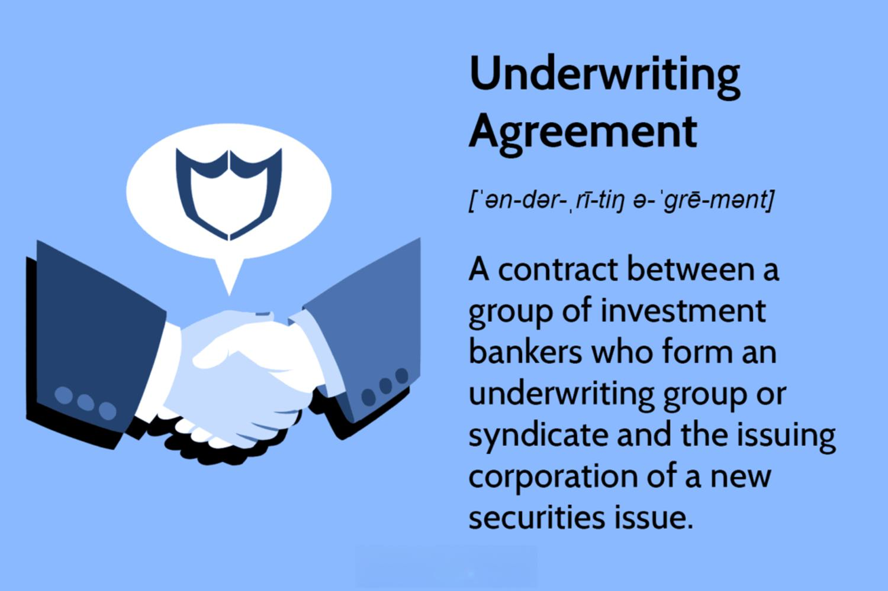

The finance industry is a complex ecosystem characterized by the intricate interplay of various elements such as underwriting, financial contracts, and algorithmic trading. These components are fundamental for traders, investors, and financial institutions to effectively engage with and benefit from the financial markets. 

Underwriting agreements are critical as they form the foundation of securities issuance, facilitating the capitalization efforts of corporations. By entering into these agreements, issuers collaborate with underwriters to distribute securities efficiently in the market, managing risks and ensuring compliance with regulatory frameworks. Different underwriting agreement types, such as firm commitment, best efforts, and standby agreements, cater to varying market needs and issuer preferences.



Financial contracts, particularly in the domain of algorithmic trading, are essential tools for managing risk and crafting strategic solutions. These contracts include but are not limited to spot contracts, options, futures, and swaps. Each type offers distinct advantages and applications, enabling market participants to tailor their trading strategies to dynamic market conditions and achieve specific risk management objectives.

Algorithmic trading, which relies heavily on predefined instructions to execute trades at optimal conditions, benefits significantly from these financial contracts. They provide the structural basis for trading operations, influencing the development of strategies that can harness market efficiencies, exploit arbitrage opportunities, and ensure legal and regulatory compliance.

As the financial markets evolve, understanding the roles of underwriting agreements and financial contracts becomes increasingly crucial for achieving competitiveness. Moreover, maintaining compliance with legal standards is vital for safeguarding trading operations and leveraging market opportunities effectively. This article aims to provide insights into these essential facets of finance, aiding stakeholders in navigating the landscape with greater precision and awareness.

## Table of Contents

## Understanding Underwriting Agreements

An underwriting agreement is a critical contract between an issuer of securities and underwriters that facilitates the sale of these securities to the public. This agreement outlines the responsibilities, obligations, and expectations of each party involved in the issuance process. It serves to specify the framework within which securities transactions occur, ensuring both parties are aligned on key terms.

One of the primary components of an underwriting agreement is the involvement of syndicates. Syndicates are groups of underwriters that collectively take on the responsibility of selling the securities. The participation of multiple underwriters helps in distributing the risk associated with the securities issuance. By spreading this risk across a syndicate, the financial burden doesn't fall on a single entity, mitigating potential losses. This collaborative approach also enhances the market reach and absorption capacity of the securities being issued.

The underwriting agreement carefully details several critical elements including pricing, resale, and settlement. The pricing component includes establishing the offer price at which securities are sold to the public, a process that takes into account market conditions, the issuer's financial health, and investor demand. The resale aspect of the agreement typically outlines any restrictions on how underwriters can sell the securities, ensuring orderly distribution and compliance with regulatory standards. Settlement refers to the finalization of the transaction, wherein payment is made in exchange for the securities, following agreed-upon protocols and timelines. These fundamental components ensure a structured and compliant sale process, protecting the interests of both issuers and investors.

There are several types of underwriting agreements, each suited to different scenarios and levels of risk tolerance. The most common type is the "firm commitment" agreement, where the underwriter agrees to purchase all the securities from the issuer and resell them to the public. This type guarantees that the issuer receives the full amount of capital they intended to raise, transferring the risk of unsold securities entirely to the underwriter.

Another type is the "best efforts" agreement, where the underwriter does not purchase the securities outright but rather agrees to sell as much of the issue as possible. In this model, the underwriter is not obliged to buy the remaining unsold shares, which means the issuer may not realize the desired amount of capital if all the securities are not sold.

A third type, the "standby" agreement, is often used in rights offerings. Here, the underwriter agrees to purchase any remaining shares not subscribed to by existing shareholders. This agreement serves as a backup, ensuring that the issuer raises a predetermined level of capital even if the current shareholders do not fully subscribe.

These diverse types of underwriting agreements allow issuers to tailor the conditions of their securities offerings based on their financial strategy and market conditions. Understanding these agreements is essential for effective participation in the securities market, providing clarity and security to issuers, underwriters, and investors alike.

## Types of Financial Contracts in Algorithmic Trading

Financial contracts are pivotal in [algorithmic trading](/wiki/algorithmic-trading), instrumental in risk management and strategic financial innovation. These contracts form the foundation upon which trading strategies are built, helping traders to mitigate risks and leverage market opportunities efficiently. In algorithmic trading, three main types of financial contracts are often utilized: spot contracts, derivatives like options and futures, and swaps.

Spot contracts are agreements for the purchase or sale of financial instruments, commodities, or assets for immediate delivery and payment on the spot date, typically two business days from the trade date. These contracts are straightforward, with pricing determined by the current market value. In algorithmic trading, spot contracts are used for explicit positions requiring immediate execution, enhancing [liquidity](/wiki/liquidity-risk-premium) and price discovery.

Derivatives, including options and futures, provide more sophisticated strategic capabilities in algo trading. Options give traders the right, but not the obligation, to buy or sell an asset at a predetermined price within a certain period. Futures require the parties to transact the asset at a predetermined future date and price. These contracts are indispensable for hedging strategies, allowing traders to protect against market [volatility](/wiki/volatility-trading-strategies) and price fluctuations. For example, when implementing a hedging algorithm, traders might use options and futures to lock in prices, securing a buffer against adverse market movements.

Swaps are another critical type of financial contract in algorithmic trading, involving the exchange of cash flows or financial instruments between parties. Common examples include [interest rate](/wiki/interest-rate-trading-strategies) swaps and currency swaps, used to manage financial risks tied to interest rates or currency fluctuations. For instance, an algorithm might be programmed to periodically engage in interest rate swaps to stabilize income flows amidst changing interest rates or to hedge against currency exposure using currency swaps.

Understanding the specifications of these contracts is essential for tailoring trading strategies to current market conditions and risk management objectives. By leveraging the inherent characteristics of these financial contracts, algorithmic traders can design strategies that are not only reactive to market changes but also predictive. This understanding aids in crafting algorithms that dynamically adjust their strategies, such as coding a trading algorithm in Python that automatically executes buy/sell orders based on predefined derivative pricing models:

```python
import numpy as np

# Hypothetical option pricing algorithm
def european_call_option_price(S, K, T, r, sigma):
    """
    Calculate the European call option price using Black-Scholes model
    S: Spot price
    K: Strike price
    T: Time to maturity
    r: Risk-free interest rate
    sigma: Volatility of the underlying asset
    """
    from scipy.stats import norm

    d1 = (np.log(S / K) + (r + 0.5 * sigma ** 2) * T) / (sigma * np.sqrt(T))
    d2 = d1 - sigma * np.sqrt(T)

    call_price = S * norm.cdf(d1) - K * np.exp(-r * T) * norm.cdf(d2)
    return call_price

# Example usage
spot_price = 100  # Current market price
strike_price = 110  # Strike price of the option
time_to_maturity = 1  # Time in years until the option expires
risk_free_rate = 0.05  # Assumed risk-free interest rate
volatility = 0.2  # Assumed volatility

option_price = european_call_option_price(spot_price, strike_price, time_to_maturity, risk_free_rate, volatility)
print(f"The European call option price is: {option_price:.2f}")
```

This code snippet demonstrates how the understanding of options, a type of derivative contract, can be integrated into algorithmic trading strategies to calculate potential opportunities based on prevailing market conditions.

## Impact of Contracts on Algo Trading Strategies

Contracts play a significant role in shaping algorithmic trading strategies by establishing the boundaries and actions permissible in trading operations. They serve as the legal and operational framework that guides the development and implementation of strategies, particularly in sophisticated trading environments. 

Algorithmic trading, known for its high-speed transactions and reliance on mathematical models, often utilizes various advanced strategies such as hedging, [arbitrage](/wiki/arbitrage), and leverage. These strategies are made feasible and effective through well-structured contracts. 

**Hedging** strategies are used to mitigate risk by taking offsetting positions in related securities. For instance, a trader might use derivative contracts like options or futures to hedge against potential losses in the underlying asset. These contracts specify the terms under which these transactions occur, ensuring that the trader adheres to defined risk parameters and legal conditions.

**Arbitrage** involves exploiting price differences of the same asset across different markets. Contracts in this context provide the necessary legal assurance and financial backing to execute such transactions swiftly across multiple platforms. The details in these contracts, regarding price settlement and execution time, are crucial to the successful application of arbitrage strategies.

**Leverage** allows traders to increase their market exposure beyond their initial investment, using borrowed funds. Contracts associated with leveraging define the extent of borrowing, interest rates, and margin requirements, which are critical for maintaining market positions without incurring excessive risk. Properly structured contracts protect both the trader and the lending institution by defining these risk boundaries clearly.

Furthermore, contracts enhance strategic efficacy by ensuring compliance with relevant regulations and legal standards. In a highly regulated domain like algorithmic trading, adherence to secure transaction records and regulatory compliance is vital to avoid legal repercussions. Contracts function as a safeguard, reducing legal risks and supporting robust risk management frameworks.

In summary, contracts in algorithmic trading provide the essential structure within which strategies operate, facilitating risk management and strategic optimization. They allow traders to adapt quickly to market changes, leveraging opportunities while ensuring compliance with stringent regulatory requirements.

## Legal Considerations and Regulatory Compliance

Legal frameworks governing algorithmic trading are multifaceted, requiring comprehensive compliance measures to prevent financial and legal liabilities. The regulatory environment aims to ensure fair and transparent trading practices, mitigate market manipulation risks, and maintain the integrity of the financial markets.

### Key Regulatory Concerns

#### Adherence to Securities Laws
Securities laws are fundamental to governing algorithmic trading activities. These laws set the foundation for the issuance, trading, and settlement of financial instruments. Compliance with securities laws requires understanding specific provisions relating to insider trading, disclosure requirements, and reporting obligations. Failure to adhere can result in severe penalties, including fines and trading bans.

#### Anti-Manipulation Rules
Algorithmic trading systems must operate within anti-manipulation rules designed to prevent practices like spoofing, layering, and other forms of market manipulation. These activities distort the normal supply and demand dynamics and undermine market confidence. Regulatory bodies, such as the U.S. Securities and Exchange Commission (SEC) and the Commodity Futures Trading Commission (CFTC), have stringent guidelines to identify and penalize manipulative practices.

#### Transaction Record Maintenance
Maintaining accurate and detailed transaction records is critical for algorithmic trading compliance. Regulators require exhaustive records to monitor trading activities and ensure adherence to laws and regulations. These records should include time-stamped data of orders, trade execution details, and any modifications to trading algorithms. Such documentation facilitates audits and investigations by regulatory authorities.

### Strategies for Legal Compliance

To effectively navigate the legal landscape of algorithmic trading, firms should implement robust legal and compliance strategies:

1. **Legal Strategy Development**: Developing a comprehensive legal strategy is vital. This includes drafting clear policy frameworks for legal compliance, regularly updating them to align with evolving regulations, and ensuring that all trading algorithms undergo rigorous testing to comply with existing laws.

2. **Collaboration with Regulatory Experts**: Engaging with legal professionals specializing in securities and financial regulations is beneficial. These experts can provide guidance on regulatory updates, conduct compliance audits, and help address any legal challenges that may arise.

3. **Automated Compliance Systems**: Leveraging technology to automate compliance checks can enhance the efficiency and accuracy of adhering to regulations. Automated systems can monitor trading activities for compliance with securities laws and anti-manipulation rules, generating real-time alerts for potential breaches.

4. **Training and Awareness Programs**: Implementing regular training programs for staff involved in trading operations is essential. This education ensures that all personnel are aware of current legal requirements and understand the implications of regulatory non-compliance.

In summary, algorithmic trading firms must diligently adhere to legal frameworks to safeguard their operations and maintain a competitive edge. A proactive approach involving legal strategy development, collaboration with experts, and leveraging technology can effectively mitigate legal risks and ensure long-term compliance.

## Conclusion

Contracts are fundamental components in the landscape of financial operations, playing a critical role in ensuring the legality, operational efficiency, and strategic alignment of algorithmic trading activities. These agreements serve as the infrastructural pillars that support the complex mechanisms of trading, providing clear guidelines and frameworks that facilitate seamless execution and compliance.

An in-depth understanding of underwriting agreements and various financial contracts is vital for participants seeking to effectively navigate and excel in the competitive market environment. Underwriting agreements, with their defined roles in risk distribution and transaction execution, alongside other financial contracts like derivatives and swaps, equip traders and institutions with the tools needed to manage risks and optimize strategies.

Moreover, the dynamic nature of financial markets requires continuous adjustment to the evolving regulatory landscape. Staying abreast of changes in legal standards and compliance requirements not only safeguards trading operations from legal and financial repercussions but also enhances the ability to leverage new opportunities in the market. By integrating robust legal strategies and maintaining diligent cooperation with regulatory experts, trading entities can ensure alignment with current laws, thus promoting sustainable and profitable trading practices.

In conclusion, the strategic integration and adaptation of contracts in algorithmic trading are indispensable for maintaining operational integrity, achieving strategic objectives, and sustaining competitive advantage in the fast-paced financial markets.

## References & Further Reading

1. **The Law of Electronic Commerce: Overcoming Barriers to the Electronic Market** by Alan Davidson  
   This book explores the legal landscape governing electronic commerce, providing valuable insights into the complexities and challenges of ensuring regulatory compliance in digital transactions. It is a critical resource for understanding the legal considerations essential for algorithmic trading and electronic financial operations.

2. **Algorithmic Trading and DMA: An introduction to direct access trading strategies** by Barry Johnson  
   Barry Johnson offers a comprehensive guide to algorithmic trading and Direct Market Access (DMA). This book is invaluable for gaining insights into the practical application of algorithmic trading strategies, including the types of algorithms employed, market impact considerations, and ways to optimize trading efficiency.

3. **A Random Walk Down Wall Street: The Time-tested Strategy for Successful Investing** by B.G. Malkiel  
   B.G. Malkiel's classic offers an examination of investment strategies with a focus on the efficient market hypothesis. Although not exclusively about algorithmic trading, the book provides foundational knowledge on market behavior, which can be beneficial when developing robust algo trading strategies.

4. **High-Frequency Trading: A Practical Guide to Algorithmic Strategies and Trading Systems** by Irene Aldridge  
   This guide investigates into the intricacies of high-frequency trading ([HFT](/wiki/high-frequency-trading-strategies)), presenting actionable insights on the development and deployment of algorithmic trading systems. It covers the technical and operational aspects of HFT, making it an essential read for traders interested in high-speed markets and complex trading infrastructures.

