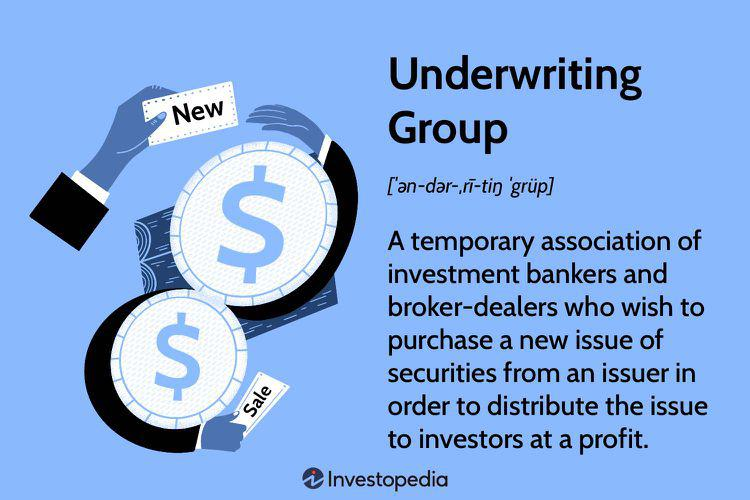

In the evolving landscape of finance and insurance, the convergence of insurance underwriting and algorithmic trading is creating new opportunities. This dynamic intersection is reshaping the manner in which these industries operate, offering enhanced efficiency, accuracy, and customer satisfaction. As traditional underwriting processes encounter limitations in speed and data processing capabilities, the introduction of algorithmic trading principles offers an innovative path forward.

Insurance underwriting involves evaluating risks and setting premiums to ensure both coverage adequacy and profitability for insurers. Traditionally reliant on manual analysis, this process is undergoing a transformation with the adoption of sophisticated algorithms, which can automate assessments and provide more precise risk evaluations. Consequently, insurers can tailor their offerings, thus meeting customer expectations more accurately and efficiently.

Algorithmic trading, originally utilized within financial markets, employs advanced computer algorithms to automate trading decisions, executing transactions at speeds and volumes impractical for human traders. Its entry into the insurance sector signals a shift towards the integration of artificial intelligence and data analytics in underwriting. This integration could enhance insurers' decision-making processes, enabling more personalized insurance products and streamlined operations.

Finance groups play a pivotal role within this evolving framework by pooling expertise and resources to manage the underwriting process. They mitigate the risks associated with issuing insurance securities, ensuring distribution success, and providing liquidity through upfront payments. This collaboration with technology-driven strategies not only optimizes indemnity processes but also fortifies the entire financial infrastructure supporting the insurance industry.

Understanding these concepts allows businesses to leverage technology and data, optimizing their operations both financially and technologically. By embracing this convergence, companies position themselves to capitalize on transformative shifts within the industry, cultivating a competitive edge in a progressively digital marketplace. Through the strategic integration of insurance underwriting and algorithmic trading, future-oriented institutions can unlock unprecedented opportunities in the finance and insurance sectors.

## Table of Contents

## Understanding Insurance Underwriting

Insurance underwriting involves evaluating risk and determining the conditions under which insurance will be provided. This process is central to the insurance industry, enabling companies to manage potential exposure by assessing the risk associated with insuring individuals, properties, or businesses. Traditionally, underwriting has relied on a combination of empirical analysis, statistical data, and professional judgment to evaluate an entity’s risk level and decide on the premium and coverage terms.

The complexity of underwriting lies in the multi-faceted approach to risk assessment that it demands. Underwriters must analyze a wide range of variables, including historical data and current trends, to forecast the likelihood and cost of potential claims. This involves examining various factors such as demographics, past claim history, lifestyle factors, and credit scores, which all contribute to the overall risk profile.

Underwriting groups, often composed of professionals such as investment bankers, are instrumental in the broader financial ecosystem of insurance. These groups are tasked with not only evaluating risk but also engaging in the financing and distribution of securities. Investment bankers contribute their expertise in pricing and market strategies to manage the distribution process effectively. By evaluating market conditions and utilizing sophisticated financial models, they ensure that securities are optimally priced and that risk is adequately managed.

This collaboration aids in securing the necessary financial resources upfront, mitigating the issuing company's risk, and ensuring [liquidity](/wiki/liquidity-risk-premium). It is through this structured approach that underwriting groups support both the insurance company’s operational stability and its ability to offer competitive, yet sustainable, insurance products to clients.

## Role of Finance Groups in Underwriting

Finance groups play a critical role in the underwriting process by harnessing a combination of resources and expertise to ensure efficiency and success. These groups are adept at assessing and sharing risks, which is pivotal for the effective distribution of insurance securities. The assessment involves a meticulous analysis of the potential risks associated with each insurance product and an evaluation of the market conditions to optimize the execution of the underwriting.

One of the foundational aspects of finance groups in underwriting is their capacity to provide upfront payments. This financial support is crucial for issuing companies as it reduces their risk and ensures liquidity. By offering these payments, finance groups absorb part of the initial financial burden, allowing the issuing companies to focus on other strategic objectives without the looming threat of immediate financial constraints.

The risk assessment and sharing mechanism employed by finance groups typically involves a diversified portfolio approach. By spreading the risk across different securities and insurance products, they can mitigate potential losses and enhance the confidence of investors and stakeholders. This method not only stabilizes the underwriting process but also facilitates the efficient allocation of capital within the financial system.

Moreover, these groups employ advanced data analytics and financial modeling to evaluate the potential performance of each security. This analytical approach helps in making informed decisions about which securities to underwrite and the terms of underwriting, taking into account both current market conditions and future projections.

In summary, finance groups are instrumental in underwriting by providing essential financial support and employing robust risk management strategies. Their contributions ensure that issuing companies have the necessary liquidity to navigate the underwriting process successfully, thereby maintaining stability and fostering growth in the insurance sector.

## Algo Trading in the Insurance Sector

Algorithmic trading, often referred to as algo trading, applies sophisticated computer algorithms to automate trading decisions. This automation allows for executing trades at speeds and volumes impossible for human traders. In recent years, the insurance sector has begun recognizing the potential of algo trading to enhance the underwriting process. 

In insurance, algo trading optimizes underwriting by accelerating decision-making and increasing accuracy. Algorithms can process vast datasets rapidly, evaluating historical claims, market conditions, and potential risks. This capability means that underwriting decisions can be made in real-time with greater precision, reducing the margin of error and improving overall efficiency. 

The integration of [artificial intelligence](/wiki/ai-artificial-intelligence) (AI) and data analytics within these trading algorithms is pivotal. AI models can analyze complex patterns and correlations within the datasets that traditional methods might overlook. For example, [machine learning](/wiki/machine-learning) models can identify risk factors that may not be evident through conventional analysis, thereby enabling more informed underwriting decisions.

By leveraging data analytics, insurance companies can develop more personalized insurance solutions. Such solutions take into account the unique profile and behavior of each policyholder. For instance, personalized car insurance models could adjust premiums based on the driving habits of customers, as monitored through telematics devices. This level of personalization not only leads to tailored product offerings but also enhances customer satisfaction by minimizing the one-size-fits-all approach prevalent in traditional insurance models.

Overall, the synergy between [algorithmic trading](/wiki/algorithmic-trading) and insurance underwriting signifies a shift towards more technologically advanced, data-driven solutions in the industry. As algorithms continue to evolve, they are likely to offer even greater efficiencies and insights, paving the way for a new era of innovation in insurance.

## Advantages of Algorithmic Underwriting

Algorithmic underwriting offers several advantages that enhance the efficiency and effectiveness of the insurance industry. The integration of advanced algorithms allows for streamlined processes and improved accuracy in risk assessment. By automating the traditionally manual and time-consuming underwriting processes, insurers can significantly reduce the time required to evaluate applications, thereby increasing process efficiency. This automation also minimizes human errors, leading to more precise and reliable risk evaluations.

One key benefit of algorithmic underwriting is the improvement in pricing decisions. The use of complex data analytics allows for a more granular analysis of risk factors, enabling insurers to set prices that better reflect the actual risk associated with an individual or entity. This approach results in more competitive pricing structures and helps insurers maintain profitability while offering fair premiums to policyholders.

Moreover, algorithmic underwriting facilitates proactive risk management. By continuously analyzing data from various sources, algorithms can detect emerging risks and trends, allowing insurers to adjust their strategies dynamically. This capability ensures that insurers remain adept at managing their portfolios and can respond swiftly to changes in market conditions or customer behavior.

Another advantage of algorithmic underwriting is the potential for greater customer satisfaction. Algorithms can analyze large datasets to identify patterns and preferences, enabling insurers to offer personalized insurance solutions tailored to individual needs. This personalization can lead to customized policy offerings and incentives, enhancing the overall customer experience. Additionally, the speed of algorithm-driven decision-making means customers receive faster responses on their insurance applications, further increasing satisfaction.

In summary, algorithmic underwriting brings efficiency, accuracy, and personalization to the insurance sector, driving improved outcomes for both insurers and policyholders. As technology continues to evolve, these advantages are likely to become even more pronounced, offering a significant competitive edge to adopters.

## Challenges and Considerations

Ensuring data quality and managing algorithmic biases in the integration of algorithmic trading and insurance underwriting are critical aspects of successful implementation. Data quality underpins the accuracy and reliability of algorithmic models, impacting decision-making processes. Poor quality data can lead to incorrect assessments and decisions that affect underwriting efficacy. To address this, insurers must implement robust data governance frameworks that emphasize the importance of data integrity, validation, and continuous monitoring.

Algorithmic biases present another significant challenge. These biases can be introduced through historical data that is inherently biased, or through algorithms that inadvertently favor certain groups over others. It is essential for insurers to regularly audit and refine algorithms to identify and mitigate these biases. This involves the use of fairness-aware machine learning techniques that aim to reduce biased outcomes by promoting equitable treatment of all underwriting classes.

Compliance with evolving regulations is also indispensable. Regulatory frameworks are becoming increasingly stringent concerning the use of AI and algorithms in financial services. Insurers must remain vigilant and ensure compliance with applicable laws to maintain operational legitimacy and trust. This includes adhering to regulations such as General Data Protection Regulation (GDPR) in Europe or similar privacy laws in other jurisdictions, which emphasize data protection and consumer privacy.

Maintaining data privacy and security is crucial as well. As insurers deploy advanced algorithms, the [volume](/wiki/volume-trading-strategy) and sensitivity of the data they handle increase significantly. Implementing robust cybersecurity measures and adopting encryption methodologies are crucial steps in safeguarding this data. Techniques like differential privacy can be employed to ensure that individual data points are not identifiable while still allowing the extraction of useful insights.

Fairness and transparency are vital in preventing algorithms from perpetuating existing prejudices or creating new disparities. Insurers must strive to make algorithmic processes understandable and open to scrutiny. This can involve clear documentation of model development processes and the rationale behind automated decisions, thereby building trust among stakeholders and consumers alike.

In conclusion, addressing these challenges through a combination of technical, regulatory, and ethical strategies will be pivotal in optimizing the integration of algorithmic trading with insurance underwriting while fostering trust and transparency.

## Case Studies and Real-World Applications

Several companies across the insurance industry are successfully integrating algorithmic underwriting to enhance their operations. These integrations have facilitated more efficient risk assessment, improved customer experiences, and fostered innovation.

One prominent example is Lemonade, an insurance company that leverages artificial intelligence and machine learning to streamline its underwriting processes. By using algorithms to evaluate and price policies, Lemonade significantly reduces the time required to provide quotes and process claims. This approach not only increases efficiency but also allows the company to offer competitive premium rates tailored to individual customer profiles. Lemonade's model also facilitates a more proactive risk management approach, as it can quickly identify and respond to emerging patterns in data.

In the context of Managing General Agents (MGAs) and insurers, the collaboration between companies like Metromile and Tokio Marine Group illustrates how partnerships can drive technological innovation. Metromile, a pioneer in pay-per-mile car insurance, utilizes data analytics and algorithmic underwriting to offer personalized insurance products based on individual driving behaviors. Their partnership with Tokio Marine Group enhances risk assessment and pricing strategies by incorporating extensive data insights, thus offering a more personalized insurance experience to customers. Such collaborations underscore the potential for MGAs and insurers to enhance their service offerings through shared technological resources and expertise.

Advanced technologies hold a transformative potential for the insurance industry. The adoption of artificial intelligence in underwriting allows insurers to evaluate enormous datasets with precision, identifying patterns that would be impractical for human underwriters to detect. This capability can lead to the development of more sophisticated predictive models, improving the accuracy and fairness of underwriting decisions. As algorithms learn from vast amounts of historical claims data, insurers can tailor their products more closely to customer needs, increasing satisfaction and loyalty.

Moreover, the use of blockchain technology offers a promising avenue for enhancing transparency and security in insurance transactions. Smart contracts can automate claims processing, reducing administrative overhead and increasing the speed of payouts. This innovation can improve trust between insurers and policyholders, as it ensures transactions are recorded on an immutable ledger, thereby mitigating disputes and fraud.

In summary, these real-world applications demonstrate how integrating advanced algorithmic underwriting not only improves operational efficiencies but also fosters innovation and customer-centric solutions in the insurance industry. As technologies continue to evolve, insurers who adopt these advancements stand to gain a significant competitive advantage.

## Conclusion

The convergence of insurance underwriting and algorithmic trading is reshaping the financial and insurance sectors. This synergy is not merely a theoretical advancement; it signifies a profound transformation that offers numerous practical benefits. By integrating technology into traditional processes, finance groups and insurers are able to develop solutions that are both efficient and aligned with customer needs. This technological adoption not only optimizes operational workflows but also enhances decision-making by leveraging vast data analytics and artificial intelligence capabilities.

The potential for algorithmic underwriting to revolutionize risk assessment and pricing strategies is immense. By utilizing sophisticated algorithms, insurers can process large volumes of data with unparalleled precision and in real-time. This leads to more accurate risk evaluations and enables insurers to offer personalized products that meet the diverse needs of their clients. Furthermore, the automation of trading decisions through algorithms streamlines the underwriting process, thereby reducing time to market and increasing competitive agility.

As we look to the future, it is expected that this integration will deepen, offering early adopters a significant market advantage. The financial and insurance industries are on the cusp of a digital transformation that promises to redefine customer engagement and operational efficiency. Insurers and finance groups that embrace these technologies are likely to lead the charge, setting new benchmarks in innovation and service delivery. The emphasis on personalizing offers and ensuring real-time responsiveness to market changes will not only augment customer satisfaction but also build trust and loyalty.

In summary, the alignment of insurance underwriting with algorithmic trading mechanisms marks a significant shift, reshaping traditional paradigms and paving the way for more agile, data-driven strategies. As these concepts become more intertwined, they will undoubtedly provide a strategic edge to companies that harness their full potential.

## References & Further Reading

[1]: Bergstra, J., Bardenet, R., Bengio, Y., & Kégl, B. (2011). ["Algorithms for Hyper-Parameter Optimization."](https://dl.acm.org/doi/10.5555/2986459.2986743) Advances in Neural Information Processing Systems 24.

[2]: ["Advances in Financial Machine Learning"](https://www.amazon.com/Advances-Financial-Machine-Learning-Marcos/dp/1119482089) by Marcos Lopez de Prado

[3]: ["Enterprise Risk Management: Today's Leading Research and Best Practices for Tomorrow's Executives"](https://www.amazon.com/Enterprise-Risk-Management-Practices-Executives/dp/1119741483) by John R. S. Fraser, Betty Simkins

[4]: ["Finance and Risk Management for International Logistics and the Supply Chain"](https://www.sciencedirect.com/book/9780128138304/finance-and-risk-management-for-international-logistics-and-the-supply-chain) by Stephen Gong and Kevin Cullinane

[5]: ["Algorithmic Trading: Winning Strategies and Their Rationale"](https://www.amazon.com/Algorithmic-Trading-Winning-Strategies-Rationale-ebook/dp/B00CY5HC0U) by Ernest P. Chan

[6]: ["Innovations in Insurance, Risk- and Asset Management"](https://worldscientific.com/worldscibooks/10.1142/11051) edited by Alexander D. B�mlich