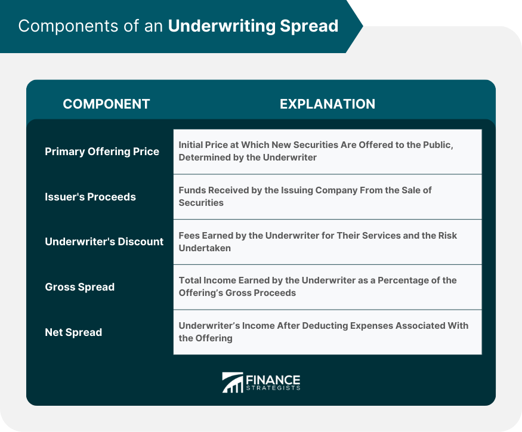

## Table of Contents

## What is underwriting spread?

Underwriting spread is the difference between the price an investment bank pays to buy securities from an issuer and the price at which the bank sells those securities to investors. It's like the bank's profit for handling the sale of the securities. When a company wants to issue new stocks or bonds, they often work with an investment bank. The bank buys the securities from the company at one price and then sells them to the public at a higher price. The difference between these two prices is the underwriting spread.

This spread is important because it covers the costs and risks that the investment bank takes on. These costs include things like marketing the securities, doing research, and managing the sale process. The underwriting spread also compensates the bank for the risk that they might not be able to sell all the securities they bought from the issuer. If the market conditions change suddenly, the bank could be stuck with securities they can't sell, so the spread helps protect them against this risk.

## Why is underwriting spread important in financial markets?

Underwriting spread is important in financial markets because it helps investment banks make money. When a company wants to sell new stocks or bonds, they work with an investment bank. The bank buys these securities from the company at a lower price and then sells them to investors at a higher price. The difference between these two prices is the underwriting spread. This spread is the bank's profit for handling the sale, which is important because it covers the costs of marketing, research, and managing the sale process.

The underwriting spread also helps manage risk. When an investment bank agrees to buy securities from a company, there's a chance they might not be able to sell all of them to investors. If the market changes and no one wants to buy the securities, the bank could lose money. The underwriting spread acts like a cushion, helping to protect the bank from this risk. This makes the underwriting process smoother and more reliable for both the company issuing the securities and the investors buying them.

## How is underwriting spread calculated?

Underwriting spread is calculated by finding the difference between the price an investment bank pays to buy securities from a company and the price at which the bank sells those securities to investors. Let's say a company wants to sell new stocks. The investment bank buys these stocks from the company for $10 each and then sells them to investors for $11 each. The underwriting spread here is $1 per stock ($11 - $10 = $1).

This spread is important because it covers the costs and risks the investment bank faces. When the bank agrees to buy securities from a company, it has to pay for things like marketing the securities, doing research, and managing the whole sale process. The underwriting spread also helps the bank manage the risk that it might not be able to sell all the securities it bought. If the market changes and no one wants to buy the securities, the bank could be stuck with them. The spread acts like a safety net, helping to protect the bank from this risk.

## What are the components of underwriting spread?

Underwriting spread is made up of a few different parts. One part is the management fee, which is what the investment bank gets paid for managing the sale of the securities. Another part is the underwriting fee, which is to cover the risk the bank takes when it agrees to buy the securities from the company. If the bank can't sell all the securities to investors, it could lose money, so this fee helps protect it.

The last part of the underwriting spread is the selling concession. This is what the bank pays to other brokers or dealers who help sell the securities to investors. All these parts together make up the total underwriting spread. It's important because it helps the investment bank cover its costs and manage the risks of selling securities.

## Can you explain the difference between gross spread and underwriting spread?

Gross spread and underwriting spread are terms used in the world of investment banking, but they can be a bit confusing. Gross spread is the total amount of money an investment bank makes from selling securities. It's the difference between the price the bank pays to buy the securities from the company and the price it sells them to investors. So, if a bank buys stocks for $10 each and sells them for $12 each, the gross spread is $2 per stock.

Underwriting spread, on the other hand, is a part of the gross spread. It includes the fees the bank charges for managing the sale and taking on the risk of buying the securities. These fees can be broken down into a management fee, an underwriting fee, and a selling concession. The underwriting spread is smaller than the gross spread because it doesn't include other costs like the selling concession paid to other brokers who help sell the securities. So, if the gross spread is $2, the underwriting spread might be a smaller part of that, like $1.50, depending on how the fees are split up.

## How does underwriting spread affect the pricing of new securities?

Underwriting spread is the difference between what an investment bank pays for new securities and what it sells them for. This spread affects how much the new securities cost. When a company wants to sell new stocks or bonds, they work with an investment bank. The bank buys these securities at a lower price and then sells them to investors at a higher price. The difference between these two prices is the underwriting spread, and it's added to the price investors pay.

This spread is important because it helps cover the costs and risks the investment bank faces. The bank has to pay for things like marketing the securities, doing research, and managing the whole sale process. The underwriting spread also helps the bank manage the risk that it might not be able to sell all the securities it bought. If the market changes and no one wants to buy the securities, the bank could be stuck with them. So, the underwriting spread acts like a safety net, helping to protect the bank from this risk, and it's this spread that affects the final price of the new securities.

## What role do underwriters play in determining the underwriting spread?

Underwriters, usually investment banks, are the ones who decide on the underwriting spread. They talk with the company that wants to sell new stocks or bonds. The underwriter looks at how much it will cost to sell the securities, like marketing and research costs. They also think about the risk of not being able to sell all the securities. All these things help them figure out what the underwriting spread should be.

The underwriting spread is important because it helps the underwriter make money and cover their costs. When the underwriter buys the securities from the company at a lower price and sells them to investors at a higher price, the difference is the underwriting spread. This spread is like a safety net for the underwriter, helping them manage the risk of the market changing and not being able to sell all the securities. So, the underwriter plays a big role in deciding this spread, which affects how much investors will pay for the new securities.

## How do market conditions influence the underwriting spread?

Market conditions play a big role in deciding the underwriting spread. When the market is doing well and lots of people want to buy securities, the underwriting spread can be smaller. This is because the investment bank can easily sell the securities to investors, so they don't need as much money to cover their risks. But if the market is not doing well and people are not buying as much, the underwriting spread might be bigger. The bank needs more money to cover the risk of not being able to sell all the securities they bought from the company.

Sometimes, the type of securities being sold can also affect the underwriting spread based on market conditions. If the securities are from a well-known company that everyone trusts, the spread might be smaller because it's easier to sell them. But if the securities are from a new or less-known company, the spread might be bigger because it's harder to find buyers. So, the underwriting spread can change depending on how the market is doing and what kind of securities are being sold.

## What are some examples of high and low underwriting spreads in recent IPOs?

In recent IPOs, high underwriting spreads can be seen in companies that are new or less known to the market. For example, when a startup tech company goes public, the underwriting spread might be higher because it's harder for the investment bank to sell these stocks to investors. They don't know much about the company yet, so the bank needs a bigger spread to cover the risk of not selling all the stocks. A recent example is a biotech startup that had an underwriting spread of around 7%, which is on the higher side.

On the other hand, low underwriting spreads are often seen in IPOs of well-known and established companies. For instance, when a big company like a well-known tech giant goes public, the underwriting spread might be lower because it's easier to sell their stocks. Investors trust these companies more, so the bank doesn't need as much money to cover the risk. A recent example is a major tech company that had an underwriting spread of about 3%, which is considered low.

## How can investors use underwriting spread to assess the risk of an investment?

Investors can use the underwriting spread to get a sense of how risky an investment might be. If the underwriting spread is high, it means the investment bank thinks there's a bigger chance they won't be able to sell all the securities they bought from the company. This could happen if the company is new or not well-known, or if the market is not doing well. A high spread suggests that the investment might be riskier because the bank needs more money to cover their costs and risks.

On the other hand, if the underwriting spread is low, it means the investment bank feels more confident about selling the securities. This is usually the case with well-known companies or when the market is doing well. A low spread suggests that the investment might be less risky because the bank doesn't need as much money to cover their costs and risks. By looking at the underwriting spread, investors can get a quick idea of how the bank views the risk of the investment.

## What strategies can issuers use to negotiate a lower underwriting spread?

Issuers can negotiate a lower underwriting spread by choosing investment banks that are eager to work with them. If a bank really wants the business, they might be willing to accept a smaller spread. Issuers can also shop around and compare offers from different banks. By showing they have other options, issuers can pressure banks to lower their fees to win the deal.

Another strategy is for issuers to work with more than one bank, called co-underwriters. When banks work together, they might compete with each other to offer a better deal, which can lead to a lower spread. Issuers can also offer incentives like future business or a long-term relationship to get a better rate. By using these strategies, issuers can get a better deal and save money on the underwriting spread.

## How has the underwriting spread evolved over time, and what might future trends look like?

Over time, underwriting spreads have generally gotten smaller. In the past, when markets were less efficient and information was harder to get, banks needed bigger spreads to cover their costs and risks. But as technology and communication have improved, banks can now do their jobs more cheaply and quickly. This means they can offer smaller spreads and still make money. Also, as more banks compete for business, they often lower their fees to win deals, which has helped push spreads down.

In the future, underwriting spreads might keep getting smaller. As technology keeps improving, banks will likely find even more ways to cut costs. Plus, with more competition and new ways of raising money, like crowdfunding and online platforms, traditional banks might have to keep lowering their spreads to stay competitive. But if there's a big change in the market, like a financial crisis, spreads could go up again because banks would need more money to cover their risks.

## What is the Underwriting Spread?

Underwriting spread is a critical concept in finance, particularly within the context of public offerings. It signifies the difference between the price at which underwriters purchase securities from issuers and the price at which these securities are offered to the public. Essentially, this spread serves as compensation for the underwriters for their services, including the risk they assume by purchasing the entire issue before selling it to the public. The underwriters, usually investment banks or consortiums of financial institutions, play a crucial role by ensuring the distribution of these securities while providing the issuer with capital.

The calculation of the underwriting spread is typically expressed as a percentage of the gross proceeds from the sale of the securities. The formula can be represented as:

$$
\text{Underwriting Spread} = \frac{(\text{Public Offering Price} - \text{Price to Underwriters})}{\text{Public Offering Price}} \times 100\%
$$

This spread is crucial in public offerings for its utility in remunerating the underwriters for underwriting, managing, and marketing the securities. A well-calculated spread ensures that the financing requirements of the issuer are met while maintaining profitability for the underwriters.

Several factors influence the underwriting spread. Market demand is perhaps the most significant determinant. In a robust market, where demand for new offerings is high, underwriters can afford narrower spreads. Conversely, in volatile or risk-averse market conditions, wider spreads are necessary to compensate for the heightened risk. Furthermore, perceived risks associated with the issuing entity and its securities significantly affect the spread. Entities perceived as high-risk undertakings often see wider spreads to cover potential shortfalls during the sale process.

Illustrative examples of underwriting spreads can be found in Initial Public Offerings (IPOs) and corporate bond issues. For instance, during an IPO, a company collaborates with underwriters to determine an initial offering price. Suppose a company's shares are purchased by underwriters at $18 per share and then offered to the public at $20. The underwriting spread in this scenario is $2 per share or 10%. Similarly, in corporate bond issuance, the spread might vary depending on the issuer's creditworthiness and prevailing interest rates, with some high-risk bonds requiring significantly higher spreads.

In summary, the underwriting spread is a fundamental [factor](/wiki/factor-investing) in the distribution and pricing of new securities. It reflects the dynamics of market demand, issuer risk profiles, and the prevailing economic environment, with possible variations observed across different types of financial offerings. Understanding these dynamics is essential for financial market participants involved in underwriting activities.

## References & Further Reading

[1]: ["Advances in Financial Machine Learning"](https://www.amazon.com/Advances-Financial-Machine-Learning-Marcos/dp/1119482089) by Marcos Lopez de Prado

[2]: ["Evidence-Based Technical Analysis: Applying the Scientific Method and Statistical Inference to Trading Signals"](https://www.amazon.com/Evidence-Based-Technical-Analysis-Scientific-Statistical/dp/0470008741) by David Aronson

[3]: ["Machine Learning for Algorithmic Trading"](https://github.com/stefan-jansen/machine-learning-for-trading) by Stefan Jansen

[4]: ["Quantitative Trading: How to Build Your Own Algorithmic Trading Business"](https://www.amazon.com/Quantitative-Trading-Build-Algorithmic-Business/dp/1119800064) by Ernest P. Chan

[5]: ["The Econometrics of Financial Markets"](https://press.princeton.edu/books/hardcover/9780691043012/the-econometrics-of-financial-markets) by John Y. Campbell, Andrew W. Lo, and A. Craig MacKinlay